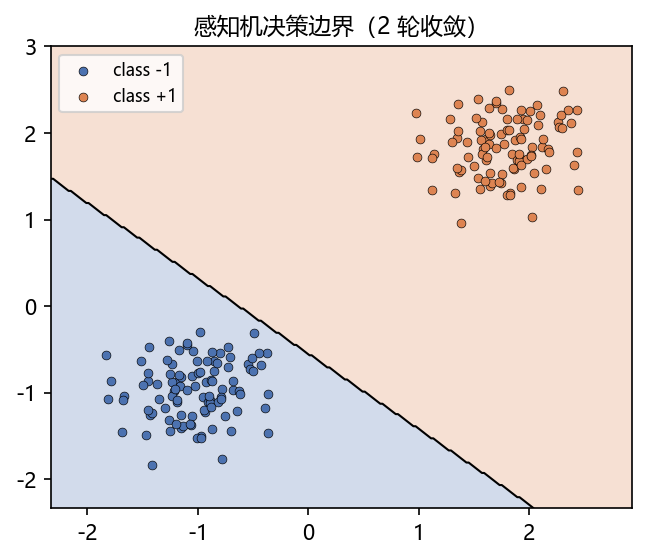
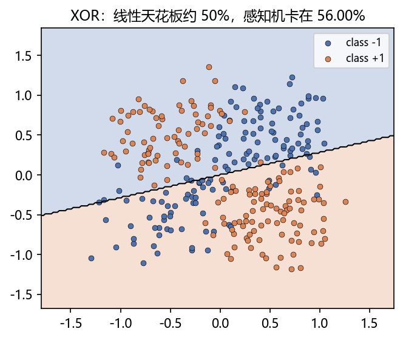
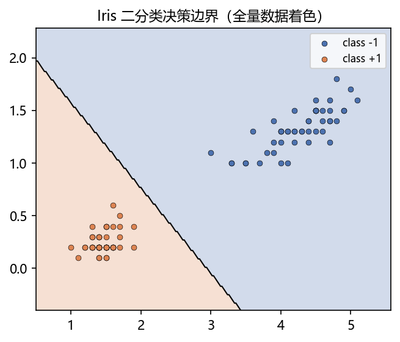

# 01 · 感知机 Perceptron —— 项目总结

> 家族：`01_Fundamentals_MLP` | 状态：✅ 已完成 | 主载体：`main.ipynb` | 公共模块：`../common/`
> 运行环境：`LLM_learning`（Python 3.9 + NumPy + sklearn，本项目无需 PyTorch 训练）

---

## 1. 任务背景与目标

感知机（Rosenblatt, 1957）是最早的**可学习**分类模型，是所有神经网络的"细胞"。本项目目标是：

1. 脱离框架、用 NumPy **手写**感知机（不是调库）
2. 在线性可分数据上验证收敛性
3. 用 sklearn 工业级实现**对照验证**手写代码的正确性
4. 通过 XOR 失效案例，理解深度学习存在的根本动机

## 2. 模型/算法原理（家族演化位置）

### 通俗理解

**一句话**：在纸上画一条直线，让正例落在一边、负例落在另一边；每分错一个点，就把直线朝正确方向挪一点，直到全部分对。

**比喻**：像切一块铺满草莓和奶油的蛋糕 —— 切错一刀，就根据"谁被切到了错的一边"微调下一刀。它的天花板也在这里：如果草莓和奶油交错摆放（XOR 数据），无论怎么调，单条直线都切不开——这正是后来发明多层网络的原因。

**演化位置**：感知机 = 神经网络的最小单元。它解决了"机器如何从数据中自动学习一个线性分类器"，但没有解决非线性可分问题——这个遗留问题催生了 MLP、反向传播，乃至整个深度学习。

**模型**：$f(x) = \mathrm{sign}(w^\top x + b)$，标签约定 $y \in \{-1, +1\}$

**学习规则**（误分类驱动的 SGD）：对每个误分点 $(x_i, y_i)$（满足 $y_i(w^\top x_i + b) \le 0$）：

$$w \leftarrow w + \eta\, y_i x_i, \qquad b \leftarrow b + \eta\, y_i$$

**损失函数视角**：$L(w,b) = -\sum_{x_i \in M} y_i(w^\top x_i + b)$（误分类点到超平面的总距离），对它做随机梯度下降即得上式——"逐样本纠错"与"优化损失"等价。

**收敛性（Novikoff 定理）**：线性可分时，误分类次数有上界 $(R/\gamma)^2$，必收敛；线性不可分时震荡、永不收敛。

## 3. 网络结构图

```
 x1 ──w1──┐
          ├──→ Σ wᵢxᵢ + b ──→ sign(·) ──→ {−1, +1}
 x2 ──w2──┘
```

单层、单神经元、阶跃激活。决策边界是 $w^\top x + b = 0$（一条直线）。

## 4. 核心公式

| 公式 | 含义 |
|---|---|
| $f(x) = \mathrm{sign}(w^\top x + b)$ | 预测 |
| $y_i(w^\top x_i + b) \le 0$ | 误分类判定 |
| $w \leftarrow w + \eta y_i x_i$ | 参数更新 |
| $L(w,b) = -\sum_{x_i \in M} y_i(w^\top x_i + b)$ | 感知机损失 |

## 5. 数据集介绍

| 数据集 | 来源 | 规模 | 特点 |
|---|---|---|---|
| 双高斯团簇 | `common/data.py::make_linearly_separable` | 200×2 | 严格线性可分（构造硬间隔） |
| XOR | `common/data.py::make_xor` | 300×2 | 四象限异或，线性不可分经典反例 |
| Iris 二分类 | sklearn `load_iris` | 100×2 | setosa vs versicolor，花瓣长/宽两特征，真实数据 |

注意标签约定：家族数据统一 `{0,1}`，感知机经典约定 `{-1,+1}`，调用前用 `np.where(y==0, -1, 1)` 转换（初学最常见的坑）。

## 6. 训练过程与超参数

- 超参数：学习率 `lr=1.0`（感知机收敛对 lr 不敏感，只影响轨迹）、`max_epochs=100/200`
- 训练方式：**逐样本 SGD + 每 epoch 随机洗牌**
- 收敛检测：一整轮零误分即提前停止（`converged_`）
- 训练统计：记录 `n_updates_`（参数更新次数）、`n_epochs_`（轮数）
- 实现位置：`common/models.py::Perceptron`，接口对齐 sklearn 风格（`fit/predict/score`）

## 7. 实验结果

| 数据集 | 是否收敛 | 收敛轮数 | 更新次数 | 准确率 |
|---|---|---|---|---|
| 双高斯团簇（线性可分） | ✅ | 2 | 1 | **100%** |
| Iris 二分类 | ✅ | 2 | 13 | **测试 100%** |
| XOR（线性不可分） | ❌ 震荡 | 200（跑满） | 持续 | **56%**（天花板约 50%） |

**sklearn 对照**：`sklearn.linear_model.Perceptron` 在同一 Iris 划分上测试准确率同为 **100%**，手写实现验证通过。

### 关键可视化

线性可分数据（2 轮收敛）：



XOR 失效（震荡不收敛）：



Iris 真实数据（测试 100%）：



## 8. 误差分析

- **XOR 上限约 50%**：四个象限两类对角分布，任何直线切出的半平面必然同时覆盖两类各约一半——直线越努力，正确率越趋近随机
- **不收敛 ≠ 优化失败**：损失函数在不可分数据上没有零点，SGD 在多个次优解之间震荡。这是**假设空间表达能力**问题，不是学习算法问题
- **对量纲与初值敏感度低**：感知机更新只依赖误分类符号，对特征缩放比想象中鲁棒（但规范化仍是好习惯）

### 常见坑 FAQ

1. **标签约定 {0,1} 与 {-1,+1} 混用**：更新公式里有 $y_i$ 乘法，用错约定等于给一半样本反向更新——训练完全不收敛。家族 data.py 专门做了转换
2. **把"lr 太大导致的震荡"误判为"线性不可分"**：先在已知可分的玩具数据上验证实现，再怀疑数据
3. **数据没洗牌**：样本按类别排序时，逐样本更新会先朝一类猛拉再被另一类拽回，收敛慢且轨迹难看——本项目每个 epoch 都重新洗牌
4. **max_epochs 给太小**：可分数据也可能需要很多轮才撞上"整轮零误分"的那一轮，别轻易下"不可分"的结论

## 9. 总结与改进方向

**三点核心收获**

1. 感知机在线性可分时收敛极快（本项目仅 1~13 次更新），且"逐样本纠错"就是 SGD
2. 线性不可分时震荡不收敛——**假设空间里没有正确答案，优化再努力也没用**，这是深度学习的第一性动机
3. 建立了贯穿系列的工程习惯：公共模块复用、标签约定检查、收敛检测、sklearn 对照验证

**改进方向**

- **Pocket 算法**：不可分时保留历史最优参数（本项目的 `Perceptron` 可直接扩展）
- **投票感知机 / 平均感知机**：MIRA、再训练理论的基础
- **Logistic 回归视角**：把 `sign` 换成 `sigmoid`，感知机损失换成交叉熵 → 概率化输出（传统 ML 系列已练过，可对照）

**实际应用场景**

- **历史现场**：1957 年感知机是"机器从数据中学规则"的第一个可运行程序，纽约时报曾预言它"会走路、说话、有意识"——银行与军方的投入引来 1969 年《Perceptrons》一书的致命批评（单层解不了 XOR），直接触发第一次 AI 寒冬
- **今天的直系后代**：垃圾邮件拦截的"命中关键词就拦"、银行风控的"负债收入比超线就拒"——一条规则一条线打天下时，感知机思想至今在跑；逻辑回归/线性 SVM 在文本分类、广告 CTR 粗排上仍是第一刀基线
- **教学价值**：理解"假设空间决定能力上限"的最小案例，深度学习一切动机的起点

**下一步**：`02_MLP_MNIST` —— 用 PyTorch 把感知机叠成多层（MLP），突破线性限制，在 MNIST 上做到 98%+。
