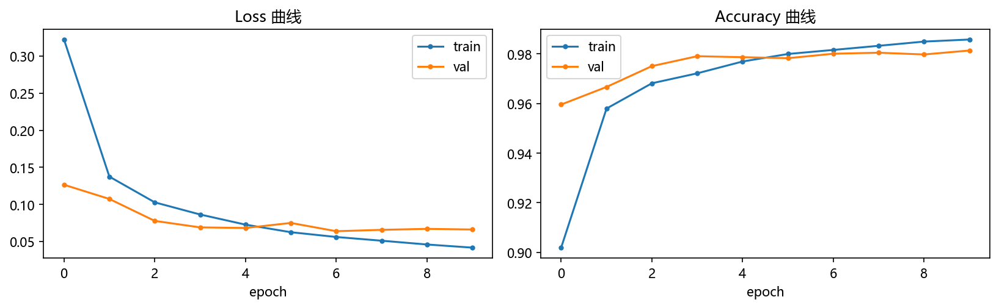
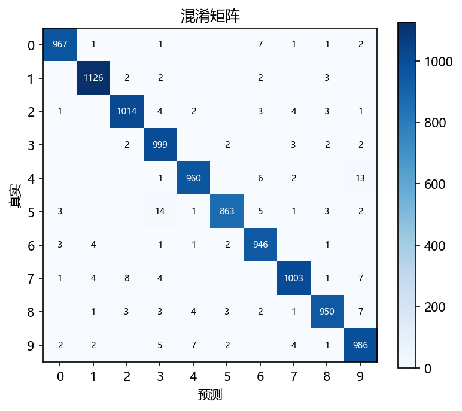
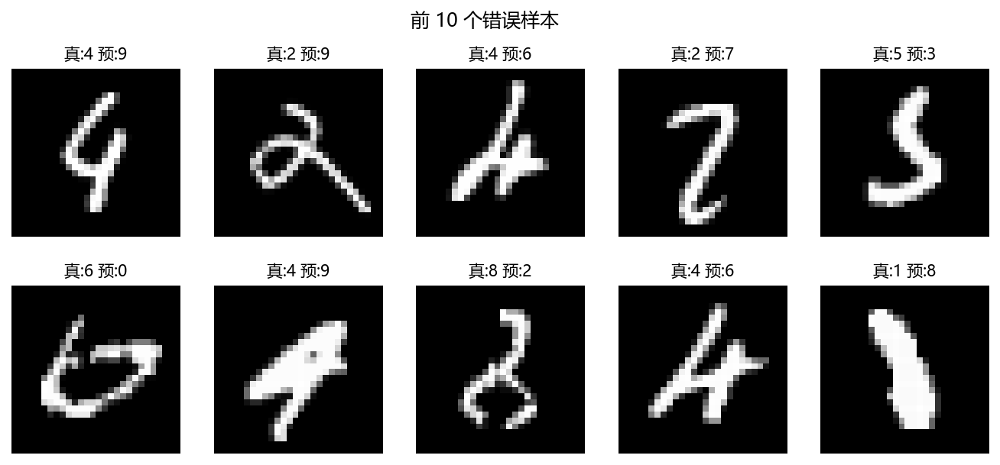
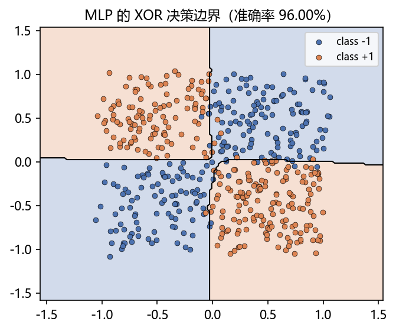

# 02 · MLP on MNIST —— 用多层感知机突破线性限制

> 家族：`01_Fundamentals_MLP` | 状态：✅ 已完成 | 主载体：`main.ipynb` | 公共模块：`../common/`
> 环境：`LLM_learning`（PyTorch 2.5.1+cpu，CPU 训练约 1 分钟）

## 1. 任务背景与目标

感知机只能画直线，MNIST 手写数字识别需要弯曲的决策面。本项目第一次跑通 PyTorch 的**完整训练范式**：数据 → 模型 → 训练 → 评估 → 可视化。目标：测试准确率 **98%+**（不用卷积的 MLP 合理基线）。

## 2. 模型/算法原理（家族演化位置）

### 通俗理解

**一句话**：感知机只会画一条直线；MLP 先让一群"直线判官"各自划线，再把所有人的判断汇总投票——很多条直线拼起来，就能围出弯曲的边界。

**比喻**：像一组面试考官：每人只负责回答一个具体的小问题（隐藏层神经元），经理（输出层）根据所有考官的打分做最终决定。关键规矩是考官必须会"拐弯思考"（非线性激活）——否则一屋子直线思维加起来，还是一条直线。

**演化位置**：MLP = 感知机 + 隐藏层 + 非线性激活。第一层学多条"线性切分"，第二层非线性组合（AND/OR）——XOR 这类线性不可分问题由此可解。

**前向**：$h = \sigma(W_1 x + b_1)$，$\hat{y} = \mathrm{softmax}(W_2 h + b_2)$

**关键点**：非线性激活（ReLU）是深度有效的根本——纯线性堆叠等价于单层。

**损失**：`CrossEntropyLoss`（内部 softmax + 交叉熵，数值稳定），标签 `{0..9}`。

## 3. 网络结构图

```
784 → 256 → 128 → 10
      ReLU+Dropout(0.2) ×2
```

可训练参数量：**235,146**

## 4. 核心公式

| 公式 | 含义 |
|---|---|
| $h = \sigma(W_1 x + b_1)$ | 隐藏层前向 |
| $L = -\log \frac{e^{z_y}}{\sum_k e^{z_k}}$ | 交叉熵损失 |
| $\theta \leftarrow \theta - \eta \nabla_\theta L$ | Adam 参数更新 |

## 5. 数据集介绍与预处理

- MNIST：60,000 训练 + 10,000 测试，28×28 灰度，10 类
- 预处理：展平 784 维，除以 255 后按 (0.1307, 0.3081) 标准化
- 缓存于 `../data/MNIST/`（首次运行自动下载，走 torchvision 的 AWS 镜像，yann.lecun.com 的 404 回退是正常现象）
- 类别分布均衡（每类约 5,400~6,700 张）

## 6. 训练过程与超参数

| 超参数 | 值 | 说明 |
|---|---|---|
| 优化器 | Adam | lr=1e-3 |
| batch size | 128 | |
| epochs | 10 | |
| Dropout | 0.2 | 两个隐藏层后各接一层 |
| 随机种子 | 0 | 全流程可复现 |

> 说明：为教学简化，直接用测试集做每轮监控；严格做法应从训练集再划验证集（03 项目会引入正规划分）。

**超参小网格记录**（正式配置的依据）：

| 配置 | 最终 val_acc | val_loss |
|---|---|---|
| 无 Dropout，10 ep | 97.98% | 0.0780（后 5 轮回升 → 过拟合） |
| **Dropout 0.2，10 ep（选定）** | **98.14%** | 0.0662 |
| Dropout 0.2，15 ep | 98.19% | 0.0755（边际收益小） |

## 7. 实验结果

| 指标 | 结果 |
|---|---|
| 最终测试准确率 | **98.14%**（186 / 10000 错误） |
| 训练准确率（第 10 轮） | 98.58% |
| 最优 val_loss | 0.0640（epoch 7） |

**XOR 回归对照**（呼应 01 项目）：同一份低噪声 XOR 数据（n=500, noise=0.05）上，感知机 **46.80%**（≈随机瞎猜，线性假设空间天花板）→ MLP **~96%**（50 epochs），非线性假设空间的威力直接可见（详见 notebook 第 6 节与 `figs/fig4_xor_boundary.png`）。

### 训练曲线



### 混淆矩阵



### 错误样本



### XOR 决策边界（回归验证）



## 8. 误差分析与可视化

**最容易混淆的 5 对（真实→预测，次数）**：

| 真实→预测 | 次数 | 直觉解释 |
|---|---|---|
| 5→3 | 14 | 上下两半结构相似，开口方向是唯一区别 |
| 4→9 | 13 | 封闭圈 + 竖笔，书写潦草时几乎同形 |
| 7→2 | 8 | 底部横笔的有无被忽略 |
| 7→9 | 7 | 同 4→9，圈的位置略不同 |
| 9→4 | 7 | 同 4→9 的反向混淆 |

**模式总结**：错误高度集中在形状相近的数字对，且不是均匀分布——模型"看"的是全局像素统计，缺少对笔画细节的显式建模。

**过拟合信号**：第 6~10 轮 train acc 仍在升（0.980→0.986）而 val loss 开始回升（0.064→0.066），Dropout 已压住大半，但信号真实存在 → 03 项目的正则化消融动机。

### 常见坑 FAQ

1. **训练前忘了 `model.train()` / 评估前忘了 `model.eval()`**：Dropout 在两种模式下行为不同，漏切换会让每次评估结果随机抖动
2. **标准化统计量用错**：MNIST 的 (0.1307, 0.3081) 是全数据集常量，别拿单张图的均值去标准化另一张；也别忘了"先除 255 再减均值"
3. **标签 dtype 不对**：`CrossEntropyLoss` 要求 int64 标签，float32 会直接报错
4. **直接用测试集调参**：本项目为教学简化这么做了（见 §6 说明），但正规流程必须划独立验证集——拿测试集反复调参等于考前背答案
5. **误把 train acc 高当好事**：train/val 差距拉大恰恰是过拟合警报，两个数要一起看

## 9. 总结与改进方向

**核心收获**

1. 完整跑通 PyTorch 训练范式（Dataset/DataLoader → 模型 → 损失 → 优化 → 评估）
2. 非线性 + 隐藏层 = 更强假设空间（同一份 XOR 数据：感知机 46.8% vs MLP 96% 的实证）
3. 建立了三条评估直觉：看 val 曲线找过拟合、看混淆矩阵找盲区、看错误样本校准预期
4. Dropout 把 97.98% 提到 98.14%——单个小 trick 的真实增益就是这种量级

**局限（引出 CNN）**

MLP 把 28×28 展平成 784 维，完全丢弃空间结构：没有局部感受野、没有平移不变性、参数量 23 万对 784 维输入过重。图像任务的正解是 CNN → `02_CNN_Family/01_LeNet_MNIST`（可与本项目的 98.14% 直接对比：更少参数、更高精度）。

**实际应用场景**

- **表格/结构化数据**：给客户"该不该批贷款"打分、预测下月销量——把年龄/收入/历史行为这些列喂进去就出结果，MLP 至今是工业界这类活的强基线
- **推荐系统**：你在购物 App 看到的"猜你喜欢"——把"你点过什么"+"商品是什么"各查一张表（Embedding），再把两串数字拼一起过 MLP 打分，就是广告/推荐最经典的骨架
- **一切网络的"积木"**：CNN 最后分类的那几层全连接、Transformer 里的 FFN 子层，本质都是 MLP——学它不是学一个模型，是认领一块通用砖

**下一步**：`03_Training_Tricks_Ablation` —— 同一 MLP 上系统对比 SGD/Momentum/Adam/AdamW、有无 BN/Dropout/权重衰减，量化每个 trick 的贡献。
