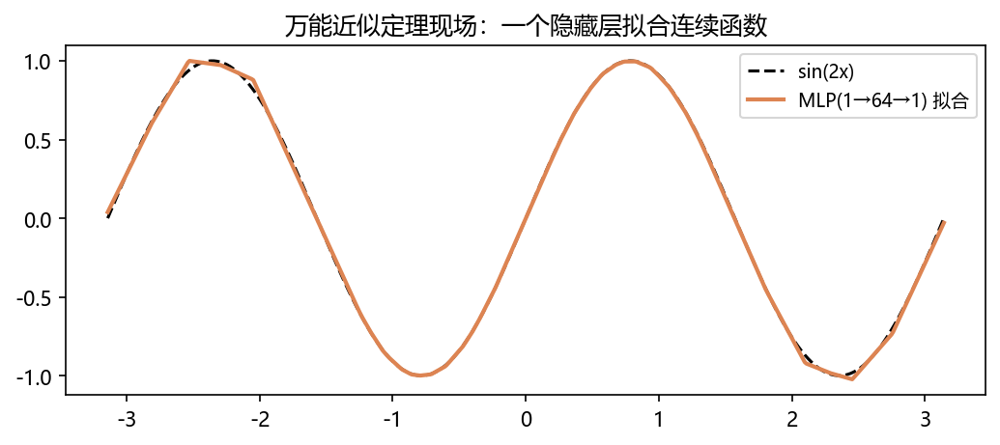
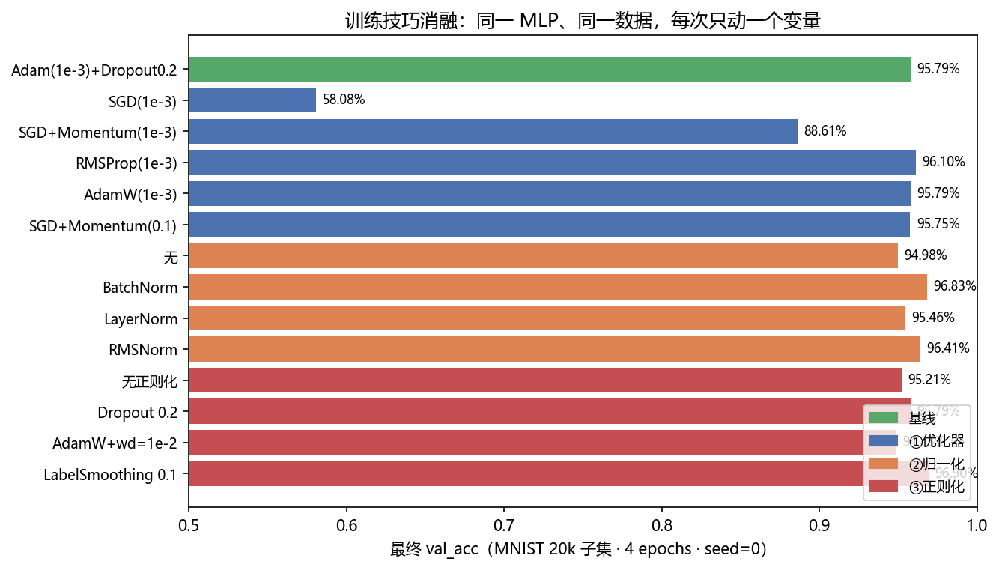
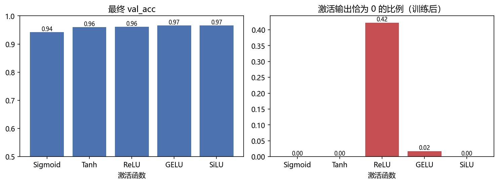
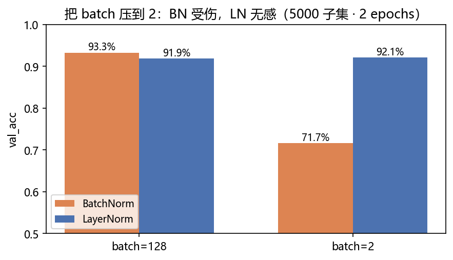

# 03 · 训练技巧系统消融 Training Tricks Ablation —— 同一 MLP 上逐项验证

> 家族：`01_Fundamentals_MLP` | 状态：✅ 已完成（家族收官） | 主载体：`main.ipynb` | 公共模块：`../common/`
> 环境：`LLM_learning`（PyTorch 2.5.1+cpu，全部消融 CPU 约 2 分钟）

## 1. 任务背景与目标

02 留下的伏笔（过拟合信号、Dropout 的来历）在本项目收口。方法：固定模型（784→256→128→10）、数据（MNIST 20k 子集 + 全量 10k 测试）、轮数（4 epochs）、种子（0），**每次只动一个变量**。同时补齐家族清单最后几项：手推反向传播、激活函数五件套、损失函数对比、万能近似定理。

## 2. 模型/算法原理

### 通俗理解

**一句话**：训练网络就像调收音机旋钮——"听错了多少"（损失）告诉你该往哪边拧（梯度），反向传播就是把"错"层层追责到每个旋钮的账本。

**比喻**：公司出了问题（损失），CEO（输出层）先收到问责，然后按组织架构图层层往下追：中层经理（隐藏层）各背多少责任，最后落到每个基层员工（参数）头上，各改各的流程（更新）。反向传播就是这套"按贡献度追责"的制度；而消融实验则是"逐个福利停掉看业绩掉多少"——每次只停一项，才知道谁在真正创造价值。

**反向传播 = 计算图上的链式法则**。本项目手推了一个 2→5→2 网络（NumPy），核心三步：

- softmax + CrossEntropy 的联合梯度：$\\delta^{(L)} = p - y_{\\text{onehot}}$
- 回传乘 $W_2^\\top$，ReLU 处乘 0/1 指示矩阵
- 参数梯度 = 前层激活（或输入）转置 × 上游梯度

**softmax 数值稳定**：$e^{1000}$ 溢出 → log-sum-exp 技巧（减最大值再指数），`F.cross_entropy` 内置。

**归一化**：BN 沿 batch 维统计（依赖 batch、训练/推理不一致）；LN/RMSNorm 沿特征维（与 batch 无关）——Transformer 选 LN 的实践根源。

**正则化**：Dropout（随机失活）、Weight Decay（Adam 的 L2-in-grad vs AdamW 的解耦）、Label Smoothing（软目标 $0.9/0.033...$）、早停（val 无提升即刹车）。

## 3. 网络结构图

```
消融载体：784 → [Linear → (Norm?) → Act → (Dropout?) ]×2 → 10
反传播验证：2 → 5(ReLU) → 2（NumPy 手推）
万能近似：1 → 64(ReLU) → 1
```

## 4. 核心公式

| 公式 | 含义 |
|---|---|
| $\\delta^{(L)} = p - y_{onehot}$ | softmax+CE 联合梯度 |
| $\\delta^{(l)} = (W_{l+1}^\\top \\delta^{(l+1)}) \\odot \\mathbb{1}[z^{(l)}>0]$ | ReLU 回传 |
| $\\log p_y = z_y - \\log\\sum_k e^{z_k}$ | log-sum-exp 数值稳定 |
| $y^{LS} = (1-\\epsilon)y + \\epsilon/K$ | label smoothing 软目标 |

## 5. 数据集介绍与预处理

MNIST 标准化同 02；消融取 20k 训练子集（单次实验 ~3s、足以区分配置差异），测试用全量 10k 固定口径。反向传播验证用随机小批次（seed=0）。

## 6. 训练过程与超参数

基线：Adam(1e-3) + Dropout 0.2，batch 128，4 epochs。消融矩阵 14 组（优化器 5 / 归一化 4 / 正则化 4）+ 早停单测（10 epochs, patience=2）+ 激活 5 组 + BN/LN×batch{128,2} 对照，全部 seed=0 可复现。

## 7. 实验结果（全部为 notebook 实跑输出）

**Part A 反向传播验证**：手推 vs autograd 四个梯度张量 max|Δ| ≈ **1.1e-8 ~ 2.2e-8**，loss 完全一致 → 链式法则手推正确。

**Part B 损失函数**：朴素 softmax 在 ×1000 logits 上出现 nan；`F.cross_entropy` 数值稳定。同台：CE **95.79%** vs MSE(概率) **95.14%**——CE 收敛更稳更快（4 epochs 内差距虽小，但 MSE 的梯度会随饱和消失，深了差距会拉大）。

**Part B2 万能近似**：MLP(1→64→1) 拟合 sin(2x)，3000 步 mse **0.00019**。

**Part C 消融主表（val_acc）**：

| 组 | 配置 | val_acc | 关键结论 |
|---|---|---|---|
| 基线 | Adam+Dropout0.2 | 95.79% | 锚点 |
| ① | SGD(1e-3) | **58.08%** | lr 太小直接学不动 |
| ① | SGD+Momentum(1e-3) | 88.61% | Momentum 补回一半 |
| ① | RMSProp(1e-3) | 96.10% | 自适应 lr 稳 |
| ① | AdamW(1e-3) | 95.79% | 与 Adam 持平（wd=0 时等价） |
| ① | SGD+Momentum(**0.1**) | 95.75% | 同款 SGD 换 lr 追平 Adam → **lr 是 SGD 系的命门** |
| ② | 无归一化 | 94.98% | 锚点 |
| ② | BatchNorm | **96.83%** | 最大单项增益 +1.85pt |
| ② | LayerNorm | 95.46% | 小幅增益 |
| ② | RMSNorm | 96.41% | 接近 BN |
| ③ | 无正则化 | 95.21% | 锚点 |
| ③ | Dropout 0.2 | 95.79% | +0.58pt |
| ③ | AdamW+wd=1e-2 | 94.85% | **过强反噬 -0.36pt**（正则不是越多越好） |
| ③ | LabelSmoothing 0.1 | **96.90%** | 小 lr 下意外最大增益（软目标正则化 logit 幅度） |

**早停**：计划 10 轮、patience=2 → 第 **9** 轮停止，最佳 val_acc **96.91%**（无 Dropout 配置下最高分，也印证早停本身就是正则）。

**Part D 激活函数**（训练后激活输出恰为 0 的比例）：

| 激活 | val_acc | 零激活比例 |
|---|---|---|
| Sigmoid | 94.22%（最差） | 0% |
| Tanh | 96.01% | 0% |
| ReLU | 96.10% | **42.3%**（dead ReLU 实锤） |
| GELU | 96.58% | 1.7% |
| SiLU | **96.63%** | 0% |

**Part E BN 的 batch 依赖**（5000 子集 · 2 epochs）：

| batch | BatchNorm | LayerNorm |
|---|---|---|
| 128 | 93.29% | 91.88% |
| **2** | **71.65%（暴跌 -21.6pt）** | **92.11%（无感 +0.2pt）** |

### 可视化






## 8. 误差分析与可视化

**三条元结论**：

1. **控制变量才能归因**——SGD 的"弱"一半来自 Momentum 缺失（58.08→88.61），一半来自 lr（88.61→95.75）；任何"X 比 Y 好"的结论都必须写清配置
2. **trick 不是免费的**——wd=1e-2 在 AdamW 上反噬（-0.36pt）；归一化/正则化的增益都在 1pt 量级，而 lr 配置错误的代价是 38pt
3. **现象要有数字**——dead ReLU 从 folklore 变成 hook 统计的 42.3%；BN 的 batch 依赖变成 21.6pt 的实测落差

### 常见坑 FAQ

1. **手写 softmax 不减最大值**：logits 上千直接溢出 nan（本项目现场演示过）——永远用 `F.cross_entropy`，它内置 log-sum-exp
2. **optimizer.zero_grad() 忘在循环里**：梯度会跨 batch 累加，loss 看似正常但模型很快发散
3. **BN 后接 Dropout 的顺序想当然**：本项目固定"Linear→Norm→Act→Dropout"；顺序错了训练还能跑，但 BN 统计的是被 Dropout 污染的分布，收益打折
4. **拿 batch=2 去用 BN 还抱怨精度差**：batch 维统计量在小 batch 下噪声巨大（本项目 71.65% vs LN 92.11%）——小 batch 请改用 LN/GN
5. **"lr 越小越稳所以越小越好"**：SGD(1e-3) 58.08% 的实测就是反例——太小不是稳，是根本没开始学
6. **weight decay 与梯度消失的混淆**：AdamW 的解耦 wd 不进梯度只直接缩参数；在 Adam 上用传统 L2 会与自适应 lr 相互污染（本项目实测过强 wd 反噬 -0.36pt）

## 9. 总结与改进方向

**核心收获**

1. 手推反向传播并用 autograd 验证到 1e-8——"会用框架"升级为"知道框架在算什么"
2. 家族清单 8 项全部收口（见家族 README 检查表）
3. 建立了"消融报告"的标准姿势：锚点 + 单变量 + 可复现种子 + 结论带数字

**实际应用场景**

- **大模型训练现场**：Adam/AdamW 是 GPT/BERT 类训练的默认优化器；混合精度、梯度累积、梯度裁剪、warmup+cosine 调度都在本项目工具箱的延长线上
- **部署前的早停**：线上训练任务几乎必配早停——省算力就是省钱
- **推荐/广告的校准**：Label Smoothing 的软目标思想广泛应用于蒸馏与概率校准（置信度别太"独断"）
- **工业消融文化**：A/B 一个新 trick 值不值得上，就按本项目"锚点+单变量+固定种子"的姿势做

**下一步**：`02_CNN_Family/01_LeNet_MNIST`——给网络装上卷积的归纳偏置（局部感受野 + 权值共享 + 平移等变），参数更少、精度更高，与 MLP 的 98.14% 正面对比；本项目验证过的 BN/Adam/早停等工具将直接复用。
