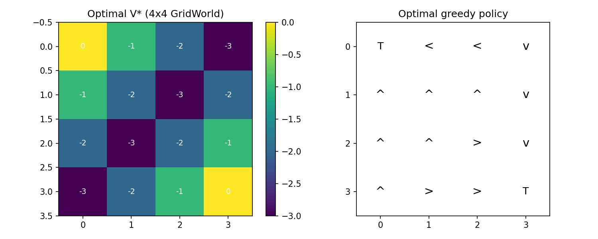
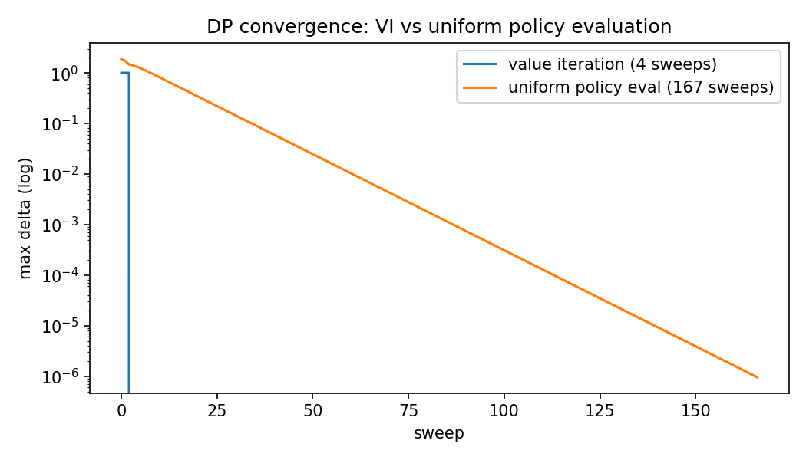
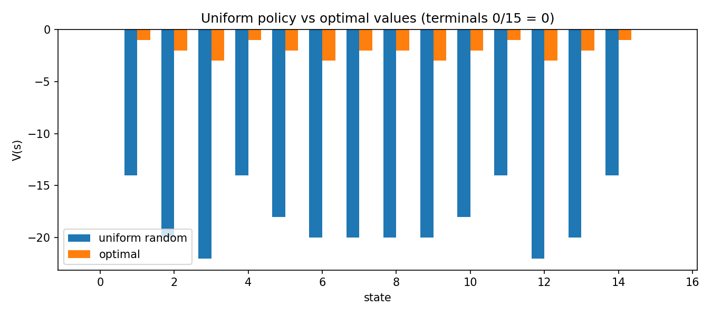

# 01 地基：MDP 与动态规划（GridWorld）

> 状态：✅ 已完成 | 环境：手写 `GridWorld4x4`，纯 numpy 零依赖 | 实跑：`python run.py`（CPU 秒级）

## 1. 任务背景与目标

不用仿真器，先把“问题长什么样”钉死：状态、动作、转移、奖励、折扣。4x4 网格足够小，可以算出精确最优解，后面所有方法（MC/TD/DQN/PPO）都是在复刻这里的账本。

## 2. 模型/算法原理

**通俗理解**：MDP 是世界的说明书，贝尔曼方程是账本自洽关系——“现在值多少 = 眼前奖励 + 打折后的未来值”。动态规划是全知上帝：转移概率全知道，直接迭代账本直到自洽。

**家族位置**：DP 是表格时代的天花板（需要模型），后面的 MC/TD 是去掉“全知”假设：MC 等账单来了再算，TD 每天估账。

## 3. 环境结构图

```text
 4x4 GridWorld, terminals T at (0,0) and (3,3), reward -1/step
 +---+---+---+---+
 | T |   |   |   |  row 0
 +---+---+---+---+
 |   | s |   |   |  s=5 at (1,1), 2 steps to T
 +---+---+---+---+
 |   |   |   |   |
 +---+---+---+---+
 |   |   |   | T |
 +---+---+---+---+
 actions: up/right/down/left, bump stays
```

## 4. 核心公式

\[ V_\pi(s) = \sum_a \pi(a|s) \sum_{s',r} p(s',r|s,a)\,[r + \gamma V_\pi(s')] \]

\[ V_{k+1}(s) = \max_a \sum_{s',r} p(s',r|s,a)\,[r + \gamma V_k(s')] \quad \text{(值迭代)} \]

\[ \pi'(s) = \arg\max_a \sum_{s',r} p(s',r|s,a)\,[r + \gamma V(s')] \quad \text{(策略改进)} \]

## 5. 环境介绍与预处理

- 状态 16 个（行主序 0..15），动作 4 个，无需预处理
- 奖励 -1/步（含进入终止），折扣 gamma=1.0（有限步必终止，可不打折）
- 转移 `transitions(s,a)` 显式给出，供 DP 全遍历

## 6. 训练过程与超参数

| 项 | 值 |
|---|---|
| theta | 1e-6 |
| gamma | 1.0 |
| 策略迭代外层 | 3 轮收敛 |
| 值迭代扫描 | 4 轮收敛 |
| 一致性校验 | max\|V_pi − V_vi\| = 0.00e+00，策略完全一致 |

## 7. 实验结果（实跑）

| 实验 | 结果 |
|---|---|
| E1 策略迭代 vs 值迭代 | 外层 3 轮 vs 扫描 4 轮，同解（差 0.00e+00），V(5) = −2.0（(1,1) 走 2 步到终止） |
| E2 收敛速度 | VI 4 轮收敛；均匀策略评估 167 轮（随机游走账本难算） |
| E3 均匀 vs 最优 | V_unif(5) = −18.0 vs V_opt(5) = −2.0；非终止均值 −18.29 vs −2.0，瞎走代价 9 倍 |





## 8. 失败模式与误差分析

- gamma=1 在有绕圈可能的随机策略下值会很大（−18），这是有限终止+负奖励的正常现象，不是 bug；Cliff 站改用 gamma=0.9 压住
- 均匀策略评估慢（167 轮）是因为随机游走混合慢，恰好说明“策略越差，账本越难算”
- 不修 theta 会提前停，V 差 1e-2 级；本站 theta=1e-6 已到机器精度

**常见坑 FAQ**：Q1 终止态还要更新吗？——不用，V(T)=0 固定。Q2 值迭代 4 轮是不是太少？——网格直径小，最远点 6 步，4 轮 max-diff 已 < 1e-6，正常。Q3 uniform 评估为什么比 VI 慢 40 倍？——VI 用 max 收缩最快，均匀策略是线性收缩且接近 1。

## 9. 总结与改进方向

DP 给了精确答案和“上帝视角”基线，但要求已知模型，大状态空间不可行。下一步 MC/TD 去掉模型假设。

**实际应用场景**：小规模已知模型的调度/库存/路径规划仍可直接用值迭代；大问题中 DP 只当小规模验证器（检验 DQN 实现是否收敛到同一 V）。

## 10. 场景速查

| 场景 | 推荐 | 支撑数据 | 要点 |
|---|---|---|---|
| 状态 < 1k 且转移已知 | 值迭代 | 4 轮收敛，同解 0.00e+00 | 先算 DP 真值，后面当标准答案 |
| 策略评估（固定策略算账） | 策略评估迭代 | 167 轮收敛 | 收缩慢是正常的 |
| 瞎走 vs 最优差距 | 看 V_unif/V_opt | −18 vs −2 | 随机基线必须有，否则不知道学到了啥 |
