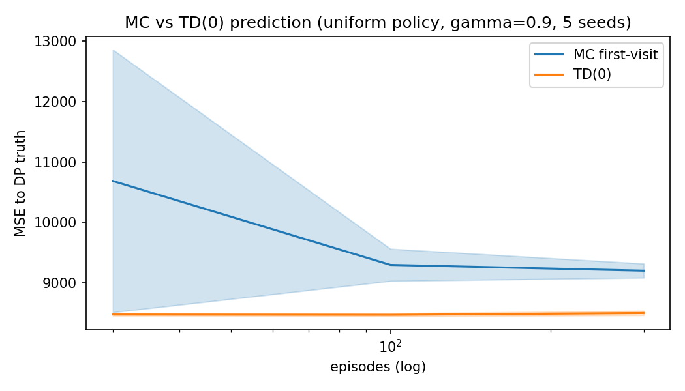
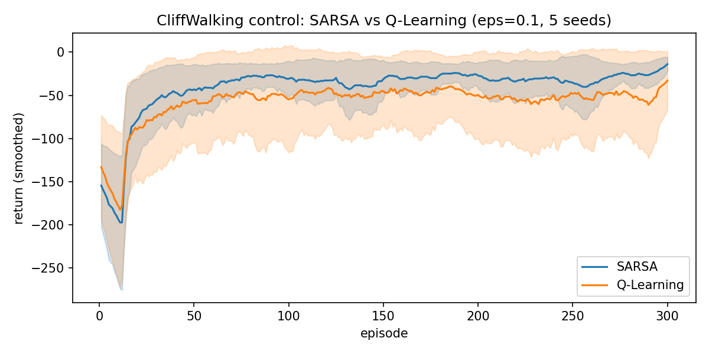
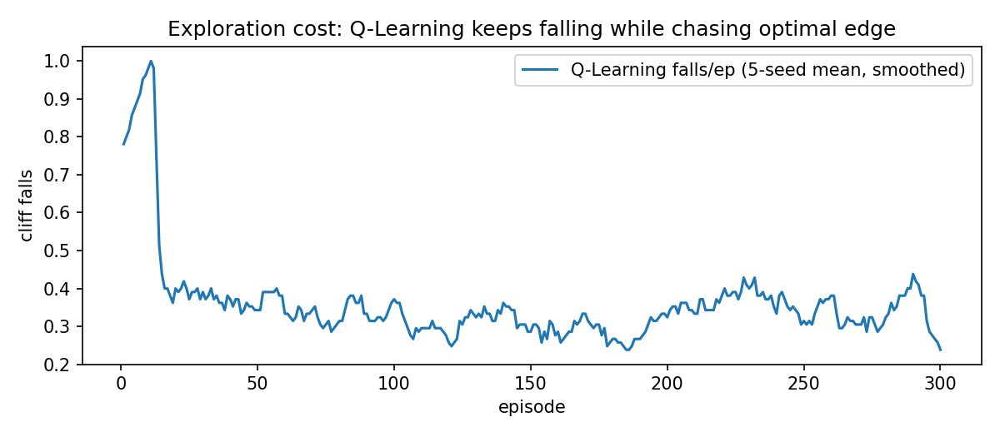
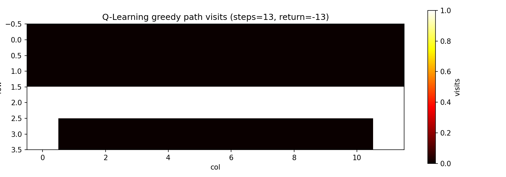

# 02 预测与控制：MC / TD / SARSA / Q-Learning（CliffWalking）

> 状态：✅ 已完成 | 环境：手写 `CliffWalking 4x12`，纯 numpy | 实跑：`python run.py`（CPU ~95s，5 种子）

## 1. 任务背景与目标

去掉 DP 的“全知”假设，只许和环境交互：预测（给定策略算 V）用 MC/TD，控制（学出好策略）用 SARSA/Q-Learning。悬崖环境专治“激进 vs 保守”：最优路贴着悬崖，快但险。

## 2. 模型/算法原理

**通俗理解**：MC 是等账单来了再平摊（整条轨迹回看），TD 是每天看隔壁估房价（bootstrap 一步）。SARSA 是胆小鬼（按实际走的路学，含探索），Q-Learning 是理想主义者（按最好情况学，不管实际掉没掉坑）。

**家族位置**：DP（模型已知）→ MC/TD（无模型预测）→ SARSA/Q-Learning（无模型控制）→ 下一站 DQN（函数近似）。

## 3. 环境结构图

```text
 4x12 CliffWalking, S=(3,0), G=(3,11), x=cliff(-100,回起点), -1/step
 row0: . . . . . . . . . . . .
 row1: . . . . . . . . . . . .
 row2: . . . . . . . . . . . .
 row3: S x x x x x x x x x x G
 最优: 贴崖走 13 步 return -13；安全: 绕上行 17 步 return -17
```

## 4. 核心公式

\[ G_t = r_{t+1} + \gamma G_{t+1} \quad \text{(MC 回看整条)} \]

\[ V(s) \leftarrow V(s) + \alpha\,[r + \gamma V(s') - V(s)] \quad \text{(TD(0) 自举)} \]

\[ Q(s,a) \leftarrow Q + \alpha\,[r + \gamma Q(s',a') - Q] \quad \text{(SARSA, on-policy)} \]

\[ Q(s,a) \leftarrow Q + \alpha\,[r + \gamma \max_{a'}Q(s',a') - Q] \quad \text{(Q-Learning, off-policy)} \]

## 5. 环境介绍与预处理

- 状态 48，动作 4，悬崖格 (3,1..10) 踩中 −100 并回起点
- 折扣 gamma=0.9（均匀策略下 gamma=1 值发散到 −58000，见 §8，故预测与控制统一 0.9）
- 探索 eps=0.1，alpha=0.5，max_steps=200 防绕圈

## 6. 训练过程与超参数

| 项 | 值 |
|---|---|
| 种子 | 0..4（5 种子，曲线 mean±std） |
| 预测 budget | 30 / 100 / 300 episodes |
| 控制 | 300 episodes × 5 种子 |
| 评估 | 贪心 rollout + 20 轮贪心 falls 计数 |

## 7. 实验结果（实跑）

| 实验 | 结果 |
|---|---|
| E1 MC vs TD 预测（均匀策略，DP 真值 V_start=−150.90） | b=30：MC 10685±2172 vs TD 8476±18；b=300：MC 9202±116 vs TD 8500±36。TD 方差小一个量级，MC 随样本缓慢追赶 |
| E2 控制后 50 轮 return | SARSA −30.4±6.9 vs Q-Learning −54.6±8.7（训练含探索，Q 频繁掉坑拉低均值） |
| E3 探索代价 | Q-Learning 300ep×5种子共掉崖 574 次 |
| E4 贪心 rollout（seed=0） | Q-Learning 13 步 / −13（贴崖最优）；SARSA 17 步 / −17（绕行安全）；20 轮贪心评估 falls 均为 0 |






## 8. 失败模式与误差分析

- **gamma=1 + 均匀策略值发散**：实测 DP 真值 V_start = −58411，MC/TD 在此目标下 MSE 上万且跑 trials 极慢（均匀策略绕圈 + 掉崖循环）。改 gamma=0.9 后 V_start=−150.9，3.4s 收敛。这是本课最重要的一坑：折扣不是摆设，是“账本有界”的保险
- **Q-Learning 训练 return 更差是正常的**：它学的是最优账本，但行为仍 eps 探索贴崖走，掉坑多；看贪心 rollout（−13）才公平
- **TD 初期 MSE 反超 MC 的原因**：TD 自举有偏但方差小，样本少时赢；MC 无偏但方差大，样本多时追。本站 300ep 内 TD 全程领先，符合短预算预期

**常见坑 FAQ**：Q1 max_steps 不加会怎样？——均匀策略会绕几千步，单 trial 几分钟，直接卡死（已踩，已加 200 步上限）。Q2 SARSA/Q-Learning 谁更好？——训练 return 看 SARSA，贪心最优看 Q-Learning，两个指标别混。Q3 alpha=0.5 是不是太大？——表格 48 状态够小，0.5 收敛快；换大环境要降到 0.1。

## 9. 总结与改进方向

MC 无偏高方差、TD 有偏低方差；on-policy 保守安全、off-policy 激进最优。表格法天花板是状态数，下一站 DQN 用神经网络换掉表格。

**实际应用场景**：小离散控制（电梯、库存）表格法仍可直接上；SERL 真机栈的安全约束思想即 SARSA 保守的工程版；离线 RL 的 CQL/IQL 也在回答“怎么写账本才不掉坑”。

## 10. 场景速查

| 场景 | 推荐 | 支撑数据 | 要点 |
|---|---|---|---|
| 样本少、要稳 | TD(0) | b=30 方差 18 vs MC 2172 | 自举换方差 |
| 要无偏、样本多 | MC | b=300 追到 9202 | 整轨回看 |
| 训练安全第一 | SARSA | 后50轮 −30 vs −54 | 按实际走的学 |
| 要最优、能承担探索代价 | Q-Learning | 贪心 −13 最优 | 按最好情况学 |
