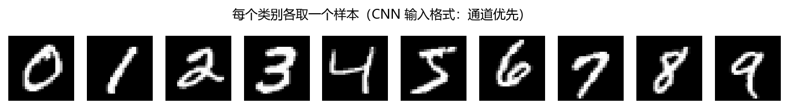
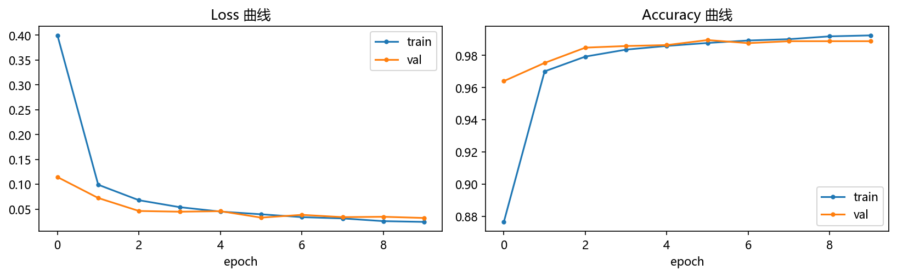
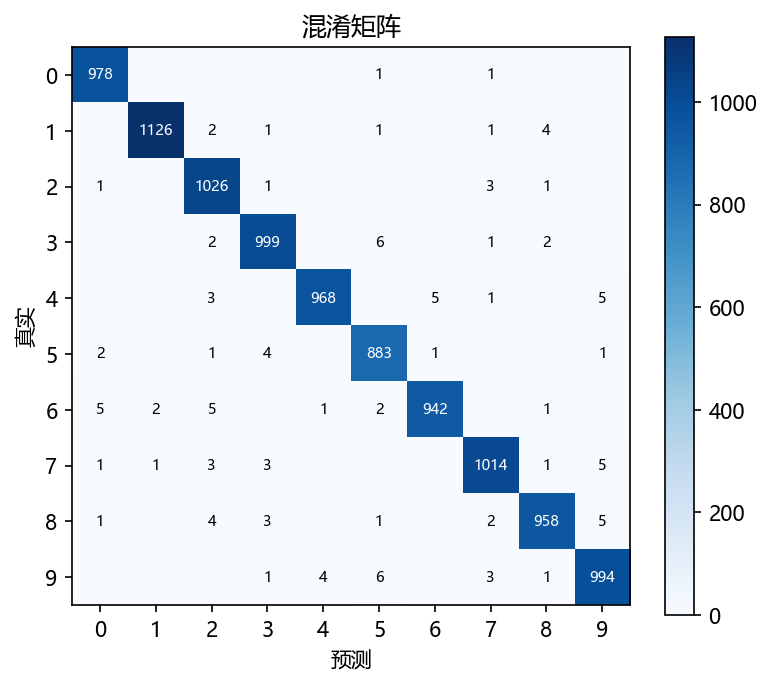
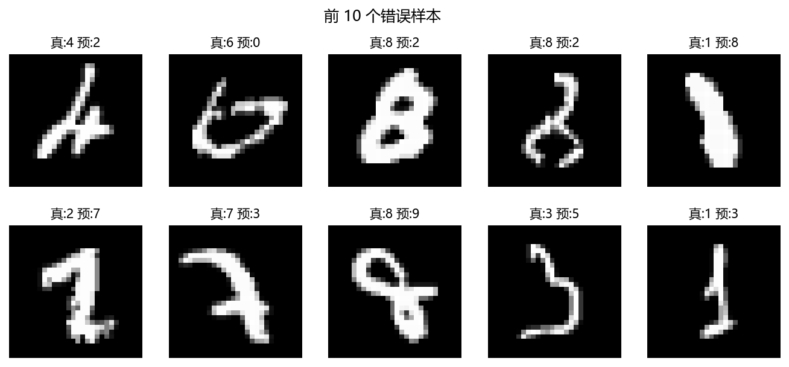
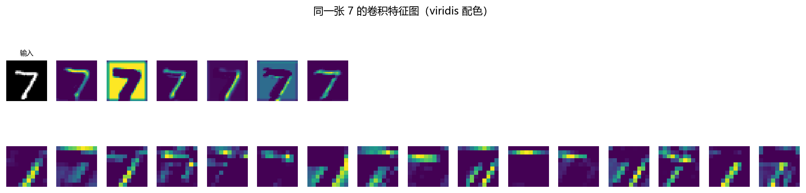
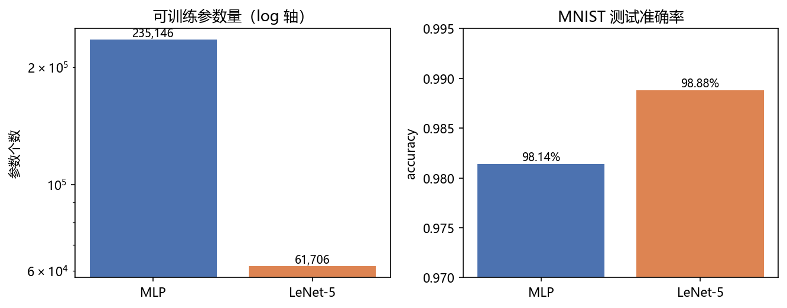

# 01 · LeNet on MNIST —— CNN 家族起点：给网络装上"眼睛"

> 家族：`02_CNN_Family` | 状态：✅ 已完成 | 主载体：`main.ipynb` | 公共模块：`../common/`
> 环境：`LLM_learning`（PyTorch 2.5.1+cpu，全量 MNIST 10 epochs 约 50 秒）

## 1. 任务背景与目标

01 家族 MLP 把 28×28 展平成 784 维，抹掉了空间结构。LeNet（LeCun, 1998）是第一个"看图"的网络：卷积核直接在二维图上滑动。任务：**用 MLP 1/4 的参数量，超过它 98.14% 的成绩**。

## 2. 模型/算法原理（三大归纳偏置）

### 通俗理解

**一句话**：MLP 是把整张图揉成一团凭手感判断；CNN 是拿几张小模板在图上滑动找图案——找"竖线"的模板、找"圈"的模板各管各的，最后综合所有模板的命中报告做判断。

**比喻**：像验钞员查钞票——不把整张钞票压成一维数据，而是拿放大镜逐区域检查水印。**权值共享** = 同一个验钞员用同一套手法检查所有区域（手法通用，所以不用雇 784 个专家，参数量只有 MLP 的 1/4）；**池化** = 每查完一片区域只记一个要点（水印在不在），不记每个像素的细节。

- **局部感受野**：每个神经元只看 5×5 邻域——符合图像局部相关性先验
- **权值共享**：同一卷积核扫全图（模板匹配），参数量骤降 + 平移等变
- **池化降采样**：分辨率减半，计算量下降、感受野变大、对小位移鲁棒

**LeNet-5 结构（现代复现版）**：原版 tanh + RBF 输出层改为 ReLU + Linear + CrossEntropy；输入为 28×28 适配（conv1 pad=2）。

```
28×28×1 → Conv5×5×6(pad=2) → ReLU → AvgPool → 6×14×14
        → Conv5×5×16 → ReLU → AvgPool → 16×5×5
        → Flatten(400) → FC120 → FC84 → FC10
```

## 3. 网络结构图与参数演算（代码逐层打印复核通过）

| 层 | 参数量 | 推导 |
|---|---|---|
| conv1 6@5×5 | 156 | (5×5×1+1)×6 |
| conv2 16@5×5 | 2,416 | (5×5×6+1)×16 |
| fc1 400→120 | 48,120 | 400×120+120 |
| fc2 120→84 | 10,164 | 120×84+84 |
| fc3 84→10 | 850 | 84×10+10 |
| **合计** | **61,706** | MLP 同任务 235,146 的 26.2% |

## 4. 核心公式

| 公式 | 含义 |
|---|---|
| $O_{i,j} = \\sigma\\left(\\sum_{c}\\sum_{u,v} K_{c,u,v} \\cdot I_{c,\\,i+u,\\,j+v} + b\\right)$ | 卷积：局部加权 + 共享核 |
| $H_{out} = \\lfloor (H + 2p - k)/s \\rfloor + 1$ | 尺寸演算（28→14→10→5） |
| $O = \\frac{1}{|R|}\\sum_{(u,v)\\in R} I_{u,v}$ | 平均池化 |

## 5. 数据集介绍与预处理

MNIST 同 01 家族（60k+10k、10 类、0.1307/0.3081 标准化），唯一区别：保留 (N, 1, 28, 28) 四维结构。类别分布均衡（5,421~6,742/类）。

## 6. 训练过程与超参数

| 超参数 | 值 |
|---|---|
| 优化器 | Adam, lr=1e-3 |
| batch size | 128 |
| epochs | 10 |
| 随机种子 | 0 |

与 01 家族 MLP 完全同规格——保证对比公平（唯一变量是架构）。

## 7. 实验结果

| 架构 | 参数量 | 测试准确率 | 答错 |
|---|---|---|---|
| MLP（01 家族 02） | 235,146 | 98.14% | 186 |
| **LeNet-5** | **61,706（26.2%）** | **98.88%** | **112（60.2%）** |

- 训练动态：epoch 1 即 96.40%（MLP 需 3 轮），epoch 6 达峰值 **98.95%**，val 曲线平稳无过拟合
- 最易混淆对：3→5(6)、9→5(6)、4→9(5)、8→9(5)、6→0(5)——仍是形近数字，但**错误总量比 MLP 少 40%**
- 逐层尺寸演算（28→28→14→10→10→5→400）与代码打印完全一致

### 可视化








## 8. 误差分析与可视化

**特征图可视化**（一张"7"）：conv1 的 6 张 28×28 特征图保留笔画/拐角等原始形状响应；conv2 的 16 张 10×10 特征图在更小分辨率上组合出结构响应——"浅层学笔画、深层学结构"的直观证据。

**为什么 CNN 用更少参数反而更强**：MLP 的 235k 参数花在"每个像素位置单独配权重"上（数据效率低）；CNN 的 61k 参数全部花在"可复用的模板"上（每个核扫全图）——归纳偏置替我们省了 3.8 倍参数，还带来 0.74pt 的精度提升。

### 常见坑 FAQ

1. **忘了 `model.eval()` 就画特征图/评估**：本项目没有 BN/Dropout 尚无碍，但养成习惯——有 BN 的模型漏这一步，评估结果会随机漂移
2. **通道顺序搞反**：PyTorch 是 (N, C, H, W)，把 (N, H, W, C) 喂进去只会报尺寸错误还算幸运；C=1 时忘了 unsqueeze 通道维是高频报错
3. **手算尺寸忘了 padding**：28×28 输入 conv5 无 padding 会得 24 而不是 28——本项目 conv1 的 pad=2 就是为对齐原版 32×32 设计的；用 $H_{out} = \lfloor (H+2p-k)/s \rfloor + 1$ 现场验算
4. **MaxPool 和 AvgPool 随手换**：LeNet 原版是 AvgPool；换成 MaxPool 结果会变（不一定是坏事，但对比实验就不受控了）
5. **特征图可视化时忘了 detach**：带着梯度张量进 numpy 直接报错——推理前 `torch.no_grad()` + `.detach()`

## 9. 总结与改进方向

**核心收获**

1. CNN 三件套把"像素统计"升级成"结构感知"——同任务下参数 26%、错误 60%
2. 手算逐层尺寸/参数 + 代码打印双向验证，卷积的"账"要会算
3. 01 家族的评估套路（曲线/混淆/错误样本）跨架构直接复用

**实际应用场景**

- **历史现场**：1998 年美国邮政每小时数万封手写邮编信件自动分拣、银行支票金额自动识别——CNN 第一次大规模商用，LeCun 用它证明"端到端训练"真能上产线
- **今天的小场景**：水表/仪表读数、快递单数字录入、图形验证码识别——6 万参数小到手机 CPU 甚至单片机都能毫秒级跑完，不用上 GPU
- **思想遗产**："卷积→池化→卷积→池化→全连接"的三明治骨架是后面所有视觉网络的底座——VGG/ResNet 只是在这上加高加宽

**下一步**：`02_AlexNet_VGG_FashionMNIST`——网络加深加宽（ReLU+Dropout+堆叠小卷积核），体验深度带来的训练难点，为 ResNet 的残差思想埋伏笔。
