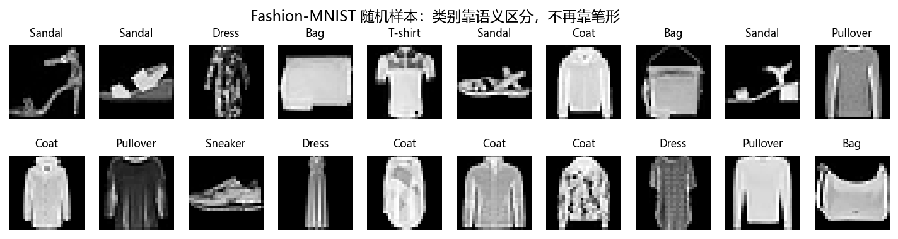
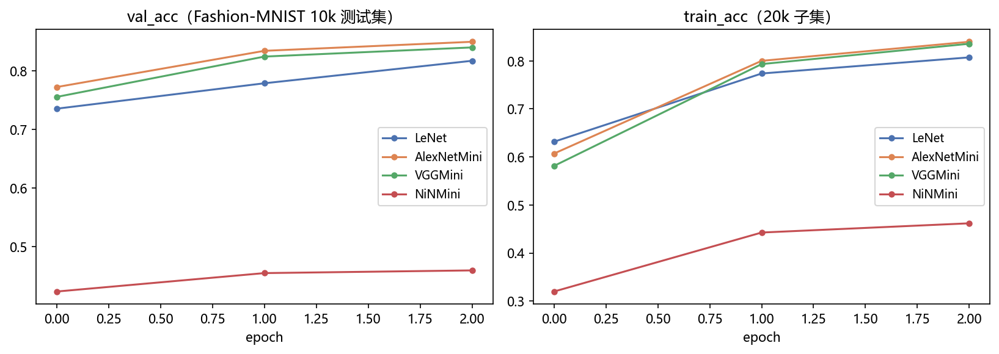
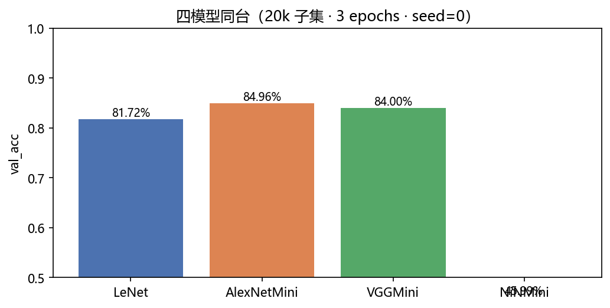
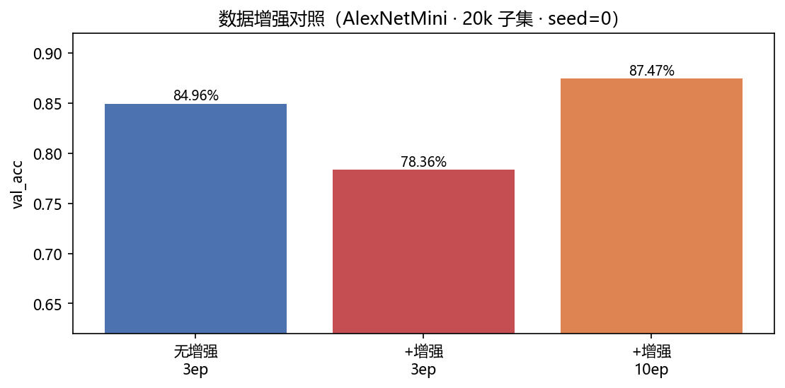
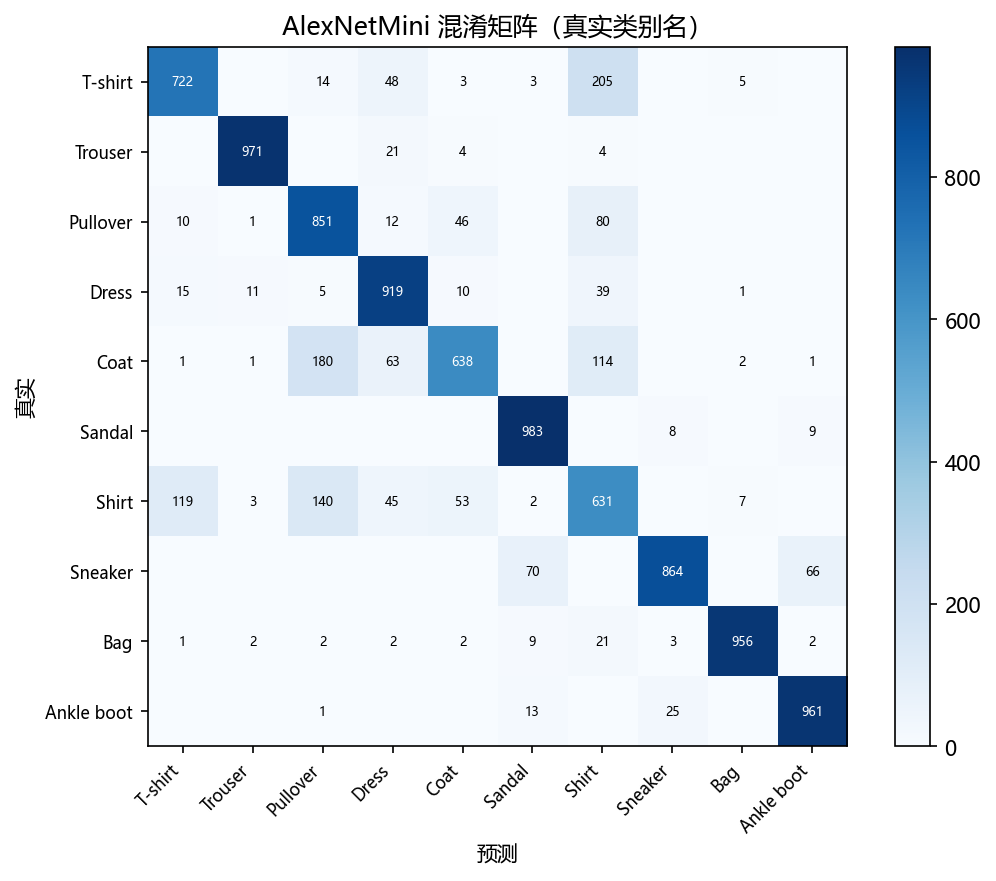

# 02 · AlexNet / VGG / NiN on Fashion-MNIST —— 深度加深的时代

> 家族：`02_CNN_Family` | 状态：✅ 已完成 | 主载体：`main.ipynb` | 公共模块：`../common/`
> 环境：`LLM_learning`（PyTorch 2.5.1+cpu；主实验四模型 + 增强对照 + 混淆分析全本约 12 分钟）

## 1. 任务背景与目标

LeNet 在 MNIST 拿 98.88%，但 MNIST 太简单（灰底白字、居中、无干扰）。**Fashion-MNIST** 同规格（28×28、10 类、60k+10k）难度陡增——混淆是语义级的。本项目沿 2012-2014 真实历史把网络加深加宽：AlexNet（深度+ReLU+Dropout）→ VGG（小核堆叠）→ NiN（1×1 卷积+GAP），并首秀数据增强。

## 2. 模型/算法原理

### 通俗理解

**一句话**：数据变难了，就把车间造得更大（AlexNet：更多工人+更好的激活零件+随机放假防死记）；发现车间越大成本越高后，VGG 想通一件事——用小工具多组装几道工序，比造一件大工具又便宜又灵活。

**比喻**：ReLU 是永不疲倦的开关（ sigmoid 这类老开关拧到头就卡死，信号传不动）；Dropout 是每次上班随机让一半员工回家，逼剩下的每个人都是多面手，没有谁不可替代；VGG 的 3×3 小核堆叠像乐高——小块反复拼，比预制大板件更省料、造型更多变。

- **ReLU**：负区恒 0、正区恒 1，深层梯度不衰减——AlexNet 第一次训通 8 层的发动机
- **Dropout 0.5**：百万级参数防死记（01 家族 03 项目实测过 +0.6pt，这里更关键）
- **小核堆叠（VGG 核心）**：两层 3×3 = 一层 5×5 感受野，参数 25C²→18C²（-28%）、非线性 ×2
- **NiN**：1×1 卷积 = 像素级全连接；GAP 头直接出分类，全连接参数清零。代价：2013 年无 BN，深堆叠对 lr/初始化敏感（原论文即报告，下面现场见识）
- **数据增强**：50% 水平翻转 + 4 像素随机平移（保标签变换，等效免费扩容）

**28×28 精神复现约定**：原版输入 224~227；CPU 预算下保持块的层数/通道比例/Dropout/池化次数，缩分辨率与通道（模型名带 Mini）。

## 3. 网络结构图（模型定稿，代码在 `../common/models.py`）

```
LeNet        2 conv + 3 fc          61,706 参数（01 项目基线）
AlexNetMini  5 conv(32→96→192→128→128) + 3 fc + Dropout0.5×2   1,287,274
VGGMini      [2,2,3,2] 全 3×3 块 32→64→128→256 + 2 fc          1,353,450
NiNMini      3×NiNBlock(48/96/192) + 1×1 头 + GAP               323,626（fc=0）
```

## 4. 核心公式

| 公式 | 含义 |
|---|---|
| $H_{out} = \\lfloor (H + 2p - k)/s \\rfloor + 1$ | 卷积/池化尺寸演算（28→14→7→3） |
| 两层 3×3：$18C^2$ vs 一层 5×5：$25C^2$ | VGG 的参数效率 |
| $p$ 的期望不变：$E[\\text{flip}(x)] = x$ | 增强保标签、保分布 |

## 5. 数据集介绍与预处理

Fashion-MNIST：60k+10k、28×28 灰度、10 类（标准化 0.2860/0.3530）。类别靠语义区分（T恤/衬衫/外套/针织衫…），SOTA ~94%。主实验用 20k 训练子集 + 全量 10k 测试。

## 6. 训练过程与超参数

**主实验协议**（缩时原型实测后锁定）：四模型同 20k 子集、3 epochs、Adam(1e-3)、batch 128、seed=0，唯一变量是架构。

> 为什么不用原版通道全量训练：原型实测原通道版 2ep@10k 需 87~132s/模型，全量 10 epochs 需 40+ 分钟/模型；缩通道后 3ep@20k 约 25~37s/模型。教学看**相对差距**，不是绝对 SOTA。

**增强对照**：AlexNetMini，无增强 3ep vs +增强 3ep vs +增强 10ep；AugLoader 洗牌与增强共用固定种子 generator，且 10ep 曲线前 3 轮与 3ep 逐位一致（可复现性强验证，代码内置 assert）。

## 7. 实验结果（全部为 notebook 实跑输出）

**主实验（20k 子集 · 3 epochs · seed=0）**：

| 模型 | conv/fc 层数 | 参数量 | val_acc | val_loss | train_acc |
|---|---|---|---|---|---|
| LeNet | 2/3 | 61,706 | 81.72% | 0.4964 | 80.73% |
| **AlexNetMini** | 5/3 | 1,287,274 | **84.96%** | **0.3994** | 83.97% |
| VGGMini | 9/2 | 1,353,450 | 84.00% | 0.4274 | 83.56% |
| NiNMini | 10/0 | 323,626 | 45.99% | 1.5142 | 46.19% |

**数据增强对照（AlexNetMini，唯一变量：翻转+平移）**：

| 配置 | val_acc | 相对无增强 3ep 基线 |
|---|---|---|
| 无增强 3ep | 84.96% | — |
| +增强 3ep | 78.36% | **-6.60%（负结果，如实呈现）** |
| +增强 10ep | **87.47%** | **+2.51% 转正** |

10ep 逐轮 val_acc：71.45 → 75.05 → 78.36 → 81.31 → 83.17 → 83.65 → 85.74 → 85.77 → 86.90 → 87.47——**增强的收益取决于训练时长**：短训下模型连原数据都没喂饱，增强抬高的任务难度成本 > 泛化收益；训练拉长后转正。这是本项目最重要的方法论结论。

**冠军混淆矩阵（AlexNetMini，语义级混淆实锤）**：

| 真实 → 预测 | 次数 | 直觉 |
|---|---|---|
| T-shirt → Shirt | 205 | 上衣大类内部，形态几乎同构 |
| Coat → Pullover | 180 | 厚外套与套头衫，纹理/轮廓重叠 |
| Shirt → Pullover | 140 | 同上 |
| Shirt → T-shirt | 119 | 薄上衣三分家 |
| Coat → Shirt | 114 | |

对比 01 家族 MNIST 的"笔形相近"（4/9、3/5）：**Fashion-MNIST 的错误是语义级的**——这正是它难的原因。

### 可视化







## 8. 误差分析与可视化

**深度难点如实入账**：

1. **VGGMini 慢热**：9 层无 BN 小 lr 下 3 epochs 只到 84.00%，被 AlexNetMini 压制——深度本身不是免费的
2. **NiNMini 困境**：lr=1e-3 只有 45.99%；lr 提到 1e-2/3e-2 直接崩到 ~10%（原型实验数据）。深层 1×1 堆叠 + GAP 头对初始化极敏感——这不是实现错误，NiN 原论文（2013）就报告调参敏感，2015 年 BN 出现后才"好训"
3. **train/val 差距**：AlexNetMini 83.97/84.96 几乎无过拟合（Dropout 0.5 在干活）；若去掉，20k 子集撑不起 1.29M 参数

**伏笔**：NiN 的"病"（深层不稳定）正是 03 项目 ResNet 两条腿要治的——BN 稳定每层输入分布，残差给梯度留直达通道。

### 常见坑 FAQ

1. **增强变换会破坏标签**：对数字做垂直翻转（6↔9）或大角度旋转，标签就错了——增强前先问"变换后还是同一类吗"；本项目只用水平翻转+小平移，对衣服类是安全的
2. **增强组与基线组训练时长不一致**：3ep 时增强看起来"有害"（-6.60%），10ep 转正（+2.51%）——对照实验必须同时报告协议
3. **增强随机性没固定种子**：AugLoader 若用全局 RNG，每次跑结果都不同，实验不可复现（本项目用独立 seeded generator，并断言 10ep 前 3 轮与 3ep 逐位一致）
4. **NiN 训不动就怀疑实现写错**：先查 lr——NiNMini 在 1e-3 只有 45.99%，深层 1×1 堆叠就是难训，原论文自己都承认；加 BN 是正解（03 项目见分晓）
5. **Dropout(0.5) 用在 conv 层**：AlexNet 的 Dropout 只放全连接之间——对 conv 层滥用 Dropout 会伤害空间信息（后来才发明 SpatialDropout）
6. **混淆"通道数"和"卷积核个数"**：conv 输出通道数 = 卷积核个数 = 本层学到的"模板种类"，三者是一回事，别当成三个超参各自乱调

## 9. 总结与改进方向

**核心收获**

1. 数据升级立刻暴露架构上限——81.72%（LeNet）到 84.96%（AlexNetMini），加深加宽是必然
2. 深度时代三件套到位：ReLU / Dropout / 小核堆叠
3. 数据增强首秀拿到**完整的方法论结论**：收益取决于训练时长（-6.60% → +2.51% 的翻转全过程被记录）
4. 增强管线可复现性做到位：固定 seed generator + 前 3 轮逐位一致断言
5. VGG 慢热、NiN 难训两个"病"如实入账——ResNet 的药方已在路上

**实际应用场景**

- **AlexNet**：2012 年 ImageNet 夺冠（Top-5 错误率比第二名低约 10 个百分点）引爆深度学习十年浪潮；今天仍是中小图像任务的快速基线与"迁移学习起手式"
- **VGG**：结构规整适合当特征提取器（人脸识别 VGGFace 等经典下游）；3×3 堆叠思想被此后所有网络继承
- **NiN**：GAP 头成为现代 CNN 标配（GoogLeNet/ResNet 全在用）；1×1 卷积是 bottleneck 降维与通道注意力（SENet）的原料——"砍全连接"影响了每一个后续架构
- **数据增强**：几乎所有视觉任务的标配（分类/检测/分割通吃）；本项目的语义级混淆分析也指向"细粒度分类"（衬衫 vs 外套）这一真实工业难题

**下一步**：`03_ResNet_CIFAR10` ★——家族重点。同结构有/无残差受控消融，CIFAR-10 彩色图（3 通道、更难），亲眼看到残差如何让"加深度"从负担变成红利。
