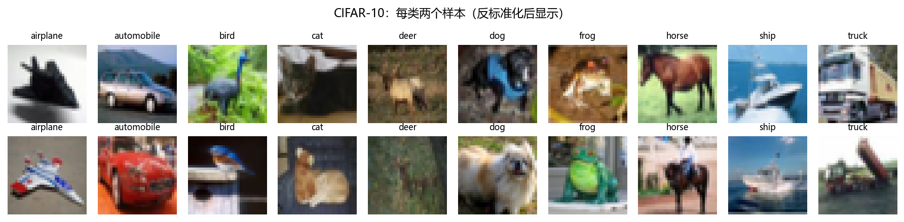
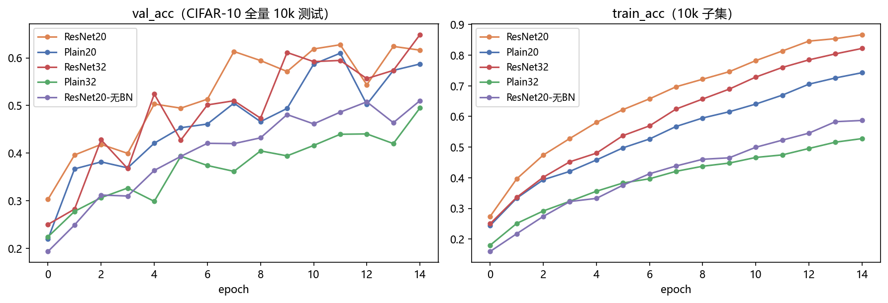
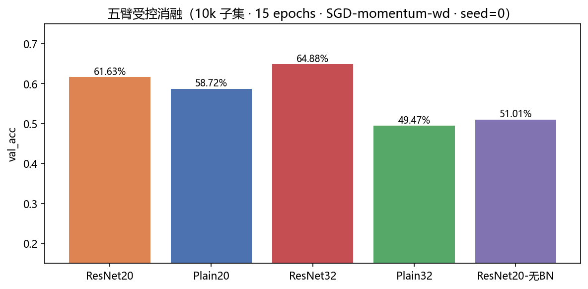
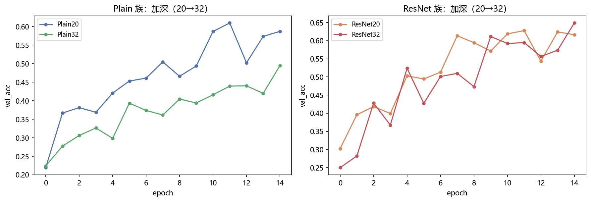
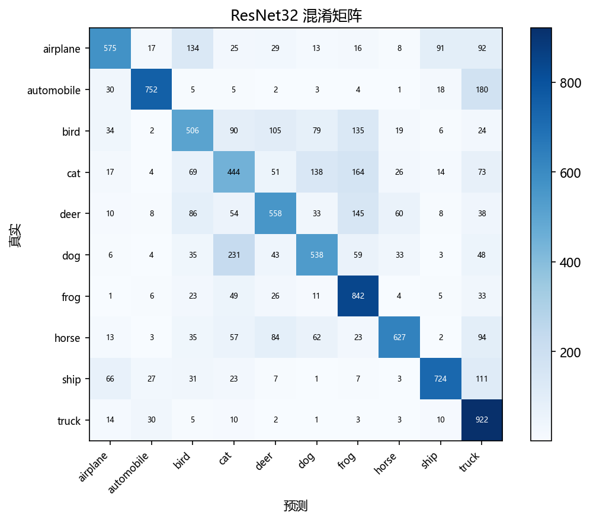

# 03 · ResNet on CIFAR-10 —— 残差连接：深度学习真正的分水岭 ★

> 家族：`02_CNN_Family` | 状态：✅ 已完成 | 主载体：`main.ipynb` | 公共模块：`../common/`
> 环境：`LLM_learning`（PyTorch 2.5.1+cpu；五臂 × 15 epochs 全本约 44 分钟）

## 1. 任务背景与目标

02 项目留下 NiN 的"病"——深层网络越深越差。本章开药方且拆开称重：**BN**（稳住每层分布）与**残差**（梯度直达通道）各自贡献多少？方法：`ResNetCIFAR` 一个类带 `residual` / `use_bn` 两个开关，生成五个臂做**受控消融**——同深度同通道，一次只拨一个开关。

## 2. 模型/算法原理

### 通俗理解

**一句话**：Plain 深网像传话游戏——传 30 层后信息面目全非；残差连接给每层加了一条"原话直达通道"，后层只需要学"需要改动的部分"。

**比喻**：改论文时不重写全文，而是在原稿上做**批注修改**（F(x) 是批注，x 是原稿）——哪怕批注是空白（F=0），论文也至少保持原样（恒等映射免费拿到）。反向传播时，梯度沿"原稿通道"无衰减地直达浅层（公式里的那个 "1"）。

### 退化问题（Degradation）

He 等人（2015）实测：56 层 Plain 的**训练误差**比 20 层还高——不是过拟合（训练集上也差），是优化失败：深层网络连"恒等映射"都学不好。残差把学习目标从 $H(x)$ 改成 $F(x)=H(x)-x$，恒等成为默认路径。

### 公式与设计

| 公式/设计 | 含义 |
|---|---|
| $y = F(x) + x$ | 残差块输出：批注 + 原稿 |
| $\\frac{\\partial L}{\\partial x} = \\frac{\\partial L}{\\partial y}(1 + \\frac{\\partial F}{\\partial x})$ | 梯度直达通道（"1" 的贡献） |
| $6n+2$（n=3→20 量级，n=5→32 量级） | CIFAR 深度公式，通道 16→32→64（原论文配置） |
| 1×1 投影捷径 ×2 | 维度对齐，全部代价 2,752 参数（1.01%） |

## 3. 网络结构图（五臂，代码 `../common/models.py::ResNetCIFAR`）

```
stem 3×3(16) → [BasicBlock]×3(32ch) → [BasicBlock]×3(64ch) → [BasicBlock]×3(128?no, 64) → GAP → FC
基本块: 3×3conv-BN-ReLU → 3×3conv-BN → (+x) → ReLU     # residual=False 即 Plain
```

| 臂 | residual | use_bn | 卷积层数 | 参数量 |
|---|---|---|---|---|
| ResNet20 | ✓ | ✓ | 21 | 272,474 |
| Plain20 | ✗ | ✓ | 19 | 269,722 |
| ResNet32 | ✓ | ✓ | 33 | 466,906 |
| Plain32 | ✗ | ✓ | 31 | 464,154 |
| ResNet20-无BN | ✓ | ✗ | 21 | 271,690 |

## 4. 核心公式

见 §2 表。补充：stride=2 下采样处捷径用 1×1 卷积（论文 option B），BN 层数 = 2×块数 + 2 投影 + 1 stem（ResNet20 共 21 层）。

## 5. 数据集介绍与预处理

CIFAR-10：50k+10k、32×32×3、10 类（每类均衡 5,000）。标准化 (0.4914,0.4822,0.4465)/(0.2470,0.2435,0.2616)。训练 10k 子集 + 测试全量 10k；**不使用增强**（02 已专题验证增强，此处追求五臂严格可比）。

## 6. 训练过程与超参数（协议演进实录）

**最终协议（v2）**：SGD(momentum=0.9, lr=0.05) + weight_decay=1e-4、batch 128、15 epochs、seed=0。

> **第一版协议的失败实录（本身就是教学点）**：最初用 Adam(1e-3)、8 epochs 跑出反常结果——ResNet20(50.9%) **低于** Plain20(56.4%)，且 train/val 差距 25pt（严重过拟合，val 曲线第 6 轮后下滑）。诊断：lr=1e-3 对 BN 深网过大 + 无增强 + 小子集。换 ResNet 论文标准配方（SGD+momentum+wd）后排序完全恢复（原型：ResNet20 61.4% > Plain20 50.5%）。**教训：配方不对时，任何组件都可能在错误的实验里"被失效"——报告组件结论必须连同优化器/lr 一起报告。**

## 7. 实验结果（全部为 notebook 实跑输出，15 epochs）

| 臂 | val_acc | val_loss | train_acc | 相对结论 |
|---|---|---|---|---|
| ResNet20 | 61.63% | 1.6611 | 86.67% | 基准 |
| Plain20 | 58.72% | 1.3307 | 74.27% | **残差增益 +2.91pt** |
| **ResNet32** | **64.88%** | 1.2370 | 82.19% | 深度是补药 +3.25pt |
| Plain32 | 49.47% | 1.3836 | 52.77% | **退化实锤 -9.25pt** |
| ResNet20-无BN | 51.01% | 1.3656 | 58.69% | **BN 贡献 +10.62pt** |

**三个核心结论**：

1. **残差的价值随深度放大**：20 层 +2.91pt → 32 层 **+15.41pt**——原论文"越深残差越重要"的叙事完整复现
2. **退化问题实锤**：Plain 族加深 -9.25pt，且 train_acc 掉 21.50pt（训练集上也差 → 优化失败而非过拟合，与原论文 Figure 1 一致）；ResNet 族加深 +3.25pt
3. **BN 贡献 +10.62pt**：ResNet 的两条腿缺一不可——02 项目 NiN 的"病"（深层 1×1 堆叠无 BN）在本章被精确复现（51.01% vs 61.63%）

**冠军错误（ResNet32）**：dog→cat 231、automobile→truck 180、cat→frog 164——视觉语义级混淆（毛发纹理/轮廓/颜色场景），与 MNIST 笔形、Fashion-MNIST 款式混淆又不同。

### 可视化







## 8. 误差分析与可视化

- **残差增益随深度放大**（+2.91 → +15.41pt）：浅层 Plain 还能靠梯度幸存，深层 Plain 的梯度在 30+ 层里已腐烂
- **退化 ≠ 过拟合**：Plain32 train_acc 52.77% < Plain20 74.27%——训练集上都学不动，铁证是优化失败；同参数量的 ResNet32（+2,752 参数）却学到 64.88%
- **无 BN 的残差网掉 10.62pt**：残差保梯度通道，但不稳分布——两味药治两个病（对应 NiN 困境的完整解释）
- **协议敏感性**：Adam(1e-3) 版本曾让 ResNet"被失效"（见 §6 实录）——消融结论 = 组件 × 配方的联合结论

## 9. 总结与改进方向

**实际应用场景**

- **ResNet 家族**：ResNet-50 至今是视觉骨干默认选型（分类/检测/分割 backbone）；残差思想进入了 Transformer（每个块都有 skip connection）——"加一条线"是深度学习史上性价比最高的发明
- **残差 + 归一化的组合拳**：现代大模型（GPT/ViT）全是"残差 + LayerNorm"的堆叠，正是本章两条腿的变体
- **消融方法论**：开关式消融（一个类 + 两个布尔参数）是论文复现/工业 A/B 的标准姿势

**常见坑 FAQ**

1. **Adam(1e-3) 直接训 BN 深网**：本项目第一版协议的翻车原因——ResNet 系请用 SGD+momentum（或极小 Adam lr + 预热）
2. **无增强 + 小子集 + 深网**：train/val 差距 25pt 的过拟合警报；真实 CIFAR 配方必配随机裁剪+翻转
3. **比较"残差 vs Plain"时忘了对齐参数量**：残差只加 1.01% 参数，对齐成本极低；但若 Plain 偷偷加宽通道，对照就废了
4. **把退化误诊为过拟合**：看 train_acc——训练集上也差就是优化失败，加正则只会更糟，加残差/BN 才是药
5. **权重衰减忘记加**：SGD+momentum 不带 wd 时小数据集上泛化明显变差（本项目 wd=1e-4 是论文标配）
6. **投影捷径随手加在所有层**：维度不变处用恒等捷径即可（论文 option A/B 只在下采样处投影）——乱加会平白增加参数

**下一步**：`04_DenseNet_Inception_CIFAR10`——连接拓扑续篇：DenseNet 密集连接（每层接所有层，特征复用极致）vs Inception 多尺度并行分支，与 ResNet 的相加连接同台对比。
