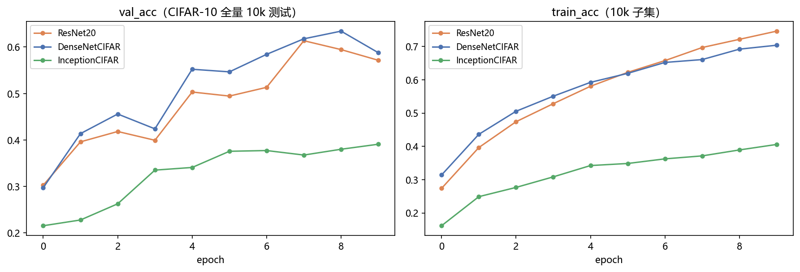
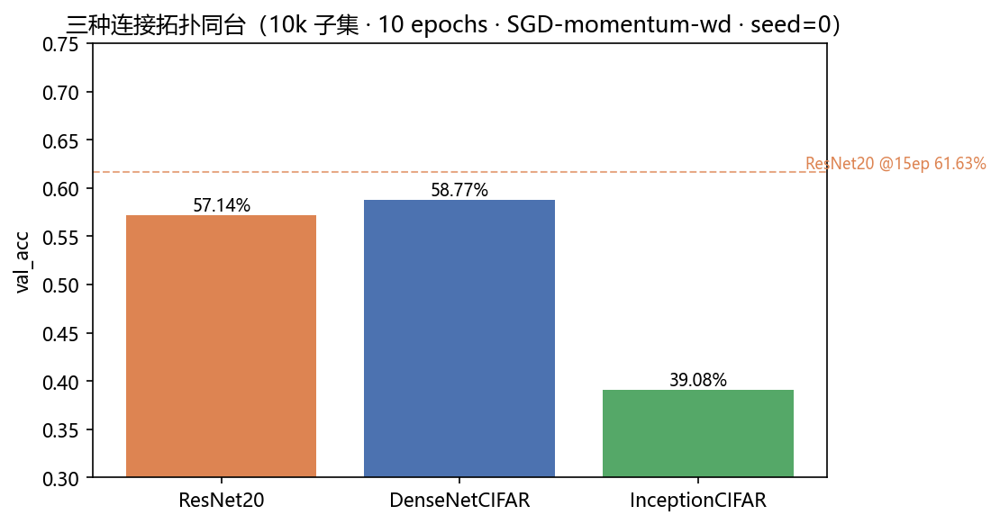
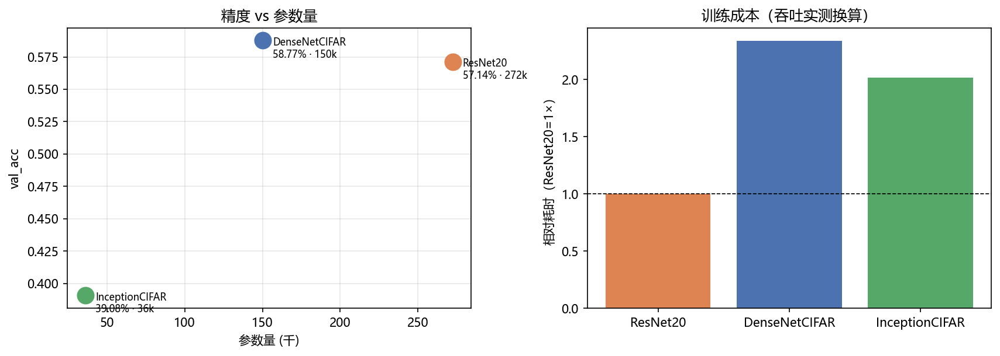
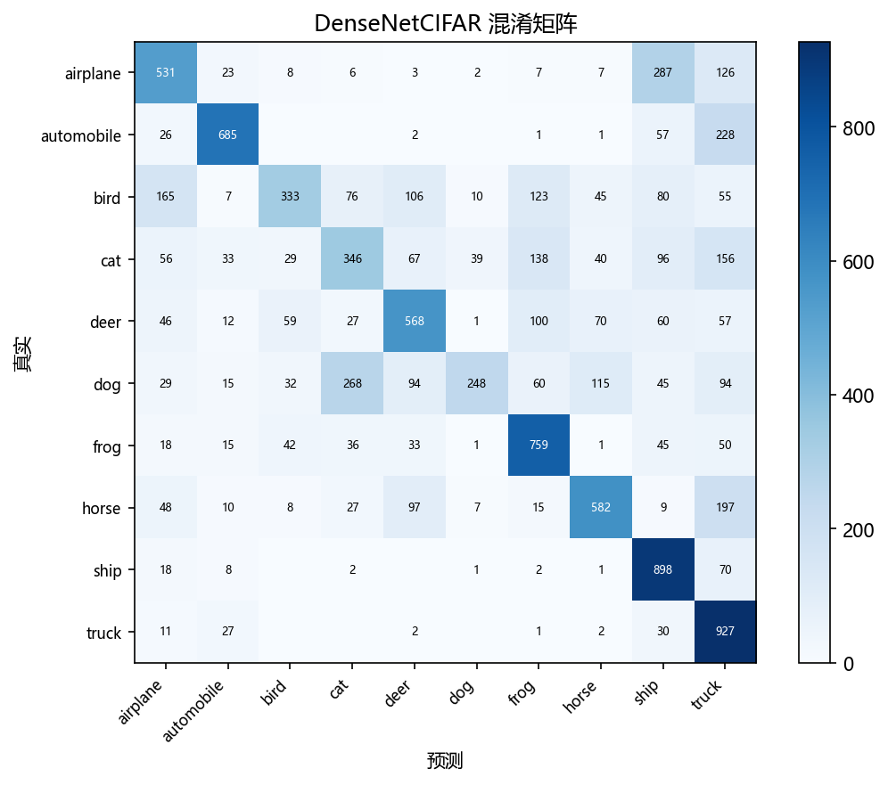

# 04 · DenseNet / Inception on CIFAR-10 —— 连接拓扑的两种答案

> 家族：`02_CNN_Family` | 状态：✅ 已完成 | 主载体：`main.ipynb` | 公共模块：`../common/`
> 环境：`LLM_learning`（PyTorch 2.5.1+cpu；三臂 × 10 epochs 全本约 28 分钟：ResNet 288s / DenseNet 723s / Inception 644s）

## 1. 任务背景与目标

03 项目证明"连接"是深度的解药——但"怎么连"不止一种答案。本章对比另外两种拓扑：**DenseNet**（每层接所有层，特征复用做到极致）与 **Inception**（多尺度并行分支，宽度换深度）。复用 ResNet20 作为**跨项目锚点**——03 同协议 15 epochs 的 61.63% 是参照线，本项目同配方 10 epochs 的 57.14% 同步可比。

## 2. 模型/算法原理

### 通俗理解

**一句话**：ResNet 是"批注修改"（新特征与原稿相加）；DenseNet 是"档案室"（所有历史版本原样保留在架子上，任何一层都能翻阅）；Inception 是"并行小组"（让 1×1/3×3/5×5 四个小组同时看同一张图，再把报告拼接）。

**比喻**：做笔记——ResNet 在旧笔记上改；DenseNet 把每堂课的笔记都复印一份钉在一起（所以 Transition 要用 1×1 压缩"减页"）；Inception 派四个不同放大倍数的显微镜同时观察，1×1 "降维镜"先把视野收窄再细看（省参数的核心）。

### 三种拓扑一句话

- **ResNet（相加）**：$y = F(x) + x$——维度必须对齐，旧特征被覆盖式混合
- **DenseNet（拼接）**：$y = [x, F_1(x), F_2(x), \\dots]$——所有历史特征原样保留，任何一层都能直接访问早期特征
- **Inception（并行）**：$y = [B_1(x), B_3(x), B_5(x), B_p(x)]$——同一输入同时过四条分支，网络自己学该看多大感受野

### DenseNet 的账：通道数怎么长

每层新增 `growth=12` 个通道，块内 6 层后 16→88；Transition 用 1×1 压缩一半（θ=0.5）再池化，三块下来最终 130 通道出 GAP——参数量 15.0 万（ResNet20 的 55%）。**代价**：concat 使每层输入通道线性增长，吞吐约为 ResNet 的 43%（197 vs 460 img/s）。

### Inception 的账：四分支怎么省

朴素 5×5 参数 = 25C²；Inception 先 1×1 降维再卷（"降维再卷"思想来自 NiN），参数省一个数量级。本项目轻量化两块（80→120 通道），参数量仅 3.6 万，CPU 上可承受。

## 3. 网络结构图

```
ResNetCIFAR(锚点)          21 卷积  272,474 参数  460 img/s
  stem 3×3(16) → 3×[BasicBlock(16→32→64, residual)] → GAP → FC

DenseNetCIFAR              150,322 参数  197 img/s（ResNet 的 43%）
  stem 16 → [DenseLayer×6 + Transition(θ=0.5)]×2 + DenseLayer×6 → BN→GAP → FC
  通道：16 → 88 → 44 → 116 → 58 → 130

InceptionCIFAR(轻量)        36,286 参数  228 img/s
  stem 32 → InceptionBlock(32→80) → InceptionBlock(80→120) → GAP → FC
  每块四分支：1×1 | 1×1→3×3 | 1×1→5×5 | Pool→1×1（拼接）
```

## 4. 核心公式

| 公式 | 含义 |
|---|---|
| $y_l = H_l([x_0, x_1, \\dots, x_{l-1}])$ | DenseNet 拼接：输入是所有前层输出的 concat |
| $y = [B_{1\\times1}(x), B_{3\\times3}(x), B_{5\\times5}(x), B_{pool}(x)]$ | Inception 并行拼接 |
| out = $\\lfloor$in × θ$\\rfloor$（θ=0.5） | Transition 压缩：通道减半控参数 |

## 5. 数据集介绍与预处理

CIFAR-10：50k+10k、32×32×3、10 类均衡、标准化 (0.4914,0.4822,0.4465)/(0.2470,0.2435,0.2616)，训练 10k 子集 + 测试全量 10k，无增强（保证与 03 锚点严格可比）。

## 6. 训练过程与超参数

**协议（沿用 03 最终配方）**：子集 10k、10 epochs、SGD(momentum=0.9, lr=0.05) + weight_decay=1e-4、batch 128、seed=0。训练部分耗时：ResNet 4.8 min / DenseNet 12.1 min / Inception 10.7 min。

> 与 03 锚点的差异：03 是 15 epochs（ResNet20 61.63%），本项目为控时用 10 epochs（同配方下 ResNet20 57.14%），两者同配方、仅轮数不同，差距符合训练曲线趋势。

## 7. 实验结果（全部为 notebook 实跑输出）

| 模型 | 参数量 | val_acc | val_loss | train_acc | 相对结论 |
|---|---|---|---|---|---|
| ResNet20（锚点） | 272,474 | 57.14% | 1.3849 | 74.60% | 基准（03 同配方 10ep 版） |
| **DenseNetCIFAR** | **150,322（55%）** | **58.77%** | 1.2463 | 70.37% | **+1.63pt 且参数减半** |
| InceptionCIFAR | 36,286（13%） | 39.08% | 1.5917 | 40.57% | 轻量两块思想验证，容量不足 |

**效率视角**：

| 模型 | 参数量 | val_acc | 吞吐(img/s) | 相对耗时 |
|---|---|---|---|---|
| ResNet20 | 272k | 57.14% | 460 | 1.0× |
| DenseNetCIFAR | 150k | 58.77% | 197 | 2.3× |
| InceptionCIFAR | 36k | 39.08% | 228 | 2.0× |

DenseNet 以 55% 参数拿到更高精度（特征复用效率高），但 concat 使计算图变宽、吞吐仅 43%——这正是它工业落地少于 ResNet 的真实原因：**参数省了，计算没省**。Inception 轻量版参数极小但受两块深度限制，精度未追上。

**冠军错误（DenseNetCIFAR，语义级混淆与 03 的 ResNet32 不同）**：

| 真实 → 预测 | 次数 |
|---|---|
| airplane → ship | 287 |
| dog → cat | 268 |
| automobile → truck | 228 |
| horse → truck | 197 |
| bird → airplane | 165 |

与 03 的 dog→cat(231) 领跑不同，DenseNet 的头号混淆是 airplane→ship（天空-海面背景 + 细长轮廓的跨域混淆）——拓扑差异改变了错误分布。

### 可视化







## 8. 误差分析与可视化

- **DenseNet 的"参数省、计算贵"**：拼接让旧特征零损耗复用（15 万参数超 27 万 ResNet），但每层输入通道线性增长导致卷积计算量与显存带宽飙升——论文本身也承认需要 Transition 压缩控规模
- **Inception 轻量的"思想到位、容量不足"**：两块 80→120 通道验证了四分支并行可行，但对比 ResNet 三阶段 9 个块，感受野与深度不足导致 39%——原版 GoogLeNet 靠 9 个 Inception 块 + 辅助分类器才达 SOTA，轻量化是 CPU 的妥协
- **train/val 差距**：三臂均有 12~18pt 差距（小子集 10k 的过拟合信号），与 03 的 15ep 版趋势一致；真实 CIFAR 配方需配增强（02 已专题验证）

### 常见坑 FAQ

1. **DenseLayer 拼错维度**：`torch.cat` 必须在通道维(dim=1)，拼在 batch 维会直接报 shape 错；增长后的通道数要传给下一层
2. **Transition 忘了压缩**：不做 θ=0.5，三块后通道会到 260+，显存与计算翻倍——论文 θ 就是为此设计
3. **Inception 分支出错**：四分支的 padding/stride 必须保证输出空间尺寸一致（32×32），否则 concat 报尺寸错
4. **轻量版归因错误**：Inception 39% 不是"Inception 不行"，是本项目轻量 2 块的容量不足——结论要连同"轻量化"一起报告
5. **DenseNet 吞吐慢就怀疑实现慢**：concat 本质是内存搬运密集型，197 vs 460 是拓扑固有代价，不是代码 bug

## 9. 总结与改进方向

**实际应用场景**

- **DenseNet**：数据少、参数预算紧时选它——如医疗影像小样本任务，150k 参数比 ResNet20 少 45% 还 +1.63pt；但每层要搬运所有历史特征的"显存账"使它没当上骨干默认（吞吐仅 ResNet 43%），大厂骨干还是相加的 ResNet
- **Inception**：多尺度思想进入后续所有架构——FPN 特征金字塔（检测标配，02 站三模型全在用）就是"让大中小感受野同时看"的雏形；1×1 降维再卷成为 ResNet-bottleneck、MobileNet 的标配零件
- **拓扑选择**：相加省显存 / 拼接省参数 / 并行多尺度——本章三臂同台给选择配了数字：同样 10 epochs，DenseNet 58.77% vs ResNet 57.14% vs Inception 39.08%

**核心收获**

1. 三种拓扑的机制与账目：相加（对齐约束）/ 拼接（通道线性增长+压缩）/ 并行（1×1 降维再卷）
2. 同协议同台：DenseNet 以 55% 参数 +1.63pt，轻量 Inception 思想验证（容量受限版）
3. 效率视角：参数量 ≠ 计算量——DenseNet 参数省、计算贵的经典案例
4. 跨项目锚点方法论：03 的 61.63% → 本章 57.14%（同配方、不同轮数）的可比性本身就是家族累积证据链的体现

**下一步**：`05_Lightweight_MobileNet_EfficientNet`——效率时代收口：深度可分离卷积（MobileNet 8~9 倍参数削减）与复合缩放（EfficientNet），画 Acc-FLOPs 权衡曲线，给本家族"效率视角"收官。
