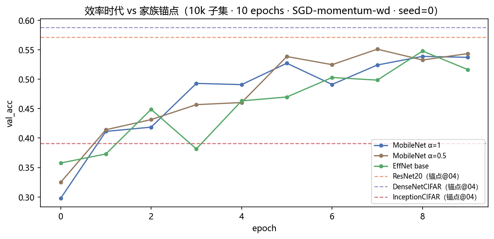
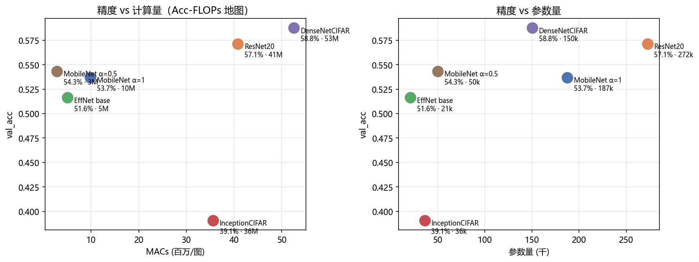
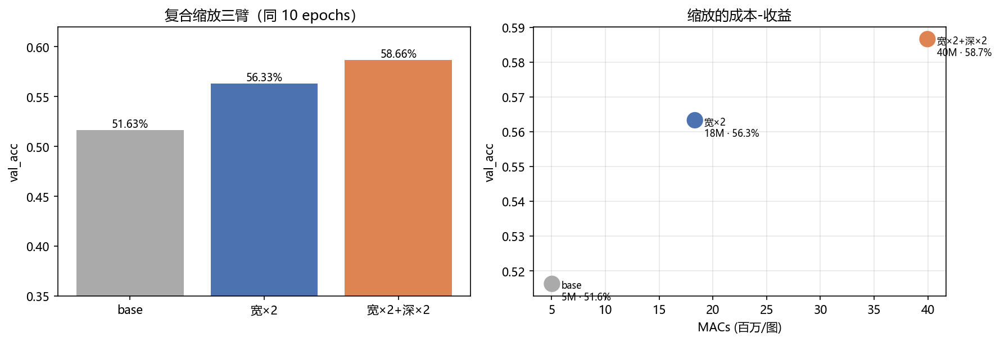
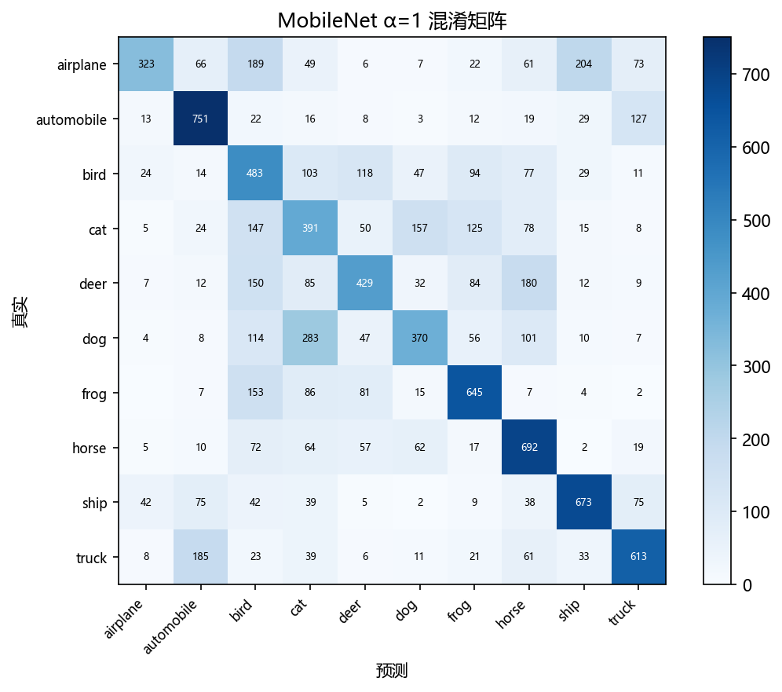

# 05 · MobileNet / EfficientNet on CIFAR-10 —— 效率时代：同一份算力能买多少精度

> 家族：`02_CNN_Family` | 状态：✅ 已完成 | 主载体：`main.ipynb` | 公共模块：`../common/`
> 环境：`LLM_learning`（PyTorch 2.5.1+cpu；主实验 3 臂 + 缩放 3 臂全本约 39 分钟：224s+474s+1066s）

## 1. 任务背景与目标

04 留下效率悬念——DenseNet 参数省、计算贵。本章给家族补第二把尺子 **FLOPs**，并引入两个把"省"做到极致的架构：**MobileNet**（深度可分离分解）与 **EfficientNet**（复合缩放，其 MBConv 内置 SE——04 的选学伏笔在此转正）。与 03/04 同配方同子集做**零成本锚点复用**，放上家族的 **Acc-FLOPs 性价比地图**。

## 2. 模型/算法原理

### 通俗理解

**一句话**：MobileNet 把一个"看所有通道再输出"的普通卷积拆成两步——先用每通道一个独立小卷积各自提炼（DW），再用 1×1 把各通道结论混合（PW）；EfficientNet 则回答"预算变多时，该把钱花在加宽、加深还是加分辨率"——答案是按固定比例同时放大。

**比喻**：拆卷积像餐厅改革——原来一个全能厨师同时看 32 个锅炒 64 道菜；改革后 32 个学徒各看各的锅（DW），再由传菜员统一调配（PW），人力省近 8 倍。

### 分解账（本项目现场验证）

标准 3×3 卷积：MACs = 9·Cin·Cout；分解后：DW 9·Cin + PW Cin·Cout。Cin=32, Cout=64, 32×32 时 **18.87M → 2.39M（省 7.9×）**。

### 复合缩放

EfficientNet 观察：单轴放大边际递减；用系数 φ 同步放大 depth(α^φ)/width(β^φ)/resolution(γ^φ)，约束 α·β²·γ²≈2 保证每档 FLOPs 翻倍。CIFAR 32×32 无分辨率下探空间，本项目 mini 版演示 width/depth 两轴。

### FLOPs 口径

`count_flops` 统计 Conv/Linear 的 MACs（乘加次数），BN/激活/池化忽略；MACs×2≈FLOPs，模型间相对比较不受口径影响。

## 3. 网络结构图

```
MobileNetCIFAR(α)                ~187k(α=1) / 50k(α=0.5)    9.8M / 2.8M MACs
  stem 3×3(32α) → MobileBlock×4(64α→128α→256α→512α, stride 1/2/2/2) → GAP → FC

EfficientNetCIFAR(base, w2, w2d2)   21k / 77k / 236k          5.0 / 18.3 / 40.0M MACs
  stem 16 → MBConv(24, 1块, s1) → MBConv(40, 1块, s2) → MBConv(64, 1块, s2) → GAP → FC
  MBConv = PW扩张(×2) → DW 3×3 → SE → PW投影(线性)；同通道 s1 时带残差（倒残差）
```

参数对比锚点（04 同协议实测）：ResNet20 272k / 40.8M；DenseNet 150k / 52.6M；Inception 36k / 35.6M。

## 4. 核心公式

| 公式 | 含义 |
|---|---|
| MACs_std = 9·Cin·Cout·H·W | 标准 3×3 卷积 |
| MACs_sep = 9·Cin·H·W + Cin·Cout·H·W | DW+PW 分解（本项目 7.9×） |
| w = φ·β, d = φ·α, 约束 α·β²·γ²≈2 | 复合缩放的预算直觉（γ 在 CIFAR 32 上固定） |
| w_SE = σ(FC2(ReLU(FC1(GAP(x))))) | SE 通道注意力权重（04 伏笔转正） |

## 5. 数据集介绍与预处理

CIFAR-10：50k+10k、32×32×3、10 类均衡、标准化 (0.4914,0.4822,0.4465)/(0.2470,0.2435,0.2616)，训练 10k 子集 + 测试全量 10k，无增强（保证与 03/04 锚点严格可比）。

## 6. 训练过程与超参数

**协议（沿用 03/04 最终配方）**：子集 10k、10 epochs、SGD(momentum=0.9, lr=0.05) + weight_decay=1e-4、batch 128、seed=0。训练耗时：MobileNet α=1 约 1.5 min/10ep（593 img/s）；EffNet base 224s / w2 474s / w2d2 1066s。

## 7. 实验结果（全部为 notebook 实跑输出）

**主实验（同 10 epochs 预算）**：

| 模型 | 参数量 | MACs | val_acc | val_loss | train_acc |
|---|---|---|---|---|---|
| ResNet20（锚点@04） | 272,474 | 40.8M | 57.14% | — | — |
| DenseNetCIFAR（锚点@04） | 150,322 | 52.6M | 58.77% | — | — |
| InceptionCIFAR（锚点@04） | 36,286 | 35.6M | 39.08% | — | — |
| MobileNet α=1 | 187,338 | 9.8M | 53.70% | 1.4895 | 76.88% |
| **MobileNet α=0.5** | **50,154** | **2.8M** | **54.34%** | 1.4154 | 70.01% |
| EffNet base | 21,186 | 5.0M | 51.63% | 1.3506 | 61.49% |

**α 消融**：α=0.5 以 **27% 参数、29% 计算** 反超 α=1 **+0.64pt**——小子集上小模型泛化更好，"更大≠更好"的经典案例。

**复合缩放三臂（同 10 epochs）**：

| 配置 | 参数量 | MACs | val_acc | 相对 base |
|---|---|---|---|---|
| base | 21,186 | 5.0M | 51.63% | — |
| 宽×2 | 77,434 | 18.3M | 56.33% | +4.70pt / +13.3M |
| **宽×2+深×2** | **235,770** | **40.0M** | **58.66%** | **+7.03pt / +35.0M** |

每 +10M MACs 买到的精度：宽×2 **+0.35pt/10M**，宽×2+深×2 **+0.20pt/10M**——边际递减明显，复合臂用近 3 倍计算才多买 2.33pt，且仍未超 DenseNet 锚点（58.77%）——**mini 容量下缩放的收益有限**，如实呈现。

### 可视化







## 8. 误差分析与可视化

- **分解的账算对了**：MobileNet 以 ResNet 69% 参数、24% 计算拿到 53.7%（-3.44pt），α=0.5 更以 18% 参数追回 0.64pt——"省 8 倍"是真的，但"精度不掉"是**有条件**的（小子集上小模型反而受益）
- **缩放的账不划算**：mini 版三臂显示，35M 额外计算只多买 7pt（0.20pt/10M），而 DenseNet 用 52.6M 已拿到 58.77%——**拓扑选择比单纯放大更重要**（呼应 04 结论）
- **train/val 差距**：MobileNet α=1 高达 23pt（76.88→53.70），α=0.5 收窄到 16pt——宽度本身就是正则化
- **冠军错误（MobileNet α=1，轻量网视角）**：dog→cat 283、airplane→ship 204——与重型网（ResNet32 的 dog→cat 231）分布相似，轻量化未显著改变错误结构

### 常见坑 FAQ

1. **MACs 少就一定快？** 理论 FLOPs 与实测吞吐不完全正比——DW 卷积在部分 BLAS 上 memory-bound，本项目需同时报告两者
2. **α=0.5 精度更高就怀疑 bug**：小子集+短训下小模型过拟合更轻，反超是合理的泛化现象，不是实现错
3. **EffNet 缩放没超 DenseNet 就否定 EfficientNet**：mini 版 3 块 vs 原论文 7 stages + 更大分辨率，结论要带"mini 容量"限定语
4. **MBConv 的 SE 忘加**：EffNet 的"高效"一半来自 SE 通道注意力（04 选学转正），漏掉精度明显掉
5. **count_flops 口径不一致**：BN 不计入，比较时必须统一口径；本项目 MACs 已在 cell-08 打印可复核
6. **width_mult 用错维度**：α 同时缩放 stem 与所有 stage，若只缩放部分层，对比就不受控

## 9. 总结与改进方向

**实际应用场景**

- **MobileNet**：手机端实时视觉（拍照分类、扫码、端侧检测 backbone）——端侧推理的默认起点
- **EfficientNet**：云端"精度-算力"帕累托前沿的标杆；复合缩放思想进入后续所有 NAS 搜索空间
- **SE 注意力**：从 04 选学到 05 标配，成为现代 CNN/Transformer 通道注意力的通用件

**核心收获**

1. 深度可分离的账（7.9× 现场 verify）与 α 旋钮的收益曲线（小模型在小数据上反超）
2. MBConv = 倒残差 + SE——SE 伏笔转正
3. 复合缩放 mini 三臂的成本-收益口径（0.35→0.20pt/10M 的递减）
4. Acc-FLOPs + Acc-params 双图：家族六配置的性价比地图（DenseNet 两图位置不同 = 参数省/计算贵的证据升级）

**下一步**：`06_ConvNeXt_vs_ViT`——家族压轴：现代化改造（ConvNeXt 用 Transformer 经验重造 CNN）与跨家族 ViT 同台，为 06 Transformer_Vision 家族铺路。
