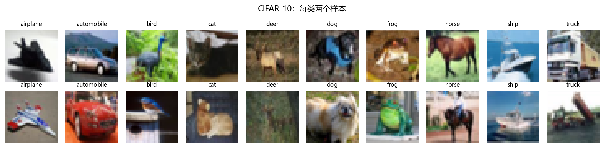
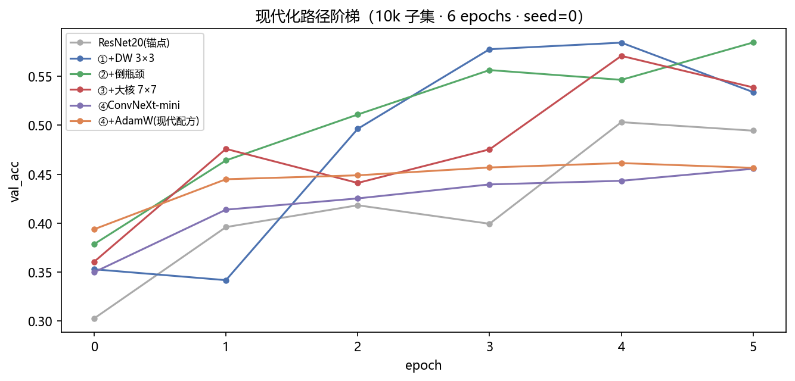
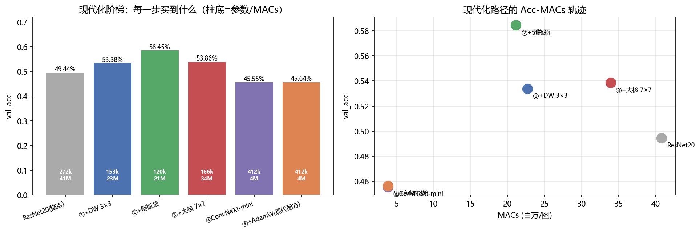
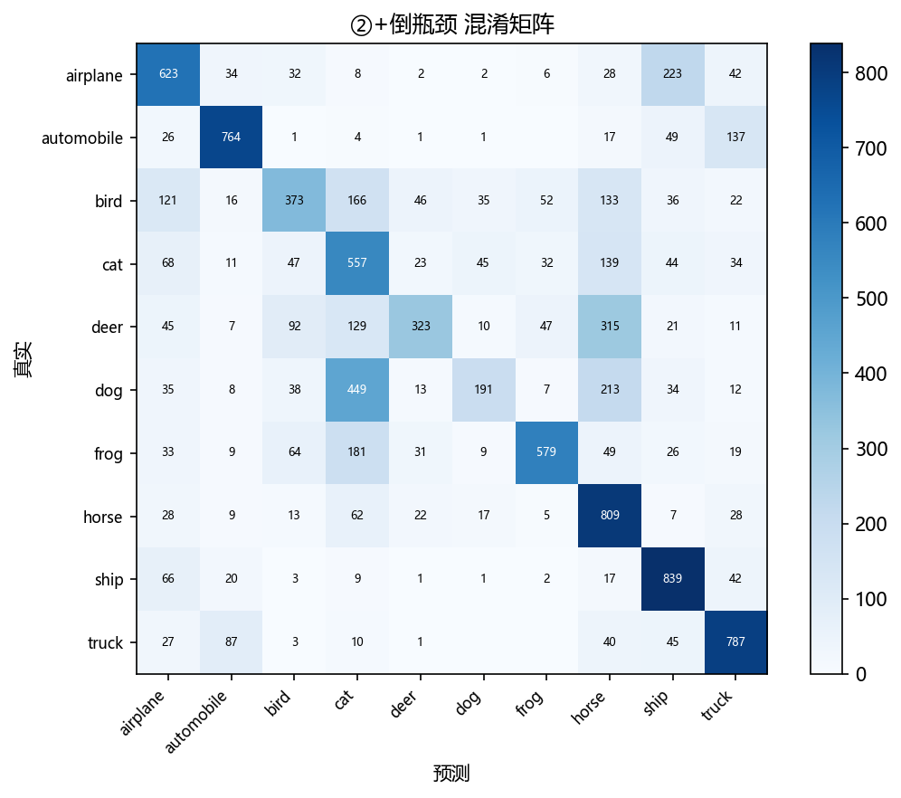

# 06 · ConvNeXt —— 用 Transformer 的经验重造 CNN（家族收官）

> 家族：`02_CNN_Family` | 状态：✅ 已完成 | 主载体：`main.ipynb` | 公共模块：`../common/`
> 环境：`LLM_learning`（PyTorch 2.5.1+cpu；六臂 × 6 epochs 全本约 33 分钟：170s/149s/545s/820s/33s/33s）

## 1. 任务背景与目标

05 的 Acc-FLOPs 地图摆出六配置性价比，本章回答最后问题：**带着 Transformer 时代的经验重造 CNN，长什么样？** ConvNeXt（2022）不改归纳偏置，只换工程细节就追平 Swin。本章沿原论文现代化路径对 ResNet20 做**逐步改造**，每步只动一个开关，ViT 同台为**预留延续点**（`06_Transformer_Vision_Multimodal` 完工后回填，协议兼容）。

## 2. 模型/算法原理

### 通俗理解
**一句话**：不换承重墙（卷积局部性/权值共享），只做装修——换现代镜头（大核 DW）、取景器（LN）、快门曲线（GELU）、算力分布（倒瓶颈）和入口（patchify）。

### 现代化五件套（本项目消融路径）
| 步骤 | 改动 | 动机 |
|---|---|---|
| 锚点 | ResNet20（3×3 稠密） | 出发点 |
| ① | → DW 3×3 | 各通道独立处理，算力省给通道混合 |
| ② | → 倒瓶颈（1×1×4→DW→1×1） | 中间层低分辨率下做重计算 |
| ③ | DW 3×3 → DW 7×7 | 对齐 Transformer 全局感受野 |
| ④ | +LN/GELU/patchify 4×4/分离下采样/γ | 全面现代化 → ConvNeXt-mini |
| ⑤ | SGD → AdamW(1e-3, wd 0.05) | 现代配方（03 教训闭环） |

## 3. 网络结构图
```
ResNetCIFAR锚点  21 conv 272k 40.8M MACs
ModernPath(dw/inv3/inv7)  保持 stem 16→32→64 / GAP 骨架，只换块内
ConvNeXt-mini  32→64→128, 每段2块, patchify 4×4(32→8), 411k/3.9M MACs
  ConvNeXtBlock: DW7×7→LN→PW×4→GELU→PW→γ缩放→(+x)
```

## 4. 核心公式
| 公式 | 含义 |
|---|---|
| MACs_std=9·Cin·Cout·HW vs MACs_DW=9·Cin·HW+Cin·Cout·HW | 分解账（05 已 verify 7.9×） |
| y=γ·PW2(GELU(PW1(LN(DW(x)))))+x | ConvNeXt 块 |
| patchify: 32×32→8×8 一步到位 | 计算从高分辨率挤到低分辨率 |

## 5. 数据集
CIFAR-10：50k+10k、32×32×3、10 类均衡、标准化 (0.4914,0.4822,0.4465)/(0.2470,0.2435,0.2616)，训练 10k 子集 + 测试全量 10k，无增强。

## 6. 训练过程与超参数
**协议**：子集 10k、6 epochs（③臂 92 img/s 为全梯统一步长）、SGD(momentum 0.9, lr 0.05)+wd1e-4、batch 128、seed 0；⑤臂换 AdamW(1e-3, wd 0.05)。锚点同预算复训，阶梯严格可比。耗时：ResNet 170s / dw 149s / inv3 545s / inv7 820s / ConvNeXt 33s×2。

## 7. 实验结果（实跑输出）

| 臂 | 参数量 | MACs | val_acc | val_loss | train_acc | 逐步增量 |
|---|---|---|---|---|---|---|
| ResNet20 锚点 | 272,474 | 40.8M | 49.44% | 1.4831 | 62.22% | — |
| ①+DW 3×3 | 153,386 | 22.7M | 53.38% | 1.4334 | 71.94% | **+3.94pt** |
| **②+倒瓶颈** | **120,186** | **21.1M** | **58.45%** | **1.2267** | 67.24% | **+5.07pt** |
| ③+大核 7×7 | 166,266 | 33.9M | 53.86% | 1.4178 | 70.11% | -4.59pt |
| ④ConvNeXt-mini | 411,658 | 3.9M | 45.55% | 1.5310 | 53.60% | -8.31pt |
| ④+AdamW | 411,658 | 3.9M | 45.64% | 1.6449 | 69.19% | +0.09pt |

**关键解读**：
1. **前两步是真红利**：DW 省 44% 参数/MACs 还 +3.94pt；倒瓶颈再 +5.07pt，以 44% 参数超越锚点 9pt——现代算力分布的核心价值
2. **后两步在小预算下反噬**：7×7 大核在 32×32、10k、6ep 下 -4.59pt；patchify 4×4 把 32 直接压到 8 丢失细节，ConvNeXt-mini 45.55%——**原论文配方为 ImageNet 224×224 + 长训设计，CIFAR mini 不是其舒适区**，如实呈现
3. **AdamW 短训无感**：+0.09pt，现代配方需长训+预热才兑现（呼应 03 教训：配方×预算联合决定结论）
4. **算力账极端**：ConvNeXt 41万参数但仅 3.9M MACs（ResNet 1/10）——参数多计算少，与 DenseNet 相反，patchify+倒瓶颈把计算挤到低分辨率

冠军错误（②倒瓶颈 58.45%）：dog→cat 449、deer→horse 315——仍是语义混淆主导。

### 可视化





## 8. 误差分析与可视化
- **DW 与倒瓶颈是普适红利**：两步共 +9pt 且 MACs 减半，小数据短训下稳赚
- **大核与 patchify 的预算错配**：7×7 在小图上感受野溢出，patchify 4×4 过度下采样——大模型为大数据设计，mini 复现必然失真，教训是“现代化≠无脑堆大核”
- **train/val 差距**：dw 18.5pt / inv3 8.8pt——倒瓶颈本身有正则效应
- **ViT 预留**：CNN 的归纳偏置在小数据短训下仍是优势，ViT 需更大数据/更长训才反超，届时同协议回填即得“偏置 vs 规模”对照

### 常见坑 FAQ
1. 大核 DW 在小图上变慢（inv7 92 vs inv3 155 img/s）却掉精度——别為大核而大核
2. patchify stride 4 + LN 通道错配（本项目 LayerNorm2d 已封装）
3. ConvNeXt-mini 掉分就否定 ConvNeXt——mini 为 CPU 妥协，结论带“mini 预算”限定语
4. AdamW 1e-3 在短训下不如 SGD 0.05——现代配方需 warmup+长训

## 9. 总结与改进方向
**实际应用场景**
- **DW/倒瓶颈**：手机/端侧的实时识别（拍照分类、扫码）骨干几乎都换成这套——本项目 +9.01pt 还省 44% MACs，是"用更少计算买同样精度"的普适红利
- **ConvNeXt**：2022 后云端视觉新基准——图像分类/检测/分割的骨干选型里与 Swin Transformer 同台；当数据大、训练长时，它用纯卷积拿到 Transformer 级精度，运维还更省心

**核心收获**
1. 现代化阶梯：DW 与倒瓶颈是真红利，大核/patchify 在小预算下负收益——如实量化
2. 极端性价比账：41万参/3.9M MACs 的算力分布
3. 家族收官：LeNet→ConvNeXt 14 年演进同协议复现，锚点链完整

**下一步**：`06_Transformer_Vision_Multimodal` 家族完工后回填 ViT-mini 同台——本 notebook ARMS 结构可直接扩展。
