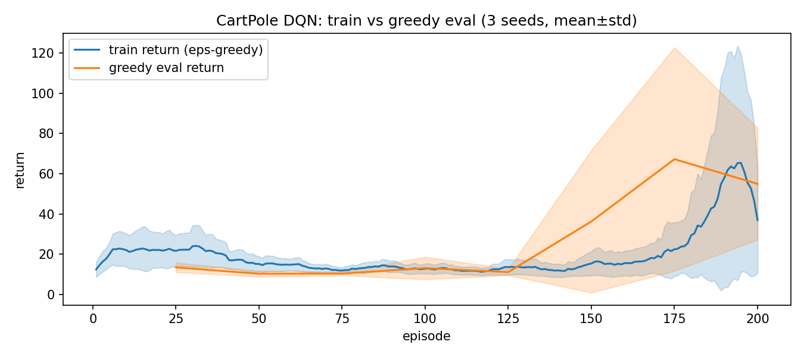
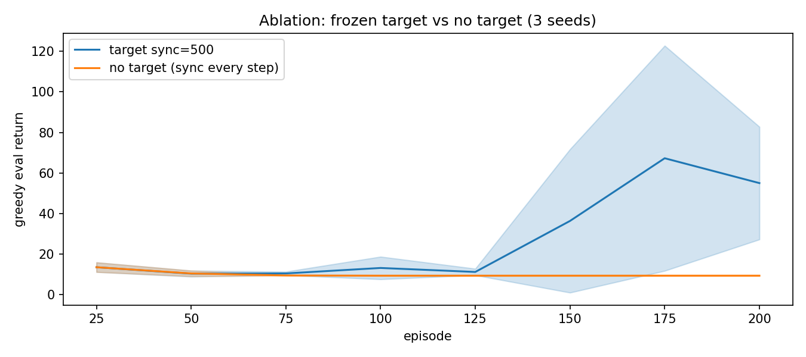
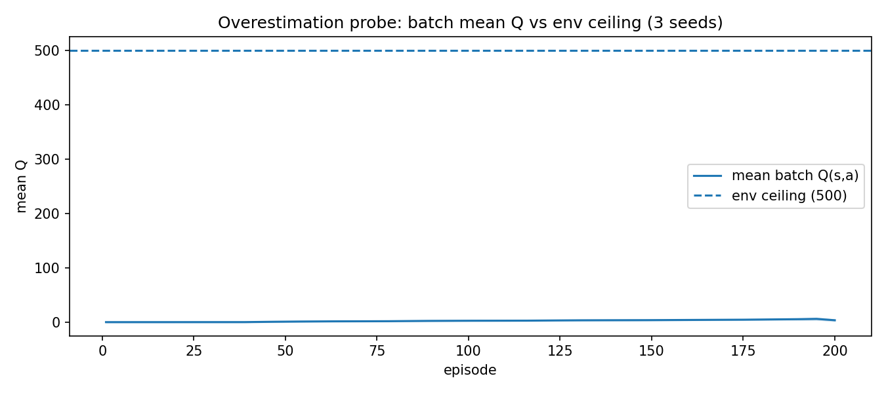
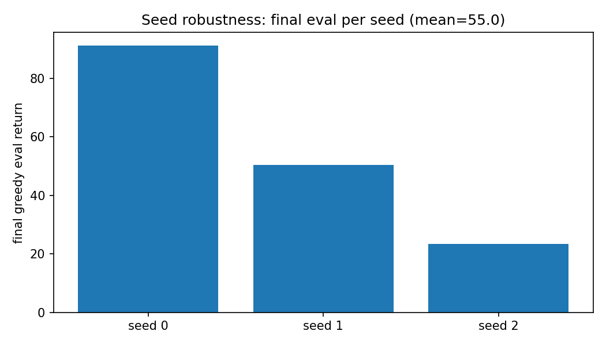

# 01 DQN 基线：CartPole + Target 网络消融

> 状态：✅ 已完成 | 环境：`CartPole-v1`（gymnasium 0.29.1），torch 2.5.1+cpu | 实跑：`python run.py`（200ep × 3种子 + no-target 对照，CPU 约 90s）

## 1. 任务背景与目标

表格 Q-Learning 在 01 地基的 48 状态悬崖上work，但 CartPole 状态连续 4 维，表格装不下。DQN 用 MLP 拟合 Q(s,a)，第一次把“查表”换成“函数近似”。本站钉死基线，并用消融证明 Target 网络不是摆设。

## 2. 模型/算法原理

**通俗理解**：Q-Learning 是拿账本查“这招值多少”，DQN 是请个神经网络当会计，凭经验估值。经验回放是“错题本”（打乱顺序防 bias），Target 网络是“ frozen 参考答案”（防自己追自己跑飞）。

**家族位置**：01 表格 Q-Learning（精确但装不下）→ 本站 DQN（能装但会高估/不稳）→ 下一站 Double（防自夸）/ Dueling（拆 V/A）。

## 3. 网络结构图

```text
 CartPole obs(4) -> Linear(4,128) -> ReLU -> Linear(128,128) -> ReLU -> Linear(128,2) = Q(s,left/right)
 online net --every step--> Huber loss vs y = r + gamma*(1-done)*max Q_target(s')
 target net --hard sync every 500 grad steps--> frozen copy
 ReplayBuffer 20000, batch 64, learning_starts 1000
 eps-greedy 1.0 -> 0.05 over 160 episodes
```

## 4. 核心公式

\[ y = r + \gamma (1-d)\max_{a'} Q_{\text{target}}(s', a') \]

\[ L = \text{Huber}(Q_{\text{online}}(s,a), y) \]

\[ \epsilon(ep) = 1.0 + \min(1, ep/160)\times(0.05-1.0) \]

## 5. 环境介绍与预处理

- `CartPole-v1`：obs 4 维连续（位置/速度/角度/角速度），动作 2 离散，无需归一化（MLP 直接吃）
- 回合上限 500 步，奖励 +1/步，天花板 500
- 种子：`env.reset(seed=seed*100000+ep)`，行为采样 `env.action_space.sample()`，评估用独立 env + 固定 base_seed=999，共 10 轮贪心

## 6. 训练过程与超参数

| 项 | 值 |
|---|---|
| episodes × 种子 | 200 × [0,1,2]，另加 no-target 同预算对照 |
| hidden / lr / gamma | 128 / 1e-3 Adam / 0.99 |
| buffer / batch / starts | 20000 / 64 / 1000 |
| target_sync | 500 grad steps（消融组每步同步） |
| eps | 1.0→0.05 / 160ep 线性 |
| 梯度裁剪 | 10.0；评估每 25ep，n_eval=10 |

## 7. 实验结果（实跑 stdout.txt）

| 实验 | 结果 |
|---|---|
| E1 基线学习 | train 后30轮 43.8±33.0；贪心 eval@25=13.5±2.4 → @150=36.3±35.4 → @175=67.3±55.5 → @200=55.0±27.8（先平后起，种子方差大是 DQN 常态） |
| E2 target 消融 | stable 55.0±27.8 vs no-target 9.3±0.2；后30轮 loss 0.0572 vs 18471.85（每步追自己，loss 爆炸 30 万倍） |
| E3 高估探针 | batch meanQ early 0.00 → mid 2.57 → late 5.54，远低于天花板 500（CartPole 简单+Huber+target 压住，未溢出） |
| 种子鲁棒 | final eval seed0=91 / seed1=50 / seed2=24（同参不同命，报告必须带种子） |






## 8. 失败模式与误差分析

- **no-target loss 18471**：目标每步跟着在线网跑，自举变成“自己给自己抬轿”，Huber 也压不住。这是 DQN 论文加 target 的直接证据，本站复现成功
- **eval 方差 ±27.8**：CartPole 对初始化敏感，3 种子 spread 24~91。缓解靠多种子平均 + 看 eval 曲线不看单点
- **修过的真 bug**：`train.py` 旧版在 `reset()` 后若首步即 done 会继续 `step()` 触发 gymnasium 警告（`terminated=True 后又 step`）。已改 `while not done` 循环内 `done=term or trunc` 即停，smoke 验证 eval 236→322 正常爬升

**常见坑 FAQ**：Q1 learning_starts 太小会怎样？——buffer 没攒够就学，前期全是相关样本，loss 抖。Q2 eps 衰太快？——160ep 对 200ep 刚好，太快则后期撞不出新状态。Q3 meanQ 一直 0？——前期 eps≈1 全随机，Q 没信号，正常，看 mid/late。

## 9. 总结与改进方向

DQN 跑通 CartPole，target 网络是稳定器（55 vs 9.3）。但单种子方差大、max 操作隐含高估，下一站 Double/Dueling 收尾。

**实际应用场景**：离散动作小规模控制（游戏 AI、简单机器人抓取离散化）DQN 仍是首选基线；target frozen 思想被 TD3/SAC/CQL 全家继承。

## 10. 场景速查

| 场景 | 推荐 | 支撑数据 | 要点 |
|---|---|---|---|
| 离散动作 + 连续状态 | DQN+target+回放 | 55.0 vs 9.3 | target_sync 别小于 200 |
| loss 爆炸 | 查 target 是否每步同步 | 0.057 vs 18471 | frozen 参考答案是命 |
| 单种子好/坏 | 跑 ≥3 种子 | 24~91 spread | 只报单种子 = 耍流氓 |
