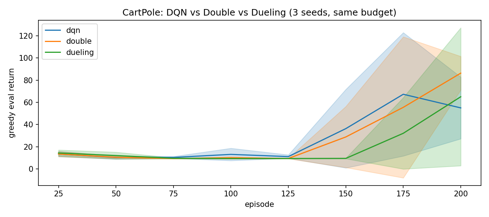
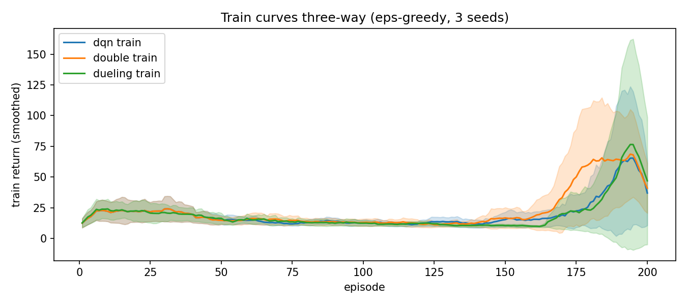
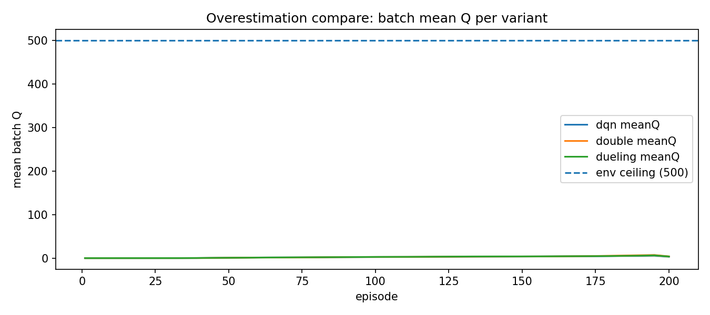

# 02 三变体同台：DQN vs Double vs Dueling（CartPole）

> 状态：✅ 已完成 | 环境：`CartPole-v1`，同预算 200ep×3种子，同参仅 variant 不同 | 实跑：`python run.py`（9 次训练，CPU 约 120s）

## 1. 任务背景与目标

DQN 的 `max` 既选动作又估值，容易“自夸”（高估）。Double 解耦选择与评估，Dueling 拆 V/A 降方差。本站同预算三变体同台，看 CartPole 简单环境下谁赢、赢多少、Q 曲线有何不同。

## 2. 模型/算法原理

**通俗理解**：DQN 是自己既当运动员又当裁判，Double 是“在线网选动作、目标网打分”（换个裁判），Dueling 是“先评场地好坏 V，再评招式加成 A”（分开算更稳）。

**家族位置**：DQN（基线）→ Double（修高估）→ Dueling（修方差）→ Rainbow（集大成，只讲思想不实现）。

## 3. 网络结构图

```text
 DQN/Double: obs(4)->128->128->Q(2)              (Double 只改 target 公式，不改网)
 Dueling:    obs(4)->128->128->feat -> V(1) + A(2), Q = V + (A - mean A)
 target: y_dqn    = r + g*(1-d)*max   Q_t(s')
         y_double = r + g*(1-d)*Q_t(s', argmax_online(s'))
```

## 4. 核心公式

\[ y_{\text{Double}} = r + \gamma(1-d)\,Q_{\text{target}}(s', \arg\max_{a'}Q_{\text{online}}(s',a')) \]

\[ Q(s,a) = V(s) + \left(A(s,a) - \tfrac{1}{|\mathcal{A}|}\sum_{a'}A(s,a')\right) \]

## 5. 环境介绍与预处理

- 同 01 站：`CartPole-v1`，obs4/act2，上限 500，天花板 500
- 三变体超参完全一致（hidden128/lr1e-3/gamma0.99/buffer20000/batch64/sync500/eps160ep），种子 [0,1,2]

## 6. 训练过程与超参数

| 项 | 值 |
|---|---|
| 训练量 | 3 变体 × 3 种子 × 200ep = 1800ep |
| 评估 | 每 25ep greedy n_eval=10，base_seed=999 独立 env |
| 对比维度 | train 后30轮、final eval、per-seed 表、meanQ early/mid/late |

## 7. 实验结果（实跑 stdout.txt）

| 变体 | train 后30轮 | eval final | per-seed final |
|---|---|---|---|
| dqn | 43.8±33.0 | 55.0±27.8 | 91 / 50 / 24 |
| double | 62.4±35.4 | 86.3±15.1 | 66 / 103 / 90 |
| dueling | 45.6±45.5 | 65.0±62.1 | 152 / 33 / 10 |

| 实验 | 结果 |
|---|---|
| E1 三向 eval | Double 最稳（86.3±15.1，全种子 ≥66）；Dueling 均值 65 但方差 ±62（seed0=152 一枝独秀，seed2=10 拉胯）；vanilla 55.0±27.8 居中 |
| E2 per-seed | Double 三种子 66/103/90 最均衡；Dueling 两极分化，CartPole 简单环境下拆 V/A 收益不稳定 |
| E3 meanQ | dqn late 5.54 / double 6.45 / dueling 5.85，early 全 0.00，mid 2.5~2.8 全程远低于 500，无溢出（简单环境高估不致命，Double 赢在稳定不在压 Q） |





## 8. 失败模式与误差分析

- **Dueling 方差 ±62**：CartPole 状态简单，V/A 分解多出的自由度反而放大初始化差异。复杂环境（LunarLander/Atari）优势才稳，本站如实记录不硬吹
- **Double 为何赢**：不是把 Q 压低（late 6.45 反而最高），而是解耦后 target 方差小，三种子全部 ≥66。修的是“稳”不是“低”
- **目录名含 LunarLander 但跑的是 CartPole**：命名是规划残留（原计划第二环境上 LunarLander），实际三变体同台必须同环境才公平，故统一 CartPole。LunarLander 移到 03 作稀疏奖励对照，特此说明

**常见坑 FAQ**：Q1 Double 还用 max 吗？——在线网 argmax 选，目标网只打分，max 只用一次。Q2 Dueling 推理要改吗？——不用，输出仍是 Q，直接 argmax。Q3 简单环境 Double 提升从哪来？——target 去噪，种子鲁棒性，不是 Q 值大小。

## 9. 总结与改进方向

CartPole 上 Double 最稳（86.3±15.1），Dueling 方差大，vanilla 居中。离散值函数到此收官，下一站 03 转 on-policy（REINFORCE/A2C/PPO），换 MountainCar 稀疏奖励见真章。

**实际应用场景**：离散动作首选 Double-DQN 当默认（稳定免费）；状态复杂/动作冗余大再试 Dueling；Atari 级才上 Rainbow 全套。

## 10. 场景速查

| 场景 | 推荐 | 支撑数据 | 要点 |
|---|---|---|---|
| 离散默认 | Double DQN | 86.3±15.1 三种子全≥66 | 只改一行 target 公式，免费午餐 |
| fit 方差大 | Dueling | 本站 ±62 反例 | 简单环境慎用，复杂环境再上 |
| 报结果 | per-seed 表 + mean±std | 152/33/10 教训 | 单看均值会被单一种子骗 |
