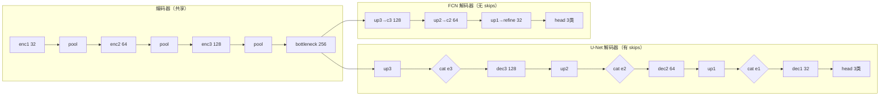
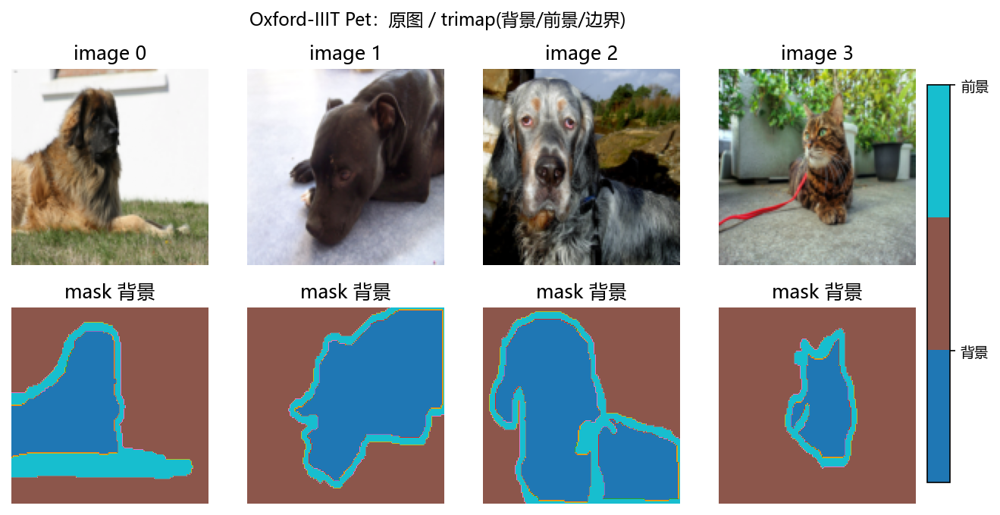
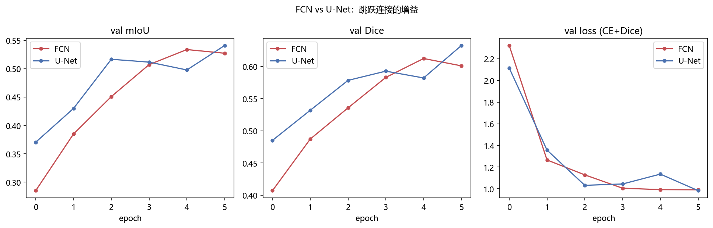
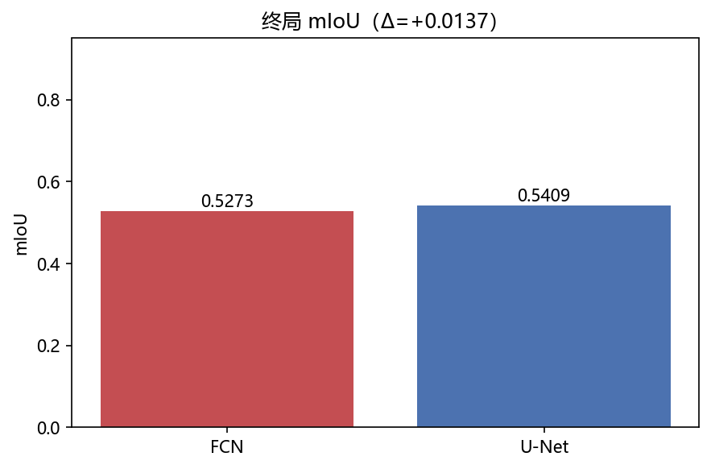
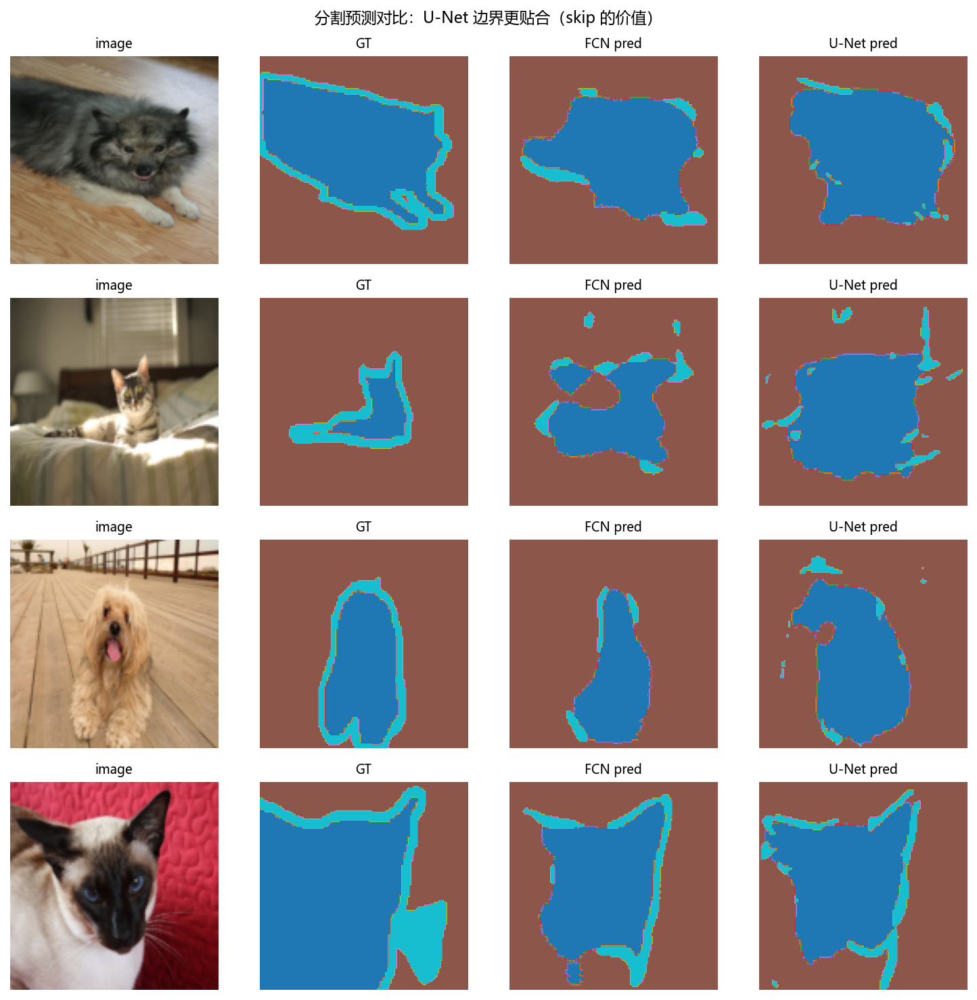
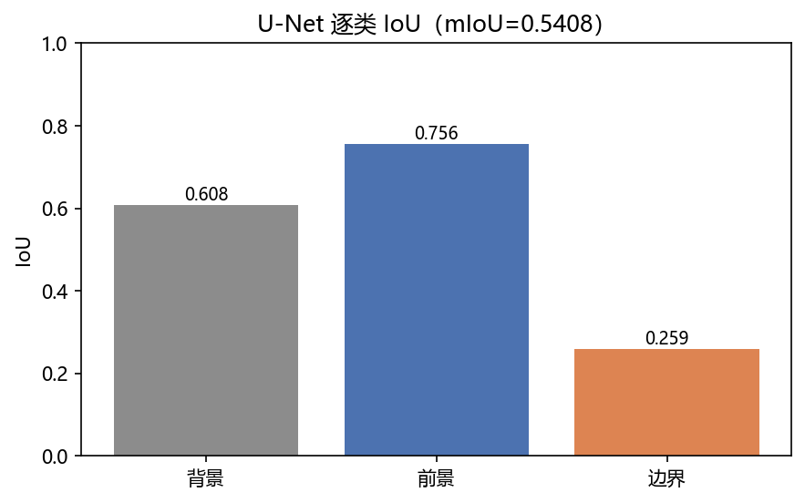

# 01 · FCN / U-Net on Oxford-IIIT Pet —— 从分类到逐像素

> 家族：`03_CNN_Segmentation_Detection` | 状态：✅ 已完成 | 主载体：`main.ipynb` | 公共模块：`../common/`
> 环境：`LLM_learning`（PyTorch 2.5.1+cpu；双臂 ×6 epochs 全程约 9.7 分钟，FCN/U-Net 各 ~290s）

## 1. 任务背景与目标

02 家族在 32×32 上把分类主干（LeNet→ConvNeXt）走完，本章把同一套卷积思想搬到**逐像素任务**：分类一图一签，分割每像素一签。指标、损失、数据形态全部换挡——mIoU/Dice 代替 accuracy，CE+Dice 代替纯 CE，带 trimap 掩码的 Oxford-IIIT Pet 代替 CIFAR。

## 2. 模型/算法原理

### 通俗理解

**一句话**：分类把全图压成一个标签就完事，分割要把每个像素的标签都吐出来。下采样会丢细节，上采样只会模糊补——U-Net 把编码器高分辨率的"原图细节"通过跳跃连接直接抄给解码器，既看得懂"这是什么"（深层语义）也记得"在哪儿"（浅层位置）。

**比喻**：抄地图——编码器把地图越折越小只记要点，解码器要重新展开。FCN 只靠记忆展开，细节全糊；U-Net 每折一次留一张小抄（skip），展开时对照着描，边界自然清晰。

### 结构账（唯一差跳跃）

```
FCN ： enc1→pool→enc2→pool→enc3→pool→bottleneck → deconv×3 → refine → head          (无跳跃)
U-Net：enc1 ─┐  enc2 ─┐  enc3 ─┐
              pool    pool    pool
              bottleneck → deconv┘cat→dec3 → deconv┘cat→dec2 → deconv┘cat→dec1 → head
```

两网共享编码器容量（32→64→128→256），唯一变量是 `cat([up, enc])`——消融的本体。

## 3. 网络结构图



- `U-NetMini`：192.7 万参数 / 2205.2M MACs（128×128）
- `FCNMini`：173.4 万参数 / 1752.2M MACs —— 少三处拼接，但为弥补容量多一层 refine

## 4. 核心公式

| 公式 | 含义 |
|------|------|
| `IoU_c = \|pred_c ∩ gt_c\| / \|pred_c ∪ gt_c\|`，`mIoU = mean_c IoU_c` | 分割主指标：边界错一圈 IoU 就掉，极敏感 |
| `Dice_c = 2·\|pred_c ∩ gt_c\| / (\|pred_c\|+\|gt_c\|)` | 与 IoU 单调，小目标更友好；soft 版可导做 loss |
| `Loss = CE(logits, y) + (1 − mean_c Dice_c)` | 本项目联合损失：CE 稳分类 + Dice 缓解边界类不均衡 |

## 5. 数据集

Oxford-IIIT Pet：7393 张 37 品种宠物图 + trimap 三类掩码（0=背景 1=前景 2=边界，原始 1/2/3 减 1 得到）。掩码统计（500 train）：背景 29.4% / 前景 58.8% / 边界 11.8%——边界最薄、天生不均衡，Dice 的主场。统一 `Resize 128×128`（BILINEAR 图 / NEAREST 掩码）+ ImageNet 标准化。协议：500 train / 200 val，seed=0 切分。

## 6. 训练过程与超参数

**协议**：128×128、CE+Dice 联合、Adam 1e-3、batch 8、6 epochs、seed 0。两网同数据同优化同轮数——唯一变量跳跃连接。耗时：FCN ~290s / U-Net ~290s（CPU），总计 ~580s。

## 7. 实验结果（实跑输出）

| 模型 | 参数量 | MACs(128×128) | val mIoU | val Dice | val loss | train loss |
|------|--------|---------------|----------|----------|----------|------------|
| FCN | 1,733,539 | 1752.2M | 0.5273 | 0.6009 | 0.9908 | 0.8840 |
| **U-Net** | **1,927,075** | **2205.2M** | **0.5409** | **0.6324** | 0.9829 | 0.8986 |

- **终局差**：ΔmIoU = **+0.0136**（U-Net 胜），ΔDice = +0.0315。多 19.4 万参数（+11%）换 1.36pt mIoU / 3.15pt Dice——跳跃连接在 500 样本×6 epochs 小预算下已兑现增益。
- **训练曲线**：FCN 在 epoch 6 有轻微回落（0.5338→0.5273），U-Net 稳步收于 0.5409；Dice 侧 U-Net 0.6324 明显领先。
- **逐类 IoU（U-Net）**：背景 0.6078 / 前景 0.7557 / **边界 0.2590**——边界类薄且细，IoU 仅 0.26 是全局瓶颈，与类别占比 11.8% 一致。

### 可视化







## 8. 误差分析与可视化

- **边界是天花板**：三类中边界 IoU 仅 0.259，拖累 mIoU。原因：边界带最窄、像素占比最低、CE 天然偏向大类；Dice 已缓解但仍不足——更大数据/更长训/边界加权可再提。
- **跳跃的价值**：fig3 四组验证图，U-Net 在耳朵、尾巴等细边界处更贴 GT，FCN 边界糊且有孔洞——正是 `cat([up, enc])` 补回的高频细节。
- **FCN 末期回落**：val mIoU 0.5338→0.5273，小数据+无 skip，正则更弱，易在 6ep 后轻微过拟合。
- **前景最易**：前景 IoU 0.7557 远超背景——宠物主体占图大、纹理丰富，网络最先学会。

### 常见坑 FAQ

1. trimap 掩码是 1/2/3，记得 `-1` 转 0/1/2，否则 CE 越界
2. 上采样后与 skip 尺寸不对齐——本项目固定 128=2³×16，无需裁剪；变尺寸要用 `F.interpolate` 对齐
3. 只用 CE 会忽视边界类——CE+Dice 联合是分割标配
4. 误用 accuracy 评分割——像素 accuracy 被大类主导，必须看 mIoU

## 9. 总结与改进方向

**实际应用场景**

- **医学影像分割**：在 CT/MRI 上把肿瘤、血管的轮廓描出来供医生阅片——几十上百张标注的小样本+边界必须精，U-Net 的跳跃连接专治边界糊，至今是首选 baseline
- **心电/信号分割**：把心电图逐点分成 P 波/QRS 波/T 波——同样的"一维涂色本"活
- **工业质检/遥感**：把产品瑕疵区域、卫星图的道路/建筑涂出来；FCN 更轻（少 11% 参数、少 20% 计算），但边界糊，要求不高时可省成本
- **生产做法**：小数据 + CE+Dice 联合 + 数据够长训——本项目 500 张 6 epochs 已能拉开差距，全量 7393 张+边界加权还能再提

**核心收获**

1. 分类→分割的范式转移：每像素监督 + mIoU/Dice 评估体系
2. 跳跃连接量化：同容量对照下 +0.0136 mIoU / +0.0315 Dice，且预测可视化可验证
3. CE+Dice 联合与边界不均衡的经典配方
4. 分割可视化语言：掩码叠加与逐类 IoU（对应分类的混淆矩阵）

**下一步**

- `02_Detection_torchvision`：预训练 Faster R-CNN / RetinaNet 推理，理解 mAP、NMS、Anchor
- `03_YOLO_Concept`：手写 NMS + grid 思想，不做大训练
- 本项目可扩展：更多数据（全量 7393）、8–12 epochs、边界加权 loss

## 10. 场景速查（实践推荐）

| 场景 | 推荐 | 支撑数据 | 要点 |
|------|------|----------|------|
| 边界精细、小样本分割 | U-Net | mIoU 0.5409 vs 0.5273，Dice +0.0315 | 跳跃连接必加 |
| 速度优先、边界要求低 | FCN | 少 11% 参数、少 20% 计算 | 但边界糊、易过拟合 |
| 类别不均衡（薄边界/小目标） | CE + Dice 联合 | 边界占比 11.8% 时 Dice 仍能拉动 | 纯 CE 会忽视小类 |
