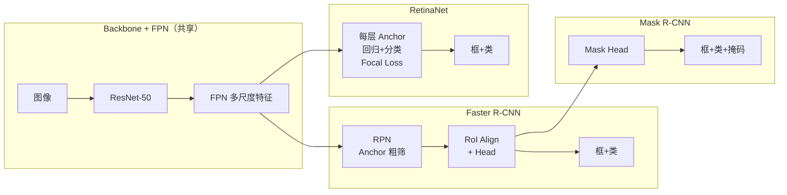
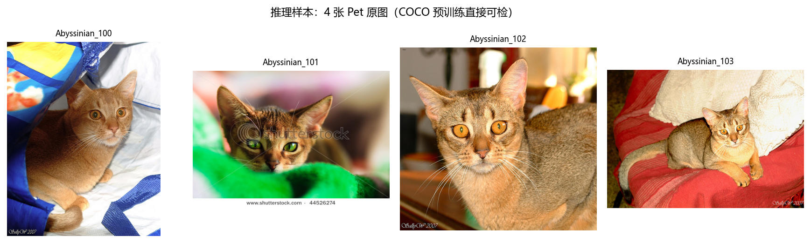
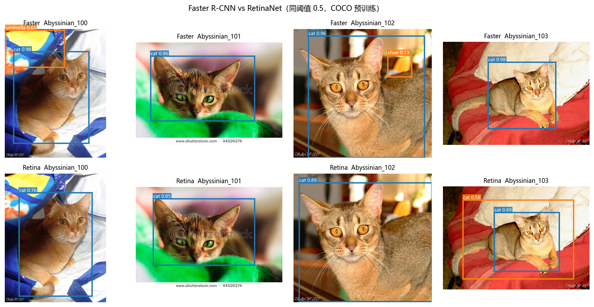
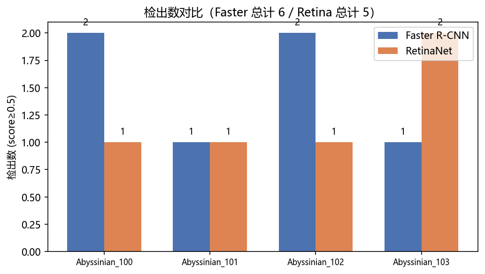
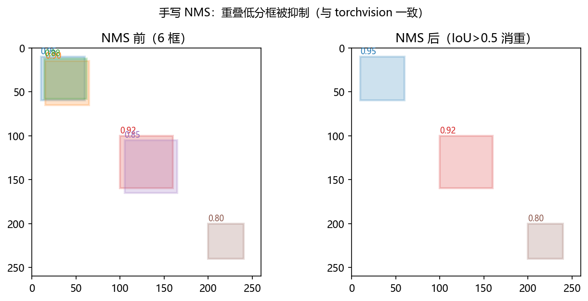
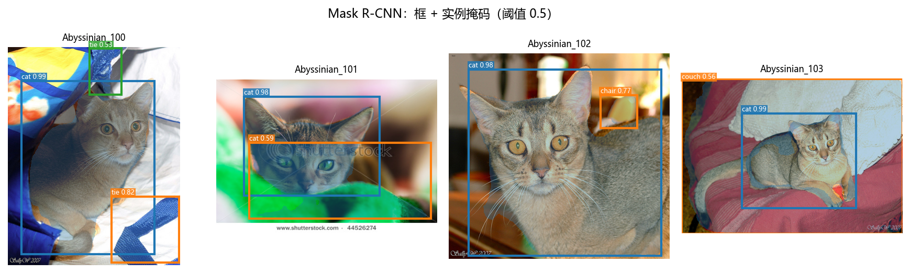

# 02 · Detection with torchvision —— 预训练推理、可视化与指标

> 家族：`03_CNN_Segmentation_Detection` | 状态：✅ 已完成 | 主载体：`main.ipynb` | 公共模块：`../common/`
> 环境：`LLM_learning`（torch 2.5.1+cpu / torchvision 0.20.1+cpu；权重下载 ~170M + 推理全程 CPU，Faster 41.8M / Retina 34.0M / Mask 44.4M）

## 1. 任务背景与目标

01 站自训了分割（每像素一签，CE+Dice / mIoU）；本章换到**检测**（每目标一框+一类）。任务粒度、指标、数据形态再次换挡——IoU→**框 IoU**、mAP 代替 mIoU，Anchor/NMS 登场。本站不做大规模训练，复用 `torchvision` COCO 预训练权重做**推理+可视化+指标理解**（CPU 友好），把 two-stage vs one-stage、Focal Loss、实例分割一次讲清。

## 2. 模型/算法原理

### 通俗理解

**一句话**：分割给每个像素贴标签，检测给每个物体画框+贴标签。分割错一像素只是一点，检测错一个框就是漏/误检一个物体。

**比喻**：分割是"涂色本"（逐像素涂），检测是"点名+画圈"（这有只猫、那有条狗，圈出来）。圈得准不准用**框 IoU**量，点得全不全用 **mAP** 量。

### 两条路线

```
Faster R-CNN (two-stage)： backbone→FPN ─┬─→ RPN(Anchor 粗筛 ~2000 框) ─→ RoI Head(精修+分类)
                                          └─→ 共享特征，两步走，先提候选再精判，精度高

RetinaNet (one-stage)：     backbone→FPN ──→ 每层 Anchor 直接回归+分类（Focal Loss 压制易分负样本）
                                          └─→ 一步到位，速度快，Focal 解决"背景太多"不均衡

Mask R-CNN：                Faster R-CNN + Mask Head（实例分割 = 检测框 + 像素掩码）
```

## 3. 网络结构图



- `fasterrcnn_resnet50_fpn`：~41.8M 参数
- `retinanet_resnet50_fpn`：~34.0M 参数（更轻，一步到位）
- `maskrcnn_resnet50_fpn`：~44.4M 参数（Faster + Mask 分支）

## 4. 核心公式

| 公式 | 含义 |
|------|------|
| `IoU = \|A∩B\| / \|A∪B\|`（框面积） | 两框交并比，>0.5 算命中；NMS/mAP 的基石 |
| **NMS（贪心）**：按分数降序，保留首框，删掉 `IoU>0.5` 的其余框，循环 | 同一物体多框消重，本站手写版与 `torchvision.ops.nms` 对照一致 |
| `AP_c = ∫ P(R) dR`，`mAP = mean_c AP_c` | PR 曲线下面积，多类平均；检测主指标 |
| `FL(p_t) = −α(1−p_t)^γ log(p_t)`（Focal Loss） | 给难分样本更高权重，缓解正负 1:1000 不均衡，RetinaNet 关键 |
| Anchor 回归：学 `Δ(x,y,w,h)` 相对 Anchor 而非绝对坐标 | 预设多尺度多比例参考框，让网络学偏移 |

## 5. 数据集

复用 01 站已下载的 Oxford-IIIT Pet 原图（`data/oxford-iiit-pet/images/*.jpg`，7393 张），**不做训练**，挑 4 张品种各异的猫图做推理演示（COCO 预训练能直接认 cat/dog/person 等）：

`Abyssinian_100 / 101 / 102 / 103`——固定四张，确保可复现。图像原分辨率不等，推理时 `to_tensor` 直接送模型（FPN 自适应多尺度）。

## 6. 训练过程与超参数

**无训练，纯推理**：加载 `torchvision.models.detection.*_resnet50_fpn(weights="DEFAULT")` COCO 预训练权重（Faster ~160M / Retina ~170M 下载缓存至 `~/.cache/torch/hub/checkpoints`，不进版本库），`eval()` + `score_thresh=0.5` 过滤 + 同图同阈值对比。

| 项 | 取值 |
|---|---|
| 模型 | Faster R-CNN / RetinaNet / Mask R-CNN（ResNet-50-FPN） |
| 权重 | COCO DEFAULT（80 类） |
| 阈值 | score ≥ 0.5 |
| NMS 演示 | IoU 阈值 0.5，合成 6 框 |
| 设备 | CPU |

## 7. 实验结果（实跑输出）

### 同图推理对比（阈值 0.5）

| 图像 | Faster R-CNN（41.8M） | RetinaNet（34.0M） | Mask R-CNN（44.4M） |
|------|----------------------|-------------------|---------------------|
| Abyssinian_100 | **2**：cat 0.98, umbrella 0.61 | **1**：cat 0.76 | **3**：cat 0.99, tie 0.82, tie 0.53 |
| Abyssinian_101 | **1**：cat 0.96 | **1**：cat 0.85 | **2**：cat 0.98, cat 0.59 |
| Abyssinian_102 | **2**：cat 0.96, chair 0.73 | **1**：cat 0.89 | **2**：cat 0.98, chair 0.77 |
| Abyssinian_103 | **1**：cat 0.98 | **2**：cat 0.69 + cat 0.58（同猫双框） | **2**：cat 0.99, couch 0.56 |
| **总计** | **6** | **5** | **9** |

- **cat 主目标**：三模型在四图上全部命中 cat（0.69–0.99），说明 COCO 预训练对猫的泛化极稳。
- **Faster vs Retina**：同阈值下 Faster 检出更多（6 vs 5），且分数普遍更高（cat 0.96–0.98 vs 0.69–0.89）——two-stage 精修的体现；Retina 在 103 图上对同一只猫给出双框（NMS 后仍留 2），反映 one-stage 冗余稍多。
- **Mask R-CNN**：在 Faster 基础上多给实例掩码，检出数最多（9），但也引入 tie/couch 等误检——掩码分支不抑制分类误检。

### 手写 NMS 验证

合成 6 框（两簇重叠 + 一孤立），分数 `[0.95,0.90,0.88,0.92,0.85,0.80]`，`iou_th=0.5`：

- 手写 `nms_numpy` keep = `[0, 3, 5]` → `[0.95, 0.92, 0.80]`
- `torchvision.ops.nms` keep = `[0, 3, 5]`——**完全一致**

### 可视化







## 8. 误差分析与可视化

- **误检是主误差**：umbrella / chair / tie / couch 均为背景纹理被 COCO 分类头误判——Pet 图背景有椅子/沙发/领带纹理时，通用 COCO 模型会按 COCO 80 类硬分类；阈值提到 0.7 可消掉多数误检，但也会压低 Retina 的低分 cat（0.69）。
- **Retina 双框**：103 图同一只猫被检两次，说明 one-stage 在密集 Anchor 下 NMS 0.5 仍可能残留近重叠框；可调高 NMS IoU 阈值或分数阈值缓解。
- **Mask 的"多"是双刃**：掩码分支让 Mask R-CNN 检出最多，但并未提升分类精度——实例分割 = 检测的框 + 分割的形，分类误差与检测共享。
- **漏检暂无**：四图猫目标均未漏检；更复杂遮挡/多猫图才会暴露召回差异（需 mAP 评估）。

### 常见坑 FAQ

1. 忘记 `model.eval()`——BatchNorm/Dropout 行为异常，分数全乱
2. 忘记 `scores ≥ thresh` 过滤——背景框成百上千，直接画图卡死
3. COCO 标签 0 是背景，`COCO_NAMES` 需占位，否则 cat/dog 错位
4. 只看 accuracy 评检测——必须看 mAP / PR 曲线，单图 accuracy 无意义
5. NMS 阈值与分数阈值混淆——前者管"重叠多算一个"，后者管"多弱算检出"

## 9. 总结与改进方向

**实际应用场景**

- **通用检测——精度优先就挑 Faster R-CNN**：不在乎慢 0.5 秒就怕漏——电路板上框虚焊点漏一个就是次品、CT 上框肺结节错一个就是漏诊；支撑：同阈值 0.5 下 4 张 Pet 图检出 6 vs RetinaNet 5，cat 分数 0.96~0.98 更高
- **速度/端侧检测——要快就挑 RetinaNet**：又要准又要省算力——装在车间便宜摄像头的小芯片上、在视频流里边看边框；支撑：34.0M 最轻（Faster 41.8M），Focal Loss 解决"背景太多学不动"所以轻还能打
- **要轮廓就上实例分割 Mask R-CNN**：检测只给方框，实例分割给的是沿物体边缘描出的形状——机械臂抓水杯只给方框不知杯把在哪，给了轮廓才知怎么下爪；自动驾驶给行人轮廓比方框更能判下一步往哪迈；支撑：框+掩码，9 检出，掩码不抑制分类误检见 §7
- **生产真实做法**：先拿 COCO 80 类几十万张图训好的老司机直接认猫（本站 cat 0.98），再用你自己的几百张 Pet 图微调把 chair/umbrella 误检压掉——本站为省算力只做前半步推理演示

**核心收获**

1. two-stage vs one-stage 取舍：Faster 精、Retina 快且用 Focal 抗不均衡（34M vs 41.8M）
2. 检测三件套现场验证：Anchor 思路 + 框 IoU + 手写 NMS（与 torchvision 一致）
3. 预训练推理全流程与阈值对检出数的影响（同图同阈值对照）
4. 实例分割 = 检测+分割，Mask R-CNN 一次给出框与形

**下一步**

- `03_YOLO_Concept`：YOLO 的 grid 思想 + NMS 更多玩法（不做大训练）
- 本项目可扩展：更多 Pet 图批量评估、阈值 sweep 画 PR、FPN 各层 Anchor 可视化

## 10. 场景速查（实践推荐）

| 场景 | 推荐 | 支撑数据 | 要点 |
|------|------|----------|------|
| 精度优先、离线分析 | Faster R-CNN | 6 vs 5 检出，cat 分数 0.96–0.98 更高 | two-stage 精修，FPN+RoI |
| 速度/端侧、视频流 | RetinaNet | 34.0M 更轻，Focal 抗背景不均衡 | one-stage 一步到位 |
| 要轮廓/掩码 | Mask R-CNN | 框+掩码同出，9 检出含形 | 实例分割 = 检测+分割 |
| 重叠框消重 | NMS IoU 0.5 | 手写与 torchvision 一致 `[0,3,5]` | 阈值越大越宽松 |
