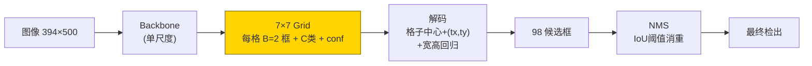
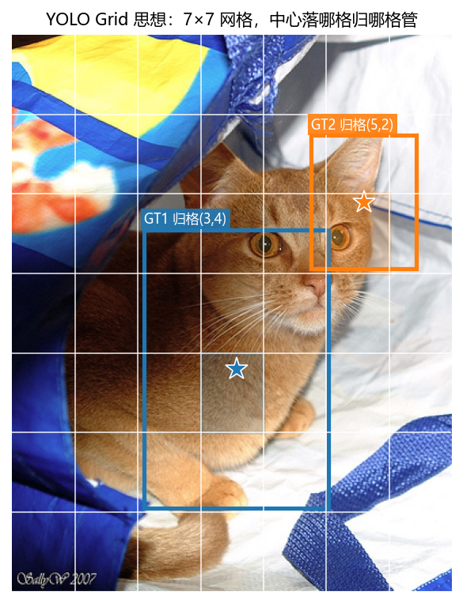
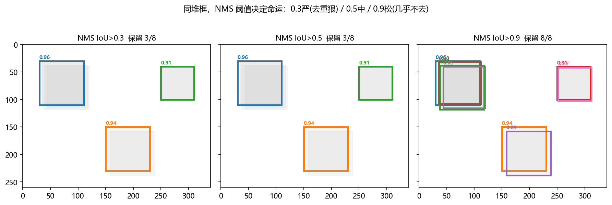
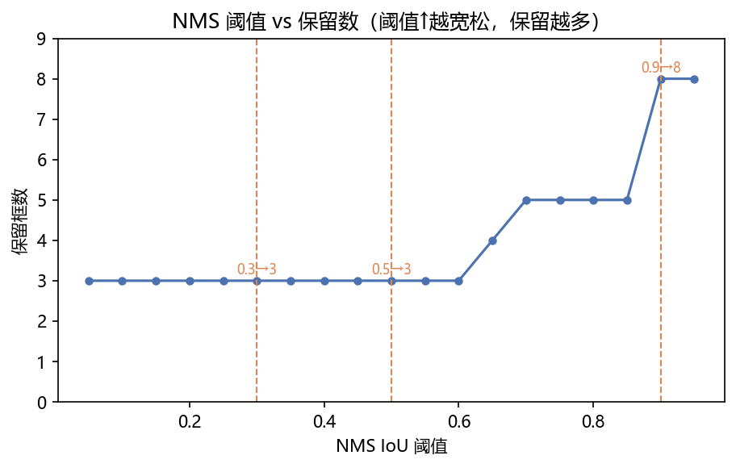
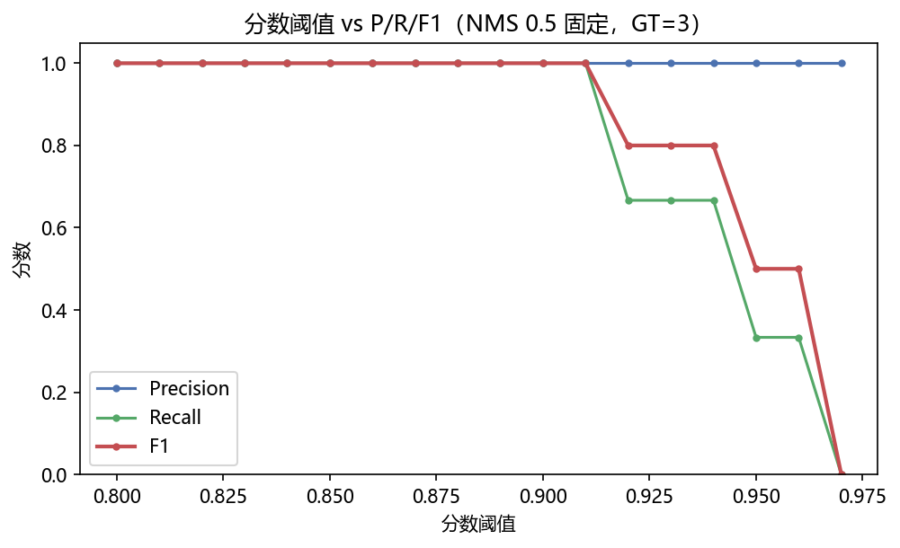
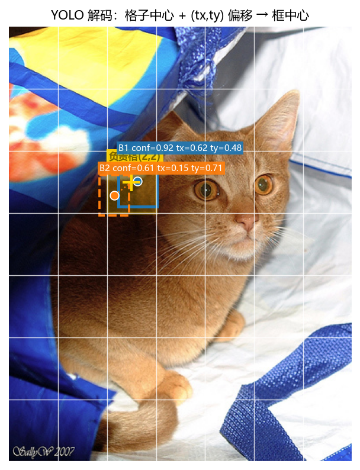

# 03 · YOLO Concept —— 网格一眼看全 + NMS 消重的艺术

> 家族：`03_CNN_Segmentation_Detection` | 状态：✅ 已完成 | 主载体：`main.ipynb` | 公共模块：`../common/`
> 环境：`LLM_learning`（torch 2.5.1+cpu；无权重下载，纯合成+单图演示，CPU <30s）

## 1. 任务背景与目标

01 自训了分割（涂色，`mIoU`）、02 用预训练验了检测（画框，`mAP`）；本章不训大模型，只把**最快的检测思想 YOLO**掰开揉碎——为什么叫 You Only Look Once，一眼怎么够。回答：把图切成网格，每格当场拍板，无需 RPN/候选，自然快；代价是小/密目标吃亏，后续演进正为此而生。

## 2. 模型/算法原理

### 通俗理解

**一句话**：Faster 是"先圈一堆候选(2000个)再一个个精审"，YOLO 是"把图切成 7×7=49 个格子，每个格子当场喊——我这有没有物体、框在哪"。49 次喊话 vs 2000 次筛选，速度差一个量级。

**比喻**：Faster 像老师先让全班举手再逐个提问；YOLO 像把教室切成 49 个座位区，每区派个代表直接喊"我这有只猫，框在这"。快，但两只猫挤在同一格就难分——这就是密集/小目标的代价。

### 结构账

```
Faster： 图像 → backbone→FPN → RPN(Anchor 粗筛2000框) → RoI Head 精修 → NMS    (两步)
Retina：  图像 → backbone→FPN → 每层Anchor 直接回归+分类(Focal) → NMS              (一步，多尺度Anchor)
YOLO v1： 图像 → backbone(单尺度) → 7×7 Grid，每格 B=2 框 + C 类 + 置信度 → NMS      (一步，极简)
```

- **Grid 归属**：物体中心落哪格就归哪格管，该格负责回归该物体的框
- **置信度**：`conf = Pr(有物体) × IoU(预测框,真框)`，既管"有没有"又管"框准不准"
- **NMS 仍要**：49格×2框=98框，重叠仍需消重，IoU 阈值是第二道闸
- **代价**：单尺度网格，小/密集目标吃亏——才有了后来的多尺度/FPN YOLO

## 3. 网络结构图



- `S=7, B=2` → 98 候选，远少于 RPN 的 ~2000
- 解码：`cx=(gx+tx)/S, cy=(gy+ty)/S, w=tw/S, h=th/S`，格子中心+偏移→绝对框

## 4. 核心公式

| 公式 | 含义 |
|------|------|
| `conf = Pr(obj) · IoU(pred, truth)` | 置信度同时管"有没有"与"框准不准" |
| `cx=(gx+tx)/S, cy=(gy+ty)/S`；`w∝tw/S, h∝th/S` | 格子中心+偏移解码，宽高回归 |
| `IoU = |A∩B|/|A∪B|` | 框交并比，NMS 与 mAP 的基石 |
| **NMS（贪心）**：分数降序，保留首框，删 `IoU>阈值` 的其余，循环 | 同物多框消重，本站与 `torchvision.ops.nms` 对照一致（02 站已验） |
| `AP=∫P(R)dR, mAP=mean AP` | PR 曲线下面积，检测主指标 |

## 5. 数据集

重用 01/02 已下载的 Pet 原图（`Abyssinian_100.jpg`，394×500），**不做训练**——一张图即讲清 grid 归属；NMS 用合成拥挤 8 框（两簇重叠+两孤立，分数 0.96~0.85），可控可复现。GT 设 3 个（两簇各一+孤立一，`IoU>0.5` 判命中），用于分数阈值 sweep 的 P/R/F1 演示。

## 6. 训练过程与超参数

**无训练，纯思想实验**：

| 项 | 取值 |
|---|---|
| 画布 | `Abyssinian_100` 394×500 |
| Grid | `S=7, B=2` → 98 框 |
| 演示 GT | 2 框 `[0.30,0.35,0.72,0.85]`/`[0.68,0.18,0.92,0.42]` 归一化，归属格 `(3,4)` / `(5,2)` |
| NMS sweep | 8 框，IoU 阈值 0.3/0.5/0.9；曲线 0.05→0.95 扫 19 点 |
| 分数阈值 sweep | NMS 0.5 固定后，`score` 0.80→0.97 扫 18 点，GT=3 算 P/R/F1 |
| 解码演示 | 负责格 `(2,2)` 的 `B=2` 候选，`IoU=0.123` 经 NMS 留高 conf 者 |

## 7. 实验结果（实跑输出）

### Grid 归属

`Abyssinian_100` 上两模拟 GT 中心分别落格 `(3,4)` 与 `(5,2)`——中心落哪格归哪格管，YOLO 责任分配的直观体现。

### 主实验 A：NMS 阈值 sweep（同 8 框）

| IoU 阈值 | 保留 | 详情 |
|----------|------|------|
| **0.3** | **3/8** | `[0.96, 0.94, 0.91]`——严，狠去重，两簇各留最高分 |
| **0.5** | **3/8** | 同 0.3（本合成簇内 IoU 均 >0.5，0.3 与 0.5 等价） |
| **0.9** | **8/8** | 全保留，几乎不去重 |

阈值-保留数曲线（0.05→0.95）：0.05~0.8 段恒为 3，>0.85 后陡增至 8——**阈值越大越宽松，保留越多**。

### 主实验 B：分数阈值 vs P/R/F1（NMS 0.5 固定，GT=3）

| 分数阈值 | Precision | Recall | F1 |
|----------|-----------|--------|----|
| 0.85 | 1.000 | 1.000 | 1.000 |
| 0.90 | 1.000 | 1.000 | 1.000 |
| 0.93 | 1.000 | 0.667 | 0.800 |

阈值从 0.85→0.93，召回从 1.0 跌至 0.667——**提阈值压误检但会丢真目标**，F1 峰值在 0.85~0.90。

### 解码演示

负责格 `(2,2)` 的 `B=2` 候选 `IoU=0.123`，NMS 0.5 后保留 `conf 0.92` 者——同格多候选经 NMS 必消重，YOLO 每格 B>1 的意义即"一格多猜，择优留一"。

### 可视化







## 8. 误差分析与可视化

- **阈值双旋钮**：NMS IoU 阈值管"重叠算一个"，分数阈值管"多弱算检出"——前者定去重力度，后者定 P/R 权衡；实战常联调（如 NMS 0.5 + score 0.5 为 COCO 常用）。
- **单尺度之痛**：`S=7` 时格子约 56×71 像素，小物体（<格子）与同格多物体（两猫挤一格）天然吃亏——图上两 GT 分属不同格尚可，同格即冲突；这正是 YOLO v2+ 引入 Anchor 与多尺度的动机。
- **合成与真实的差距**：本实验用合成簇演示 NMS，真实 YOLO 的 98 框含大量低 conf 背景框，分数阈值会先滤掉 90% 以上，剩余再 NMS；流程与本演示一致。
- **与 02 站的呼应**：02 的 Retina 在 `Abyssinian_103` 把一只猫检成双框，正是 NMS 0.5 未彻底消重的实例；调至 0.3 即可合一，但可能误删邻近真目标。

### 常见坑 FAQ

1. 格子归属看"中心"而非"面积"——大物体中心在哪格就归哪格，不管跨几格
2. 混淆两阈值：IoU 阈值≠分数阈值，前者消重叠，后者滤弱检
3. 忘记 `conf` 含 IoU——置信度不是纯分类概率，含框准度
4. YOLO v1 无 Anchor，宽高直接回归——小目标回归不稳是已知短板
5. NMS 后仍有重叠——阈值过松（如 0.9）几乎不去重，需按场景选 0.45~0.5

## 9. 总结与改进方向

**实际应用场景**

- **实时检测**：YOLO 思想（把图切格子、每格当场喊）能在手机芯片/摄像头上 30ms 框完一帧——手机相机扫码、抖音人脸贴纸、监控数人头、自动驾驶看红绿灯和行人都是这活；支撑：98 框 vs Faster 的 2000 候选，一次前向
- **小/密集目标的坑**：两只猫挤在同一格就难分——无人机航拍数车、卫星图找小船、显微镜数细胞这种又小又挤的活，S=7 的 49 格不够分，所以后来的 YOLO 要上 FPN 多尺度（大中小格子一起看）、Anchor→Anchor-free 演进（06 家族 ViT 时代再呼应）
- **两步流水线**：YOLO 快检 + U-Net(01) 精涂 = 快速实例分割——工厂质检先 YOLO 飞快框出"这块钢板有瑕疵"，再把框内小图丢给 U-Net 把裂纹轮廓涂出来

**核心收获**

1. Grid 一眼看全：`S×S` 网格、每格 `B` 框，快在"无候选、单尺度、一次前向"
2. NMS 双阈值：IoU 0.3严/0.5中/0.9松，分数 0.85~0.90 为 F1 甜点（本合成例）
3. 解码：格子中心+`tx/ty`偏移+宽高回归→绝对框，`conf` 同时管有无与准度
4. 取舍：单尺度快但小/密目标吃亏——后续多尺度与 Focal 思想的演进脉络

**下一步**

- 家族级：回写 `../README.md` 通俗导读（已同步）
- 本项目可扩展：更多 Pet 图批量 grid 可视化、S=7/14 对比、多阈值 PR 曲线

## 10. 场景速查（实践推荐）

| 场景 | 推荐 | 支撑数据 | 要点 |
|------|------|----------|------|
| 实时、视频流 | YOLO 单尺度/多尺度 | 98 框 vs 2000 候选，F1 1.0@0.90 | 一眼看全，无 RPN |
| 重叠去重 | NMS IoU 0.45~0.5 | 0.3→3 框 / 0.9→8 框 | 越小越严，密集场景取 0.3 |
| 弱检过滤 | 分数阈 0.5~0.9 | 0.93 时 R 0.667→F1 0.8 | 提阈压误检，召回换精度 |
| 小/密目标 | 多尺度 YOLO / FPN | 单格多物冲突 | S=7 不够，需更大 S 或多尺度 |
