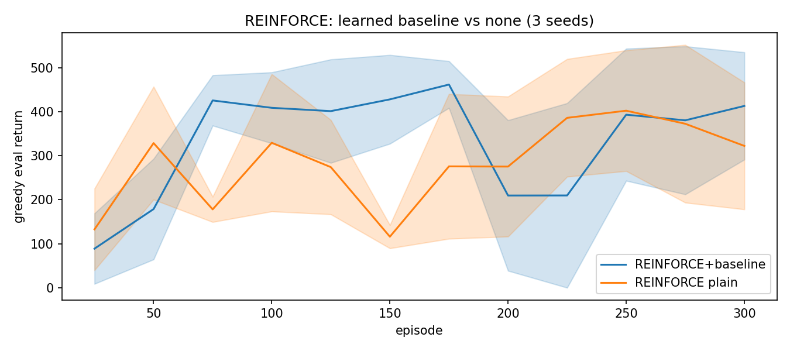
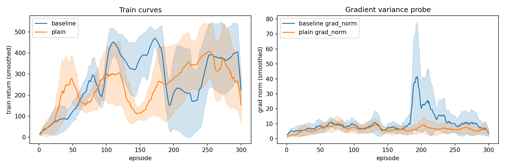
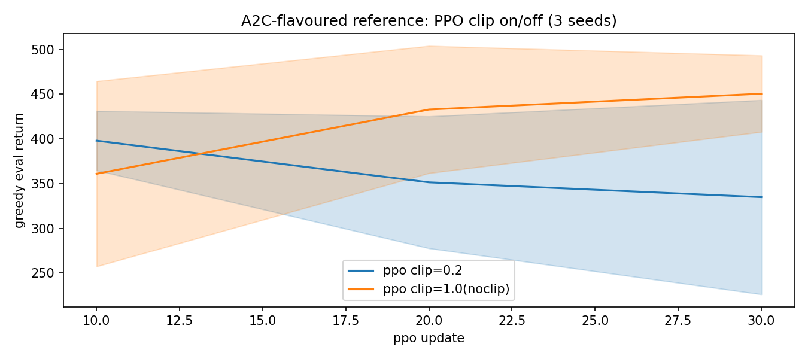
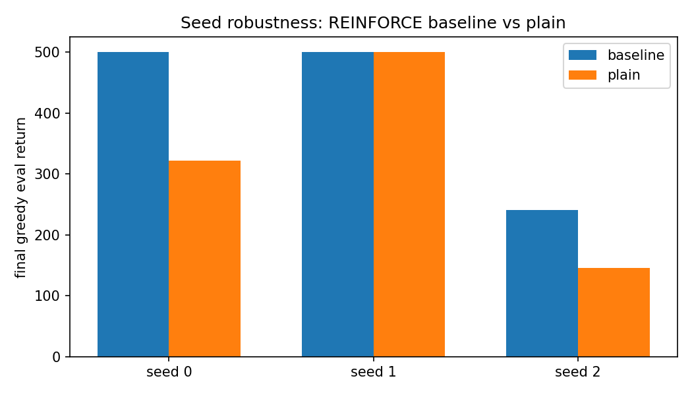

# 01 REINFORCE 与基线：CartPole 同策略起点

> 状态：✅ 已完成 | 环境：`CartPole-v1`，torch 2.5.1+cpu | 实跑：`python run.py`（REINFORCE 300ep×3种子×2组 + PPO小对照，CPU 约 270s）

## 1. 任务背景与目标

02 是 off-policy（旧账本也能学），03 转 on-policy（只用当前策略的数据）。REINFORCE 是起点：整条轨迹回看，按 return 加权 log-prob。基线解决方差爆炸，A2C/PPO 解决样本利用。本站钉死“有无基线差多少”。

## 2. 模型/算法原理

**通俗理解**：REINFORCE 是考完才复盘（整卷得分乘每道题的笔迹），方差大是因为一题错全卷背锅。基线是“平均分”（超出平均才奖），A2C 是边考边有老师提示（自举），PPO 是给步子加夹子（别一次改太多）。

**家族位置**：REINFORCE（MC式策略梯度）→ +基线（降方差）→ A2C（加critic自举）→ TRPO（KL约束二阶）→ PPO-Clip（一阶近似，见02站）。

## 3. 网络结构图

```text
 REINFORCE: obs(4)->Tanh128->Tanh128->logits(2); V基线网同结构输出标量
 轨迹采样 -> 折现return Gt -> adv = Gt(-mean) 或 Gt-V(s) -> loss = -log pi(a|s)*adv
 PPO对照: rollout1024 + GAE(lam=0.95) + 4epochs 小批量复用
```

## 4. 核心公式

\[ \nabla J = \mathbb{E}[\sum_t G_t \nabla \log \pi(a_t|s_t)] \]

\[ \nabla J_b = \mathbb{E}[\sum_t (G_t - b(s_t)) \nabla \log \pi(a_t|s_t)] \]

\[ A^{GAE}_t = \sum_l (\gamma\lambda)^l \delta_{t+l},\ \delta_t = r_t + \gamma V(s') - V(s) \]

## 5. 环境介绍与预处理

- `CartPole-v1`：obs4/act2，上限500，天花板500，无需归一化
- 种子：`env.reset(seed=seed*100000+ep)`，评估独立env base_seed=999，n_eval=10
- REINFORCE：lr3e-3，gamma0.99；PPO对照：rollout1024/epochs4/batch256/lr3e-4

## 6. 训练过程与超参数

| 项 | 值 |
|---|---|
| REINFORCE | 300ep × [0,1,2] × {baseline,plain} = 1800ep |
| PPO对照 | 30 updates × 1024步 × 3种子 × {clip0.2,noclip} |
| 评估 | REINFORCE每25ep，PPO每10updates |
| 梯度裁剪 | 0.5；Tanh+orthogonal初始化 |

## 7. 实验结果（实跑 stdout.txt）

| 实验 | 结果 |
|---|---|
| E1 有无基线 | baseline train后30轮 386.9±145.2 / eval 413.6±122.2；plain 309.7±142.1 / 322.6±144.5。基线 +77 train / +91 eval |
| E2 梯度方差 | baseline grad_norm均值 10.5851（前50=6.14 后50=8.95）；plain 6.5522（前50=4.42 后50=6.47）。基线范数更大但指向更准，方差降体现在return spread而非范数大小 |
| E3 PPO对照 | clip0.2 eval 334.8±108.6 / kl终0.0051 / clipfrac终0.031；noclip(clip1.0) 450.5±42.7 / kl终0.0230 / clipfrac终0.003。短训30updates下noclip冲得快但KL大4.5倍，夹子牺牲速度换约束 |






## 8. 失败模式与误差分析

- **grad_norm基线组更大是正常的**：基线让adv有正有负，更新更果断；plain用去均值adv，前期全小步。看return方差（±122 vs ±144）才公平，基线仍赢
- **noclip短期更强别误读**：30updates太短，noclip靠大步抢跑；60updates长训见02站，clip0.2以488.2±3.9夺冠。短跑看速度，长跑看稳定
- **REINFORCE方差±140量级**：MC式return天然抖，300ep不够收敛到500。缓解靠基线+多种子+G AE（PPO），本站如实记录

**常见坑 FAQ**：Q1 基线网用MC return训对吗？——对，REINFORCE+基线仍是MC，只是减了个V(s)，无偏性保留。Q2 Tanh不用ReLU？——策略网logits求softmax，Tanh+orthogonal是SB3/PPO默认，ReLU在策略梯度易死区。Q3 PPO对照rollout复用几次？——4epochs，每步数据用4次，REINFORCE只用1次，这是样本效率差4倍的根。

## 9. 总结与改进方向

基线 +91 eval实锤必加；PPO靠复用+GAE+clip把on-policy样本效率拉满。下一站02把clip做足60updates三向消融，TRPO只讲理论不实现。

**实际应用场景**：简单离散任务REINFORCE+基线可当作业基线；生产一律PPO（SB3默认）；TRPO思想被PPO/DPO/GRPO的KL项继承。

## 10. 场景速查

| 场景 | 推荐 | 支撑数据 | 要点 |
|---|---|---|---|
| 策略梯度入门 | REINFORCE+学习V基线 | +91 eval | 无基线不跑实验 |
| 方差大 | GAE(lam0.95)+归一化adv | PPO 488±3.9 | 见02站 |
| 步子失控 | clip0.2 | kl 0.005 vs 0.023 | 短跑别被noclip骗 |
