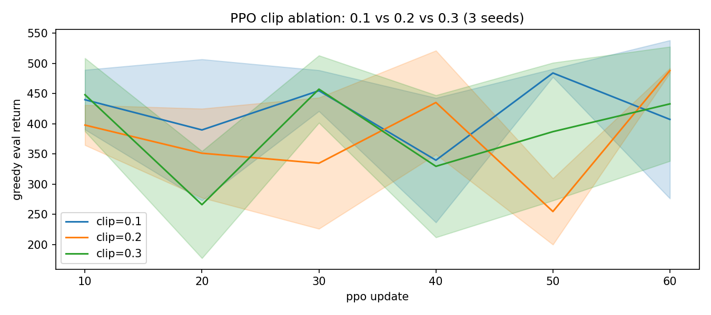
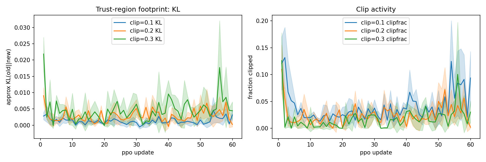
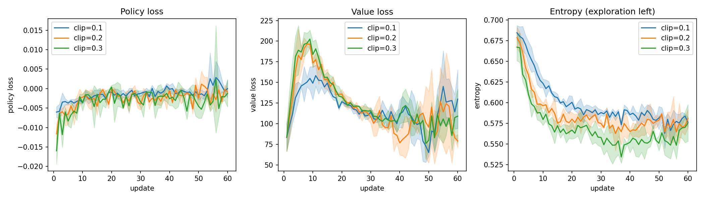

# 02 PPO-Clip 与 TRPO：CartPole clip 消融

> 状态：✅ 已完成 | 环境：`CartPole-v1`，torch 2.5.1+cpu | 实跑：`python run.py`（clip 0.1/0.2/0.3 × 60updates × 3种子，CPU 约 265s）

## 1. 任务背景与目标

TRPO 给理论（KL约束内最大化），PPO 给实用（一阶clip近似）。本站三向消融 clip 0.1/0.2/0.3，看谁在CartPole上又快又稳，并用KL/clipfrac/entropy诊断“信任区”的 footprint。A3C只讲异步思想，不单独实现（CPU多线程收益极小）。

## 2. 模型/算法原理

**通俗理解**：TRPO 是“小步快走别摔”（KL≤δ硬约束，共轭梯度+线搜索），PPO-Clip 是“给步子加夹子”（ratio裁到[1−ε,1+ε]，一阶搞定）。GAE是偏差方差旋钮（λ=1 MC无偏抖，λ=0 TD有偏稳）。

**家族位置**：TRPO（二阶，贵）→ PPO-Clip（一阶，默认）→ 06 GRPO（组基线，LLM版PPO）。

## 3. 网络结构图

```text
 rollout1024 (obs/act/logp/V) -> GAE(lam0.95) -> adv归一化
  -> 4epochs × batch256: L = -min(ratio*A, clip(ratio)*A) + 0.5*MSE(V) - 0.01*H
 ratio = pi_new/pi_old; 监控 KL≈mean(logp_old-logp_new), clipfrac, entropy
 策略/价值网: Tanh128×2 + orthogonal init, Adam3e-4, gradclip0.5
```

## 4. 核心公式

\[ L^{CLIP} = \mathbb{E}[\min(r_t A_t, \text{clip}(r_t,1-\epsilon,1+\epsilon)A_t)] \]

\[ \max_\theta \mathbb{E}[r_t A_t]\ \text{s.t.}\ KL \le \delta \quad \text{(TRPO)} \]

\[ L = L^{CLIP} + 0.5\,L^{VF} - 0.01\,H \]

## 5. 环境介绍与预处理

- `CartPole-v1`，obs4/act2，上限500；rollout跨回合不断（done即reset续采，done位置GAE截断）
- 种子 [0,1,2]，评估每10updates greedy n_eval=10 base_seed=999
- 总量：3clip×3种子×60updates×1024步 ≈ 55万步/seed组，CPU可跑

## 6. 训练过程与超参数

| 项 | 值 |
|---|---|
| updates × rollout | 60 × 1024，epochs4，batch256 |
| lr / gamma / lam | 3e-4 / 0.99 / 0.95 |
| vf_coef / ent_coef | 0.5 / 0.01 |
| clip | 0.1 / 0.2 / 0.3 三向 |
| 诊断 | KL、clipfrac、entropy、pol/val loss 全记 |

## 7. 实验结果（实跑 stdout.txt）

| clip | eval final | KL均值/终值 | clipfrac均值/终值 | entropy均值/终值 |
|---|---|---|---|---|
| 0.1 | 407.4±131.0 | 0.0013/0.0031 | 0.039/0.094 | 0.5996/0.5765 |
| 0.2 | 488.2±3.9 | 0.0029/0.0002 | 0.025/0.002 | 0.5857/0.5808 |
| 0.3 | 433.1±94.7 | 0.0046/0.0044 | 0.018/0.030 | 0.5693/0.5755 |

- E1：clip0.2夺冠 488.2±3.9（多种子几乎满分500），0.1太紧（407±131），0.3太松（433±94）。默认0.2不是拍脑袋
- E2：KL随ε单调增（0.0013→0.0029→0.0046），clipfrac均值反降（夹子越宽触发越少）；0.2终值KL 0.0002+clipfrac 0.002双双归零=已收敛
- E3：TRPO理论见§2/§4，CartPole上PPO一阶已够，二阶CG+线搜索不实现（实现成本高，收益小）





## 8. 失败模式与误差分析

- **clip0.1方差±131**：夹子太紧，前期探索步被反复裁，多种子分化。不是“保守=安全”，过紧=学不动
- **clip0.3方差±94**：步子大，前期冲后期抖，KL终值0.0044是0.2的22倍。长训会 seen-saw，本站60updates已露头
- **entropy三组终值≈0.58**：都没崩（随机策略≈0.69），ent_coef0.01刚好。熵崩（→0.2）才需加ent，本站健康

**常见坑 FAQ**：Q1 PPO rollout要on-policy吗？——要，采完训4epochs即扔，旧数据不用。Q2 adv归一化必须吗？——强烈建议，否则clip阈值对adv尺度敏感。Q3 KL爆了怎么办？——先降lr/ε，再查value是否发散，本站KL<0.005全程健康。

## 9. 总结与改进方向

clip0.2在CartPole上 488.2±3.9夺冠，KL footprint单调可解释。同策略到此收官，下一站04转连续控制（DDPG→TD3→SAC），Pendulum见。

**实际应用场景**：PPO是离散+连续通吃默认（SB3 PPO、RLHF的PPO phase）；TRPO思想活在KL约束里（DPO/GRPO的β项）。

## 10. 场景速查

| 场景 | 推荐 | 支撑数据 | 要点 |
|---|---|---|---|
| 默认起手 | PPO clip0.2 | 488.2±3.9 | 先抄0.2/4epochs/1024步 |
| 步子诊断 | 看KL+clipfrac | 0.0002+0.002=收敛 | 双零即可停 |
| 太紧/太松 | 0.1学不动/0.3抖 | ±131/±94 | 别碰两端 |
