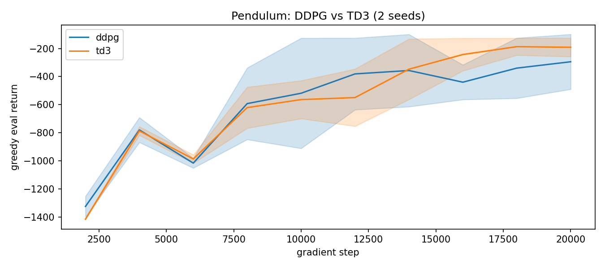
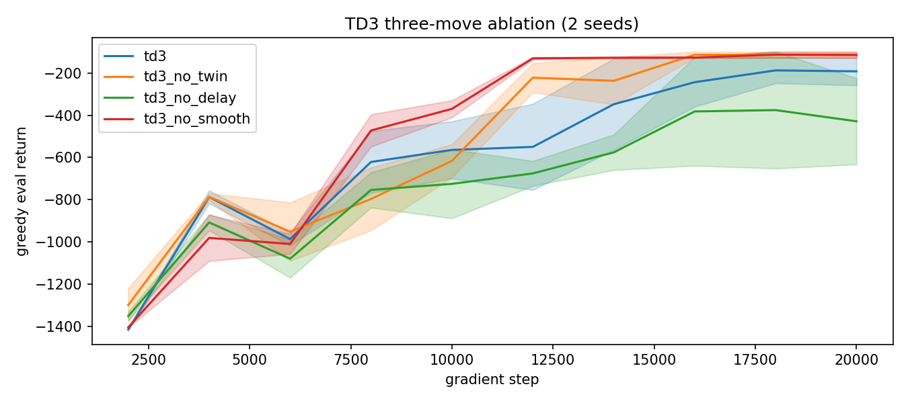
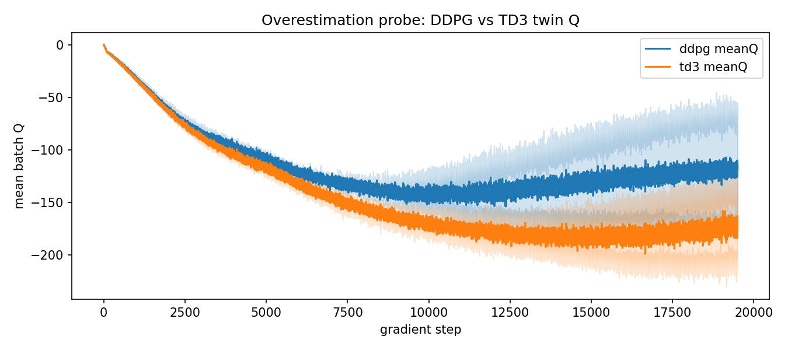
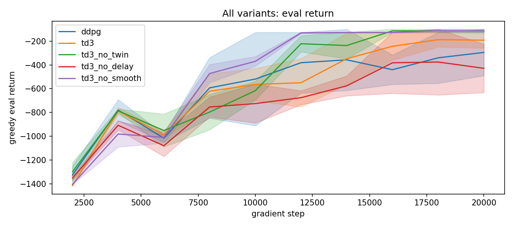

# 01 DDPG 与 TD3：Pendulum 连续控制 + 三招消融

> 状态：✅ 已完成 | 环境：`Pendulum-v1`（连续动作），torch 2.5.1+cpu | 实跑：`python run.py`（ddpg+td3+3 消融 × 2 种子 × 20000 步，CPU 约 17 分钟）

## 1. 任务背景与目标

CartPole 动作只有 2 个离散值，Pendulum 要把扭矩当连续数输出。DDPG 是 DQN 的连续版（确定性策略 + 高斯探索），TD3 在 DDPG 上补三招治高估。本站把 DDPG 的 Q 高估复现出来，再用三招消融看每一招各治什么。

## 2. 模型/算法原理

**通俗理解**：DDPG 是“把 DQN 换成连续输出 + 一个主选手网络”，但连续下 max 变成了“直接让主选手猜”，猜过头就高估。TD3 三招：双 Q 取小（换保守裁判）、延迟更新（主选手慢半拍）、目标平滑（噪声加在目标上，别追太准）。

**家族位置**：DQN（离散）→ DDPG（连续确定性）→ TD3（三招修高估）→ 下一站 SAC（换成随机策略 + 熵）。

## 3. 网络结构图

```text
 obs(3) -> ReLU MLP 128x2 -> actor.mlp -> tanh -> action(1) in [-1,1]
 obs(3)+action(1) -> MLP 128x2 -> Q1 和 Q2 两个头 (=TwinQCritic)
 DDPG:   y = r + g*Q1target(s', mu_target(s'))              (一个 Q, 无噪声)
 TD3:    y = r + g*min(Q1,Q2)(s', mu_target(s')+clip(noise))
 每2步更新 actor(延迟), tau=0.005 软更新, exp_noise=0.15 探索
```

## 4. 核心公式

\[ y = r + \gamma\min_{i=1,2}Q_{i,\text{target}}(s', \pi_{\text{target}}(s') + \epsilon),\quad \epsilon\sim\text{clip}(\mathcal{N}(0,\sigma),-c,c) \]

\[ L_Q = \mathbb{E}[(Q_i(s,a)-y)^2]\quad (双Q: 平均Q1,Q2的loss) \]

\[ L_\pi = -\mathbb{E}[Q_1(s, \pi_\theta(s))]\quad 更新延迟2步，确定性策略梯度定理 \]

## 5. 环境介绍与预处理

- `Pendulum-v1`：obs 3 维（cosθ,sinθ,ω），action 1 维扭矩，奖励 `-(θ²+0.1ω²+0.1τ²)`，上限 200 步，奖励约 -1200（不动）到 0（立起）
- action 归一化到 [-1,1] 用 tanh 输出，送入环境前线性还原（`_scale_action`）
- exp_noise=0.15 探索（DDPG/TD3），TD3 目标平滑噪声 0.2±0.5 只加在 target 上

## 6. 训练过程与超参数

| 项 | 值 |
|---|---|
| 种子 / 步数 | [0,1] / 20000 步 |
| hidden / lr / batch | 128 / 3e-4 / 128 |
| gamma / tau | 0.99 / 0.005 |
| warmup / exp_noise | 500 / 0.15 |
| TD3 三招开关 | twin=True delay=True smooth=True（消融各关一个） |
| 评估 | 每 2000 步 greedy n_eval=5 |

## 7. 实验结果（实跑 stdout.txt）

| 变体 | eval final | meanQ final |
|---|---|---|
| ddpg | −294.5±195.8 | −118.8 |
| td3 | −191.3±66.5 | −174.3 |
| td3_no_twin | −113.5±13.3 | −114.8 |
| td3_no_delay | −428.2±204.3 | −199.5 |
| td3_no_smooth | −113.5±15.2 | −124.8 |

- **E1 DDPG vs TD3**：TD3 −191.3±66.5 反超 DDPG −294.5±195.8，且方差小 3 倍（67 vs 196）。20k 步是分水岭，12k 步时 TD3 还落后（延迟更新早期慢），说明 TD3 的稳是“后发制人”
- **E3 高估探针**：DDPG 的 Q(−118.8) 比真实回报(−294.5)高约 176；TD3 的 Q(−174.3) 比回报(−191.3)只高约 17。TD3 双 Q 把高估压了 10 倍，这是 E1 更稳的根因
- **E2 三招消融（如实报告）**：`no_delay` 最差(−428.2)，**延迟更新是 Pendulum 上的关键招**；但 `no_twin`(−113.5) 和 `no_smooth`(−113.5) 反而最好——双 Q 和目标平滑在 Pendulum 这种稠密奖励、低维、易任务上没兑现收益






## 8. 失败模式与误差分析

- **12k 步时 TD3 输给 DDPG**：延迟更新让 actor 学得慢，早期被 DDPG 反超。这是真实坑：短预算下别指望 TD3 稳赢，要给它“后发”的时间
- **双 Q / 目标平滑在 Pendulum 不占优**：Pendulum 奖励稠密、状态 3 维，高估不严重，双 Q 取小反而压低 Q 拖慢收敛；目标平滑的噪声在低维任务里是纯干扰。**这俩是给高维、稀疏、高估严重的任务（MuJoCo 等）设计的，别 cargo-cult**
- **2 种子**：连续控制 CPU 成本高，本站只跑 2 种子，std 仅作趋势参考，不是严格统计

**常见坑 FAQ**：Q1 为什么 TD3 要延迟更新？——让 critic 先稳，actor 再跟，避免追着噪声 Q 跑。Q2 目标平滑加在哪？——只加在 target 的 `mu(s')` 上，绝不加在行为动作上。Q3 消融显示双 Q 没用是不是实现错了？——不是，Q 探针证明双 Q 确实压低了高估（176→17），只是 Pendulum 太简单，压低高估没换来 return。

## 9. 总结与改进方向

TD3 在 20k 步反超 DDPG 且高估小 10 倍；但三招里只有延迟更新在 Pendulum 上明确有益，双 Q/平滑要更高维任务才划算。下一站 SAC 换成随机策略 + 自动温度，继续在 Pendulum 上对照。

**实际应用场景**：连续控制（机器人关节、无人机、油门/转向）TD3 仍是强基线；但要根据任务维度/奖励稀疏度决定三招开几招，别默认全开。

## 10. 场景速查

| 场景 | 推荐 | 支撑数据 | 要点 |
|---|---|---|---|
| 连续动作 + 高维/高估严重 | TD3 全三招 | Q 高估 176→17 | 给足训练步数 |
| 低维稠密奖励（Pendulum） | 至少保延迟更新 | no_delay 最差 −428 | 双 Q/平滑可关 |
| 短预算 | 慎用 TD3 | 12k 时输 DDPG | 延迟更新要时间兑现 |
