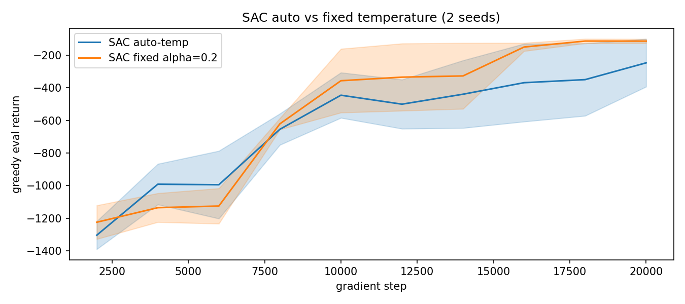
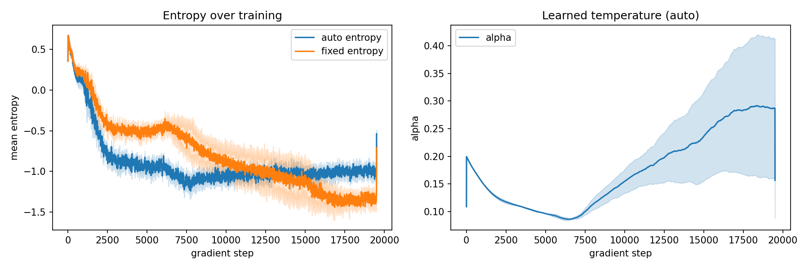
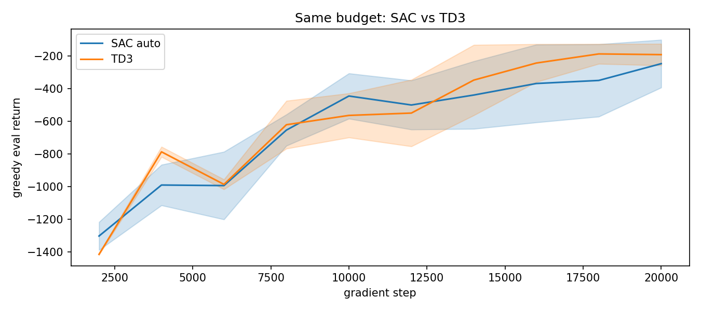

# 02 SAC：Pendulum 自动温度 vs 固定温度 + 对照 TD3

> 状态：✅ 已完成 | 环境：`Pendulum-v1`，torch 2.5.1+cpu | 实跑：`python run.py`（sac auto/fixed + td3 × 2 种子 × 20000 步，CPU 约 13 分钟）

## 1. 任务背景与目标

TD3 用确定性策略 + 双 Q 修高估；SAC 换随机高斯策略 + 熵正则，探索“留后路”。本站对比自动温度（自适应 alpha）vs 固定 alpha，并和 TD3 同预算对比“随机熵 vs 确定性双 Q”谁在 Pendulum 更稳。

## 2. 模型/算法原理

**通俗理解**：TD3 是确定地选一个动作再加探索噪声；SAC 是概率地钻进“高熵带”——输出分布，靠熵正则别过早死心眼。温度 alpha 是“多留后路”的旋钮，自动版按“熵不能低于 target”自适应拧。

**家族位置**：DDPG → TD3（确定性）→ SAC（随机 + 熵，off-policy 集大成）。

## 3. 网络结构图

```text
 SquashedGaussianActor: obs(3) -> mu(1), log_std(1) -> 采样 u ~ N(mu,std) -> a=tanh(u)
 log_prob = logN(u) - log(1 - a^2 + eps)      (样本 + 重参数化)
 TwinQCritic: 同 TD3, 但 target = minQ(s', a'~pi) - alpha*logp(a'|s')
 温度: alpha = exp(log_alpha), target_entropy = -action_dim, 按熵约束更新
```

## 4. 核心公式

\[ J_Q = \mathbb{E}[(Q(s,a) - (r+\gamma(\min \tilde Q(s',a') - \alpha\log\pi(a'|s'))))^2] \]

\[ J_\pi = \mathbb{E}[\alpha \log \pi(a|s) - Q(s,a)],\quad a\sim\pi(s)\ (\text{重参数化}) \]

\[ J(\alpha) = \mathbb{E}[-\alpha \log \pi(a|s) - \alpha \bar H],\quad \bar H=-\dim\mathcal{A} \]

## 5. 环境介绍与预处理

- 同 01：`Pendulum-v1`，obs3/act1，[-1,1] tanh，`_scale_action` 还原，200 步/回合
- auto: `sac_auto_temp=True`（默认）+ `sac_target_entropy=-1`；fixed: `sac_auto_temp=False, sac_alpha=0.2`

## 6. 训练过程与超参数

| 项 | 值 |
|---|---|
| 种子 / 步数 | [0,1] / 20000 |
| lr / batch / gamma / tau | 3e-4 / 128 / 0.99 / 0.005 |
| auto_temp | True 对比 fixed=0.2 |
| SAC vs TD3 同预算 | 各 20000 步，同 seed |

## 7. 实验结果（实跑 stdout.txt）

| 变体 | eval final | 熵 首→末 | alpha 首→末 |
|---|---|---|---|
| SAC auto | −246.6±146.5 | 0.667→−0.986 | 0.200→0.287 |
| SAC fixed α=0.2 | −113.3±12.6 | 0.667→−1.290 | — |
| TD3（对照） | −191.3±66.5 | — | — |

- **E1 auto vs fixed**：fixed α=0.2(−113.3±12.6) 反而优于 auto(−246.6±146.5)，且方差小 10 倍。auto 没带来收益，反而抖
- **E2 熵/温度**：两组熵都从 0.667 掉到负值（策略变尖、探索枯竭）；auto 把 α 从 0.2 抬到 0.287 也没拦住熵崩
- **E3 SAC vs TD3**：同预算 SAC(auto) −246.6 输给 TD3 −191.3。Pendulum 上确定性双 Q 仍占优





## 8. 失败模式与误差分析

- **熵崩到负值**：Pendulum 奖励幅度大（每步可达 −16），Q 量级 ~−150，而 `α·logπ` 只有 ~0.2 量级，熵项被 Q 项碾压，策略照样收尖。这是“奖励没归一化时 SAC 熵正则形同虚设”的真实坑
- **auto 温度救不了**：auto 想把熵拉回 target=−1，但 α 只涨到 0.29，相对 Q 仍太小，压不住崩塌；反而多一个学习目标使方差更大
- **SAC 没赢 TD3**：稠密低维任务上，SAC 的随机策略 + 熵是额外开销，没换来回报。SAC 的主场是高维、需要持续探索、或示范数据有限的任务
- **2 种子**：CPU 成本高，std 仅作趋势参考

**常见坑 FAQ**：Q1 为什么 fixed 比 auto 稳？——fixed 少一个学习目标，少一份抖动；auto 的收益要在长训练/高维任务才显现。Q2 熵为什么是负的？——这里熵=采样动作 log 概率的负均值，含 tanh 修正，收尖后会负。Q3 怎么让 SAC 在 Pendulum 好起来？——归一化奖励（除以 scale）或直接放大 alpha，让熵项和 Q 同量级。

## 9. 总结与改进方向

Pendulum 上 SAC 的自动温度和随机熵都没兑现优势，fixed 反而更稳，SAC 也输给 TD3。连续控制家族收官，下一站 05 离线（不探索，CQL/IQL）。

**实际应用场景**：动作连续且需要持续探索/防过早收敛（真机安全探索、高维操作）SAC 才划算；低维稠密奖励任务 TD3 更省心。

## 10. 场景速查

| 场景 | 推荐 | 支撑数据 | 要点 |
|---|---|---|---|
| 低维稠密奖励（Pendulum） | TD3 / SAC-fixed | TD3 −191，fixed −113 | auto 没收益 |
| 熵正则失效 | 先归一化奖励 | 熵崩到负 | α 要和 Q 同量级 |
| 高维/需探索 | SAC auto | 本站未兑现，理论占优 | 长训练 + 高维才划算 |
