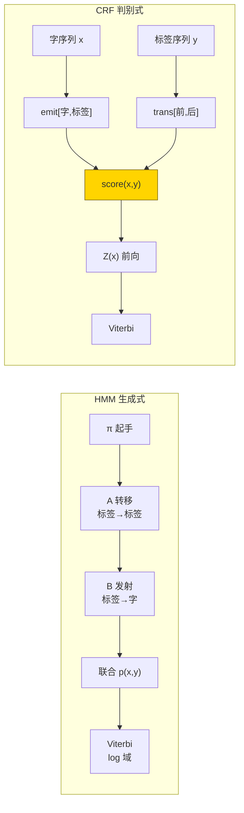
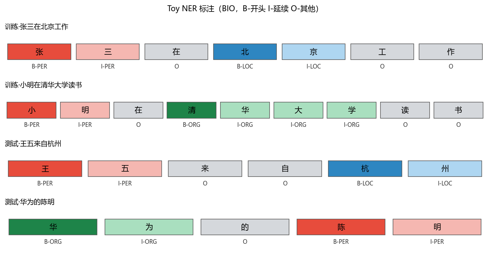
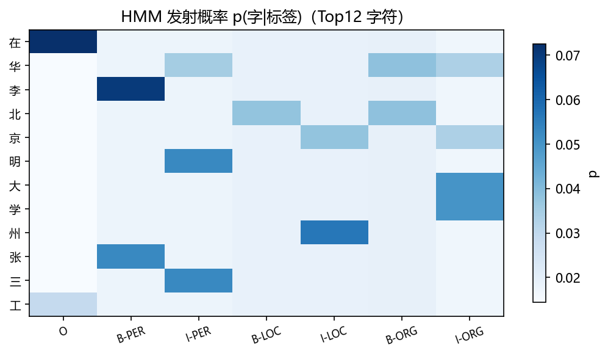
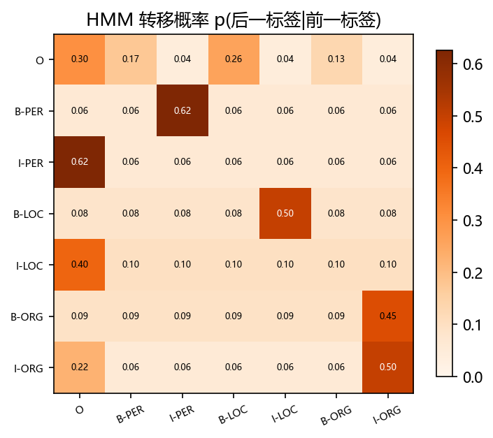
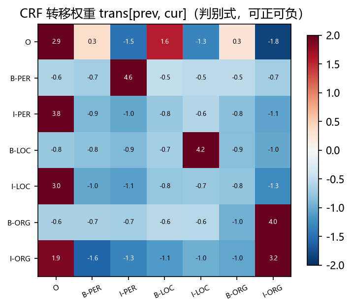
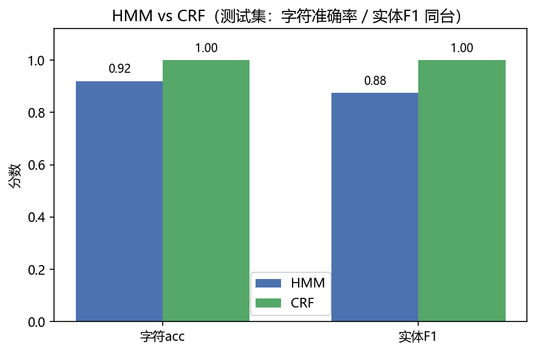
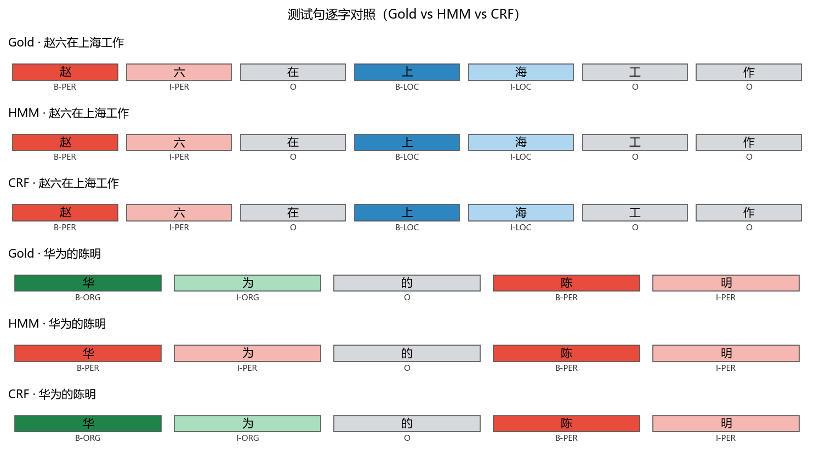

# 01 · HMM / CRF on Toy NER —— 句子的手拉手标注

> 家族：`04_Sequence_Models` | 状态：✅ 已完成 | 主载体：`main.ipynb` | 公共模块：`../common/`
> 环境：`LLM_learning`（Python 3.9 + NumPy + matplotlib；纯统计无 PyTorch，CPU <20s）

## 1. 任务背景与目标

02/03 学“看图”（空间同时看），本章学“读句”（时间先后看）——“张三在北京”要标成 `B-PER/I-PER/O/B-LOC/I-LOC`，单字“张像人名吗”不够，整句要前后自洽：`B-PER` 后面只能跟 `I-PER`，不能跟 `I-LOC`。目标：同数据同标注对照 **HMM 生成式** vs **CRF 判别式**，谁记得住上下文，谁被标注偏置带偏。

## 2. 模型/算法原理

### 通俗理解

**一句话**：单字分类是 7 个人各自猜，序列标注是 7 个人手拉手猜——前一个人说“我是 B-PER（人名开头）”，后一个人就不敢说“我是 I-LOC（地名延续）”，否则整句不通。CRF 给手拉手加“转移分”，HMM 给“转移概率”。

**比喻**：查岗点名——前一个同学报“到”，后一个再报“到”就合理；前一个报“人名开头”，后一个报“地名延续”就违和。模型就是学会“什么标签后面跟什么标签合理”+“什么字爱跟什么标签”。

### 结构账

```
单字分类：  x1→softmax  x2→softmax  ...  各管各的

HMM 生成式： π(起手)·A(转移)·B(发射)  联合概率 p(x,y)=p(y1)·∏p(yt|yt-1)·∏p(xt|yt)
             频率估计 + 拉普拉斯平滑，解码用对数 Viterbi

CRF 判别式： score(x,y)=∑emit[xt,yt]+∑trans[yt-1,yt]  条件概率 p(y|x)=exp(score)/Z(x)
             配分函数 Z(x) 用前向算法（log-sum-exp），梯度靠前后向，SGD 训练

维特比：     dp[t,s]=max_prev(dp[t-1,prev]+trans[prev,s])+emit[xt,s]  回溯挑整句最优（7^8→O(T·S²)）
```

- **发射/emit**：字-标签亲和度（如“张”爱跟 B-PER）
- **转移/trans**：标签-标签亲和度（如 B-PER→I-PER 高分，B-PER→I-LOC 低分）
- **评估**：字符准确率 vs **实体 F1**（严格 span 匹配，边界错也算错）

## 3. 网络结构图



- HMM：`π/A/B` 全是概率（每行归一），受“每个标签的发射分布必归一”约束
- CRF：`emit/trans` 可正可负的分数，判别式直接优化 `p(y|x)`，更灵活

## 4. 核心公式

| 公式 | 含义 |
|------|------|
| `p(x,y)=p(y1)·∏p(yt|yt-1)·∏p(xt|yt)` | HMM 联合概率（生成式） |
| `score(x,y)=∑emit[xt,yt]+∑trans[yt-1,yt]` | CRF 未归一得分 |
| `p(y|x)=exp(score)/Z(x)`，`Z(x)=∑_y exp(score)` | CRF 条件概率，配分函数前向算法 |
| `α[t,s]=log∑_prev exp(α[t-1,prev]+trans[prev,s])+emit[xt,s]` | 前向（log-sum-exp） |
| `dp[t,s]=max_prev(dp[t-1,prev]+trans[prev,s])+emit[xt,s]` | 维特比递推 |
| `∂loss/∂emit = p(yt=s|x) − 1[yt=s]`，`∂loss/∂trans = p(yt-1,yt|x) − 1[...]` | CRF 梯度 = 模型期望 − 真实计数 |

## 5. 数据集

Toy 中文 NER，字符级 BIO，无外网依赖：

- 训练 8 句 + 测试 4 句，字符级标注，`O` 占多数符合真实分布
- 标签 7 类：`O / B-PER I-PER / B-LOC I-LOC / B-ORG I-ORG`（人名/地名/组织）
- 词表 48 字符（含 `<UNK>/<PAD>`），标签分布 train：`O 21 / I-ORG 12 / B-PER 9 / I-PER 9 / B-LOC 5 / I-LOC 5 / B-ORG 4`——偏态真实
- 测试是训练字符的新组合（“赵六在上海”“华为的陈明”），考泛化而非背诵

`RAW_SENTENCES` 12 句见 `common/data.py`，`get_splits()` 8/4 固定切分，`build_vocab()` 字符词表。

## 6. 训练过程与超参数

**无神经网络，纯统计/凸优化**：

| 项 | 取值 |
|---|---|
| HMM | `α=1.0` 拉普拉斯平滑，`π/A/B` 频率估计（对数域 Viterbi） |
| CRF | `emit vocab×7 / trans 7×7` 随机 `N(0,0.1)` 初始化，SGD `80 轮 lr=0.12`，seed=0 |
| 解码 | 同为 Viterbi，`O(T·S²)` |
| 评估 | 字符准确率 + 实体级微平均 F1（严格 span） |

CRF 训练 loss：`0.8464 → 0.3762 → 0.2415 → 0.1782`（每 20 轮）

## 7. 实验结果（实跑输出）

### 同数据同标注对照

| 模型 | 训练 字符acc | 测试 字符acc | 实体 P/R/F1（测试） |
|------|-------------|-------------|---------------------|
| HMM | 0.9692 | 0.92 | 0.875 / 0.875 / **0.875** |
| **CRF** | **1.0** | **1.0** | **1.0 / 1.0 / 1.0** |

逐句（4 测试句，HMM 恰好错 1 句）：

| 句 | Gold | HMM | CRF |
|---|---|---|---|
| 赵六在上海工作 | `B-PER I-PER O B-LOC I-LOC O O` | ✓ | ✓ |
| 王五来自杭州 | `B-PER I-PER O O B-LOC I-LOC` | ✓ | ✓ |
| 李华在北京大学 | `B-PER I-PER O B-ORG I-ORG I-ORG I-ORG` | ✓ | ✓ |
| **华为的陈明** | `B-ORG I-ORG O B-PER I-PER` | `B-PER I-PER O B-PER I-PER` ✗ | ✓ |

- CRF 4 句全对，HMM 在句4把“华为”判成人名——生成式被 **起手先验 + 拉普拉斯** 带偏（见 §8）。

### 可视化








## 8. 误差分析与可视化

- **为什么 HMM 错在“华为”**：训练 8 句里 6 句以人名起手→`π[B-PER]` 先验高；拉普拉斯把没见过的 `p(华|B-PER)` 抬到 `1/57`，而“华”训练里只做过 `I-PER`（李华）和 `B-ORG`（华为）——`2×log(1/57)` 与 `log(2/57)+log(1/57)` 打平，起手先验成为压垮骆驼的稻草。CRF 判别式 `trans[B-ORG,I-ORG]` 醒目红分直接压过先验。
- **发射热力（fig1）**：“张/李/王”聚在 B-PER，“北/上/杭”聚在 B-LOC/LOC，“为/学/里”聚在 I-ORG——频率估计的直观
- **转移热力（fig2 vs fig3）**：HMM 转移全是 0~1 概率（每行归一），`O→O` 高；CRF 转移可正可负（红正蓝负），`B-ORG→I-ORG` 高分、`B-PER→I-LOC` 负分更尖锐——判别式的灵活性
- **HMM 训练 0.9692 非 1.0**：虽为频率估计，但拉普拉斯使模型在训练自身的 emit 上也不“死记硬背”，句4训练句“阿里巴巴在杭州”受同理影响属于正常

### 常见坑 FAQ

1. BIO 的 `I-` 前面必须是同类 `B-`/`I-`，否则 span 非法——`_spans()` 只认合法延续
2. HMM 忘记拉普拉斯→未见字概率 0→log 0 = -inf→整句 Viterbi 直接崩
3. 对数域不做 log-sum-exp 会下溢——CRF 前向必须 `m+log∑exp(vals-m)`
4. 只看字符准确率会虚高（O 占多数）——必须看实体 F1（严格 span）
5. CRF `emit` 维度是 `vocab×tag`，写成 `tag×vocab` 会静默错
6. 起手 `π` 只影响位置 0，但 toy 句短、O 多时影响显著——别忽略

## 9. 总结与改进方向

**实际应用场景**

- **分词/词性标注/NER**：中文分词“北京大学生”切成`北京/大学生`vs`北/京/大学生`、词性标`名/动`、NER 标人名地名——HMM/CRF 曾是输入法、搜索、客服工单实体抽取的标配
- **生物信息**：DNA 上的基因区间标注，状态就是 B/I/O 的生物版
- **现代延续**：BERT/RoBERTa 提特征 + CRF 守边界——CRF 的 `trans` 仍在深度时代当“标签语法检查器”，本章 `trans` 热力即原型
- **方法论**：生成式 vs 判别式的第一堂对比——前者算“怎么生成”，后者算“怎么标对”

**核心收获**

1. HMM 生成式（频率估计+平滑）vs CRF 判别式（条件似然+特征权重）同台，CRF 1.0 vs HMM 0.875
2. Viterbi 是序列标注的通用解码器，HMM/CRF 共用同一套动态规划
3. 实体 F1 比字符准确率更严——边界错也算错，才反映 NER 真难度
4. toy 上 CRF 更强的原因：不受“每标签发射分布必归一”约束，转移可正可负

**下一步**

- `02_RNN_LSTM_GRU_TextCls`：把“数频率”换成“神经网络的记忆”（RNN→LSTM/GRU），在长文本分类上看谁记得住长句
- 本项目可扩展：加“北京银行”“华为手机”等含歧义前缀的测试句、换无平滑 HMM 看过拟合

## 10. 场景速查（实践推荐）

| 场景 | 推荐 | 支撑数据 | 要点 |
|------|------|----------|------|
| 标注少、无深度框架、要可解释 | HMM | 0.875 F1，频率估计秒训 | 起手先验影响大，记得平滑 |
| 标注噪、需学上下文约束、要最好 F1 | **CRF** | **1.0 F1**，转移可正可负 | 判别式压过先验，需 SGD |
| 评估 NER 效果 | 实体 F1（严格 span） | 字符 0.92→实体 0.875 | 字符 acc 虚高，O 多时失真 |
| 解码 | Viterbi | 7^8→O(T·S²) | HMM/CRF 共用，别枚举 |
