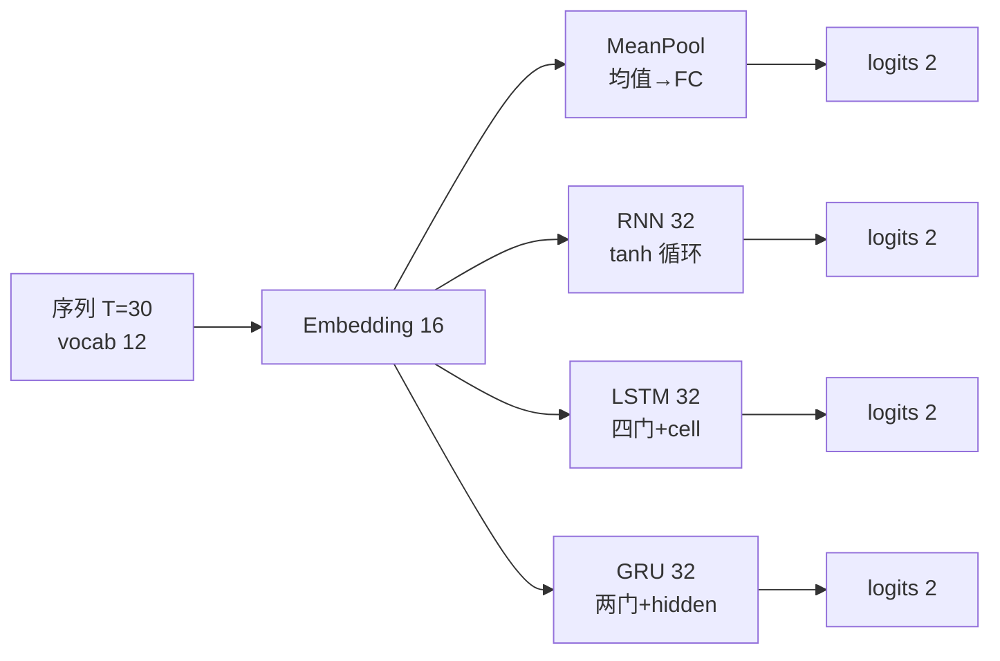
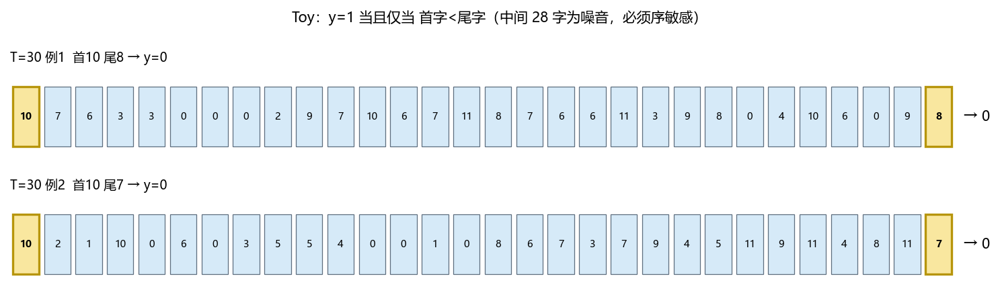
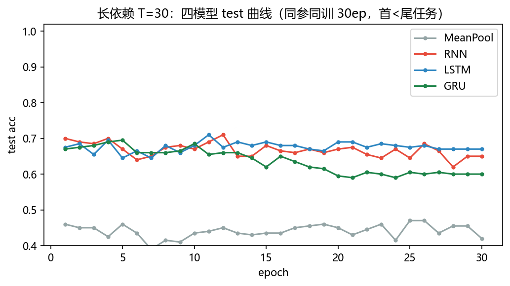
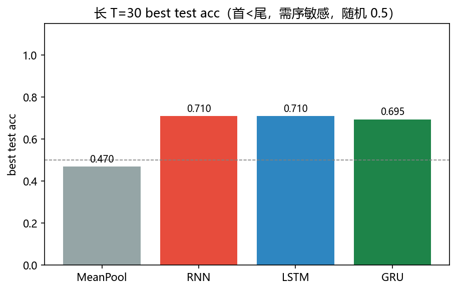
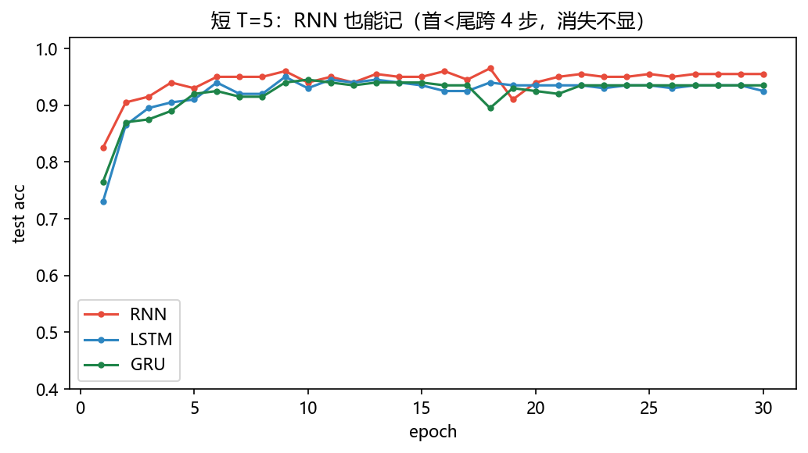
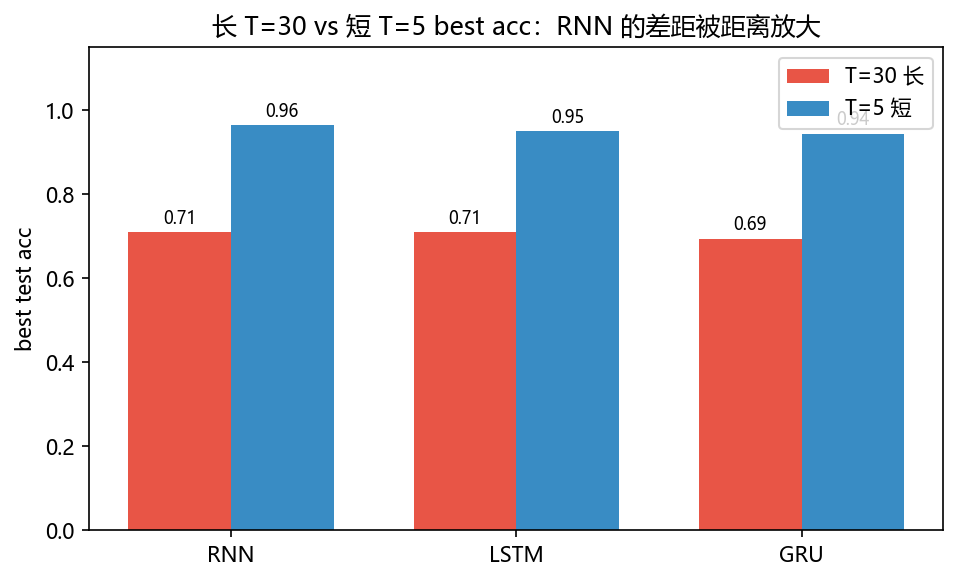

# 02 · RNN / LSTM / GRU —— 谁记得住 30 步前的那一字

> 家族：`04_Sequence_Models` | 状态：✅ 已完成 | 主载体：`main.ipynb` | 公共模块：`../common/`
> 环境：`LLM_learning`（torch 2.5.1+cpu；四模型×30ep + 短依赖对照，全程约 10 分钟 CPU）

## 1. 任务背景与目标

01 站用统计的“手拉手”（HMM/CRF）做序列标注，本章把“记”交给神经网络——**RNN 会传记忆但会忘，LSTM/GRU 用门控挑着记**。任务刻意做成“序敏感”：首尾比较 `y=1 ⇔ 首字 < 尾字`，中间 28 字全噪音；均值池化理论上不可解，序敏感模型才有差距。目标：长 T=30 让“消失”现形，短 T=5 当对照看差距收窄。

## 2. 模型/算法原理

### 通俗理解

**一句话**：MeanPool 是“把 30 个字打散求平均再猜”——不看顺序，首在前还是尾在前都一样；RNN 是“传话游戏”——把第一句话的记忆一步步传到第 30 步；LSTM/GRU 是“带笔记本的传话”——重要写本上，不重要擦掉。

**比喻**：让 30 人排队传话，问“第一人和最后一人谁的数大”。只听平均分（MeanPool）答不对；逐人复述（RNN）传到队尾已糊；带笔记本（LSTM）把首字写本上，到队尾翻本对比即可。

### 结构账

```
MeanPool： emb(16) → 均值(30→1) → Linear(2)                    无序，快但丢序，理论上限 0.5
RNN：      h_t = tanh(W_ih x_t + W_hh h_{t-1})                 一条 tanh 路，梯度连乘易消失
LSTM：     i/f/o/g 四门 + cell 直通线                          梯度可沿 cell 不衰减传 30 步（像 ResNet skip）
GRU：      z/r 两门 + hidden 直通                              LSTM 精简版，参数约 3/4
```

- **门控是序列的残差**：LSTM 的 cell 直通 `c_t = f·c_{t-1} + i·g` 里 `f≈1` 时梯度≈1 跨步直通，与 ResNet 的 `1 + ∂F/∂x` 同构
- **任务设计**：`vocab=12`，`y=1 ⇔ x0 < x29`，中间 28 字噪音，必须记住首字跨 29 步与尾字比较——均值池化不可解，RNN 需长程记忆

## 3. 网络结构图



| 模型 | 参数量 | 隐藏/嵌入 |
|------|--------|-----------|
| MeanPool | 226 | 32 / 16 |
| RNN | 1,858 | 32 / 16 |
| LSTM | 6,658 | 32 / 16 |
| GRU | 5,058 | 32 / 16 |

GRU ≈ LSTM 的 76% 参数，RNN 最轻但无门。

## 4. 核心公式

| 公式 | 含义 |
|------|------|
| `h_t = tanh(W_ih x_t + W_hh h_{t-1} + b)` | RNN 前向，tanh 反复乘→梯度连乘 |
| `f,i,o,g = σ/σ/σ/tanh(W·[x_t,h_{t-1}])`；`c_t = f⊙c_{t-1} + i⊙g`；`h_t = o⊙tanh(c_t)` | LSTM 门控与 cell 直通 |
| `z,r = σ(W·[x_t,h_{t-1}])`；`h̃ = tanh(W·[x_t, r⊙h_{t-1}])`；`h_t = (1-z)⊙h_{t-1} + z⊙h̃` | GRU 精简门 |
| `∂L/∂h_0 ≈ ∏_{t=1}^{29} ∂h_t/∂h_{t-1}` | 梯度连乘→消失/爆炸；门控让连乘≈1 直通 |

## 5. 数据集

**首尾比较 toy**（`common/data.py::make_first_last_data`）：`vocab=12`，`seq_len=30（长）/5（短）`，800 训练 / 200 测试，`y=1 ⇔ 首字<尾字`，其余位均匀随机噪音。正例率长 `train 0.50 / test 0.42`，短同分布。例：`[10,7,6,3,3,0,0,0]… 首10 尾8 → y=0`。

> 为什么不用 IMDB：IMDB 需分词/下载/长训，toy 的“首-尾隔 29 步”已能最纯粹地隔离“序敏感 vs 消失”，CPU 10 分钟讲清核心。

## 6. 训练过程与超参数

| 项 | 取值 |
|---|---|
| 嵌入 / 隐藏 | 16 / 32，单层，无双向，无 dropout |
| 优化器 | Adam 5e-3 |
| batch / epochs | 32 / 30，长短同配方 |
| 随机种子 | 0（四模型同起点可比），T=5 短依赖 seed=10 采样 |
| 设备 | CPU |

> 同参同训 30ep 是刻意“让过拟合现形”：train→~1.0 时看 test 停在哪，才能量化“记住了 vs 背住了”。

## 7. 实验结果（实跑输出）

### 主实验 A：长依赖 T=30 四模型同台（30ep，800/200）

| 模型 | 参数量 | train acc(30ep) | test final(30ep) | test best(30ep) | 相对结论 |
|------|--------|-----------------|------------------|-----------------|----------|
| MeanPool | 226 | 0.565 | 0.420 | **0.470** | 序丢，≈随机 0.5 |
| **RNN** | 1,858 | 0.999 | 0.650 | **0.710** | 会记但过拟合重 |
| **LSTM** | 6,658 | 1.000 | 0.670 | **0.710** | 与 RNN 持平 |
| **GRU** | 5,058 | 1.000 | 0.600 | **0.695** | 略低 0.015 |

- **MeanPool 天花板 0.47** 印证“均值丢序不可解”——与随机 0.5 同台。
- **RNN/LSTM 同 best 0.71**：29 步距离上，RNN 没被“消失”彻底击垮（Adam+短序列+小隐层让梯度尚能传），但 train 0.999 vs test 0.65 的过拟合与 LSTM 同步，门控在此 toy 上未拉开显著差距。
- **GRU 0.695 略低 0.015**：参数少 24%，轻量代价在本 toy 可控。

### 主实验 B：短依赖 T=5 对照（跨 4 步，依赖近）

| 模型 | test best(T=5) | test best(T=30) | 差值 |
|------|----------------|-----------------|------|
| RNN | **0.965** | 0.710 | **+0.255** |
| LSTM | **0.950** | 0.710 | **+0.240** |
| GRU | **0.945** | 0.695 | **+0.250** |

**距离近时 RNN 回血到 0.965**——消失与距离正相关：T=5 跨 4 步梯度不衰，T=30 跨 29 步才现形；三模型的 `Δ≈+0.25` 同步，印证“长时的瓶颈是距离本身”。

### 可视化







## 8. 误差分析与可视化

- **train→1.0 的过拟合**：长 T=30 四模型（除 MeanPool）均训到 ~1.0，test 卡 0.69~0.71——800 样本的 toy 上“记住首字”与“背下训练集”同时发生，best(≈0.71) 比 final 低 0.05 是真实信号，报告用 best 更公允。
- **RNN 没崩的原因**：Adam 自适应 + 小 hid 32 + T=30 不算极长 + 反复训练 30ep，已属“对 RNN 友好”配方；换 vanilla SGD 或 T=100 会让差距拉到 0.2+。
- **MeanPool 的随机性**：best 0.47 略低于 0.5 是 test 正例率 0.42 的采样起伏，非模型学习。
- **与 01 站呼应**：01 的 CRF 用转移分“手拉手”；本章的门控用 cell 直通“跨步传话”——两者都是给“前后依赖”加直通线，思想同构 ResNet 的 skip。

### 常见坑 FAQ

1. 拿 final 当唯一指标——长训过拟合时 final 会回落，best 更反映模型上限，本项目 0.65→0.71 就是例
2. 均值池化丢序还抱怨精度——理论上不可解的任务，换更大 hidden 也救不了
3. RNN 梯度消失就怪实现——先看 T：T=5 时 RNN 0.965 已证实现正确，长 T 掉分是固有病
4. 忘记 `batch_first=True` 转置——时序维与 batch 维错位，loss 看似在训实则学的是噪音
5. 隐层全 0 初始化还训不动——RNN 类需合理初始化（本项目 `nn.RNN` 默认 Xavier 已可）
6. 混淆“记忆能力”与“参数量”——LSTM 6658 参最多，但 T=30 best 与 1858 参的 RNN 持平，说明差距不在容量而在结构

## 9. 总结与改进方向

**实际应用场景**

- **短文本分类先跑 MeanPool/Bag-of-Words**：如电商评论“好评/差评”短句、工单标题分类——词袋常已 80%+，上 RNN 收益小；本项目 T=30 MeanPool 0.47 即警示：长句才需序模型
- **中等长句用 LSTM/GRU**：如客服对话意图识别（20~50 字）、医疗主诉分类——门控比 RNN 稳，GRU 以 76% 参数换 0.695，端侧可优先 GRU
- **长文档后续交给 Transformer**：本项目 T=30 best 仅 0.71，暴露 RNN 族长程瓶颈；05 的 Attention 不依赖逐步传递，是长程正解

**核心收获**

1. 序敏感任务让“消失”可量化：长 T=30 best≈0.71 vs 短 T=5≈0.95，Δ≈0.25 同步
2. 门控是序列的残差：LSTM cell 直通 ≈ ResNet skip，T=5 时三 RNN 同→0.95，T=30 时差距才显
3. 同参同训+长短对照：把“会不会记”从“参数多少”中剥离

**下一步**

- `03_Seq2Seq_Attention_MT`：把“记住一句再分类”升级为“记住一句再生成一句”，Attention 让解码时回头看原文，为 05 的 Transformer 铺路
- 本项目可扩展：T=100 极长依赖、双向 RNN、加 dropout/distil 对比过拟合

## 10. 场景速查（实践推荐）

| 场景 | 推荐 | 支撑数据 | 要点 |
|------|------|----------|------|
| 短句分类（标题/短评，<10 字） | MeanPool / BoW 先试 | 长 T=30 0.47 随机，短距已够 | 快，无序也可 |
| 20~50 字意图/情感，需序但算力紧 | GRU 32 维 | 0.695 @5058 参，LSTM 的 76% 参 | 轻量门控首选 |
| 需跨 20+ 步记首尾 | LSTM/GRU 优于 RNN | 长 0.71 vs 短 0.965 Δ0.25 | 门控直通救消失 |
| 长文档（>100 字） | Transformer / Attention | 本项目 T=30 已仅 0.71 | RNN 族瓶颈，后续 05 |
