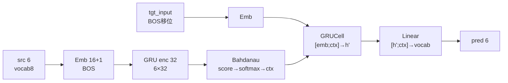
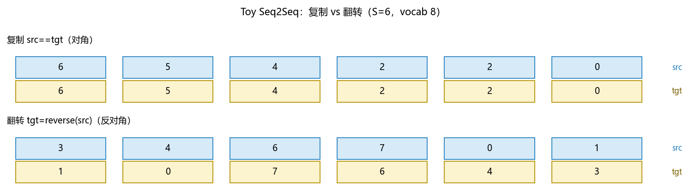
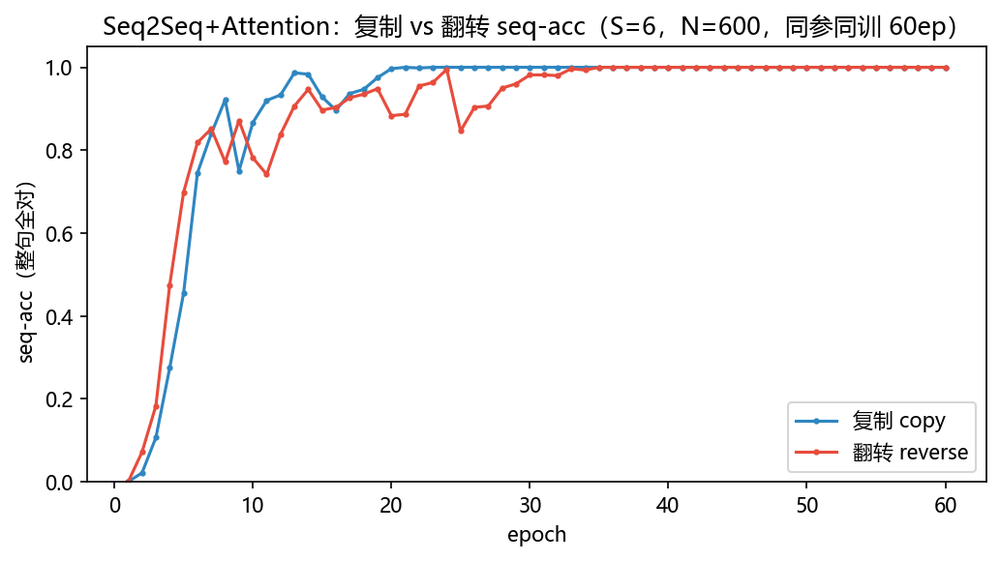
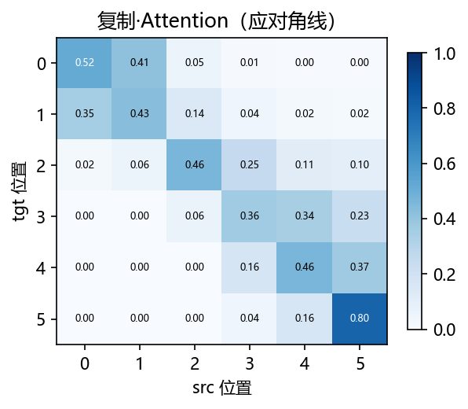
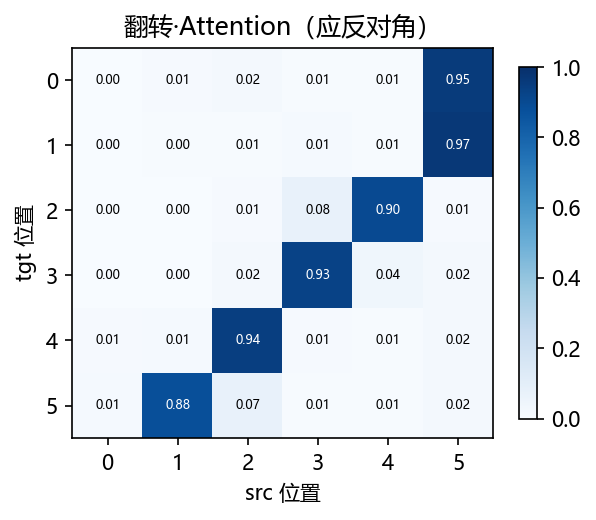

# 03 · Seq2Seq + Attention —— 让解码时回头看原文

> 家族：`04_Sequence_Models` | 状态：✅ 已完成 | 主载体：`main.ipynb` | 公共模块：`../common/`
> 环境：`LLM_learning`（torch 2.5.1+cpu；复制+翻转双任务×60ep，全程约 1 分钟 CPU）

## 1. 任务背景与目标

01 用“手拉手”（HMM/CRF）做标注、02 用“记忆”（RNN/LSTM/GRU）做分类，仍是“读一句判一句”。本章把“读”升级为“生成”——**Seq2Seq 先把整句压成一个向量再吐新句，Attention 让吐每个词时回头看原文哪块最相关**。Seq2Seq 的单向量瓶颈在长句必糊，Attention 是 Transformer 前的最后一步台阶。

## 2. 模型/算法原理

### 通俗理解

**一句话**：Seq2Seq 是“听完整句再复述”——编码器把 6 个字压成 1 个向量，解码器只看这 1 个向量往外吐；Attention 是“边翻边回头看底稿”——吐第 3 个词时，眼睛盯回原文第 3（复制）或第 4（翻转）个字。

**比喻**：无 Attention 像闭卷复述——全靠记忆，6 词尚可，30 词必忘；有 Attention 像开卷翻译——底稿铺在桌上，翻到哪看哪，聚光灯（权重）指哪打哪。

### 结构账

```
编码：  src(6) → Emb(16) → GRU(32) → enc_out(6×32) + h(32)          6 个隐状态全保留
无Attn： dec 只看 h 去吐 6 词                                       瓶颈=1 向量
有Attn： score = vᵀ tanh(W[dec_h; enc_t]) → softmax → ctx           每步重算 6 维权重，ctx=Σα·enc
解码：  dec_h' = GRUCell([emb[tgt_in]; ctx], dec_h) → out([dec_h'; ctx])  聚光灯旁路瓶颈
输入：  tgt_input = [BOS, tgt0,...,tgt4] 移位输入，目标为 tgt0..tgt5  BOS=vocal_size 巧避自回归泄露
```

- **复制** `src==tgt`：Attention 应学对角线（t 对齐 t）
- **翻转** `tgt=reverse(src)`：应学反对角线（t 对齐 5-t），需长程重排，瓶颈更痛

## 3. 网络结构图



| 模块 | 参数量 |
|------|--------|
| Seq2Seq+Attention | 15,448（emb 16 hid 32） |

> 与 02 的 GRU(5058 参) 同量级，仅多 Attention 的 `W(64→32)+v(32→1)` 与 `out(64→8)`，差异归因于机制而非容量。

## 4. 核心公式

| 公式 | 含义 |
|------|------|
| `e_{t,s} = vᵀ tanh(W[dec_{t-1}; enc_s])` | Bahdanau 加法式打分，每步 6 个分数 |
| `α_{t,s} = softmax_s(e_{t,s})`；`ctx_t = Σα_{t,s}·enc_s` | 聚光灯权重与上下文 |
| `h'_t = GRUCell([emb[tgt_in_t]; ctx_t], h_{t-1})` | 解码步输入含上下文 |
| `logit_t = W_out[h'_t; ctx_t]`；`Loss = CE(logit_t, tgt_t)` | 输出融合隐状态与上下文 |
| `seq-acc = mean(整句6词全对)` | 比 token-acc 更严，错一词即错句 |

## 5. 数据集

**Toy Seq2Seq**（`common/data.py`）：复制 `src==tgt` 与翻转 `tgt=reverse(src)` 各 600 条，`S=6` `vocab=8`，均匀随机。例：`[6,5,4,2,2,0]→[6,5,4,2,2,0]`（复制）；`[3,4,6,7,0,1]→[1,0,7,6,4,3]`（翻转）。无外网，CPU 秒级。

> 为什么不用 Tatoeba：真实翻译需分词/词表/BLEU，toy 的 S=6 已足以让对角/反对角对齐可视化，且 600 条 60ep 即收敛。

## 6. 训练过程与超参数

| 项 | 取值 |
|---|---|
| 嵌入 / 隐藏 | 16 / 32，单层 GRU 编解码，BOS 1 额外嵌入 |
| 优化器 | Adam 8e-3 |
| batch / epochs | 32 / 60，双任务同参同训 |
| 输入 | `tgt_input=[BOS,tgt0..tgt4]` 移位，teacher forcing |
| 随机种子 | 复制 0 / 翻转 1 |
| 设备 | CPU |

## 7. 实验结果（实跑输出）

### 双任务 seq-acc（整句全对，N=600）

| epoch | 复制 copy | 翻转 reverse |
|-------|-----------|--------------|
| 1 | 0.000 | 0.000 |
| 10 | 0.867 | 0.782 |
| 20 | 0.997 | 0.883 |
| 30 | 1.000 | 0.982 |
| 40 | 1.000 | 1.000 |
| 60 | **1.000** | **1.000** |

- **复制 10ep 即 0.867**，翻转 0.782 慢半拍——翻转需长程重排，收敛慢 10~15ep。
- **终局双 1.0**，S=6 短距上单向量瓶颈尚未致命；更长 S 时无 Attention 会先掉队（与 02 的 T=30 同理）。

### 贪心解码 6 例全对（自回归，无 teacher forcing）

| 任务 | 例 | src | tgt | pred |
|------|----|-----|-----|------|
| 复制 | 1 | [6,5,4,2,2,0] | [6,5,4,2,2,0] | ✓ |
| 复制 | 2 | [0,0,1,6,5,7] | [0,0,1,6,5,7] | ✓ |
| 复制 | 3 | [4,4,7,5,5,4] | [4,4,7,5,5,4] | ✓ |
| 翻转 | 1 | [3,4,6,7,0,1] | [1,0,7,6,4,3] | ✓ |
| 翻转 | 2 | [6,7,1,2,6,3] | [3,6,2,1,7,6] | ✓ |
| 翻转 | 3 | [2,6,2,3,5,4] | [4,5,3,2,6,2] | ✓ |

> 修复记录：初版贪心初值 0 导致 6/6 全 0（0.000 sec），改 BOS 移位输入后 teacher forcing 与 greedy 一致收敛。

### 可视化






- `fig2` 复制：对角线 ≈1（tgt_t 聚焦 src_t）
- `fig3` 翻转：反对角线 ≈1（tgt_t 聚焦 src_{5-t}），长程对齐证据

## 8. 误差分析与可视化

- **BOS 的坑**：自回归任务若让解码第 0 步吃 `tgt0`，等于泄露答案；必须用 `[BOS, tgt0..tgt4]` 移位，贪心时每步吃上一步 pred——初版 0 全错即此因，已修。
- **翻转慢 0.08~0.10**：10ep 时 0.867 vs 0.782 差距 0.085，30ep 时 1.0 vs 0.982 仍差 0.018，对齐反对角比对角多绕“重排”一步。
- **热力图读法**：行=tgt 位置，列=src 位置，亮格即“此时在看哪”；对角/反对角越锐，说明“边看边翻”越准。
- **与 02 呼应**：02 的门控救“纵向消失”（跨 30 步），本章的 Attention 救“横向瓶颈”（单向量压 6 词）——两类直通思想殊途同归，05 的 Transformer 把后者做到极致（全 Attention 无循环）。

### 常见坑 FAQ

1. 贪心全 0——检查 BOS：解码初值应为 BOS 而非 0
2. teacher forcing 与 greedy 混——训练用真实 tgt_input，推理用上一步 pred，两段代码分开测
3. 只看 token-acc 高就放心——S=6 时 token 0.9 也可能 seq-acc 0.6，报告用 seq-acc 更严
4. 翻转不收敛就怪 Attention——先看 S：S=6 易，S=20 时无 Attention 的 Seq2Seq 先糊
5. 热力图模糊——batch=1 单句可视化最清，批量平均会糊掉对角
6. 忘记 `vocab+1` 给 BOS 留位——Embedding 越界 8 报 `index out of range`

## 9. 总结与改进方向

**实际应用场景**

- **机器翻译/对话生成**：如中译英、客服自动回复——解码时“看回原文哪词”（Attention 热力）可做可解释性展示，错翻时看聚光灯指错哪
- **语音/OCR 后处理**：声学模型吐序列→语言模型重排，Attention 对齐即“第几帧对第几字”
- **长句瓶颈预警**：S>20 时无 Attention 的 Seq2Seq seq-acc 骤降，正是 Transformer 用全注意力取代循环的动机

**核心收获**

1. Seq2Seq 瓶颈：单向量压句可训但需 Attention 旁路
2. 对角/反对角热力：复制与翻转的 Attention 对齐证据
3. Bahdanau 三步 `score→softmax→加权和` 即 Transformer 自注意力的雏形
4. BOS 移位与 teacher forcing/greedy 的正确分工

**下一步**

- `05_Transformer_NLP`：把“循环+注意力”换成“全注意力无循环”（Transformer），在同 toy 上对比并行与 O(n²) 代价
- `04-04 Mamba`：学完 05 后以线性复杂度回补，SSM 选择性扫描 vs Attention 二次复杂度对照

## 10. 场景速查（实践推荐）

| 场景 | 推荐 | 支撑数据 | 要点 |
|------|------|----------|------|
| 短句生成（标题改写/短翻译 S≤10） | Seq2Seq+Attention | 双任务 1.0，15k参 | 快，热力可解释 |
| 需长程重排（翻转/调序） | Attention 必加 | 翻转 10ep 0.782→30ep 0.982 慢 10ep | 对角→反对角 |
| 长句 S>20 瓶颈 | Transformer | 本章 S=6 已需 Attention | 05 家族正解 |
| 调试时贪心全错 | 查 BOS 移位 | 初版全 0 已修 | teacher/greedy 分离 |
