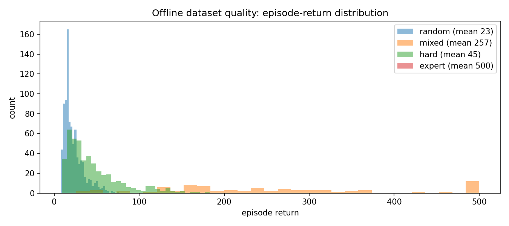
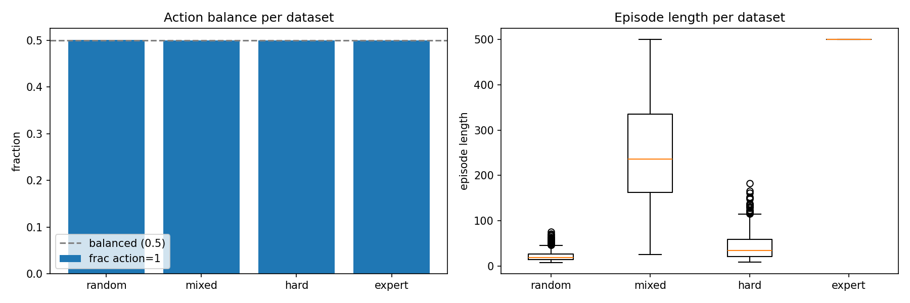
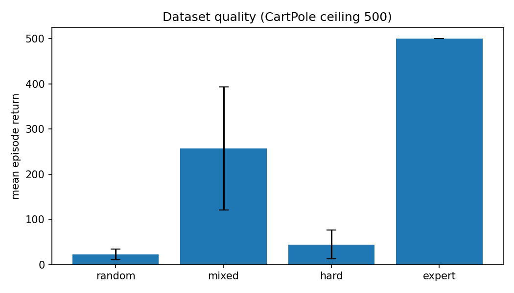

# 01 离线数据集采集：CartPole 四种质量

> 状态：✅ 已完成 | 环境：`CartPole-v1`，纯 numpy 采集 | 实跑：`python run.py`（CPU ~27s，4 数据集各 2 万条）

## 1. 任务背景与目标

离线 RL 的第一原则：**数据质量决定天花板**。本站不训练任何策略，只用 4 种行为策略采集 CartPole 轨迹，把“数据从差到好”这条轴钉死，供 02 站做 BC/CQL/IQL 对照。避免下载 D4RL 大文件，全部自采。

## 2. 模型/算法原理

**通俗理解**：离线 RL 不给试错机会，只给一叠“录像带”。录像带是随机乱按还是高手操作，直接决定你能学出什么。所以先造 4 盘不同水平的带子。

**行为策略**：CartPole 有个经典 PD 启发式（杆往哪倒就往哪推），近乎满分，拿它当“专家”；再按不同比例掺入随机动作，得到中等/较差的带子。

## 3. 环境结构图

```text
 CartPole-v1: obs=[x, x_dot, theta, theta_dot], act=2, 上限500, 奖励+1/步
 专家策略: a = 1 if (theta + 0.5*theta_dot) > 0 else 0   (PD 控制器)
 四种数据:
   random : 全随机          -> 均值 ~23
   hard   : 75%随机+25%专家 -> 均值 ~45
   mixed  : 40%随机+60%专家 -> 均值 ~257
   expert : 纯专家          -> 均值 500 (满分)
```

## 4. 核心公式

\[ \text{behavior}:\ a_t \sim \begin{cases} \text{Uniform}\{0,1\} & \text{w.p. } \epsilon \\ \pi_{\text{PD}}(s_t) & \text{w.p. } 1-\epsilon \end{cases} \]

\[ \text{PD 控制器}:\ \pi_{\text{PD}}(s) = \mathbb{1}[\theta + 0.5\,\dot\theta > 0] \]

## 5. 环境介绍与预处理

- 每个数据集固定 20000 条转移，按回合采集（`done` 标记），obs/act/rew/nobs/done 五元组存 `.npz`
- 行为策略随机性用固定 `seed` 的 `np.random.default_rng`，可复现
- 无需归一化，CartPole obs 量级已友好

## 6. 训练过程与超参数

| 项 | 值 |
|---|---|
| 数据集数 | 4（random / hard / mixed / expert） |
| 每条转移数 | 20000 |
| 专家 | PD 控制器 `theta+0.5*theta_dot` |
| 噪声比 | random=100% / hard=75% / mixed=40% / expert=0% |
| 存储 | `data/*.npz` + `*_stats.json` |

## 7. 实验结果（实跑 stdout.txt）

| 数据集 | 转移数 | 回合数 | 平均回报 | 平均步长 | action=1 占比 |
|---|---|---|---|---|---|
| random | 20006 | 887 | 22.6±11.6 | 22.6 | 0.501 |
| hard | 20002 | 447 | 44.7±31.7 | 44.7 | 0.500 |
| mixed | 20053 | 78 | 257.1±135.9 | 257.1 | 0.500 |
| expert | 20000 | 40 | 500.0±0.0 | 500.0 | 0.500 |

- 质量轴清晰：22.6 → 44.7 → 257.1 → 500.0，四档拉开
- action=1 占比都≈0.5，说明**动作分布均衡**（不是靠偏科刷分），质量差异来自“时序决策好坏”而非动作偏好





## 8. 失败模式与误差分析

- **random 回合极短（22 步）**：随机策略很快翻车，导致状态覆盖差（高价值状态见得少），这正是 02 站 CQL/IQL 在 random 上不高的根因
- **expert 满分且零方差**：PD 控制器对 CartPole 是确定性的最优级策略，所以 expert 数据“太干净”，BC 能完美克隆（02 站会看到）
- **动作分布均衡**：四档 action_frac 都 0.5，排除“数据偏差来自动作不平衡”的可能

**常见坑 FAQ**：Q1 为什么不用 D4RL？——CartPole 自采 2 万条秒级完成，避免下载 GB 级数据，且质量可控。Q2 为什么专家用启发式不用训练？——启发式确定性、可复现、零训练成本，且能造出满分数据。Q3 obs 要不要归一化？——CartPole 不需要，量级已在 [-4,4]。

## 9. 总结与改进方向

数据质量轴已钉死（22→500）。下一站 02 用它回答：BC 天花板多高、离线 RL 能否超过模仿、CQL 保守系数多重要。

**实际应用场景**：真实离线 RL 数据来自历史日志/人工遥操作/旧策略回放，质量参差正是常态；先做数据画像（本站）再选算法是工程惯例。

## 10. 场景速查

| 场景 | 推荐 | 支撑数据 | 要点 |
|---|---|---|---|
| 造离线数据 | 行为策略分层采集 | 4 档 22→500 | 先画数据质量轴 |
| 动作偏差排查 | 看 action_frac | 全 0.5 | 均衡才排除偏科 |
| 覆盖度差 | 看平均步长 | random 仅 22 步 | 短回合=覆盖差 |
