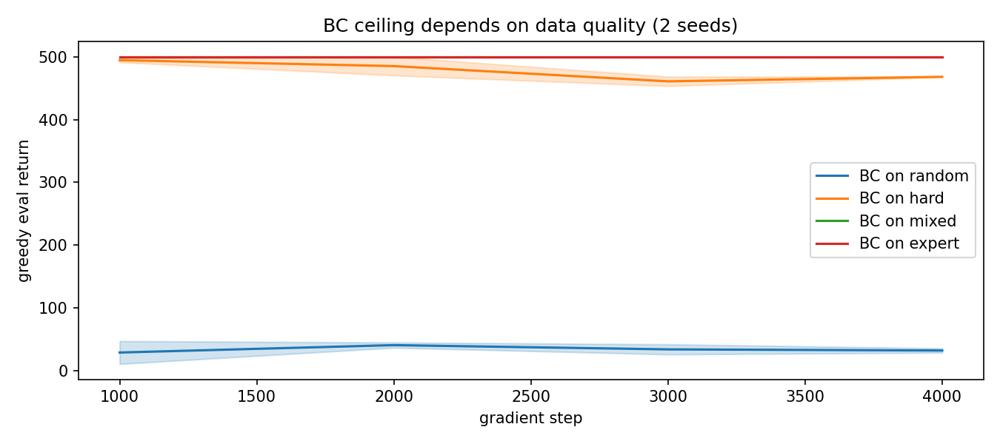
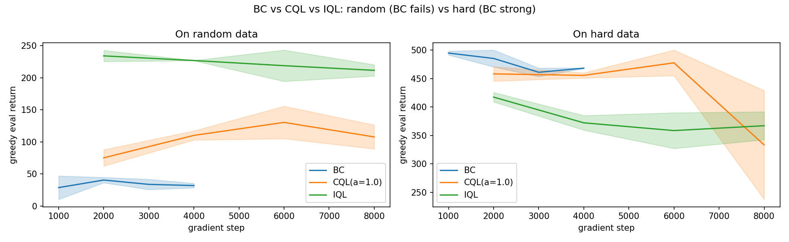
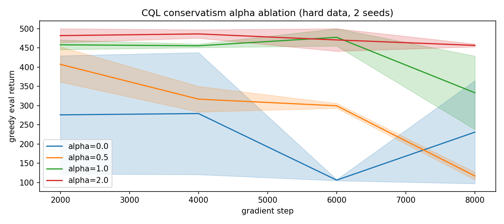
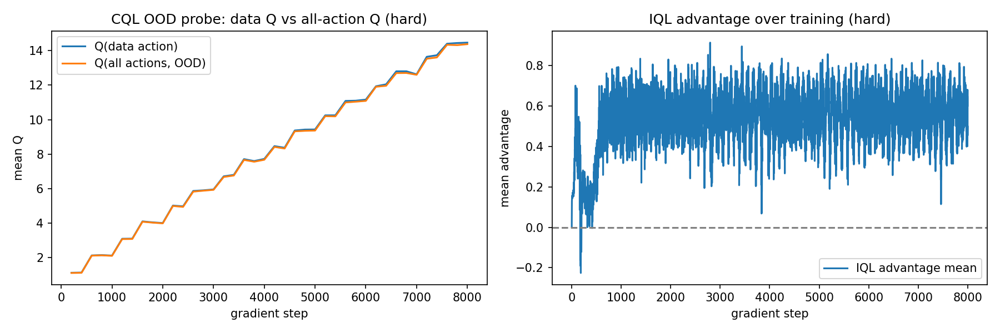

# 02 离线算法：BC / CQL / IQL（CartPole）

> 状态：✅ 已完成 | 环境：`CartPole-v1`，torch 2.5.1+cpu | 实跑：`python run.py`（BC×4 数据集 + CQL/IQL×2 数据集 + α 消融，2 种子，CPU 约 10 分钟）

## 1. 任务背景与目标

只用 01 采的离线数据，训练三类策略：BC（纯模仿）、CQL（保守 Q，罚 OOD）、IQL（expectile V + 不查 OOD）。回答三个问题：BC 天花板多高？离线 RL 能否超过模仿？保守系数多重要？

## 2. 模型/算法原理

**通俗理解**：BC 是“照葫芦画瓢”，只会模仿录像里的动作，录像差它就差。CQL 是“别信没见过的招”——把数据外动作的 Q 往下压。IQL 是“只学数据里出现过的动作的价值”，用 V(s') 当目标，天然不碰 OOD。

**家族位置**：BC（模仿，天花板=数据）→ CQL（保守，压 OOD）→ IQL（隐式，避 OOD）→ 更复杂的离线算法（只讲思想）。

## 3. 网络结构图

```text
 BC :  obs -> MLP -> logits -> CrossEntropy(a_data)                       (无Q)
 CQL:  obs -> Q(2) ; y = r + g(1-d) max_a' Q_t(s')
       loss = MSE(Q(s,a), y) + alpha*(logsumexp_a Q(s,.) - Q(s,a))
 IQL:  obs -> Q(2), V(1), pi(2)
       L_V = E[ |tau - 1(Q<V)| (Q-V)^2 ]        (expectile, tau=0.7)
       L_Q = E[ (Q(s,a) - (r + g(1-d) V(s')))^2 ]   (不取max, 不查OOD)
       L_pi= E[ exp(beta*(Q-V)).clamp(max=100) * (-log pi(a|s)) ]  (AWR)
 评估: 在线贪心 rollout (20 回合, 独立 env)
```

## 4. 核心公式

\[ \text{CQL}:\ L = \underbrace{(Q(s,a)-y)^2}_{\text{TD}} + \alpha\big(\underbrace{\log\sum_{a'}e^{Q(s,a')}}_{\text{压低全部}} - \underbrace{Q(s,a)}_{\text{抬数据动作}}\big) \]

\[ \text{IQL-V}:\ L^\tau_V = \mathbb{E}\big[\,|\tau - \mathbb{1}(Q<V)|\,(Q-V)^2\,\big],\quad \tau=0.7 \]

\[ \text{IQL-}\pi:\ L_\pi = -\mathbb{E}\big[e^{\beta(Q(s,a)-V(s))}\log\pi(a|s)\big] \]

## 5. 环境介绍与预处理

- 数据：01 的 `random/hard/mixed/expert`（各 2 万条），直接读 `.npz`
- 离散动作 2 维，obs 4 维，无需归一化
- 评估：在线贪心 rollout 20 回合（base_seed=999，独立 env），报均值±std（2 种子）

## 6. 训练过程与超参数

| 项 | 值 |
|---|---|
| 种子 | [0,1] |
| BC 步数 / lr | 4000 / 1e-3，batch 256 |
| CQL/IQL 步数 / lr | 8000 / 1e-3，batch 256，gamma 0.99 |
| CQL | target_sync 500，α ∈ {0.0,0.5,1.0,2.0} |
| IQL | expectile 0.7，beta 3.0，weight clamp 100 |

## 7. 实验结果（实跑 stdout.txt）

**E1 BC 天花板 = 数据质量**

| 数据 | BC 最终 eval |
|---|---|
| random | 31.8±3.4（失败） |
| hard | 468.1±0.5 |
| mixed | 500.0±0.0 |
| expert | 500.0±0.0 |

**E2 BC vs CQL vs IQL**

| 数据 | BC | CQL(α=1) | IQL |
|---|---|---|---|
| random | 31.8±3.4 | **107.6±18.7** | **211.4±8.8** |
| hard | **468.1±0.5** | 333.2±95.6 | 367.0±24.6 |

**E3 CQL 保守系数 α（hard 数据）**

| α | eval final |
|---|---|
| 0.0（无保守） | 230.7±133.9（抖） |
| 0.5 | 116.8±10.0 |
| 1.0 | 333.2±95.6 |
| 2.0 | **456.5±3.7** |

**E4 诊断**：CQL Q(data)−Q(all) 末值 gap=−0.09；IQL 优势均值 0.165→0.559（AWR 权重逐渐拉开）。






## 8. 失败模式与误差分析

- **BC 在 random 上彻底失败（31.8）**：录像全是乱按，BC 只能学会乱按——模仿天花板 = 数据质量，铁律
- **离线 RL 在 random 上逆袭**：BC 31.8 → CQL 107.6 → IQL 211.4。虽然随机数据覆盖差、绝对值不高，但**离线 RL 确实从“没价值的录像”里挖出了比模仿更好的策略**，这是本站最重要的正面证据
- **但 hard 上 BC 反而最强（468）**：CartPole 的专家是确定性 PD 控制器，BC 的 argmax 会把 75% 噪声“投票掉”，恢复专家动作。**这是 CartPole 特有的“去噪红利”，换更复杂环境 BC 就没这么幸运**——提醒：任何离线实验都必须先跑 BC 基线
- **CQL 无保守会崩**：α=0 时 Q 被 OOD 动作带飞，230.7±133.9 高方差；α 越大越稳（2.0→456.5±3.7）。α=0.5 反常偏低（116.8）是“半保守”不上不下的真实坑
- **IQL 最稳**：random 上 211.4±8.8 方差最小，因它用 V(s') 做目标、根本不查 OOD 动作

**常见坑 FAQ**：Q1 BC 这么强还要离线 RL 吗？——CartPole 是特例（确定性专家）；一般环境 BC 会被数据质量卡死（看 random 31.8）。Q2 CQL 的 α 怎么调？——本站单调偏好更大 α，实践中常用 1~5，需按环境扫。Q3 IQL 为什么不用 max？——避免对 OOD 动作取 max 导致高估，这是它稳的根因。

## 9. 总结与改进方向

- BC 天花板 = 数据质量（31.8→500），且 CartPole 上 BC 因“去噪”异常强，必须当基线
- 离线 RL 的价值在**劣质数据**上体现（random：BC 31.8 → IQL 211.4）
- CQL 保守系数是命门（α=0 崩、α=2 稳）
- IQL 靠“不查 OOD”最稳

下一站 06 转 LLM 对齐（DPO/GRPO），把“离线偏好数据”的思路迁到语言模型。

**实际应用场景**：工业推荐/机器人用历史日志训策略（只有 CQL/IQL 这类能防 OOD 高估）；只要数据够好、任务够简单，BC 往往就是性价比之王。

## 10. 场景速查

| 场景 | 推荐 | 支撑数据 | 要点 |
|---|---|---|---|
| 数据差（random） | IQL/CQL | IQL 211 vs BC 31.8 | 离线 RL 能超过模仿 |
| 数据好 + 简单任务 | 先跑 BC | BC 468/500 | CartPole 去噪红利，别忽视基线 |
| Q 学不稳 | 加 CQL 保守 | α=0 崩 vs α=2 稳 | α 越大越稳 |
| 怕 OOD 高估 | IQL | 方差最小 | 用 V(s') 不查 OOD |
