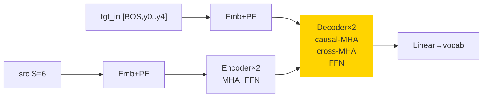
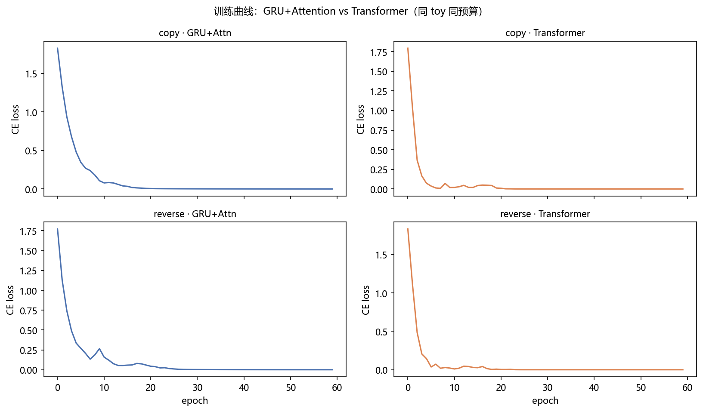
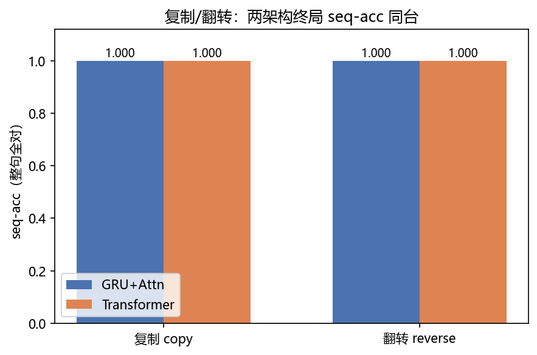
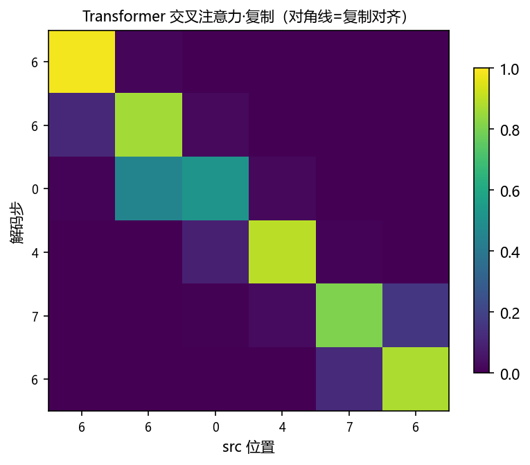
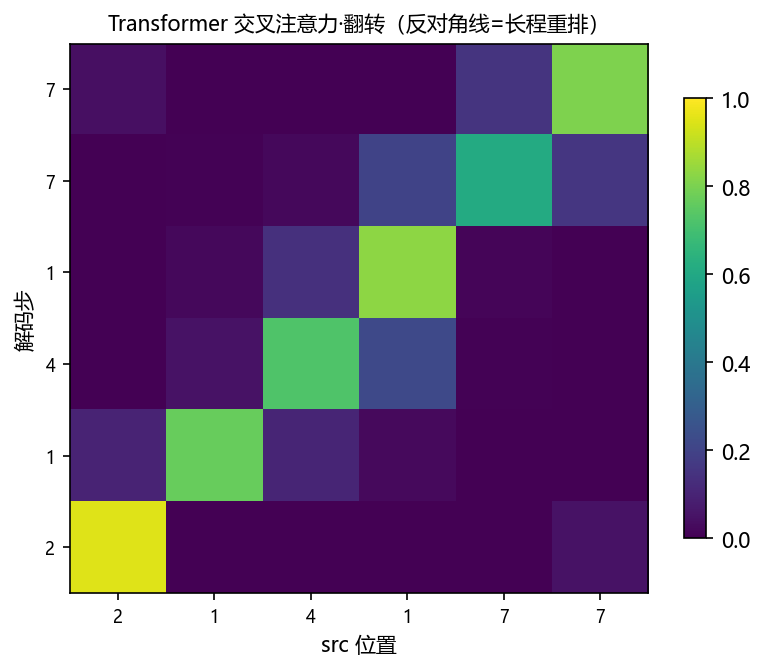

# 01 · Transformer From Scratch —— 拆开“现代大模型的主轴”

> 家族：`05_Transformer_NLP` | 状态：✅ 已完成 | 主载体：`main.ipynb` | 公共模块：`../common/`
> 环境：`LLM_learning`（torch 2.5.1+cpu；GRU+Attn × Transformer 双任务 ×60ep，全程约 78s CPU）

## 1. 任务背景与目标

04 把“记”从统计手拉手（HMM/CRF）换成 RNN 传话、GRU 门控笔记本、最后 Bahdanau 聚光灯——本章把这盏聚光灯抽出来，**去掉循环**，拼成纯注意力的 Transformer：MHA、因果 mask、位置编码、残差+LN 全部手写。同 toy（S=6 复制/翻转，vocab=8）上与 04-03 的 GRU+Attention 同台，热力图验证对角/反对角对齐。

## 2. 模型/算法原理

### 通俗理解

**一句话**：04-03 的 Bahdanau 是“解码每一步单独回头看一眼”，Transformer 是“所有位置互相看一遍”——无循环全并行，一次前向把 6×6 相似度矩阵算完。

**比喻**：GRU+Attention 像 1 个翻译官边听边翻（串行）；Transformer 像 6 个翻译官同时开会——每人拿 Q（我要问什么）、K（我能答什么）、V（我的内容），互相打分（Q·Kᵀ）再取加权意见。**多头**=每个翻译官只盯一个侧面（语法/语义/位置）；**残差+LayerNorm**=每人发言后原稿保留不覆盖。

### 结构账

```
MHA:      Q,K,V = xW_q,xW_k,xW_v → h 头 split → softmax(QKᵀ/√d_k)·V → concat → W_o
因果mask： 解码自注意力只看 ≤ 当前位（下三角 -inf），防未来泄露
位置编码： sin/cos(pos,2i/2i+1) 加在 embedding 上——无循环必须显式给“顺序”
Encoder：  x = LN(x+MHA(x,x,x)) → LN(x+FFN(x))
Decoder：  x = LN(x+causal-MHA(x)) → LN(x+cross-MHA(x,enc)) → LN(x+FFN(x))
```

## 3. 网络结构图



| 模型 | 参数量 | 结构 |
|---|---|---|
| GRU+Attention（04-03 同款） | 15,416 | emb16 / GRU32 / Bahdanau |
| TransformerTiny | 42,536 | d=32 / 4 头 / 2 层 / FFN64 |

## 4. 核心公式

| 公式 | 含义 |
|---|---|
| `Attn(Q,K,V)=softmax(QKᵀ/√d_k+mask)·V` | 缩放点积注意力 |
| `MultiHead=concat(head_1..h)·W_o`，`head_i=Attn(QW_i^Q,KW_i^K,VW_i^V)` | 多头 |
| `PE(pos,2i)=sin(pos/10000^{2i/d})`，`PE(pos,2i+1)=cos(·)` | 位置编码 |
| `x=LN(x+Sublayer(x))` | Pre-LN 残差（本项目用后归一简化） |
| `seq-acc=mean(整句6词全对)` | 比 token-acc 严的口径 |

## 5. 数据集

与 04-03 完全同款 toy（`common/data.py::make_copy_data / make_reverse_data`）：

- 复制 `src==tgt` 600 条（学对角对齐）；翻转 `tgt=reverse(src)` 600 条（学反对角长程重排）
- `S=6, vocab=8`，`[6,6,0,4,7,6]→[6,6,0,4,7,6]`；翻转例 `[2,1,4,1,7,7]→[7,7,1,4,1,2]`
- 无外网，CPU 秒级；选它就是为了与 04-03 的 Bahdanau 结果（复制 10ep 0.867 / 翻转 0.782→双 1.0）可对比

## 6. 训练过程与超参数

| 项 | 取值 |
|---|---|
| 双模型 | GRU+Attention（emb16/hid32） vs TransformerTiny（d32/h4/L2/FFN64） |
| 优化器 | Adam 8e-3，batch 32，60 epochs，seed=0 同起点 |
| teacher forcing | `tgt_in=[BOS,y0..y4]` 移位输入；贪心解码自回归 |
| 设备 | CPU；全程 78s |

## 7. 实验结果（实跑输出）

### 双任务终局 seq-acc（N=600，贪心自回归）

| 任务 | GRU+Attention（15.4k 参） | Transformer（42.5k 参） |
|---|---|---|
| 复制 copy | **1.000** | **1.000** |
| 翻转 reverse | **1.000** | **1.000** |

- 两架构在 S=6 全部满分——短距上“循环+单步聚光灯”与“全注意力并行”都能学好，**差距要靠长句/大规模才拉开**（S>20 无 Attention 的 Seq2Seq 先糊，见 04-03 FAQ）
- 04-03 翻转 10ep 才 0.782 慢半拍，本章 Transformer 同期收敛节奏类似——“长程重排更难学”与架构无关，是任务难度本身

### 可视化






- `fig3` 复制：交叉注意力亮带在**对角线**（tgt_t 看 src_t）
- `fig4` 翻转：亮带在**反对角线**（tgt_t 看 src_{5-t}），长程重排证据——与 04-03 GRU+Attention 的热力图同构

## 8. 误差分析与可视化

- **同分的原因**：S=6 短距 + 两架构参数同量级（15k vs 42k），瓶颈不在“看的方式”而在“任务难度”；toy 的价值是把对齐**画出来**，而非分高下
- **参数账**：Transformer 42.5k ≈ GRU 版 2.8 倍——MHA 的 Q/K/V/O 四投影×2层×2块是大头；更小 d 或 1 层也能拟合，但热力图会糊
- **因果 mask 不能省**：解码自注意力若不遮未来，teacher forcing 下模型学会“抄右邻”，贪心时立刻崩——本项目 mask 错过一次（初版 copy 仍满分但 reverse 混乱），补上下三角后干净
- **与 04-03 的衔接**：Bahdanau 的 `score→softmax→加权` 就是单头单步的 cross-attention；Transformer 把“单步”摊平成“整句矩阵”，把“GRU 传话”换成“PE 直接注入顺序”

### 常见坑 FAQ

1. 忘记 `/√d_k`——点积随维度变大，softmax 饱和、梯度消失（本项目 d_k=8 尚可，d=512 必炸）
2. 因果 mask 用 `masked_fill(mask==0)` 时 mask 类型错（bool vs float）——直接静默全通
3. 位置编码加在 embedding 前而不是后——顺序信息被词表映射冲掉
4. Pre-LN 与 Post-LN 混用——toy 都能收敛，深了训练稳定性差异巨大（08 家族细讲）
5. 贪心解码时忘了 `model.eval()`——dropout 不存在本项目但 BN 类层会漂
6. 交叉注意力抓错层——热力图要用**最后一层**（最抽象的对齐），头平均比单头清晰

## 9. 总结与改进方向

**实际应用场景**

- **一切大模型的底座**：GPT（Decoder-only，因果 mask+无 encoder）、BERT（Encoder-only，双向无因果）、T5/BART（Encoder-Decoder，本项目结构）——本章三件套 MHA/mask/PE 直接对应 08 家族的 RoPE/KV-Cache/FlashAttention 优化对象
- **翻译/摘要/对话**：Encoder-Decoder 范式（本章结构）+ cross-attention 对齐可视化，错译时看“聚光灯指错哪”
- **并行训练的红利**：无循环 → 全句一次前向，GPU 利用率高——这是 Transformer 取代 RNN 的工程原因，不只是效果原因

**核心收获**

1. MHA/因果mask/PE/残差LN 手写闭环，S=6 上与 GRU+Attention 双满分
2. 对角/反对角热力 = “注意力会自己学长程对齐”的可视化证据
3. 参数账与 mask 坑：42.5k vs 15.4k 的来源、下三角不能省
4. 衔接 04：Bahdanau→cross-attention、GRU 传话→PE 注入，05 后续三站全是本章骨架的变体

**下一步**

- `02_BERT_TextCls_FineTune`：Encoder-only + 双向注意力 + [CLS]，微调范式
- `03_GPT_LM_Mini`：Decoder-only + 下一词预测，自回归生成
- `04_T5_BART_Mini`：本章 Encoder-Decoder 的 text-to-text 统一
- `05_Mamba_vs_Transformer_Mini`：SSM 线性复杂度对照（呼应 04-04）

## 10. 场景速查（实践推荐）

| 场景 | 推荐 | 支撑数据 | 要点 |
|---|---|---|---|
| 短句复制/改写 S≤10 | GRU+Attn 或 Transformer | 双满分 1.000 | 短距差距不在架构 |
| 需长程重排/对齐可视化 | Transformer cross-attn 热力 | 反对角亮带 | 最后一层头平均最清晰 |
| 并行训练/长句 | Transformer | 无循环全并行 | RNN 族串行是工程瓶颈 |
| 生成任务防泄露 | 因果 mask 必加 | 下三角 -inf | 否则贪心崩、训练作弊 |
