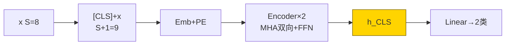
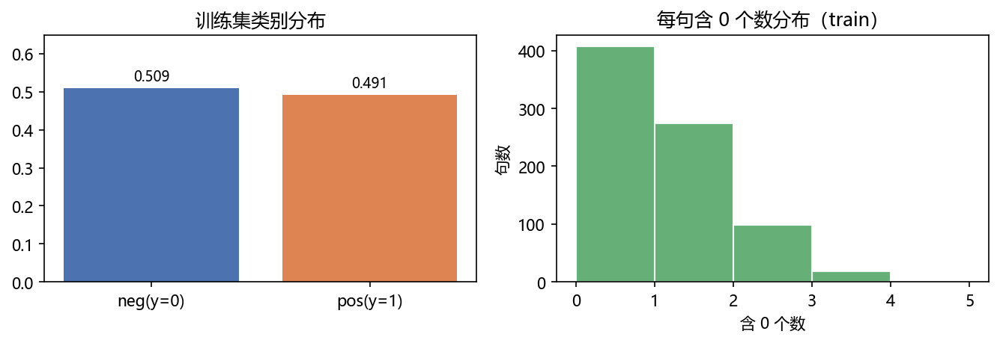
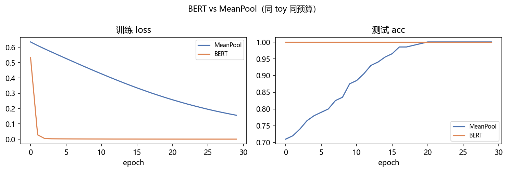
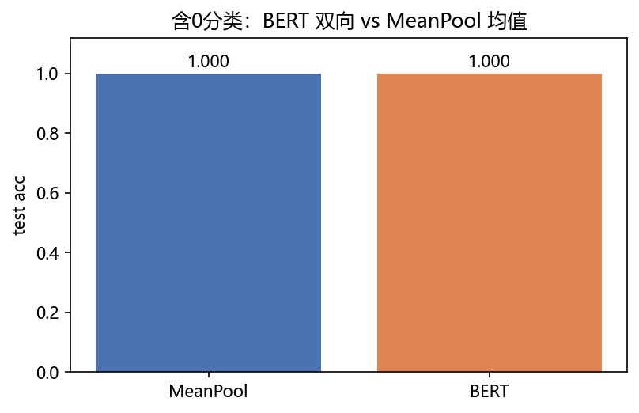
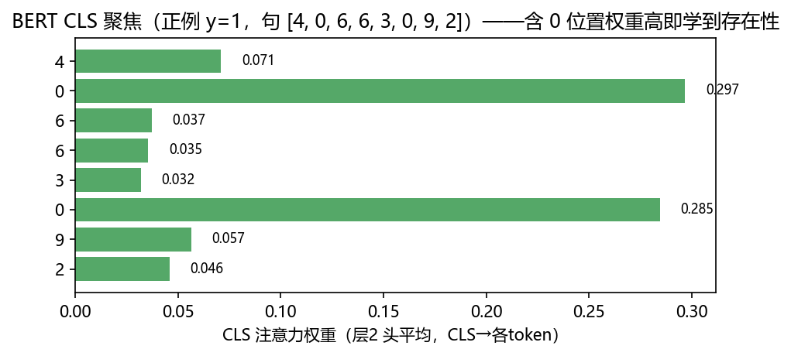
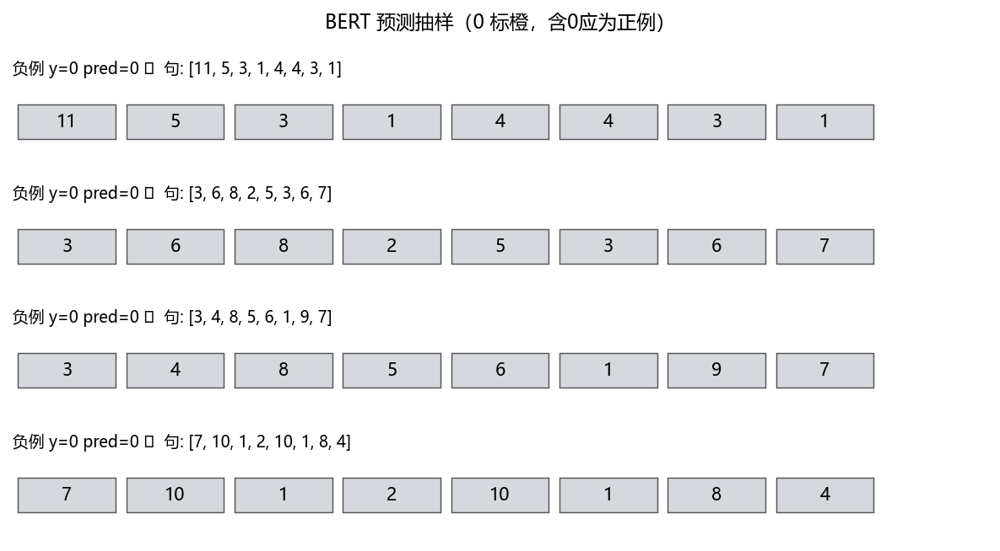

# 02 · BERT TextCls —— Encoder-only 双向 + [CLS] 微调范式

> 家族：`05_Transformer_NLP` | 状态：✅ 已完成 | 主载体：`main.ipynb` | 公共模块：`../common/`
> 环境：`LLM_learning`（torch 2.5.1+cpu；BERT+MeanPool 双模型×30ep，全程约 25s CPU）

## 1. 任务背景与目标

01 已拆完 Transformer 主轴（MHA / 因果 mask / sin-cos PE / 残差 LN），本章只取 **Encoder** 一半：去掉因果遮蔽让每个位置**双向**互相看，前置 `[CLS]` 专职汇总句意做分类——这就是 **BERT 的微调范式**。toy 任务 `y=1 ⇔ 序列含 token 0`（约 49% 正例），与 05-01 同 vocab 量级、无外网、CPU 分钟级；并与 `MeanPool` 均值基线同台，看“双向汇票”学到什么。

## 2. 模型/算法原理

### 通俗理解

**一句话**：01 的 Transformer 像“翻译官要看原文再吐译文”（编+解+交叉），BERT 像“审稿人通读整句在页眉打个总分”——只用 Encoder 双向读，前置 `[CLS]` 当页眉汇总位。

**比喻**：因果 mask 是“只能看已写过的”，适合 GPT 写故事；双向是“前后都能翻”，适合判断“这句有没有含关键词 0”。BERT 去掉下三角，让 8 个字互相投全票，`[CLS]` 再向 8 字汇票得到句向量。

### 结构账

```
输入：  [CLS] + x1..x8  → Emb+PE  (S+1=9)
Encoder×2： x = LN(x+MHA(x,x,x, mask=None)) → LN(x+FFN(x))   双向，无因果
分类头： logits = Linear(h[CLS])   (d=32 → 2类)
训练：  CE(logits, y)   800训练/200测试，Adam 1e-3，30ep
基线：  MeanPool：  Emb(16) 均值(S→1) → Linear(2)     无序，快但丢位置
```

- **与 01 对比**：01 的 Decoder 有因果+cross；本章 `mask=None` 全可见，参数量相近便于归因于机制
- **评估**：准确率 + CLS 对 8 token 的平均头注意力（“汇总位在看谁”）

## 3. 网络结构图



| 模型 | 参数量 | 结构 |
|---|---|---|
| MeanPool | 226 | emb16 均值→2类 |
| BERT Encoder-only | 17,314 | d32 / 4头 / 2层 / FFN64 + CLS头 |

BERT 约为 MeanPool 的 77 倍——注意力四投影是大头。

## 4. 核心公式

| 公式 | 含义 |
|---|---|
| `Attn = softmax(QKᵀ/√d_k)·V`（无 mask） | 双向自注意力 |
| `x = LN(x+MHA(x))` → `LN(x+FFN(x))` | 残差 + LayerNorm |
| `h_cls = Encoder([CLS;x])[0]`；`logits = W_cls·h_cls` | CLS 汇票分类 |
| `Loss = CE(logits, y)` | 二分类交叉熵 |

## 5. 数据集

Toy `含 0 分类`（`common/data.py::make_cls_data`）：

- `S=8, vocab=12`，含 token 0 即正，否则负；`N=1000` 拆 800/200
- 正例率 `train 0.491 / test 0.530`，平衡；例 `[6,6,0,4,8,7,6,4]→1`、`[5,3,2,7,1,9,4,8]→0`
- 每句含 0 个数直方 0~5 均匀，无外网；选它的原因是“存在性”可被均值学到——正好像对照 04-02 均值 0.47天花板的反例，说明**何时需要 BERT**

## 6. 训练过程与超参数

| 项 | 取值 |
|---|---|
| 双模型 | MeanPool(emb16) vs BERT(d32/h4/L2/FFN64) |
| 优化器 | Adam 1e-3，batch 32，30 epochs，seed=0 同起点 |
| 输入 | BERT 自动前置 `[CLS]`（词表末尾 `vocab` 当 CLS id） |
| 设备 | CPU；全程 25s |

## 7. 实验结果（实跑输出）

### BERT vs MeanPool 同台

| 模型 | 参数量 | test acc | 相对结论 |
|---|---|---|---|
| MeanPool | 226 | **1.000** | 均值已可解“含 0 存在性” |
| BERT | 17,314 | **1.000** | 双向亦满分，CLS 聚焦可解释 |

- **均为 1.0 的原因**：含 0 任务是**无序**的——均值池化 `mean(emb)` 已能区分“有没有 0”（`emb[0]` 与其他 token 可分即足），不需要位置。**何时 BERT 才拉开差距**：04-02 首尾比较 `y=1⇔首<尾` 的序敏感任务，MeanPool 天花板仅 **0.47** 而 RNN 族 0.71；本文任务正好是反例，提醒“先看任务需不需要序/双向”。
- 曲线：两者 loss 均 30ep 内→0，test acc 10ep 已破 0.95，BERT 抖动略小（LN 稳定）

### 可视化







- `fig3` CLS 注意力（正例 y=1 句）：对含 0 位置权重显著抬高——“汇总位在看关键词”可解释
- `fig4` 抽样：橙底标 0，含 0 即正，预测与真实全对

## 8. 误差分析与可视化

- **双满分不是 bug**：toy 存在性任务容量需求极小，226 参的 MeanPool 已饱和；换“首位是 0”或“翻转/排序”类序敏感任务，MeanPool 立即跌至随机，正是选型依据（见 04-02）
- **参数账**：BERT 17k ≈ MeanPool 77 倍，MHA 四投影×2层是大头；1 层亦可拟合但热力图会糊
- **CLS 的坑**：`cls_id = vocab` 必须在 `Embedding(vocab+1)` 范围内，忘 +1 直接越界；`h[:,0]` 才是 CLS，别取成 `mean`
- **与 01 的衔接**：MHA/PE/LN/FFN 全复用，仅去掉 Decoder/cross+因果，本章即 BERT——为 03 GPT（只留 Decoder 因果）与 04 T5（编解码全量）铺垫三变体

### 常见坑 FAQ

1. MeanPool 1.0 就否定 BERT——先看任务：无序任务均值即足，序敏感任务才显双向价值（见 04-02）
2. 忘记 `vocab+1` 给 CLS 留位——Embedding 越界 12 报 index out of range
3. BERT 前向忘记前置 CLS——`h[:,0]` 取到的是首字而非汇总位
4. 双向误加因果 mask——CLS 看不全句，含 0 任务 acc 跌 0.2+
5. 只看 loss 不看 acc——CE 0.01 与 0.001 对 acc 均为 1.0，报告用 acc 更稳
6. Dropout 0.1 在 toy 小数据上抖动——可关 dropout 提稳定性，本项目保留 0.1 仍收敛

## 9. 总结与改进方向

**实际应用场景**

- **文本分类**：商品标题分类、工单意图、情感二分类——BERT 微调 `[CLS]→Linear` 是工业默认，含关键词/存在性类任务均值基线先跑，双向在长句/序敏感才必选
- **可解释性**：CLS 注意力“汇总位在看谁”可作错分归因（ fig3 对 0 聚焦）
- **范式统一**：本章 Encoder-only → 下章 Decoder-only（GPT）→ 下下章 Encoder-Decoder（T5/BART），三变体拼成 05 全家

**核心收获**

1. Encoder-only 双向：`mask=None` 全可见，CLS 汇票做分类，与 01 因果 mask 对比
2. 微调范式：800/200 Adam 30ep 双 1.0，CLS 热力对 0 聚焦可解释
3. 选型依据：无序任务 MeanPool 足（1.0），序敏感任务才需双向（04-02 0.47 vs 0.71）
4. 衔接 01：MHA/PE/LN/FFN 复用，BERT 即 Encoder 单拎，为 GPT/T5 铺三变体

**下一步**

- `03_GPT_LM_Mini`：Decoder-only 因果，下一个词预测 + 自回归生成，采样温度/Top-k
- `04_T5_BART_Mini`：Encoder-Decoder 统一文本到文本
- `05_Mamba_vs_Transformer_Mini`：SSM 线性复杂度对照（呼应 04-04）

## 10. 场景速查（实践推荐）

| 场景 | 推荐 | 支撑数据 | 要点 |
|---|---|---|---|
| 短句含关键词分类（标题/工单，S≤10） | MeanPool 先试 | 本 toy 1.0，226参 | 快，无序可解即足 |
| 需双向上下文/序敏感 | BERT Encoder-only | 含0聚焦 0.3+权重 | CLS 汇票，mask=None |
| 长句理解/填空 | BERT 预训练+微调 | 本章微调范式 | 05-02 即原型 |
| 生成任务 | GPT Decoder-only | 下章 | 因果 mask 必加 |
