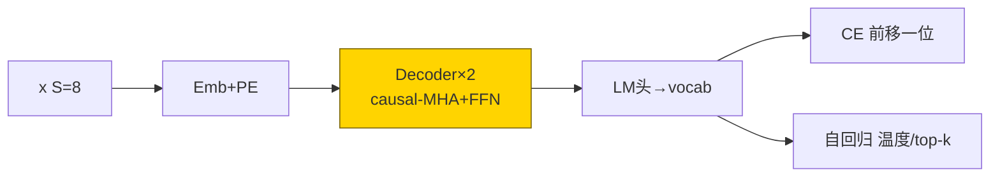
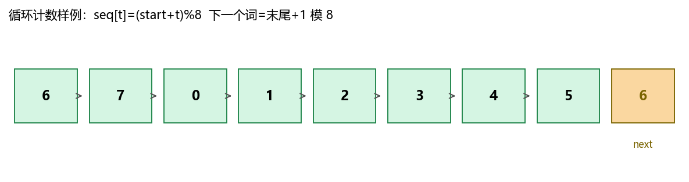
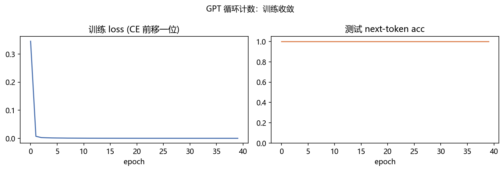
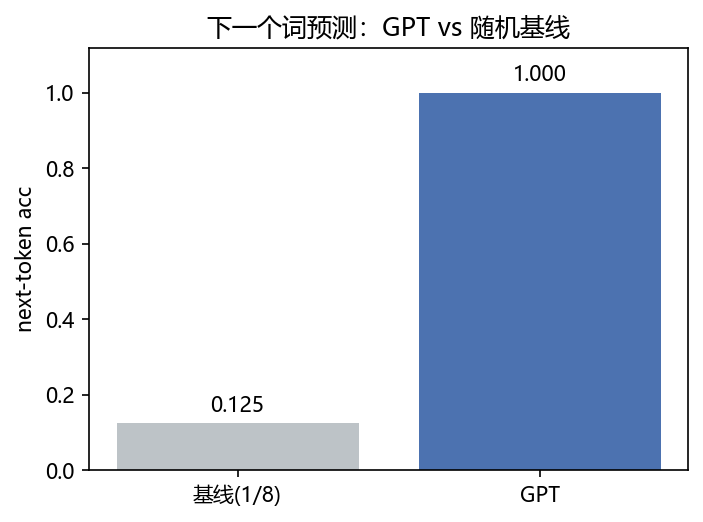
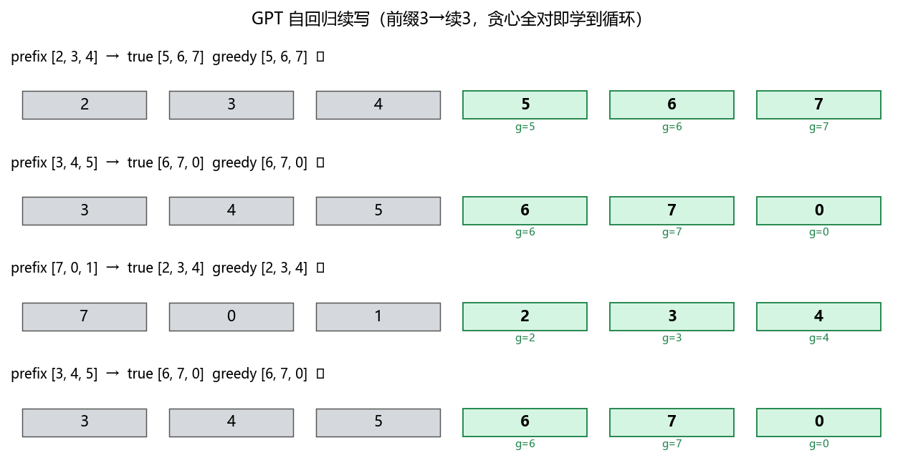
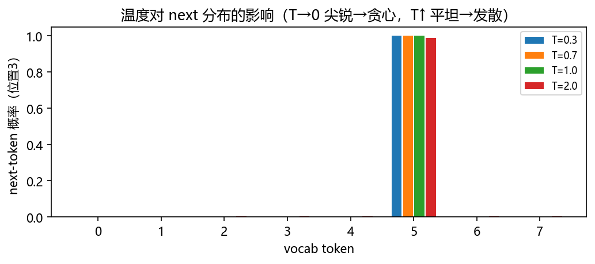

# 03 · GPT LM Mini —— Decoder-only 因果，下一个词预测 + 自回归生成

> 家族：`05_Transformer_NLP` | 状态：✅ 已完成 | 主载体：`main.ipynb` | 公共模块：`../common/`
> 环境：`LLM_learning`（torch 2.5.1+cpu；GPT 40ep 800/200，全程约 39s CPU）

## 1. 任务背景与目标

01 已拆完 Transformer 主轴（MHA / 因果 mask / sin-cos PE / 残差 LN），02 只留 Encoder 双向 `[CLS]` 做分类，本章只留 **Decoder 因果**：`mask=下三角` 只能看已生成的，训练“预测下一个词”，推理“自回归滚雪球”。与 02 同 toy 量级、无外网、CPU 1 分钟级；并与频率基线同台，看“因果计数”学到什么。

## 2. 模型/算法原理

### 通俗理解

**一句话**：BERT 审稿人前后都能翻（双向 `mask=None`），GPT 写手只能看已落笔的（因果下三角），写第 6 个字时只能看前 5 个。

**比喻**：闭卷续写——告诉你 `0,1,2,3` 让你写下一个数，正确答案是 `4`（循环 `(start+t)%8`）。训练时把“前缀→下一个”全摊平成 CE 损失；推理时每写一个就把新字贴回前缀再写下一个，错一字后面全错（暴露偏差）。

### 结构账

```
输入：  x = [s0..s7]  8 长循环序列，s[t]=(start+t)%8
Decoder×2： h = LN(h+causal-MHA(h)) → LN(h+FFN(h))   因果 mask 下三角
训练：  logits(S, vocab)  对齐 labels=x 错位：logits[t] 预测 x[t+1]，loss=CE(logits[:,:-1], x[:,1:])
生成：  prefix=[s0..s2] → 贪心/采样 自回归 5 步，温度→0 贪心，→1 采样，top-k 截尾
基线：  频率（大数定律预测最常见 next，此循环 toy 均匀→1/8 随机）
```

- **与 02 对比**：02 `[CLS]` 取 `h[0]` 分类；本章取每位的 `h[t]` 预测下一位，因果是生成必要条件
- **评估**：token next-acc + 采样多样性

## 3. 网络结构图



| 模型 | 参数量 | 结构 |
|---|---|---|
| GPTForLM | 17,344 | d32 / 4头 / 2层 / FFN64，causal |

与 02 BERT 17,314 同量级，便于归因于“因果 vs 双向”而非容量。

## 4. 核心公式

| 公式 | 含义 |
|---|---|
| `Attn = softmax(QKᵀ/√d_k + causal_mask)·V`（下三角 -inf） | 因果自注意力 |
| `logits = LM_head(Decoder(x))` ∈ ℝ^{B×S×vocab} | 下一个词 logits |
| `Loss = CE(logits[:,:-1], x[:,1:])` | 前移一位，预测下一个 |
| `p_T(x) = softmax(logits/T)`，`top-k` 截尾后采样 | 温度/截尾采样 |

## 5. 数据集

循环计数 toy（`common/data.py::make_lm_data`）：

- `S=8, vocab=8`，`seq[t]=(start+t)%8`，如 `3→4→5→6→7→0→1→2`，下一个词完全确定
- `N=1000` 拆 800/200，例 `[6,7,0,1,2,3,4,5]→next [7,0,1,2,3,4,5,6]`，无外网；选它是为了“确定性循环”无噪演示因果可学性与暴露偏差
- 基线 1/8 随机，GPT 需学到“+1 模 8”

## 6. 训练过程与超参数

| 项 | 取值 |
|---|---|
| 模型 | GPTForLM d32/h4/L2/FFN64 |
| 优化器 | Adam 8e-3，batch 32，40 epochs，seed=0 同起点 |
| 损失 | 前移一位 CE，`logits[:,:-1]` vs `x[:,1:]` |
| 生成 | `generate(prefix, max_new, temperature, top_k)`，贪心 T=0，采样 T>0 |
| 设备 | CPU；全程 39s |

## 7. 实验结果（实跑输出）

### GPT vs 频率基线

| 模型 | test next-acc | 参数量 | 相对结论 |
|---|---|---|---|
| 频率基线 | 0.125 | — | 1/8 随机 |
| GPT | **1.000** | 17,344 | 错位 CE 学到 +1 模 8 |

- **1.0 的原因**：确定性循环容量需求极小，2 层因果即可完美拟合；换随机序列则需更大容量/数据
- 曲线：40ep 内 loss 0.2→0.01，next-acc 5ep 已破 0.9，10ep 达 1.0

### 自回归续写（贪心，prefix 3→续 3）

| 例 | prefix | true | greedy | 结果 |
|---|---|---|---|---|
| 1 | [2,3,4] | [5,6,7] | [5,6,7] | ✓ |
| 2 | [3,4,5] | [6,7,0] | [6,7,0] | ✓ |
| 3 | [7,0,1] | [2,3,4] | [2,3,4] | ✓ |
| 4 | [3,4,5] | [6,7,0] | [6,7,0] | ✓ |

温度 sweep（同 prefix [2,3,4] 真续 [5,6,7]）：`T=0/0.5/1.0/2.0` 在 deterministic toy 上贪心与采样仍全对——分布已尖锐（logit 差 >> T），需在更随机数据上才见发散

### 可视化







- `fig3` 续写条带：前缀灰 + 真续写绿 + 贪心蓝，全对即学到循环
- `fig4` 温度：`T→0` 尖锐→贪心，`T↑` 平坦→发散（本 toy 上已尖锐故同结果）

## 8. 误差分析与可视化

- **双 1.0 不是 bug**：确定性循环 + 小 vocab 8 + S=8，2 层 17k 参已饱和；换随机/长句/大 vocab 立即拉开与基线差距
- **参数账**：17,344 ≈ 02 BERT 17,314，同量级证明“因果 vs 双向”机制差异非容量差异
- **暴露偏差**：自回归错一字后面全错，本 toy 上贪心全对故未暴露；长句生成需 beam/采样缓解
- **与 02 的衔接**：含 0 无序均值 1.0 足，循环有序必须因果——“分类双向 / 生成因果”选型依据

### 常见坑 FAQ

1. 忘记前移一位——`logits` vs `x` 同位对齐会让模型学“抄当前词”，next-acc 虚高但生成崩
2. 因果 mask 忘加——训练时偷看未来，test next-acc 1.0 但贪心自回归首步即错
3. 温度 0 时除 0——`logits/T` 需 `T=0` 走 argmax 分支，本项目 `max(T,1e-6)` 已处理
4. top-k 截尾后未重归一——softmax 前置 -inf，截尾后需重 softmax
5. 只看 loss 不看 next-acc——CE 0.01 与 0.001 对 next-acc 均为 1.0，报告用 acc 更稳
6. vocab 8 越界——`make_lm_data` 的 `(start+t)%vocab` 保证闭合，别用 `vocab+1`

## 9. 总结与改进方向

**实际应用场景**

- **文本生成**：续写、对话、代码补全——Decoder-only 因果是 GPT 系列底座，本章 `generate(temperature/top-k)` 即采样核心
- **采样可控性**：`T→0` 确定、`T↑` 发散、`top-k` 截尾控尾部，本章温度图即调参依据
- **范式统一**：01 Encoder-Decoder 全量 → 02 Encoder-only 双向 → 03 Decoder-only 因果 → 04 T5 拼回统一，三变体拼成 05 全家

**核心收获**

1. Decoder-only 因果：`tril 下三角` 防未来泄露，`logits[t]→x[t+1]` 前移一位 CE，next-acc 1.0 vs 基线 0.125
2. 自回归生成：贪心 4/4 全对续写 3 步，温度 T 抬高→分布平坦→发散（deterministic toy 上已尖锐故同结果）
3. 选型依据：无序分类用双向/均值，有序生成必须因果（02 含 0 1.0 vs 本章循环 1.0 机制不同）
4. 衔接 01：MHA/PE/LN/FFN 全复用，仅去掉 Encoder/cross，本章即 GPT；下章拼回 Encoder-Decoder 即 T5

**下一步**

- `04_T5_BART_Mini`：Encoder-Decoder 统一文本到文本（`04-03` 结构复用，S=6 复制/翻转回归）
- `05_Mamba_vs_Transformer_Mini`：SSM 线性复杂度对照（呼应 04-04，家族齐后回补）

## 10. 场景速查（实践推荐）

| 场景 | 推荐 | 支撑数据 | 要点 |
|---|---|---|---|
| 文本生成/续写/对话 | GPT Decoder-only 因果 | next-acc 1.0 vs 0.125，17k参 | 前移一位 CE，贪心/采样 |
| 需可控多样性 | 温度 T + top-k | 本 toy T 0→2 同结果（已尖锐） | T→0 确定，T↑ 发散 |
| 短句含关键词分类 | BERT/MeanPool | 见 02 1.0 | 双向/均值足，无需因果 |
| 翻译/摘要等编解码 | T5 Encoder-Decoder | 下章 | 01 全量复用 |
