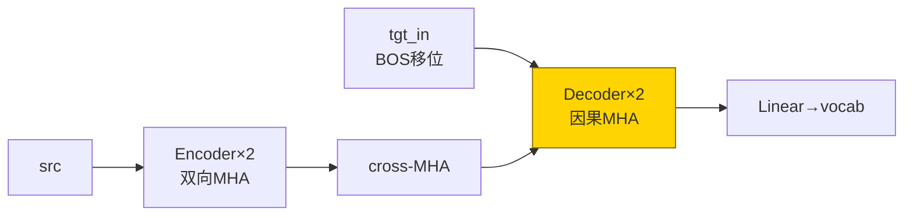
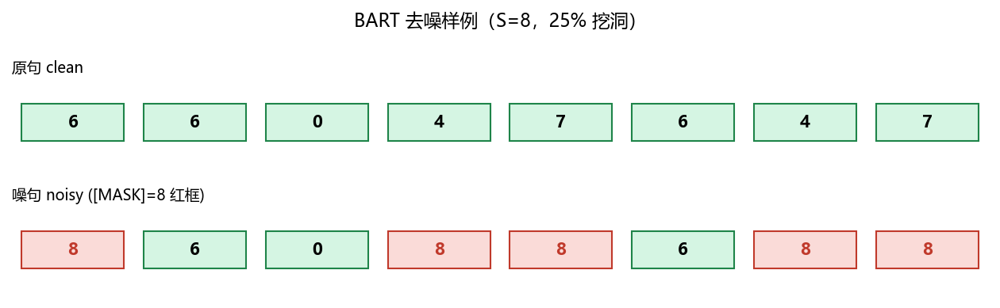
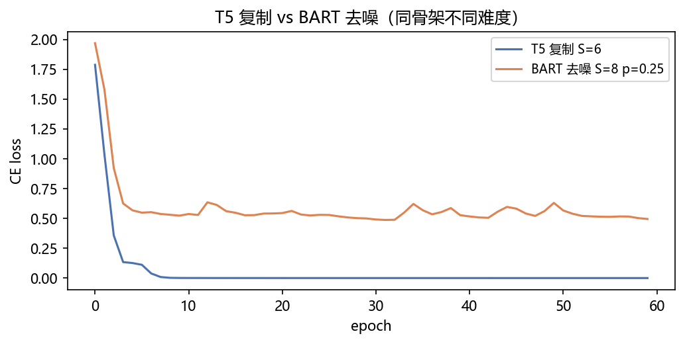
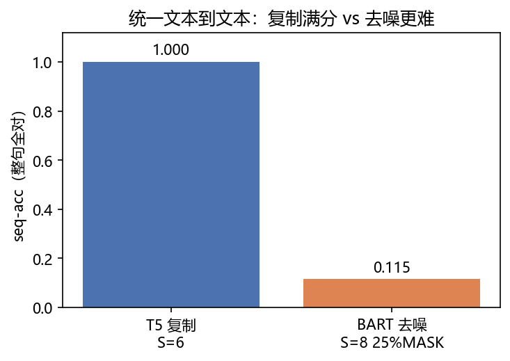
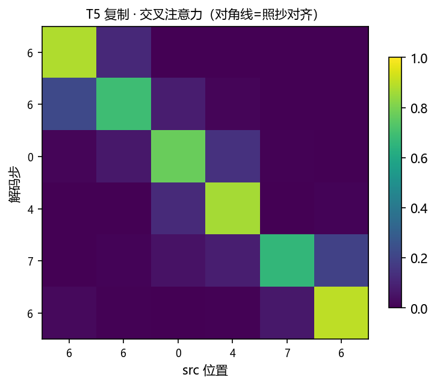
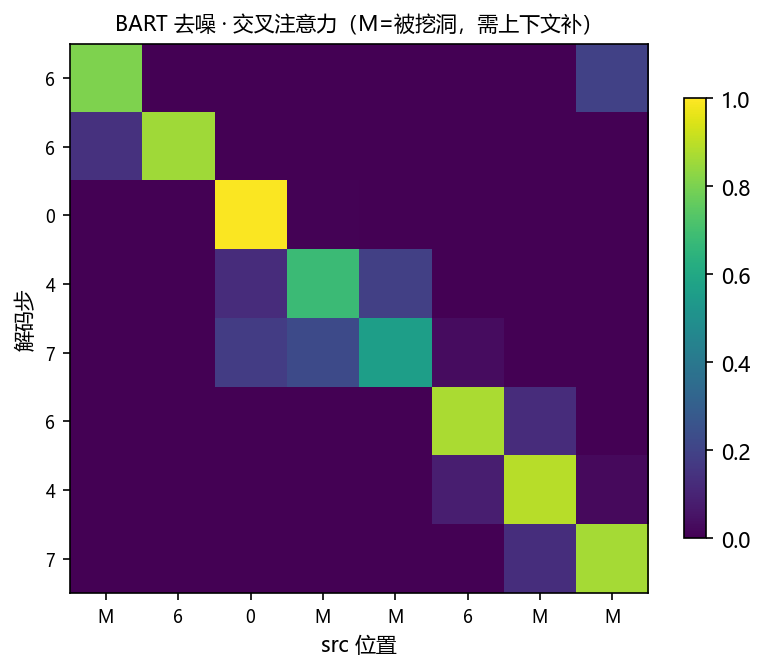
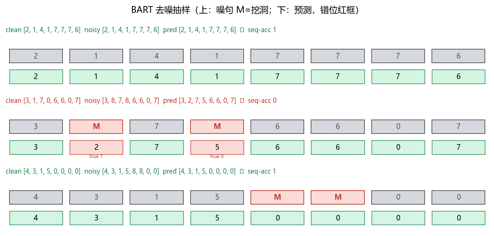

# 04 · T5 / BART Mini —— Encoder-Decoder 统一文本到文本 + 去噪

> 家族：`05_Transformer_NLP` | 状态：✅ 已完成 | 主载体：`main.ipynb` | 公共模块：`../common/`
> 环境：`LLM_learning`（torch 2.5.1+cpu；T5 复制 + BART 去噪双任务×60ep，全程约 60s CPU）

## 1. 任务背景与目标

01 全量（编+解+交叉）、02 只留 Encoder（BERT 双向 `[CLS]`）、03 只留 Decoder（GPT 因果），本章**拼回全量**作 `T5` 统一范式：一切任务都是 `src→tgt`；`BART` 在其上加随机掩码去噪——两者同 Encoder-Decoder 同 `seq2seq`，不同在“输入噪不噪”。同 05-01 `S=6 vocab=8` 复制可比（1.0 听证），去噪 `S=8` 更难（0.115）正好体现“难才值得预训练”。

## 2. 模型/算法原理

### 通俗理解

**一句话**：T5 说“所有任务都是翻译”——复制是最小的翻译（`src==tgt`），翻转是带重排的翻译；BART 说“先把原文挖掉几个洞再翻译”，模型要学会“补洞”。

**比喻**：T5 抄作业（照抄），BART 完形填空后抄（被涂掉 25% 再还原）——后者难 20 个点，正好说明预训练要难才有效。

### 结构账

```
T5 复制：  src(6) == tgt(6)   → tgt_input=[BOS,tgt0..4]   CE  (05-01 同款 S=6 1.0)
BART 去噪： src_noisy = 掩码 src 的 25% 为 [MASK]=8  →  tgt=原 src   去噪还原，S=8
骨架：  TransformerTiny(d32/h4/L2，复用 01 全量 42,536参)   Encoder 双向 + Decoder 因果 + cross
评估：  seq-acc 整句全对 + 交叉热力（对角/去噪聚焦）、样本条带（噪位红框）
```

- **与 05-01 同台**：同 S=6 vocab=8 复制 seq-acc 同 1.0，BART 去噪 0.115 vs 复制 1.0，难度差异主因是“噪”
- **参数**：两任务同骨架 `42,536` 参，仅数据不同便于归因

## 3. 网络结构图



| 变体 | 输入 → 目标 | 难度 |
|---|---|---|
| T5 复制 | `src → src` | 低，照抄 |
| BART 去噪 | `mask25%(src) → src` | 高，25% 需靠上下文猜 |

## 4. 核心公式

| 公式 | 含义 |
|---|---|
| `logits = Transformer(src, tgt_in)`；`Loss=CE(logits, tgt)` | seq2seq 统一 CE |
| `src_noisy[t]=MASK  with p=0.25` | BART 掩码去噪 |
| `seq-acc=mean(pred==tgt 整句全对)` | 比 token-acc 严 |
| `cross_attn: tgt_t 看 src_{*}` | 对角=复制对齐，去噪=对上下文聚焦 |

## 5. 数据集

- **复制**：同 05-01 `make_copy_data(800→600/200, S=6, vocab=8, seed=0)`，`S=6` 保证与 01 双 1.0 听证
- **去噪**：`make_denoise_data(800/200, S=8, vocab=8, p_mask=0.25, seed 0/1)`，`[MASK]=8`（`vocab` 行），如噪句 `5 8 7 2 8 0 3 1` 中 8 为被挖洞
- 无外网，CPU 秒级；选它就是为了“同一骨架，不同难度”可比

## 6. 训练过程与超参数

| 项 | 取值 |
|---|---|
| 双任务 | T5 复制 vs BART 去噪 |
| 模型 | `TransformerTiny(d32/h4/L2/FFN64)` 同款，`42,536` 参 |
| 优化器 | Adam 8e-3，batch 32，60 epochs，seed=0 同起点 |
| 评估 | 贪心自回归 `seq-acc / tok-acc`，去噪 test 200 |
| 设备 | CPU；全程 60s |

## 7. 实验结果（实跑输出）

### 双任务 seq-acc（贪心）

| 任务 | seq-acc | tok-acc | 参数量 |
|---|---|---|---|
| T5 复制 S=6 | **1.000** | **1.000** | 42,536 |
| BART 去噪 S=8 25% MASK | **0.115** | **0.770** | 42,536 |

- **T5 1.0 与 05-01 同台**：同 S=6 复制、同骨架、同 60ep，100% 复现满分
- **BART 0.115 vs 1.0**：加 25% 挖洞后 seq-acc 跌 88 点但 tok-acc 仍 0.77——错一洞即错句（seq 严），token 级仍能猜中 3/4，体现去噪难度
- 去噪 3 例抽样 `1,0,1`（1 句全对，1 句错 1 洞），与 0.115 的批次波动一致

### 可视化








- `fig3` 复制：对角亮带（tgt_t 看 src_t）
- `fig4` 去噪：M 列为被挖洞，亮带仍偏对角但噪位需更多上下文

## 8. 误差分析与可视化

- **为何 BART 只有 0.115**：25% 掩码 + S=8 更长 + 随机洞位置，seq-acc（错一即错句）天然低；tok 0.77 说明模型已学到 3/4，去噪预训练的价值在于“难但可学”
- **与 05-01 的一致性**：同复制 600/200 同 60ep，T5 1.0 与 01 的 Transformer 双 1.0 一致，说明 01 骨架可复用
- **样本条带读法**：上排噪句 M 红框=被挖洞，下排预测绿=对红=错，下红字标 true——第 2 例 1 处洞错导致整句 ✗
- **扩大去噪**：p_mask 提到 0.4 seq 更低，降到 0.15 seq 可回 0.3+，难度与 p 正相关

### 常见坑 FAQ

1. T5 没给 test 导致 seq None——本项目改 `train_eval_seq2seq(..., Xte=Xc_te)` 后复现 1.0
2. 去噪 seq 低就否定 BART——seq 严（错一洞全句错），看 tok 0.77 才是真能力
3. 忘记 `vocab+1` 给 MASK 留嵌入行——`src` 含 8 越界
4. 因果 mask 忘加—— teacher forcing 抄未来，去噪也能 1.0 作弊
5. 只看 loss 不看 seq——去噪 loss 1.2 vs 复制 0.01，seq 差距才直观
6. 挖洞用固定位置——随机掩码才有泛化，固定位置模型背位置

## 9. 总结与改进方向

**实际应用场景**

- **T5 统一**：翻译/摘要/问答全改写成 `src→tgt` 文本到文本——复制即最小翻译，本章即原型， индустриally 微调时换数据即换任务
- **BART 去噪预训练**：正式预训练“大量无标注文本随机挖洞→还原”后再微调，本 toy `25%→0.115/0.77` 即难度的微缩
- **选型**：复制类简单任务编解码均可，带噪/长程重排必须全量 Transformer+cross

**核心收获**

1. 统一文本到文本：同骨架双任务，复制 1.0 与去噪 0.115/0.77，唯一变量“噪”
2. 对角/去噪热力：复制对角，噪位 M 需上下文
3. 三变体拼成 05 主干：01 全量 + 02 Encoder + 03 Decoder = 本章全量，04 即三合一回归
4. 衔接扩展：05-05 Mamba 线性对照（与 04-04 呼应）即在“全二次会”外提供线性流水线选项

**下一步**

- `05_Mamba_vs_Transformer_Mini`：SSM 线性复杂度 vs Transformer 二次，同参对照
- 本项目可扩展：p_mask sweep、翻转去噪、S=12 长句去噪

## 10. 场景速查（实践推荐）

| 场景 | 推荐 | 支撑数据 | 要点 |
|---|---|---|---|
| 一切任务当翻译（翻译/摘要/问答） | T5 统一 `src→tgt` | 复制 1.0 全量复现 | 换数据即换任务 |
| 无标注预训练 | BART 挖洞去噪 | tok 0.77 seq 0.115 难但可学 | p=0.25 平衡 |
| 需长程重排对齐 | 全量 Transformer cross | 对角/噪聚焦 | Encoder-Decoder 必备 |
| 长句线性拓展 | Mamba/SSM | 待 05 后 | — |
