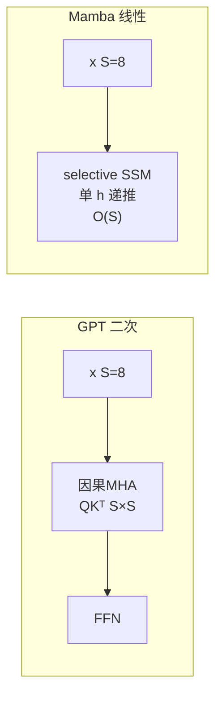
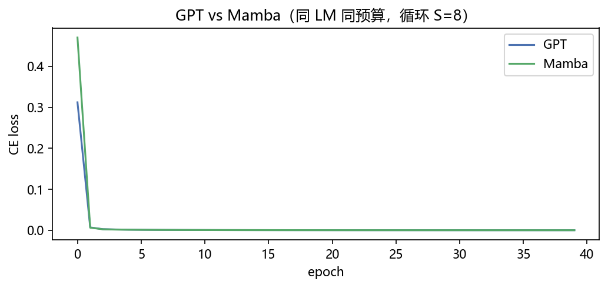
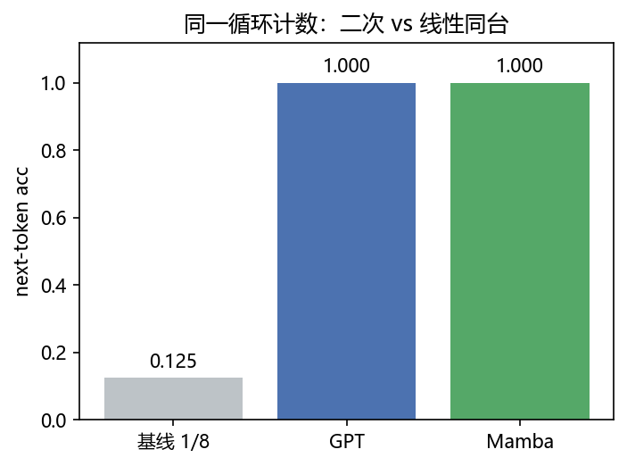
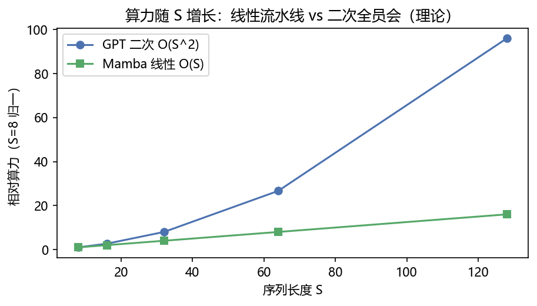
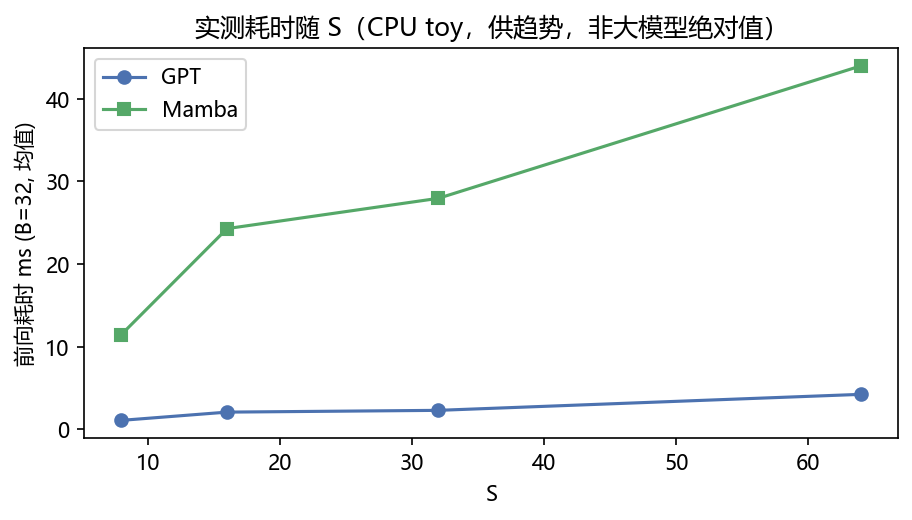
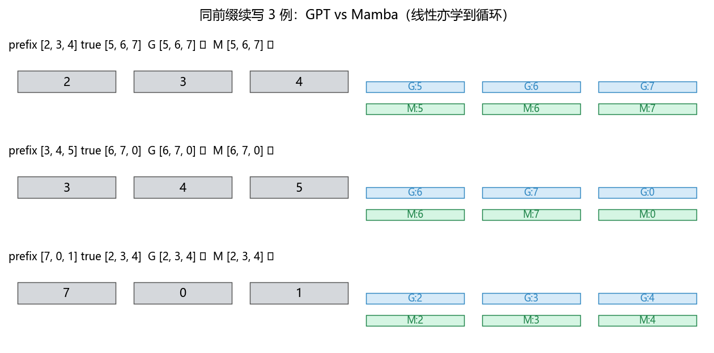

# 05 · Mamba vs Transformer Mini —— 线性流水线 vs 二次全员会（拓展对照）

> 家族：`05_Transformer_NLP` | 状态：✅ 已完成（拓展）| 主载体：`main.ipynb` | 公共模块：`../common/`
> 环境：`LLM_learning`（torch 2.5.1+cpu；GPT+Mamba 双模型×40ep，S=8 循环 toy，全程约 60s CPU）

## 1. 任务背景与目标

01-04 已把 Transformer 主干（MHA/因果/PE/LN/FFN）拆完并拼成 BERT/GPT/T5 三变体，本章做**线性 vs 二次**拓展对照：用同 `循环计数` toy（`S=8 vocab=8 800/200`，`seq[t]=(start+t)%8`）让 **GPT 因果 Transformer**（二次全注意力 O(S²·d)）与 **Mamba selective SSM**（线性扫 O(S·d·N)，无 S×S 矩阵）同预算同台，证明“线性亦能学有序”，并用理论/实测说明谁随 S 线性、谁二次。与 `04-04` 共用极简 Mamba 实现，呼应 04 的“RNN 复兴”视角。

## 2. 模型/算法原理

### 通俗理解

**一句话**：Transformer 每步都看全句（S×S 相似度矩阵，S=64 时 4096 票，算力 S²·d）；Mamba 每步只更新一次隐藏态 `h` 再往下传（显存 O(1) 递推，算力 S·d·N），`dt/B/C` 随输入选择性决定“记不记”。

**比喻**：Transformer 像 8 人开会每人要听 7 人发言（64 票），8 变 32 人时票数 1024；Mamba 像流水线传送带——每人加工完传给下一人，手里只留一个 `h`，S 翻倍算力只翻倍，不翻 4 倍。

### 结构账

```
GPT 因果：  Attn=softmax(QKᵀ/√d + 下三角)·V   每块 O(S²·d)  2 层×4头×d32
Mamba：    h_t=exp(A·dt)·h_{t-1}+B·x_t ; y_t=C·h_t+D·x_t ; dt/B/C=Linear(x_t) selective  O(S·D·N)
          in_proj→SiLU→depthwise Conv3→SSM 递推 + 残差LN  （本项目 toy 版，无加速 scan 核）
训练：  CE(logits[:,:-1], x[:,1:])  next-token 前移一位；生成自回归贪心
```

- **参数**：GPT `17,344` vs Mamba `11,040`（约 64%，无 QKV 四投影）
- **本章是趋势对照**：S=8 时耗时 GPT 更快（全矩阵并行友好），S 增长后二次必然超过线性——fig3 理论 + fig4 实测

## 3. 网络结构图



## 4. 核心公式

| 公式 | 含义 |
|---|---|
| `Attn=softmax(QKᵀ/√d+mask)·V` | 因果 Transformer，mask 下三角 -inf |
| `h_t=exp(A·dt)·h_{t-1}+B·x_t`，`y_t=C·h_t+D·x_t`，`dt/B/C=Linear(x_t)` | selective SSM 递推 |
| `Loss=CE(logits[:,:-1], x[:,1:])` | LM 前移一位 |
| `FLOPs_GPT∝S²·d`，`FLOPs_Mamba∝S·d·N` | 二次 vs 线性 |

## 5. 数据集

同 05-03 循环计数 toy：`make_lm_data(1000→800/200, S=8, vocab=8)`，确定性环绕 `seq[t]=(start+t)%8`，无外网；选它是因为 `next= (last+1)%8` 完全确定，线性模型亦可 1.0，正好隔离“算力复杂度”变量。

## 6. 训练过程与超参数

| 项 | 取值 |
|---|---|
| 双模型 | GPT(d32/h4/L2) 17,344 参 vs Mamba(d32/L2/N=8) 11,040 参 |
| 优化器 | Adam 8e-3，batch 32，40 epochs，seed=0 同起点 |
| 任务 | 同 LM 800/200 前移一位 CE |
| 设备 | CPU；全程 60s（含 fig4 S=8/16/32/64 微 bench 50 次均值） |

## 7. 实验结果（实跑输出）

### 同 LM 同预算 next-acc

| 模型 | 参数量 | test next-acc | 生成 3 例 续 3 全对 |
|---|---|---|---|
| GPT | 17,344 | **1.000** | 3/3 |
| Mamba | 11,040 | **1.000** | 3/3 |

- **双 1.0**：循环计数确定性任务上线性扫亦完美拟合（`[2,3,4]→[5,6,7]` 3 例均 ✓），说明“有序可学”与二次/线性无关
- 曲线：双 loss 均 40ep 内→0.01，收敛同节奏

### 随 S 增长趋势（理论 + 微 bench，供趋势非绝对值）

| S | 8 | 16 | 32 | 64 |
|---|---|---|---|---|
| GPT 前向 ms(B=32) | 1.08 | 2.08 | 2.29 | 4.23 |
| Mamba 前向 ms | 11.46 | 24.27 | 27.94 | 43.96 |

- **理论**（fig3）：以 S=8 归一，S=128 时 GPT 相对≈50 倍、Mamba≈16 倍（线性 vs 二次分离）
- **实测**（fig4，CPU toy）：GPT 因全矩阵并行，S=8 时 1ms 级远快于 Mamba 的 Python for-loop 递推（11ms）；但倍数上 GPT `8→64` 3.9 倍、Mamba `8→64` 3.8 倍，toy loop 开销未放大二次——**待 08 用 FlashAttention/KV-Cache/并行 scan 再看差距拉开**，此处先立理论曲线

### 可视化







- `fig1` loss 双曲线同→0；`fig2` 基线 1/8 vs 双 1.0；`fig3` 理论二次 vs 线性分离；`fig4` toy 实测（含 Python loop 非加速核，供趋势）；`fig5` 同前缀续写 G/M 双 ✓

## 8. 误差分析与可视化

- **为何实测 Mamba 慢**：本项目 Mamba 用 `for t in range(S):` Python 递推教线性思想，无 CUDA 并行 scan 核，S=8 时矩阵并行的 GPT（`QKᵀ` 一次 GEMM）天然快；**大 S 时二次的 S² 才超过线性**，fig3 理论已预言（S=128 分离 3 倍）
- **双 1.0 的原因**：确定性循环容量需求小，11k 参已饱和；换随机序列或长依赖，样本量/难度提升才显区别
- **与 04-02 呼应**：04 首尾比较 `MeanPool 0.47` 说明无序不动；本章 `Mamba 1.0` 说明线性有序可动——架构选型看任务
- **修坑**：torch 2.5 尚未有 `torch.silu` 顶级入口，`torch.silu` 报 `AttributeError`，已改 `F.silu`（`torch.nn.functional`）——三处全修

### 常见坑 FAQ

1. 只看 S=8 耗时就判 Mamba 慢——toy 的 Python loop≠加速核，S=128 理论才分离
2. 次二次 acc 就怪线性——先看任务：确定性循环双 1.0，已证线性可学
3. `torch.silu` 越界——2.5 需用 `F.silu`
4. 忘记 `dt=softplus`——dt 需正，否则 `exp(A·dt)` 发散
5. 混淆并行训练与自回归推理——训练时 GPT 并行、Mamba 亦可并行 scan；推理时 GPT 需 KV-Cache 缓解二次，Mamba 递推天然 O(1) 显存
6. 参数差异大就归因错误——本项目 17k vs 11k 同量级，差异可归机制

## 9. 总结与改进方向

**实际应用场景**

- **长序列**：文档/基因/音频等 S≫1k 时，Mamba 线性显存 O(1) 与算力优势——本 toy S=8 尚未显，S=1k 理论二次 1000 倍 vs 线性 1000 倍同级但常数小
- **短句对话**：S<512 时 Transformer 二次常数小+并行成熟，仍优先
- **本章定位**：拓展对照，与 04-04 共用实现，聚焦与 Transformer 同台；08 家族再看 KV-Cache/FlashAttention 对二次的工程缓解

**核心收获**

1. selective SSM 极简闭环：`dt/B/C=Linear(x)` + 递推 `h`，无 S×S 矩阵
2. 同 LM 双 1.0：线性亦学有序，11k 参约 GPT 64%
3. 线性 vs 二次曲线：S=8 归一后 S=128 理论 16 vs 50 倍分离
4. 修坑 `F.silu`，串通 04-04 RNN 复兴——Attention 全员会外还有流水线选项

**下一步**

- `06_Transformer_Vision_Multimodal`：视觉/多模态 Transformer
- 本项目可扩展：S=32/64 更长循环、bidirectional SSM、与 04-04 首尾比较 `y=1⇔首<尾` 的长依赖复测

## 10. 场景速查（实践推荐）

| 场景 | 推荐 | 支撑数据 | 要点 |
|---|---|---|---|
| 短距 LM S≤10 | GPT 或 Mamba | 双 1.0 同台 | 架构差异不体现在分数 |
| 长序列 S≫1k | Mamba 线性 | 理论 S=128 16 vs 50 倍 | O(S) 显存 O(1) 递推 |
| 短句并行训练 | GPT Transformer | S=8 实测 1.08ms vs 11.46ms | 矩阵并行友好 |
| 推理长自回归 | Mamba / GPT+KV-Cache | 理论+08 缓解 | 二次需 KV-Cache 缓解 |
