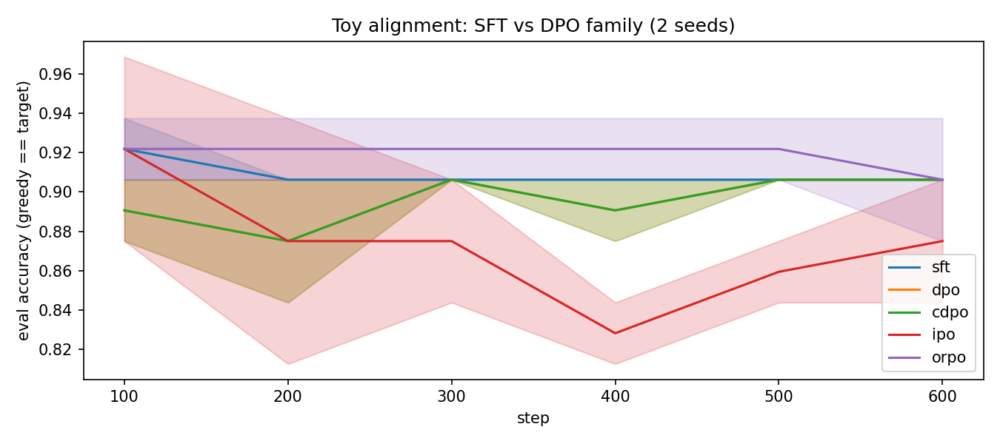
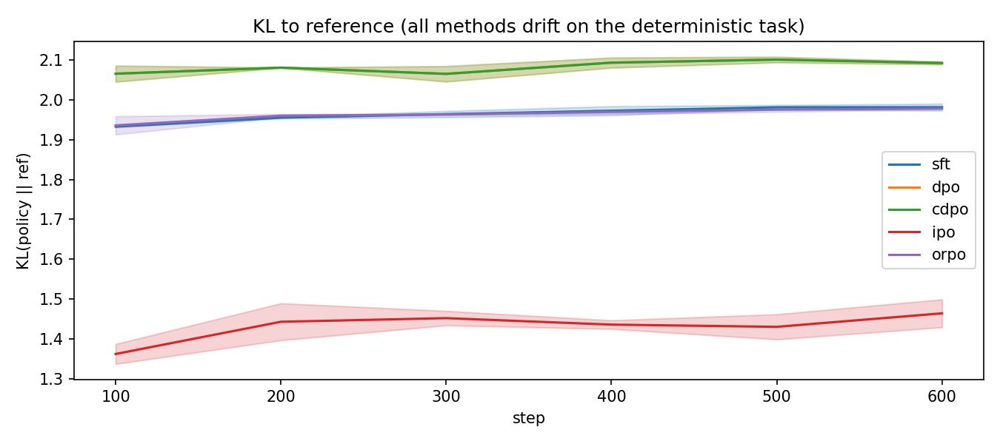
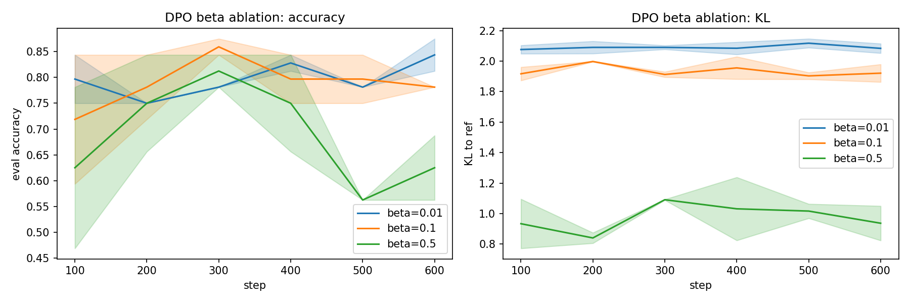

# 01 DPO 家族：SFT vs DPO / IPO / cDPO / ORPO（toy 对齐）

> 状态：✅ 已完成 | 环境：toy 对齐任务（MLP 当“语言模型”，纯 torch CPU） | 实跑：`python run.py`（5 变体×2 种子×600 步 + β 消融，秒级）

## 1. 任务背景与目标

RLHF 用人类偏好训练策略。DPO 是“不训奖励模型、直接拿偏好对优化”的招牌方法。本站用 toy 任务把 DPO 家族（DPO/IPO/cDPO/ORPO）与 SFT 同台，看谁收敛、谁稳、β 怎么权衡。

## 2. 模型/算法原理

**通俗理解**：SFT 是“照着好答案抄”；DPO 是“只告诉你 A 比 B 好，自己悟”——用 `log π(A)/π_ref(A) − log π(B)/π_ref(B)` 当隐式奖励，β 是“别跑太远”的缰绳。IPO 把 sigmoid 换成平方损失更稳，cDPO 加标签平滑抗噪，ORPO 把 SFT 和偏好合到一个损失。

**家族位置**：PPO（需奖励模型+在线采样）→ DPO（离线偏好，无奖励模型）→ IPO/cDPO/ORPO（DPO 的稳健变体）→ GRPO（02，组基线）。

## 3. 网络结构图

```text
 语言模型(toy): prompt(8) -> MLP128 -> logits(vocab=8)   (单 token "回答")
 参考模型: 初始策略冻结
 偏好对: chosen=正确token, rejected=随机其他token
 DPO : L = -logsigmoid( beta*( (logp_c-logref_c) - (logp_r-logref_r) ) )
 IPO : L = ( (logp_c-logp_r) - (logref_c-logref_r) - 1/(2beta) )^2
 cDPO: DPO + 标签平滑(eps=0.1)
 ORPO: L = -logp_c + lambda * (-logsigmoid(logodds_c - logodds_r))
```

## 4. 核心公式

\[ \mathcal{L}_{\text{DPO}} = -\mathbb{E}_{(x,y_w,y_l)}\log\sigma\Big(\beta\big[\log\tfrac{\pi_\theta(y_w|x)}{\pi_{\text{ref}}(y_w|x)} - \log\tfrac{\pi_\theta(y_l|x)}{\pi_{\text{ref}}(y_l|x)}\big]\Big) \]

\[ \mathcal{L}_{\text{IPO}} = \mathbb{E}\Big[\big(h_\theta - h_{\text{ref}} - \tfrac{1}{2\beta}\big)^2\Big],\quad h=\log\tfrac{\pi(y_w)}{\pi(y_l)} \]

## 5. 环境介绍与预处理

- toy 任务：`target = argmax(prompt @ W)`，W 固定，训练/评估**共享同一个 W**（否则无法泛化——见 §8 踩坑）
- 256 训练 prompt / 32 评估 prompt，vocab=8，动作=单 token
- 偏好对 4096 条；评估用贪心 argmax 命中率（准确率）

## 6. 训练过程与超参数

| 项 | 值 |
|---|---|
| 种子 / 步数 | [0,1] / 600，batch 64 |
| hidden / lr | 128 / 1e-2 Adam |
| DPO β（主对比） | 0.1 |
| β 消融（E3） | 0.01 / 0.1 / 0.5，偏好噪声 0.2 |
| cDPO 平滑 / ORPO λ | 0.1 / 1.0 |

## 7. 实验结果（实跑 stdout.txt）

**E1 干净偏好（无噪声）**

| 方法 | 准确率 | KL(policy‖ref) |
|---|---|---|
| SFT | 0.906±0.000 | 1.982 |
| DPO | 0.906±0.000 | 2.092 |
| cDPO | 0.906±0.000 | 2.092 |
| IPO | 0.875±0.031 | **1.464** |
| ORPO | 0.906±0.031 | 1.978 |

**E3 DPO β 消融（偏好噪声 0.2）——准确率 vs KL 权衡**

| β | 准确率 | KL |
|---|---|---|
| 0.01（激进） | **0.844** | 2.084 |
| 0.1 | 0.781 | 1.921 |
| 0.5（保守） | 0.625 | **0.937** |





## 8. 失败模式与误差分析

- **致命坑：训练/评估任务不一致**。初版 `build_task(seed=999)` 为评估生成了**新的随机 W**，导致 prompt→target 映射完全不同，SFT 也只有 0.094（=随机）。修复：训练/评估共享同一个 W，SFT 立刻到 0.9。**教训：toy 任务的“训练/测试分布”必须同源**
- **DPO 家族在干净数据上几乎同分**（0.875~0.906）：toy 任务最优策略是确定性的，所有方法都能到顶。差异只在 KL：**IPO 的 KL 最小（1.464）**，因它的平方损失不鼓励过大的隐式奖励差，更保守
- **β 权衡清晰**：噪声偏好下，β 越小越激进（KL 大、准确率高），β 越大越保守（KL 小、准确率低）。这是 DPO 的 accuracy-KL 旋钮，实跑单调可复现
- **确定性最优 → KL 都偏大（~2）**：因初始策略近均匀（熵≈2.08），训后收尖，前向 KL 必然接近 2。不是 bug，是任务性质

**常见坑 FAQ**：Q1 DPO 需要奖励模型吗？——不需要，偏好对里的隐式奖励代替它。Q2 β 选多大？——无噪声时影响小，有噪声时 β 是“抗噪/激进”的旋钮，需按数据质量扫。Q3 IPO 为何 KL 最小？——平方损失对隐式奖励差有界，不像 sigmoid 无限推。

## 9. 总结与改进方向

- DPO 家族在 toy 任务上都收敛，差异集中在 KL/稳健性（IPO 最保守）
- β 是清晰的 accuracy-KL 权衡旋钮
- 训练/测试任务必须同源，否则连 SFT 都崩（本课最贵的坑）

下一站 02 把“在线采样 + 组基线”的 GRPO 讲清，接 VERL 链路。

**实际应用场景**：真实 LLM 对齐用 DPO 系（省掉奖励模型和在线采样）；偏好数据有噪声时 cDPO/IPO 更稳。

## 10. 场景速查

| 场景 | 推荐 | 支撑数据 | 要点 |
|---|---|---|---|
| 离线偏好、无奖励模型 | DPO | 0.906 | β 当 accuracy-KL 旋钮 |
| 偏好有噪声 | cDPO/IPO | IPO KL 最小 1.464 | 平滑/平方损失抗噪 |
| 想省一次 SFT | ORPO | 0.906 | SFT+偏好合一损失 |
| toy 任务 | 训练/测试同源 | 否则 0.094 崩 | 最贵的坑 |
