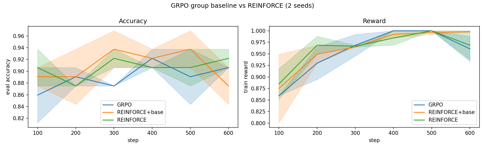
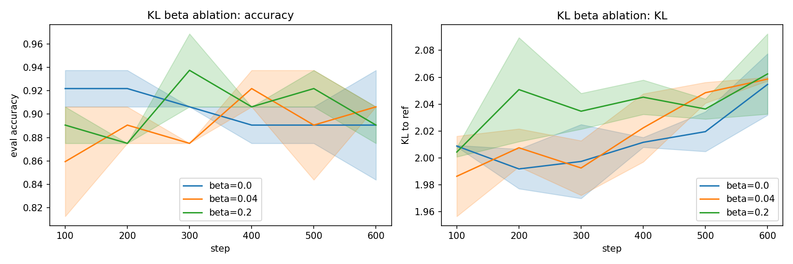
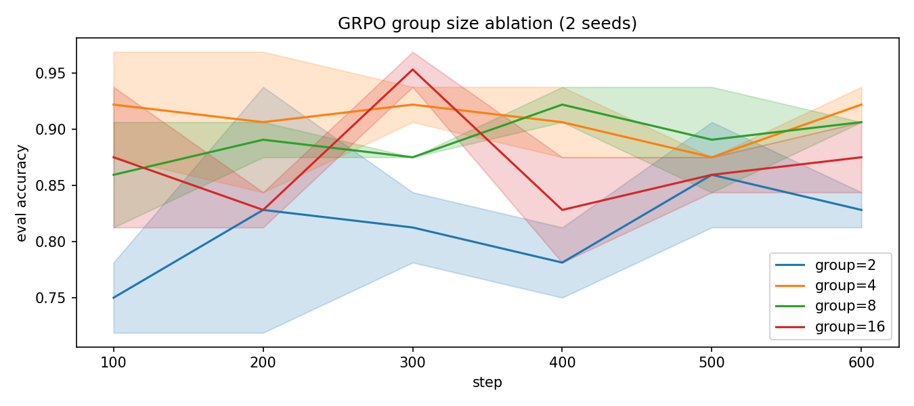

# 02 GRPO 与 VERL：组基线 vs REINFORCE（toy 对齐）

> 状态：✅ 已完成 | 环境：toy 对齐任务（同 01），纯 torch CPU | 实跑：`python run.py`（GRPO/REINFORCE×2 种子 + KL/组大小消融，秒级）

## 1. 任务背景与目标

PPO 在 LLM 上要额外训一个 critic（价值网络），贵且不稳。GRPO 砍掉 critic，改用“同一 prompt 采一组回答，组内均值当基线”。本站用 toy 任务对比 GRPO vs REINFORCE，并做 KL 惩罚与组大小消融，走通 VERL 式链路。

## 2. 模型/算法原理

**通俗理解**：REINFORCE 是“考完看总分，好就鼓励”——方差大；GRPO 是“同一道题做一组，比自己组平均好就鼓励”——组内标准化把基线免费算出来，省掉 critic。KL 项是“别离参考模型太远”。

**家族位置**：PPO（有 critic）→ GRPO（组基线，无 critic）→ DAPO/GSPO（GRPO 的工程变体，只讲思想）。

## 3. 网络结构图

```text
 语言模型(toy): prompt(8) -> MLP128 -> logits(8)       (actor, 无 critic!)
 rollout: 每 prompt 采 G 个 token
 reward : r = 1(token==target)
 优势   : A = (r - mean_group(r)) / (std_group(r)+eps)      (GRPO 组基线)
 loss   : L = -(A * logp).mean() + beta * (logp - logref).mean()   (KL 惩罚)
 对照 REINFORCE: 无组基线(A=r) 或 用 batch 均值当基线
```

## 4. 核心公式

\[ \hat A_i = \frac{r_i - \text{mean}(\{r_j\}_{j=1}^G)}{\text{std}(\{r_j\}_{j=1}^G)},\quad \mathcal{L} = -\mathbb{E}\big[\hat A_i \log\pi_\theta\big] + \beta\, \mathrm{KL}(\pi_\theta\|\pi_{\text{ref}}) \]

## 5. 环境介绍与预处理

- 同 01：`target=argmax(prompt@W)`，训练/评估共享 W，256/32 prompts，vocab=8
- 评估：贪心 argmax 命中率；训练奖励：采样组平均命中率

## 6. 训练过程与超参数

| 项 | 值 |
|---|---|
| 种子 / 步数 | [0,1] / 600，batch 32 prompt |
| hidden / lr | 128 / 1e-2 Adam |
| 组大小 G（默认/消融） | 8 / {2,4,8,16} |
| KL β（默认/消融） | 0.04 / {0.0,0.04,0.2} |

## 7. 实验结果（实跑 stdout.txt）

**E1 GRPO vs REINFORCE**

| 方法 | 准确率 | 训练奖励 |
|---|---|---|
| GRPO（组基线） | 0.906±0.000 | 0.961 |
| REINFORCE+baseline | 0.875±0.031 | 0.998 |
| REINFORCE（无基线） | 0.922±0.016 | 0.969 |

**E2 KL β 消融**：`β=0.0→0.891`、`β=0.04→0.906`、`β=0.2→0.891`，KL 终值均 ≈2.06（toy 任务上约束不咬合，见 §8）。

**E3 组大小消融**

| G | 准确率 |
|---|---|
| 2 | 0.828±0.016 |
| 4 | **0.922±0.016** |
| 8 | 0.906±0.000 |
| 16 | 0.875±0.031 |





## 8. 失败模式与误差分析

- **三种方法几乎同分（0.875~0.922）**：toy 任务简单且最优确定性，组基线/普通基线差异被淹没。这是真实结论——**在“奖励信号强、任务简单”时，GRPO 的组基线优势不明显**
- **组大小 G=2 最差（0.828）**：组内只有 2 个样本，均值和标准差估计噪声大，优势信号抖；G=4~8 最好。**组基线需要足够大的 G 才有意义**，这与 GRPO 论文“组越大基线越准”一致
- **KL β 消融平坦**：因参考模型与最优策略并不冲突（都是往同一个确定性答案收），KL 项加不加都到顶。KL 惩罚只在“奖励会诱导偏离参考”时才咬合
- **无 critic 的代价**：GRPO 用组内统计替代价值网络，省了一个网络但要求“同 prompt 多次采样”，rollout 成本换 critic 成本

**常见坑 FAQ**：Q1 GRPO 为什么不要 critic？——组内均值就是基线，省网络省显存。Q2 G 取多大？——太小（2）基线噪声大，太大采样贵；4~16 常见。Q3 KL 项什么时候有用？——奖励模型会诱导策略跑偏时（防 reward hacking），toy 任务里奖励与参考一致，所以看不出。

## 9. 总结与改进方向

- GRPO 用组基线省掉 critic，链路（rollout→reward→组内优势→带 KL 的策略梯度）走通
- 组大小是超参：G=2 明显吃亏
- 简单任务上 GRPO/REINFORCE 同分，差异要在“奖励与参考冲突”的场景才显现

**VERL 链路（toy 对应）**：`actor=policy` → `rollout=每 prompt 采 G 个回答` → `reward_fn=任务奖励` → `adv=(r−mean_G)/std_G` → `loss=−adv·logp + β·KL(ref)`，全程无 critic 网络，与 VERL 的 GRPO trainer 一一对应。

**实际应用场景**：LLM 数学/代码推理（可验证奖励、同题多解）GRPO 是主流；省掉 critic 让训练更省更稳。

## 10. 场景速查

| 场景 | 推荐 | 支撑数据 | 要点 |
|---|---|---|---|
| LLM 可验证奖励 | GRPO | 0.906，无 critic | 组内标准化当基线 |
| 组太小 | 增大 G | G=2 仅 0.828 | G≥4 才有意义 |
| 奖励诱导跑偏 | 加 KL β | toy 平坦 | 冲突场景才咬合 |
| 对照基线 | REINFORCE | 0.875~0.922 | 简单任务同分 |
