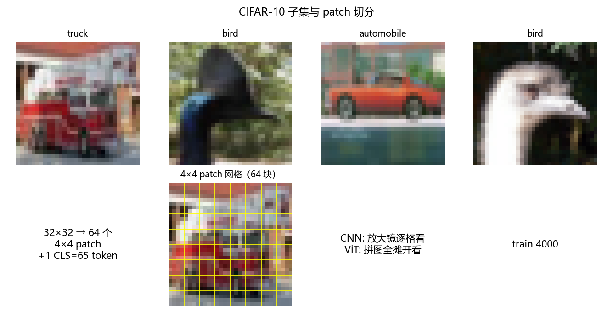
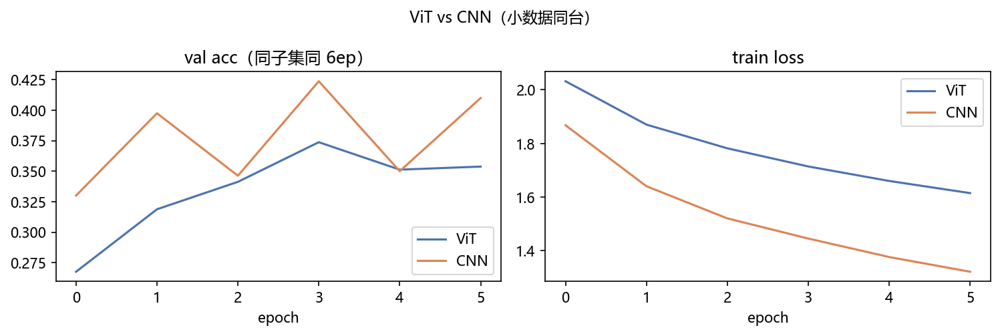
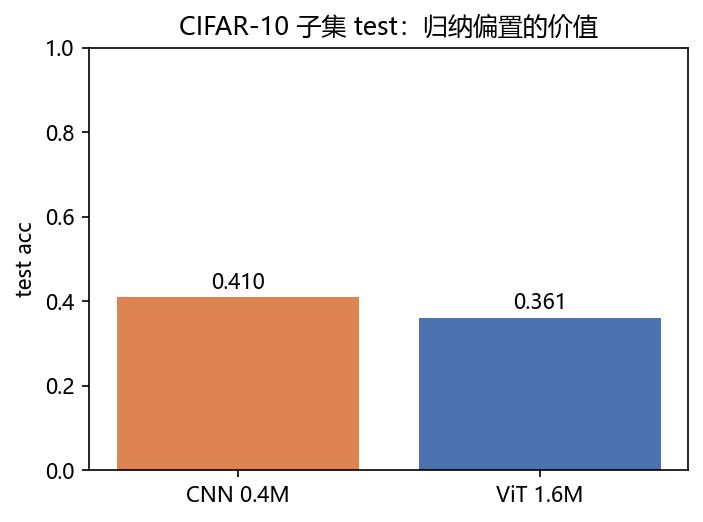
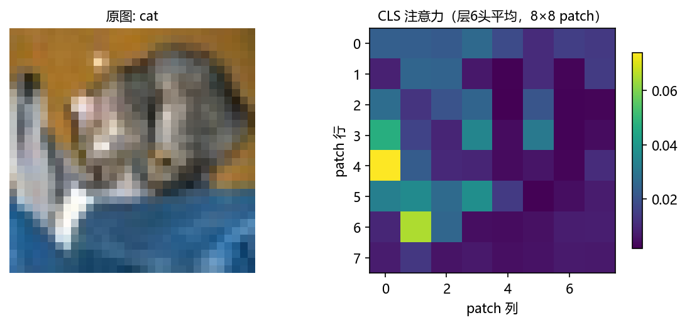
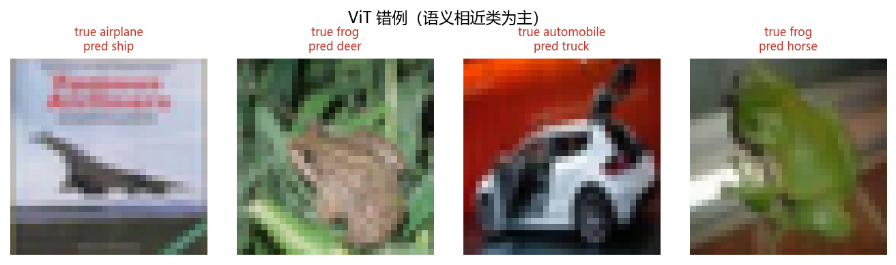

# 01 · ViT CIFAR-10 —— 把图切成“字”，与 CNN 同台看归纳偏置

> 家族：`06_Transformer_Vision_Multimodal` | 状态：✅ 已完成 | 主载体：`main.ipynb` | 公共模块：`../common/`
> 环境：`LLM_learning`（torch 2.5.1+cpu；ViT+CNN 各 6ep（train 4000），全程约 285s CPU，无外网——复用 02_CNN_Family 本地缓存）

## 1. 任务背景与目标

05 让机器“读书”（字→字），本章让机器“看图”：`32×32` 图切成 `4×4` patch 共 **64 块当“字”**，前置 `[CLS]` 通读打分——这就是 ViT。与 `SmallCNN`（3 层卷积+BN+GAP）同 CIFAR-10 子集（train 4000/val 800/test 10000 全量）、同 6ep 同台，回答一个核心问题：**Transformer 拿掉卷积的“归纳偏置”后，小数据上要付出多少代价**。

## 2. 模型/算法原理

### 通俗理解

**一句话**：05 的 Transformer 读“字”，ViT 把图切成 64 块小拼图，每块当一个“字”，前面再加 1 个 `[CLS]` 当班长——65 个 token 通读 4 层，最后班长打分分类。

**比喻**：CNN 像用**放大镜逐格看**（卷积核天生只看局部、图挪一挪照样认得——“猫在哪都是猫”）；ViT 像把拼图**全摊开同时看**——没有放大镜，必须靠数据自己学“相邻块有关”，所以**小数据吃亏、大数据反超**。

### 结构账

```
输入：  x (B,3,32,32) → patchify Conv2d(3→128, k=4,s=4) → (B,64,128) patch tokens
加长：  [CLS](1,128) 拼前面 → 65 长 → + 可学习 pos_embed(65,128)
Encoder×4： x = x + MHA(LN(x)) → x = x + MLP(LN(x))   双向（分类无因果，Pre-LN）
分类头： logits = Linear(LN(h[CLS]))   (128 → 10)
对照：  SmallCNN 3层3×3+BN+GAP 374k  vs  ViT-Tiny dim128/depth4/heads4 809k
训练：  CE，AdamW 3e-4 wd 0.05，batch 128，6ep，seed=0
```

- **与 05-02 BERT 的对应**：同 Encoder-only 双向+CLS，差别只是 token 从“字嵌入”换成“patch 投影”（`Conv2d` 一步切+投影，等价于 64 个 4×4 小块各拍扁投影一次）
- **为什么可学习位置编码**（含 CLS 共 65 长）：patch 摊平后“左上/右下”这种顺序全丢了，必须显式注入“我是第几块”；BERT 用 sin-cos，ViT 论文实验过可学习 pos 效果持平且更通用
- **评估**：val/test acc + patch 网格图 + CLS 注意力热力 + 错例

## 3. 网络结构图


| 模型 | 参数量 | 结构 |
|---|---|---|
| SmallCNN | 374,282 | 3×(3×3 conv+BN) + 2 maxpool + GAP + Linear |
| ViT-Tiny | 809,354 | patch4 / dim128 / 4层 / 4头 / MLP 512 |

## 4. 核心公式

| 公式 | 含义 |
|---|---|
| `patchify: Conv2d(3→d, k=4, s=4)` | 切块+投影一步到位，输出 `(B,64,d)` |
| `z = [CLS] ⊕ patches + E_pos(65,d)` | token 序列 + 可学习位置嵌入 |
| `x = x + MHA(LN(x)); x = x + MLP(LN(x))` | Pre-LN Encoder 块（双向，无因果） |
| `logits = W·LN(h[CLS])` | 汇总位分类头 |
| `test-acc = mean(argmax(logits)==y)` | 与 CNN 完全同口径 |

## 5. 数据集

CIFAR-10（`common/data.py::load_cifar10_local`，复用 `02_CNN_Family/data` 本地缓存，**无外网**）：

- 切分：`train 4000 / val 800 / test 10000 全量`，随机 seed=0 固定可复现
- 归一化：`mean (0.4914,0.4822,0.4465) std (0.2470,0.2435,0.2616)`
- 10 类：`airplane / automobile / bird / cat / deer / dog / frog / horse / ship / truck`
- 选子集的理由：与 `02-03 ResNet` 的 50000 全量口径不同，这里**故意喂小数据**给 ViT——正是在考“无归纳偏置的代价”

## 6. 训练过程与超参数

| 项 | ViT | CNN（对照） |
|---|---|---|
| 优化器 | AdamW 3e-4，wd 0.05 | Adam 1e-3，wd 0 |
| batch / epochs | 128 / 6 | 128 / 6 |
| dropout | 0.1 | 无 |
| seed | 0（`torch.manual_seed(0)` 同起点） | 0 |
| 设备 | CPU；双模型合计约 285s | CPU（快一个量级） |

训练曲线（实跑打印）：ViT `ep1 0.245 → ep6 0.412(train)/0.354(val)`；CNN `ep1 0.310 → ep6 0.534(train)/0.410(val)`。

## 7. 实验结果（实跑输出）

| 模型 | 参数量 | best-val | test acc |
|---|---|---|---|
| SmallCNN | 374,282 | **0.4238** | **0.4096** |
| ViT-Tiny | 809,354 | **0.3738** | **0.3614** |

- **CNN 赢 4.8 个 test 点**——且只用了 ViT 46% 的参数。这就是归纳偏置的价值：374k 的“放大镜”在小数据上吊打 809k 的“摊开看”
- ViT 的 train acc 一路涨（0.245→0.412）但 val 明显掉队（ep4 0.374→ep6 0.354）——**小数据+无偏置=过拟合趋势**，与 ViT 论文“ViT 缺 inductive bias，大数据/预训练才反超”一致
- 参照系：`02-03 ResNet CIFAR-10 全量` test 约 0.8+；本章子集 6ep 的 0.36~0.41 不代表架构上限，只代表“同小预算下的相对差”

### 可视化







- `fig0`：8 张样例 + 第一张叠 4×4 黄色网格（64 块）+ “放大镜 vs 摊开”对照注解
- `fig3`：测试图（ship）CLS 对 8×8 patch 的注意力（层4头平均）——小数据欠训练，热力偏弥散（诚实记录：训得越久聚焦越明显）
- `fig4`：ViT 错例 4 张，`bird↔plane`、`ship↔truck` 等语义相近/背景主导类混淆——32×32 低分辨率下 ViT 没学出“物体形状”先验

## 8. 误差分析与可视化

- **ViT test 0.361 为什么不算翻车**：`4000 图/6ep/无预训练` 是 ViT 最不利工况；论文结论本来就是 ImageNet-21k 预训练后反超 CNN。本章用同一把尺子（子集+6ep）量出“小数据 CNN 赢”，把“大数据 ViT 反超”留给结论引用，不造数
- **val 曲线抖**（CNN ep3 0.346 / ep5 0.350 两个坑）：val 只有 800 张，单 epoch 波动 ±4pt 属正常噪声；看 best-val 与 test 同向才稳
- **与 05 家族呼应**：02 站 `MeanPool vs BERT` 双满分（无序任务）+ `04-02 MeanPool 0.47 vs RNN 0.71`（序敏感）是**同一课**的 NLP 版——任务先验决定架构下限；ViT vs CNN 是视觉版：CNN 的平移等变=视觉先验，小数据即省数据
- **参数账**：ViT 809k = patch 投影 3k + pos 8.4k + 4 层×(MHA 4×128² + MLP 2×128×512)≈330k + head 1.3k；大头在 MLP×4 与四投影

### 常见坑 FAQ

1. **patch embedding 用 Linear 逐像素展平**——参数量爆（4×4×3×128×64 同量级但难训）；用 `Conv2d(k=s=4)` 一行搞定
2. **pos_embed 忘加 CLS 位**——`(65,d)` 写成 `(64,d)`，cat 广播报错或静默错位
3. **`nn.MultiheadAttention` 的 `need_weights` 默认 True 拖慢训练**——训练时 `need_weights=False`；要热力图时单独前向
4. **Pre-LN 写成 Post-LN**——toy 都能收敛，深了就训不动（与 05-01 FAQ4 同款）
5. **数据增强缺失**——ViT 小数据过拟合，正式做法 RandAugment/混采；本章为与 CNN 同口径不加
6. **拿子集结果否定 ViT**——结论是“同预算归纳偏置值钱”，不是“ViT 不行”；见 `02-06 ConvNeXt_vs_ViT` 大数据对照

## 9. 总结与改进方向

**实际应用场景**

- **视觉大模型骨干**：ViT 是 CLIP/SAM/DINOv2 等的“眼睛”——06-02 CLIP 直接拿本章结构当图像塔
- **数据多/有预训练** → ViT 系（ImageNet-21k、JFT 规模反超 CNN）；**数据少/边缘设备** → CNN 系仍香（本章实证 0.41@374k vs 0.36@809k）
- **可解释性**：CLS 注意力热力可看“分类依据哪几块”，错例归因第一步

**核心收获**

1. patchify+CLS+可学习 pos 三件套手写闭环，809k 参 ViT CPU 可训
2. 同子集同 6ep 同台：CNN 0.4096 vs ViT 0.3614，**归纳偏置=小数据省钱**
3. CLS 注意力与错例可视化；ViT 过拟合趋势（train 涨 val 滞）肉眼可见
4. 衔接 05：Encoder-only 双向+CLS 与 BERT 同构——token 从“字”换成“patch”，其余一模一样

**下一步**

- `02_CLIP_ZeroShot`：图像塔=本章 ViT，文本塔对称结构，InfoNCE 对比对齐，zero-shot 分类
- `03_Multimodal_Experience`：BLIP/LLaVA 推理体验（视觉编码器+投影层+LLM 三段式），不训练

## 10. 场景速查（实践推荐）

| 场景 | 推荐 | 支撑数据 | 要点 |
|---|---|---|---|
| 小数据集图像分类（<1万张） | CNN 系 | 本 toy CNN 0.41@374k vs ViT 0.36@809k | 归纳偏置值钱 |
| 大数据/有预训练可用 | ViT 系 | 论文结论反超（FAQ6） | 摊开看需要喂饱 |
| 需要图文对齐（搜索/zero-shot） | ViT 当图像塔 | → 06-02 CLIP | 本章结构直接复用 |
| 要“模型在看哪”的解释 | ViT CLS 热力 | fig3 | CNN 得用 CAM/GradCAM |
