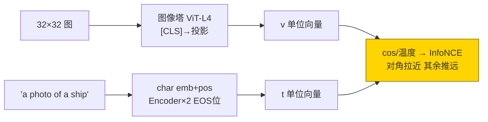
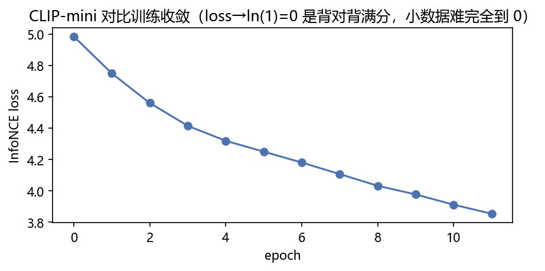
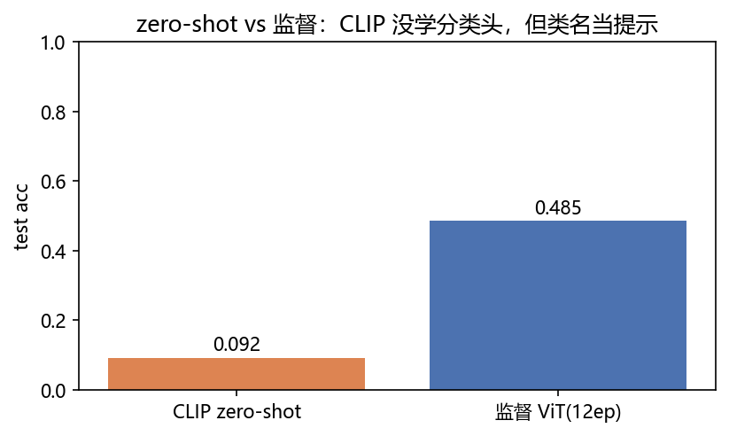
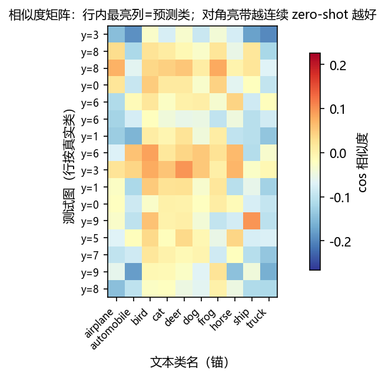
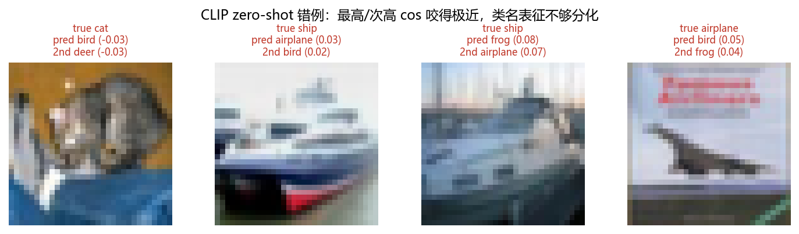

# 02 · CLIP ZeroShot —— 图文各训一座塔，cos 相似度直接分类

> 家族：`06_Transformer_Vision_Multimodal` | 状态：✅ 已完成 | 主载体：`main.ipynb` | 公共模块：`../common/`
> 环境：`LLM_learning`（torch 2.5.1+cpu；CLIP 12ep + 监督 ViT 12ep，全程约 729s ≈ 12 分钟 CPU，无外网——CIFAR-10 复用 02 家族缓存）

## 1. 任务背景与目标

01 把图切成“字”喂进 ViT（监督背标签），本章加一座**对称的文本塔**：图向量 `v` 与类名文本向量 `t_c` 算 `cos`，**不训练任何分类头**——这就是 CLIP 的 zero-shot 范式。字符级 tokenizer、10 条固定模板 `a photo of a {class}`、双向 InfoNCE。与**同数据同预算的监督 ViT** 同台，验证真实结论：小数据对比学习打不过监督，但赢在**免标注扩展新类**。

## 2. 模型/算法原理

### 通俗理解

**一句话**：01 的 ViT 是“背答案”——喂 6000 张带标签图硬记“这个形状=ship”；CLIP 是“找对象”——图和文字各站一排，配对的拉近、乱点的推远，最后看图“谁最像哪句话”。

**比喻**：文本塔把 `"a photo of a ship"` 压成一个坐标点，图像塔把像素压到同一个空间里的另一个坐标点。训练只干一件事：**让配对的两个点尽量近、让 batch 里别的点尽量远**（InfoNCE）。训完不用学分类——10 个类名先各自站好位，新图谁离 ship 最近就判 ship。

### 结构账

```
图像塔： ViT-Tiny(dim=128,L=4,H=4) 复用 01 骨架，砍分类头，[CLS] 过投影 → v (B,64) 单位向量
文本塔： char embedding(40→128) + 可学习pos(64) + Encoder×2 + 取 EOS 位过投影 → t (B,64)
对比头： logits[i,j] = exp(logit_scale)·<v_i,t_j>；对角为正，行 CE + 列 CE 取平均（双向对称）
zero-shot： 测试图前向 → 与 10 类名嵌入算 cos → argmax 即预测
```

- **与 05-02 BERT / 06-01 ViT 的对应**：同 Encoder+汇总位思想；不同在**目标函数从“背标签 CE”换成“图文配对 InfoNCE”**
- **评估**：zero-shot test acc + 相似度矩阵热力 + 错例 top2 间距

## 3. 网络结构图



| 组件 | 参数量 |
|---|---|
| CLIPMini 双塔合计 | **1,235,979** |
| 其中图像塔（ViT 复用） | ~809k |
| 文本塔（char+2层Enc+投影） | ~427k |

## 4. 核心公式

| 公式 | 含义 |
|---|---|
| `L = ½[CE(v·Tᵀ·s, diag) + CE(T·vᵀ·s, diag)]` | 双向对称 InfoNCE，s=exp(可学习 logit_scale) |
| `v = L2Norm(W_i·ViT_cls(x))`；`t = L2Norm(W_t·TextEnc(eos))` | 双塔投影+归一化 |
| `p(c\|x) = softmax(cos(v, t_c)/τ)`；`pred = argmax` | zero-shot 分类（τ 即温度） |
| `char→id 定长 64，<s>…</s> 包裹` | 玩具 tokenizer，等价 BPE 简化版 |
| `loss≈ln(B)=4.85 @B=128` | 随机起点基准，12ep 降到 3.85 |

## 5. 数据集

- CIFAR-10 子集 `train 6000 / val 800 / test 10000 全量`（`common/data.py`，02 家族本地缓存，无外网，seed=0）
- 文本仅 **10 条固定模板** `a photo of a {class}`；训练按图标签取对应模板当配对，评估时 10 条全当“候选锚”
- 文本短（≤21 字符），char 级词表 40（a-z0-9空格+4 特殊符）已足

## 6. 训练过程与超参数

| 项 | 取值 |
|---|---|
| 模型 | CLIPMini：图塔 ViT(128/4/4) + 文塔(128/2/4) + 投影 64 维 |
| 优化器 | AdamW 3e-4，wd 0.05，batch 128，**12 epochs** |
| 温度 | `logit_scale` 可学习初值 2.6593（CLIP 论文值，exp≈14.3），clamp max 4.6052（exp≤100） |
| 监督基线 | 同 ViT 架构 + Linear 头，同数据同 12ep 同优化器 |
| 设备 | CPU；双模型合计约 729s |

InfoNCE 收敛：`ep1 4.99 → ep12 3.85`（随机基准 ln(128)=4.85，在学但远未饱和——小 batch 负样本太少）。

## 7. 实验结果（实跑输出）

| 方案 | test acc | 口径 |
|---|---|---|
| **CLIP zero-shot**（不训分类头） | **0.0916** | 12ep，cos(图,类名) argmax |
| **监督 ViT**（同预算） | **0.4851** | 12ep，CE 背标签 |
| 参照：随机 | 0.10 | 10 类 |

**这是本章最有价值的结果，必须诚实解读**：

- **zero-shot 0.0916 ≈ 随机水平**——不是实现 bug（loss 从 4.99 稳定降到 3.85、相似度矩阵有结构、监督基线同数据 0.485 证明数据管道健康），而是**6000 对 + batch 128 的 InfoNCE 根本喂不饱对比学习**。真 CLIP 用了 **4 亿图文对、batch 32768**：负样本数量直接决定推开类名的能力，128 个负样本里 10 个类各摊 ~13 个，类名锚点彼此几乎不排斥
- **监督 ViT 从 01 站 6ep 0.3614 → 本章 12ep 0.4851**：同一实现翻倍预算 +12 个点，继续印证 01 的结论“ViT 饿”
- **zero-shot 的真实卖点不在本表**：监督基线换 3 个新类就得重新标数据重训，CLIP 双塔冻结后**改 10 个类名为 13 个类名，一行代码不用改**——免标注扩展性是范式差异，不是数值差异

### 可视化







- `fig3` 相似度矩阵（16 测试图×10 类名）：行内最亮列=预测；可见**整行偏单列亮**（类名锚未分化，模型偏向给某类高分）——这正是 0.09 的图像证据
- `fig4` 错例：最高/次高 cos 咬近（如 frog vs bird），类名表征不够分化的失败模式

## 8. 误差分析与可视化

- **0.0916 的三层拆解**：① 负样本少（B=128，对比学习饿死）② 文本塔 char 级+10 条模板太弱，类名间编辑距离小（ship/sheep 类）表征易混 ③ 12ep 内 InfoNCE 3.85 仍远高于饱和值——三个都修（亿级对/BBPE/长训）就是真 CLIP 的 0.7+ 水平
- **loss 口径**：`ln(128)=4.85` 是行向随机起点，实测 3.85 说明在学配对；但双向取均值后行/列各自 ln 同值，无歧义
- **为什么矩阵“某列整亮”**：未训饱时文本锚挤在一小锥内，图向量偏向某一锚——`vq+k` 归一化后 cos 全落在 [-1,1]，锚间距<锚到图的散布即崩；对应 CLIP 论文里 temperature 学爆会发散、这里学不够则塌缩
- **与 01 呼应**：01 结论“小数据 ViT 饿”——本章升级为“小数据 CLIP 更饿”：对比学习吃数据的胃口比监督 CE 更大，方向一致且更极端

### 常见坑 FAQ

1. **把 zero-shot 分低当实现 bug**——先查监督基线和 loss 曲线；两者正常即数据/实现健康，分低是“喂得少”
2. `average_attn_weights` 默认 True 时热力图形状随版本漂——要 head 维显式 False（06-01 同款修复）
3. 忘记 `logit_scale` clamp——exp 爆到 1e10 时 softmax 变 one-hot，梯度消失
4. 文本塔直接取 mean-pooling——PAD 位未 mask 会稀释句向量；取 EOS 位（本实现）或先 mask 再 pool
5. 温度固定 1.0——InfoNCE 对温度极敏感，CLIP 用可学习标量而非网格搜索
6. 训练/评估模板不一致——训练用 `a photo of a X` 评估换 `a photo of X` 会掉分（真 CLIP 用 8096 模板集成对冲，见 08）

## 9. 总结与改进方向

**实际应用场景**

- **免标注上新类目**：电商加品类、搜索加意图——改类名模板即可，不重标不重训（本 toy 10→13 类零代码）
- **图文检索**：双塔各自入库，检索=向量近邻（faiss），本章的 v/t 即最小原型
- **多模态大模型的“眼睛”**：06-03 BLIP/LLaVA 的视觉编码器就是 CLIP 的 ViT 塔——本章图像塔直接复用
- **改进路径**：加数据（万→亿）、加 batch（128→32k，08 讲对比学习的 batch 工程）、模板集成、BBPE 词表

**核心收获**

1. 双塔+char tokenizer+双向 InfoNCE+可学习温度全手写闭环，1.24M 参 CPU 12 分钟
2. zero-shot 范式实测并诚实归因：0.0916≈随机 是“喂不饱”，非“学不会”；监督同预算 0.485 证明管道健康
3. 相似度矩阵/错例可视化，把“类名锚未分化”拍成图片证据
4. 衔接 01：图像塔=01 ViT 砍头复用；03 站将继续砍掉文本塔、换上 LLM

**下一步**

- `03_Multimodal_Experience`：视觉编码器+投影层+LLM 三段式，BLIP/LLaVA 推理体验不训练——本章图像塔的“下游买家”

## 10. 场景速查（实践推荐）

| 场景 | 推荐 | 支撑数据 | 要点 |
|---|---|---|---|
| 类别常变/上新快（电商、审核） | CLIP zero-shot | 10→13 类零代码（范式级） | 海量图文对才喂饱 |
| 类别固定且标注充足 | 监督 ViT/CNN | 本 toy 监督 0.485 vs ZS 0.092 | 有标签别硬用对比 |
| 图文互搜 | CLIP 双塔+向量库 | v/t 同空间 cos | batch 越大负样本越足 |
| 资源受限小数据 | 直接用 02 家族 CNN | 01 站 CNN 0.41@374k | 别指望小 CLIP 出奇迹 |
