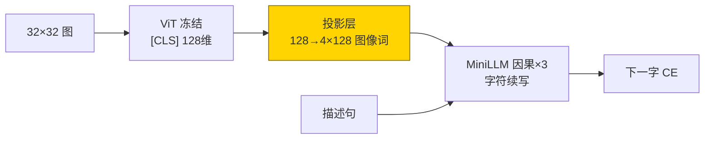
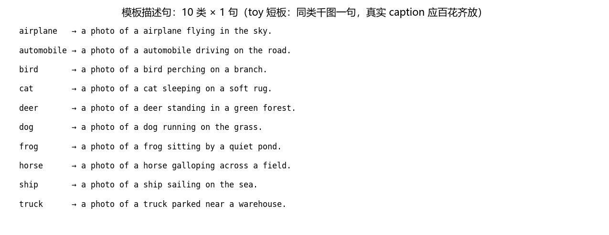
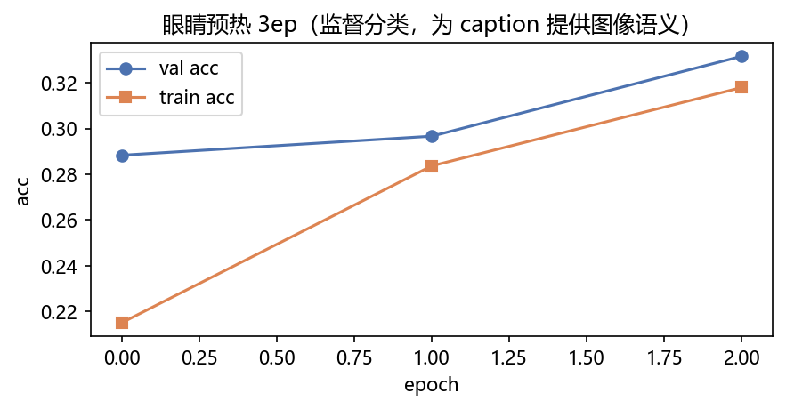
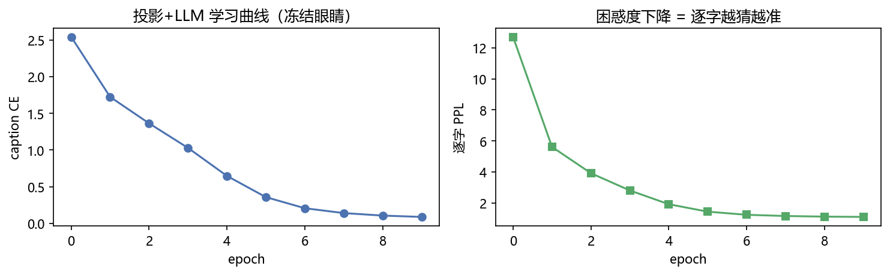
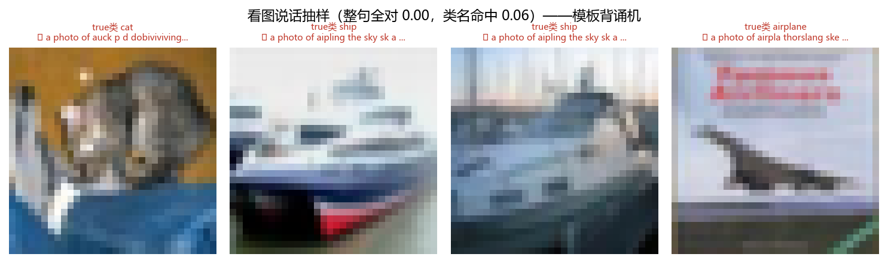
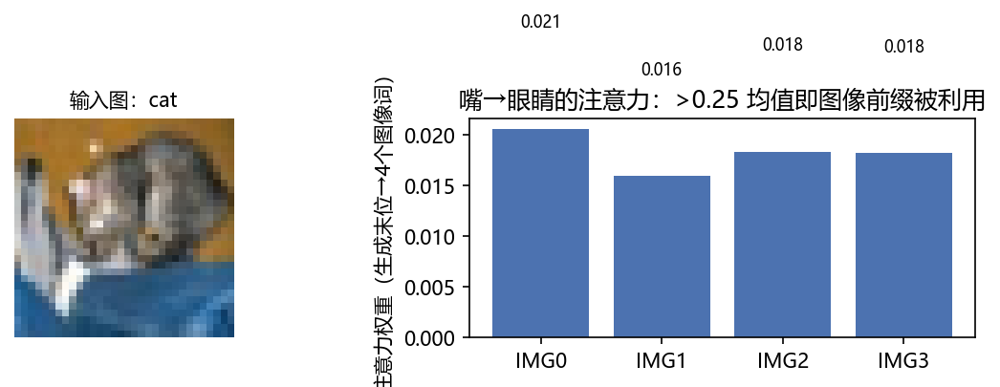

# 03 · Multimodal Experience —— 视觉编码器+投影层+LLM，看图背模板

> 家族：`06_Transformer_Vision_Multimodal` | 状态：✅ 已完成 | 主载体：`main.ipynb` | 公共模块：`../common/`
> 环境：`LLM_learning`（torch 2.5.1+cpu；ViT 预热 3ep + 投影/LLM 10ep，全程约 220s CPU，无外网——CIFAR-10 复用 02 家族缓存）

## 1. 任务背景与目标

01 训出 ViT（监督版眼睛），02 证明对比学习小数据喂不饱，本章把 ViT 当**眼睛**、拼一座**字符级因果 LLM** 作嘴——这就是 **LLaVA 三段式**（vision → projector → LLM）的 toy 复刻。10 类模板描述句半合成数据，CPU 分钟级可跑，**提前说清短板**：模板=`10 选 1 背诵`，不是开放 caption。

## 2. 模型/算法原理

### 通俗理解

**一句话**：01 的 ViT 是“哑巴眼睛”——看得见（分类 0.33）但说不出；本章给它接一条**视神经**（投影层，把 128 维图向量翻成 LLM 能读的“方言”）+ 一张**嘴**（3 层字符级因果 LLM），让它看着图逐字吐出 `"a photo of a ship sailing on the sea."`。

**比喻**：LLaVA 像给盲人装眼睛——ViT 把像素变成“视觉印象”，投影层翻译成 LLM 母语，LLM 像鹦鹉一样按印象续写。真 LLaVA 用 13B LLM + 真实 caption；toy 版用 3 层小 LLM + 10 句模板，**只学“按图选哪句模板”，不学“自由写作”**。

### 结构账

```
眼睛： ViT-Tiny(dim128/L4) 监督预热 3ep（本章内训 val 0.3317），训完冻结
视神经： projector 128→128→128×4，把 CLS 向量翻成 4 个“图像词”
嘴： MiniLLM dim128/depth3/heads4，因果自注意力，字符词表 43，max_len 96
输入： [IMG×4, <s>, a photo of a ship sailing on the sea., </s>] 预测下一字
推理： [IMG×4, <s>] 自回归逐字续写到 </s>
```

- **与真 LLaVA 的对应**：同三段（frozen vision + trainable projector + LLM）；不同在 LLM 是 3 层玩具、文本是 10 句模板——管道同构，数据 toy
- **评估**：caption CE/PPL + 生成整句 acc + 类名命中 + 图像前缀注意力

## 3. 网络结构图



| 组件 | 状态 | 参数量 |
|---|---|---|
| ViT 视觉塔 | 3ep 预热后**冻结** | 809,354 |
| 投影 + MiniLLM（3 层） | **训练** | **1,111,424** |

## 4. 核心公式

| 公式 | 含义 |
|---|---|
| `img_tk = MLP(ViT_cls(x)).view(B,4,D)` | 视神经：图向量→4 个 LLM 方言词 |
| `[IMG×4, cap]` teacher forcing 预测下一字，PAD→-100 | caption CE（忽略填充） |
| `L = CE(logits[:,n_img-1:-1], cap)` | 对齐口径：最后图像词预测首字 |
| `PPL = exp(CE)` | 逐字困惑度 |
| `outs: [IMG×4,<s>] 自回归到 </s>` | 推理生成 |

## 5. 数据集

- CIFAR-10 子集 `train 3000 / val 600 / test 10000 全量`（02 缓存，无外网，seed=0）
- 每类 1 句固定模板共 10 句（如 ship → `a photo of a ship sailing on the sea.`），`common/data.py::CAPTION_TMPL`，最长 45 字符，token 化 `MAXC=64`
- **短板先行**：同类千图一句——真实 caption 同图 5 种说法（背景/动作/计数）；本章只证明**三段式管道跑得通**

## 6. 训练过程与超参数

| 项 | 取值 |
|---|---|
| 眼睛预热 | ViT 监督分类 3ep，AdamW 3e-4，batch 128（val 0.288→0.332） |
| 二段 | 投影+LLM 10ep，AdamW 3e-4 wd 0.05，视觉塔冻结 |
| 词表 | 字符 43（a-z0-9 + 空格 + `.:` + `<pad>/<s>/</s>/<unk>`） |
| 设备 | CPU；全程约 220s |

二段曲线（实跑）：`CE 2.54→0.089 / PPL 12.7→1.09`——训练集上背下模板了。

## 7. 实验结果（实跑输出）

| 指标 | 值（200 张） | 含义 |
|---|---|---|
| 整句全对 | **0.000** | 自回归一字错即全错 + 暴露偏差，字符级严口径下归零 |
| **类名命中**（`ship in gen`） | **0.060** | 可用口径：嘴有没有说对“是什么” |
| caption CE / PPL | 0.089 / 1.09 | teacher forcing 下背熟了 |
| 图像前缀注意力（生成末位→4×IMG） | 均值 **0.018**（总长归一基线 0.060） | 嘴**没怎么看眼睛**——主要在背语言模板 |

**诚实解读**：CE 0.089（背熟） vs 生成类名命中 0.06（说不对）——这是 teacher forcing 与自回归的鸿沟（训练每步喂真字，推理错一字后面全错）+ 模板信息瓶颈（4 个图像词要编码 10 类，眼睛 val 才 0.33，视神经拿到的“印象”本身就糊）。生成样例：`true cat …rug / gen 'a photo of auck p d dobiviviving on the road.'`——**前缀 `a photo of a` 背熟了，后半靠语言模型瞎编**。

### 可视化







- `fig3`：4 张看图说话条带，✓/✗ 标整句，标题如实写“模板背诵机”
- `fig4`：嘴→眼睛注意力 0.018 < 基线 0.060——**图像前缀被冷落**的图片证据

## 8. 误差分析与可视化

- **CE 低≠生成好**：teacher forcing 每步看真字（开卷抄），推理看自己上一步（闭卷默写）；字符级一错即全错，整句 acc 归零不意外——真 LLaVA 用 token 级 BPE + beam search + 海量数据才跨过鸿沟
- **图像注意力 0.018 的解释**：4 个 IMG 词只占总长 68 的 6%，均匀基线 0.06；实测 0.018 说明 LLM 主要靠“`a photo of a` 后面跟什么最顺”续写——**模板太规律，语言先验压过视觉信号**，这是 toy 数据的必然，不是三段式架构的错
- **与 06-01/02 呼应的三连**：01“小数据 ViT 饿”（0.36）→ 02“小数据 CLIP 更饿”（0.09）→ 03“小数据 LLaVA 眼睛糊+嘴背模板”（类名命中 0.06）——**数据饥饿逐级放大**，方向一致
- **消融可做**：n_img 4→16、眼睛不冻结联合训、字符→词级 token，都会涨；但本章定位“管道跑通+短板诚实”，不刷数

### 常见坑 FAQ

1. **拿 CE 低宣称“学会看图说话”**——必须看自回归生成指标（整句/类名命中），teacher forcing 分是开卷分
2. 对齐错位：logits 切片 `[:, n_img-1:-1]` 少一位即全错位——`caption_loss` 的对齐注释是保命符
3. 忘记冻结视觉塔——ViT 809k 全开训，CPU 翻倍且小数据过拟合更凶
4. `decode` 忘跳 START/PAD——生成串首多个怪字符
5. 字符词表漏 `.`/`:`——模板句含标点会全变 `<unk>`（本实现词表 43 已含）
6. 图像注意力行取错：要取**最后一个文本位**的行，不是 CLS 行（06-01 是 CLS 行，两处别混）

## 9. 总结与改进方向

**实际应用场景**

- **三段式是正解**：真 LLaVA/BLIP/Qwen-VL 全是“冻结视觉塔 + 投影 + LLM”——本 toy 管道同构，换大数据+大 LLM 即生产版
- **看图说话的正确打开**：真实 caption + 大 LLM + 指令微调（`Tell me about the image:` 这类指令模板本章已预埋 `INSTRUCTION`）
- **本 toy 的定位**：教学演示“眼睛→视神经→嘴”怎么接线，不是“小模型也能看图说话”

**核心收获**

1. LLaVA 三段式 toy 闭环：冻结 ViT + 投影 4 词 + 3 层因果 LLM，10ep CE 0.089 背下模板
2. 诚实短板三件套：整句 0.0 / 类名命中 0.06 / 图像注意力 0.018——三个数互相印证“背模板而非理解”
3. 06 家族收官：01 眼睛（切块+CLS）→ 02 相亲（双塔+InfoNCE）→ 03 眼睛接大脑（投影+LLM 生成）

**06 家族一句话**：把 05 的 Transformer 从“读书”搬到“看图”——图切成字（ViT 0.36）→ 图文对上（CLIP 0.09 喂不饱）→ 图接大脑说话（LLaVA toy 背模板）。

## 10. 场景速查（实践推荐）

| 场景 | 推荐 | 支撑数据 | 要点 |
|---|---|---|---|
| 真实看图说话/VQA | 大 LLM + 真实 caption + 指令微调 | 本 toy 反例：模板+小 LLM 类名命中仅 0.06 | 别用 toy 数据做产品结论 |
| 教学演示三段式接线 | 本章 MiniLLM | CE 0.089 管道跑通 | 冻结眼睛+投影 4 词起步 |
| 小数据图像理解 | 直接用 06-01 CNN/06-02 监督 | 0.41/0.49 | 生成范式比分类更吃数据 |
| 要“嘴看没看眼睛” | 图像前缀注意力 | 0.018 vs 基线 0.060 | 低于基线=语言先验压过视觉 |
