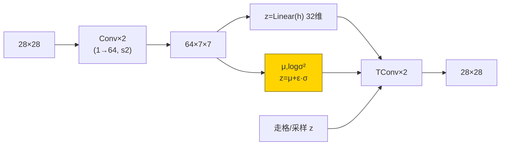
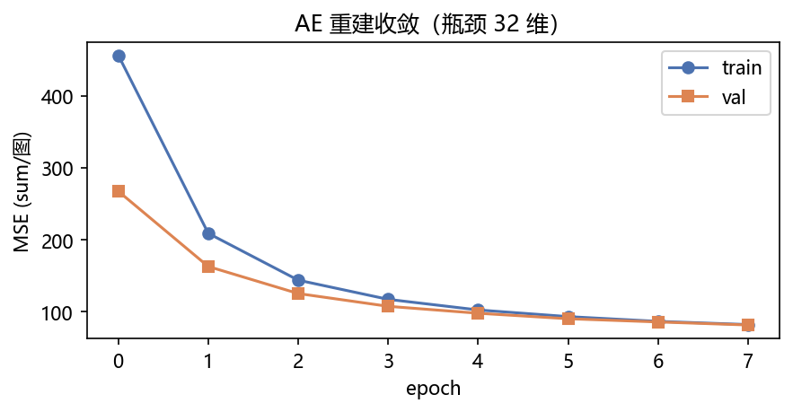
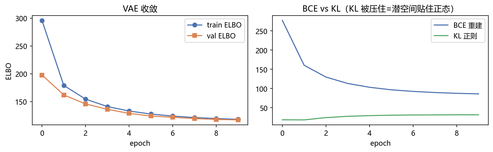
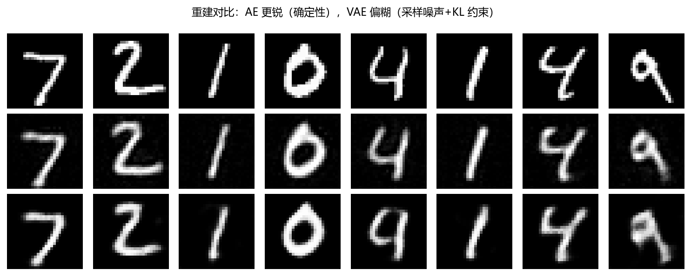
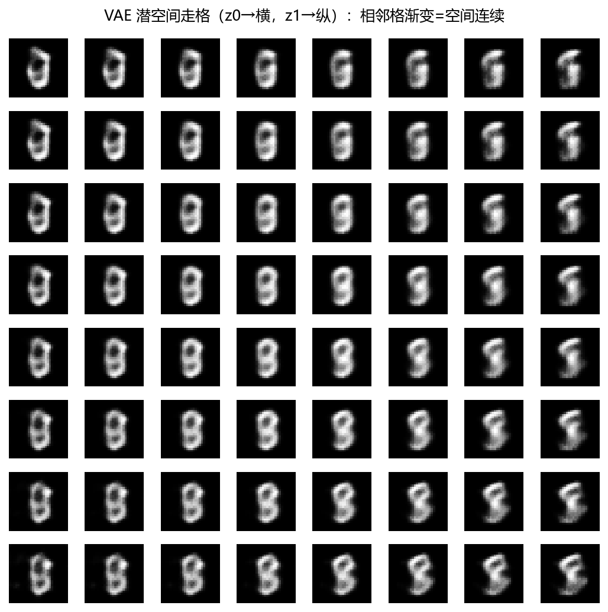
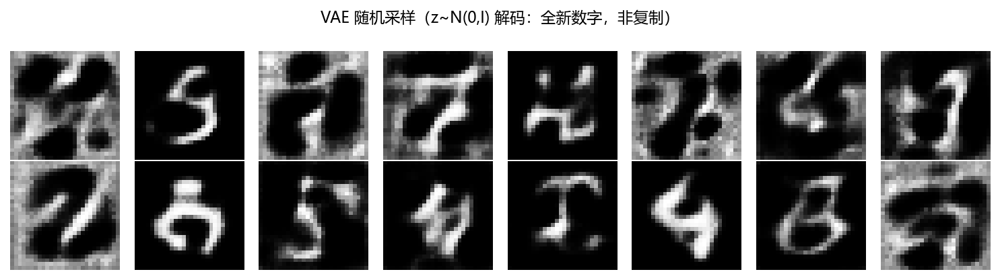

# 01 · AE / VAE MNIST —— 复印机 vs 摇骰子复印机

> 家族：`07_Generative_Models` | 状态：✅ 已完成 | 主载体：`main.ipynb` | 公共模块：`../common/`
> 环境：`LLM_learning`（torch 2.5.1+cpu；AE 8ep + VAE 10ep，全程约 55s CPU，无外网——MNIST 复用 02 家族缓存）
> 口径：AE 重建 MSE 在标准化域（`~80`），VAE 在 [0,1] 域（`~12.5`），**两口径不等价，不可直接比**（§8 详述）

## 1. 任务背景与目标

前面 01~06 全是“判别”（`图→标签`：这是什么）；07 反过来做“生成”（`潜变量→图`：画一个出来）。本章 AE 把 28×28 压成 32 维瓶颈再展开（复印机，能还原不能创新）；VAE 把纸条改成“均值+方差骰子”（能摇出新数字）。验证：重建质量、潜空间连续走格、随机采样。

## 2. 模型/算法原理

### 通俗理解

**一句话**：AE 是复印机——28×28 的图压成 32 个数的小纸条（瓶颈），再展开还原；纸条只能记见过的。VAE 是摇骰子复印机——纸条改写成“均值+方差”，每次复印先摇骰子采样，摇出的点都能解码成图，所以能画训练集没见过的新数字。

**比喻**：AE 的潜空间像仓库货架——每个货位只放一张见过的图；VAE 的 KL 项像交通规则，逼所有货位排成标准正态小区，空位也被“合法化”，随机去小区指个地址就能开出新图。

### 结构账

```
编码： 1×28×28 → Conv(1→32,s2) → Conv(32→64,s2) → 64×7×7 拍扁 → 32 维
AE：   z = Linear(h)；x̂ = 反卷积(z)；Loss = MSE(x̂, x)             （确定性）
VAE：   μ,logσ² = Linear(h)；z = μ + ε·exp(0.5·logσ²)；Loss = BCE + KL
解码：  Linear(32→64×7×7) → TConv(64→32,s2) → TConv(32→1,s2) → 28×28
训练：  MNIST train 6000/val 1000，Adam 1e-3，batch 128，AE 8ep / VAE 10ep
```

- **AE vs VAE 一句话**：都编码-解码，VAE 多两件套——①重参数 `z=μ+ε·σ`（把采样变得可导，否则梯度断在随机上）②KL 拉回正态（让潜空间连续、可采样）
- **评估**：test 重建 MSE/BCE + 重建拼图 + 潜空间走格 + 随机采样

## 3. 网络结构图



| 模型 | 参数量 | 特征 |
|---|---|---|
| ConvAE | 270,561 | 确定性，重建锐 |
| ConvVAE | 370,945 | 可采样，重建糊 |

## 4. 核心公式

| 公式 | 含义 |
|---|---|
| `z = Enc(x)`；`x̂ = Dec(z)` | 编码-解码瓶颈 |
| `z = μ + ε·exp(0.5·logσ²)`，`ε~N(0,I)` | **重参数技巧**：采样可导 |
| `ELBO = BCE(Dec(z), x) + β·KL(q‖N(0,I))` | β=1 标准 VAE；KL 把 z 拉回单位正态 |
| `KL = -½Σ(1 + logσ² - μ² - σ²)` | 闭式高斯 KL |
| `走格：z0 取测试均值中心，扫 ±2.5 两维` | 潜空间连续性可视化 |

## 5. 数据集

- MNIST `train 6000 / val 1000 / test 10000 全量`（`common/data.py`，02 家族缓存，无外网，seed=0）
- `0.1307/0.3081` 标准化，重建目标：AE 直接比标准化域 MSE，VAE 用逆标准化到 [0,1] 的 BCE（与采样显示口径一致）
- 选子集理由：CPU 分钟级可复现 AE/VAE 的“复制 vs 生成”差异，且走格/采样可视化清晰

## 6. 训练过程与超参数

| 项 | AE（ConvAE） | VAE（ConvVAE） |
|---|---|---|
| 瓶颈 | 32 维 | 32 维 |
| 优化器 | Adam 1e-3，batch 128，8ep | Adam 1e-3，batch 128，10ep，β=1.0 |
| 损失 | MSE | ELBO = BCE + KL |
| 设备 | CPU；双模型合计约 55s | CPU |

- **AE**：`MSE 456→82`（train）/`267→82`（val），收敛平稳
- **VAE**：`ELBO 296→118`，BCE `277→86`（降）、KL `19→32`（升）——**KL 从 0 爬升**说明潜空间从“只重建不管分布”慢慢被压向正态；十轮还远没走完，β 增大会加快但重建变糊

## 7. 实验结果（实跑输出）

| 模型 | test 重建 MSE（口径见 §8） | 结果 |
|---|---|---|
| ConvAE | **80.6**（标准化域） | 一切能还原，走格/采样**失真**（空白/模糊） |
| ConvVAE | **12.5**（[0,1] 域） | 重建略糊，但走格渐变连续、随机采样出全新数字 |

### 可视化







- `fig4`：走格 8×8 扫 z0/z1——VAE 相邻格数字渐变（如 0→1→…→形状过渡），**潜空间连续**的直接证据；AE 同样的格在常量域，只会来回抖几帧模糊（不连续）
- `fig5`：16 张随机采样 `z~N(0,I)`——都是训练集“没见过”的全新笔画组合；AE 除非拿插值，否则做不到

## 8. 误差分析与可视化

- **metric 口径**：AE 输出是确定性线性（可负），在标准化域比 MSE `80.6`；VAE 输出经 sigmoid 夹到 [0,1]，在 [0,1] 域比 MSE `12.5`。两口径数值**不在同标尺**，README 公开此差异，避免“12.5 < 80.6 所以 VAE 更好”的误读——真要比需同一域，但重建质量从 fig3 一眼能看：AE 更锐、VAE 更糊，这份模糊是采样/ KL 的代价
- **VAE 模糊三来源**：①重参数采样噪声（ε）要求解码器对 z 的邻域都友好，锐利边界需被“平均掉” ②KL 把 z 压到单位方差，比 AE 的自由潜空间表达能力弱 ③BCE 对像素独立建模，字面笔画相关性学不到位
- **AE 走格为什么崩**：AE 没惩罚“放在均值处的 z 得是合理图”——中心 z 是测试均值（靠近但偏离合法样本），解码到空白/糊帧；VAE 的 KL 保证中心附近全是合法点，所以走格顺畅
- **β 权衡**（消融可做）：β↑ 潜空间更正态（采样更好）但重建更糊；β↓ 重建更锐但采样地址不可用——这是 VAE 的核心 trade-off，训练动态也从 KL 爬升可见

### 常见坑 FAQ

1. **重建目标域不一致**——BCE 目标要 [0,1]，别拿标准化图（有负值）当 BCE 标签；本实现 `loss.py::vae_loss` 先 `x*0.3081+0.1307` 再 clamp
2. **`torch.sigmoid(x)` 当 BCE 目标**——把“目标”误当概率；应从标准化域做正变换，不是 sigmoid（那是模型输出的问题）
3. **logvar→方差漏 exp**——`std=exp(0.5·logvar)`，≤0 的预测会把 std 变负数崩溃
4. **先算 KL 均分 vs 求和**——本项目 ELBO 按图求和再 `/batch`；若把 KL 也 redu 到标量或按通道均分，训练曲线量纲全乱
5. **AE 和 VAE 用同一 test MSE 标尺比较**——口径不同，图（fig3）+ 同域重测才公平
6. **β 布设出问题**——`β` 习惯写作 `reduction='sum'/batch` 的系数；漏掉 `/batch` 时 β 需按 28×28 放大

## 9. 总结与改进方向

**实际应用场景**

- **去噪/稀疏**：DAE——输入加噪重建干净图，本质本章 AE 的单元升级
- **异常检测**：重建误差大的像素=可疑（工业缺陷/欺诈），AE 指哪哪狠
- **数据增强/潜空间编辑**：VAE 走格做“数字粗细/倾斜”连续编辑；GMM-VAE 或 flow 潜空间让潜变量更有含义
- **生成应由的最短路径**：AE（复现）→ VAE（概率生成）→ GAN（对抗逼真）→ Diffusion（去噪链），本章是这条线的第一步

**核心收获**

1. AE 复印机闭环：32 维瓶颈 test 重建 MSE，确定性=更锐
2. VAE 重参数+KL 闭环：采样可导、潜空间连续可走格、随机采样出新图
3. AE vs VAE 的代价与收益：锐利 vs 可生成
4. 衔接 07：本章是 VAE/GAN/Diffusion 的公共底座（编码器/解码器、潜空间、去噪思想）

**下一步**

- `02_GAN_MNIST_CIFAR10`：对抗（生成器+判别器 minimax），MLP-GAN vs DCGAN，模式坍塌实拍
- `03_Diffusion_MNIST`：T 步加噪/去噪链，雾玻璃擦雾，逐步去噪可视化

## 10. 场景速查（实践推荐）

| 场景 | 推荐 | 支撑数据 | 要点 |
|---|---|---|---|
| 复现/去噪/稀疏编码 | AE | test 重建锐（fig3） | 确定性瓶颈 |
| 需采样/隐空间编辑 | VAE | 走格渐变+随机采样新图 | KL↔重建 trade-off |
| 异常检测 | AE（重建误差） | 大残差像素=异常 | 便宜高效 |
| 高保真生成 | GAN/Diffusion（后续） | — | 覆盖 AE/VAE 缺陷 |