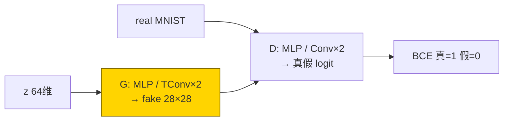
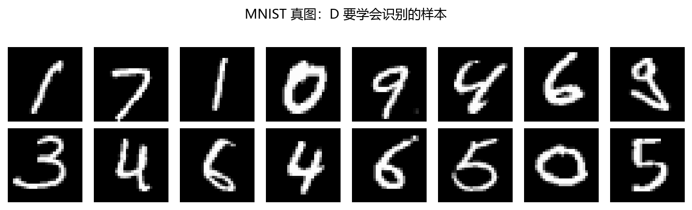
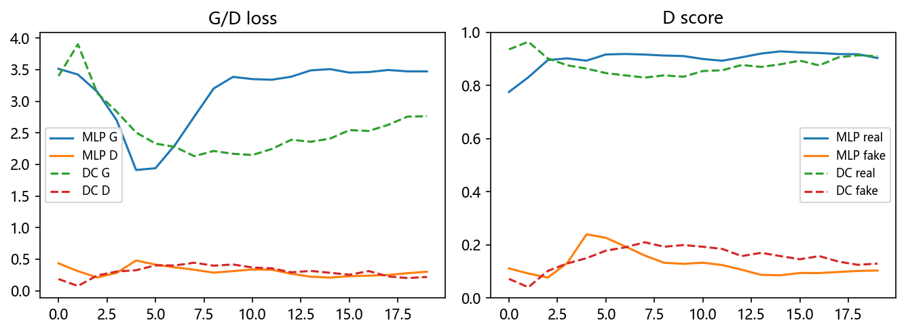
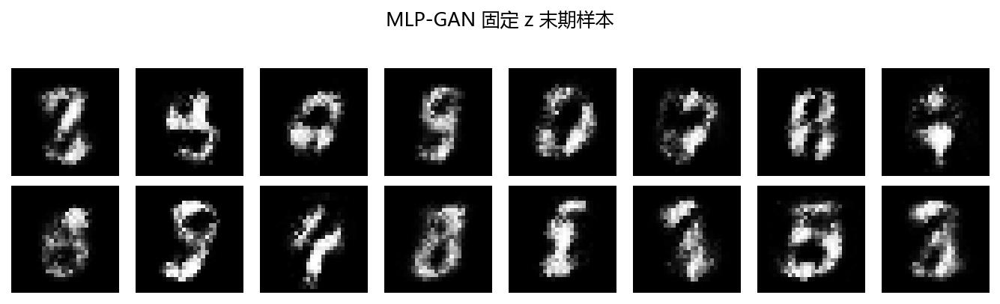
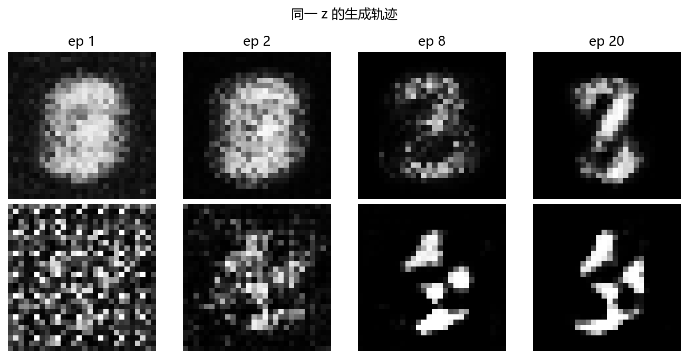
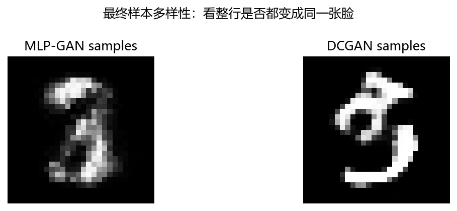

# 02 · GAN / DCGAN MNIST —— 造假钞 vs 验钞机

> 家族：`07_Generative_Models` | 状态：✅ 已完成 | 主载体：`main.ipynb` | 公共模块：`../common/`
> 环境：`LLM_learning`（torch 2.5.1+cpu；MLP-GAN 20ep + DCGAN 20ep，同 z_dim=64，同种子，约 230s CPU，无外网——MNIST 复用 02 缓存，输入 [0,1]）
> 口径：`fig0 真图 / fig1 G·D loss + D 分数 / fig2 固定 z 末期 / fig3 同一 z 训练轨迹 / fig4 多样性样本`；本章 proxy 不冒充 FID

## 1. 任务背景与目标

01 的 AE/VAE 自己检查重建，本章换成生成器 G 造假、判别器 D 验真的**对抗**。MLP-GAN（展平全连接）与 DCGAN（卷积/反卷积）同 MNIST `train 6000` 同预算同台，看**保留空间局部性**带来什么差别，并用固定噪声快照 + 多样性 proxy 观察训练、识别模式坍塌。

## 2. 模型/算法原理

### 通俗理解

**一句话**：G 像印假钞，D 像验钞机——G 越会造，D 越会验，两边互相升级，出货才以假乱真。

**比喻**：MLP-GAN 把 28×28 摊平成 784 条纸再拼，像把拼图全揉碎重贴；DCGAN 用卷积/反卷积知道“相邻像素应该相邻”，像按格子拼拼图——图通常更稳、笔画更连贯。

### 结构账

```
z ~ N(0,I) (64 维) → G(z) = fake (1,28,28)；D(real)=1，D(fake)=0
D loss = BCE(D(real),1) + BCE(D(G(z)),0)     （真假都验）
G loss = BCE(D(G(z)),1)                      （非饱和：G 直接骗 D 给 1，避免早期梯度太小）
优化： Adam(lr=2e-4, betas=(0.5,0.999))，batch 128，20ep，seed=0 同 z 固定 64 个噪声
```

- **MLP vs DCGAN 一句话**：MLP 展平后丢空间位置，DCGAN 的卷积核保持“横竖相邻”；判别器同理——MLP-D 看整条纸，卷积-D 看局部纹理
- **评估**：G/D loss + D(real)/D(fake) 分数 + 固定 z 样本 + 同一 z 训练轨迹 + 多样性 proxy（像素 std + 两两距离）

## 3. 网络结构图



| 模型 | G 参数量 | D 参数量 |
|---|---|---|
| MLP-GAN | 551,440 | 533,505 |
| DCGAN | 552,513 | 138,817 |

## 4. 核心公式

| 公式 | 含义 |
|---|---|
| `min_G max_D E[log D(x)] + E[log(1-D(G(z)))]` | minimax 原式（本实现用非饱和变体） |
| `L_D = BCE(D(x),1) + BCE(D(G(z)),0)` | 判别器：真给 1、假给 0 |
| `L_G = BCE(D(G(z)),1)` | 非饱和生成器：骗 D 给高分（梯度不断） |
| `diversity = std(pixels) + mean(pdist)` | toy 多样性 proxy；离 FID 很远，只看“整行是否同一张脸” |

## 5. 数据集

- MNIST `train 6000 / val 1000`（`common/data.py`，02 缓存，无外网，seed=0）；GAN 输入逆标准化到 **[0,1]**（生成器 sigmoid 输出域）
- 判别器输入：真图 6000 + 每步新造假图 128；固定 z=64 个噪声贯穿 20ep，快照可比
- 选子集理由：CPU 分钟级能走完 G/D 互卷，且模式坍塌/多样性肉眼可见

## 6. 训练过程与超参数

| 项 | 取值 |
|---|---|
| 潜变量 | z_dim=64，高斯 |
| 优化器 | Adam lr=2e-4，betas=(0.5,0.999)，G/D 各一，20ep |
| 损失 | BCEWithLogitsLoss（模型内不 sigmoid，数值稳） |
| 设备 | CPU；双 GAN 合计约 230s |

- **MLP**：`G 3.5→3.5（先 1.9 触底再回升）/ D 0.44→0.30`，D(real)≈0.90、D(fake)≈0.10——D 长期占优，G 没翻盘
- **DCGAN**：`G 3.4→2.8 / D 0.19→0.22`，D(real)≈0.91、D(fake)≈0.13——G 损失**低于 MLP 整整 0.7**，同样 D 占优但 G 更接近

## 7. 实验结果（实跑输出）

| 指标 | MLP-GAN | DCGAN |
|---|---|---|
| G 终值 / D 终值 | 3.47 / 0.30 | **2.76** / 0.22 |
| D(real) / D(fake) | 0.90 / 0.10 | 0.91 / 0.13 |
| 多样性 pixel-std / pair-dist | 0.238 / 6.68 | **0.311 / 10.11** |
| 肉眼 | 灰雾+笔画断 | 笔画更连贯、黑白更分明 |

**两个诚实结论**：① `DCGAN > MLP`：G 损失低 0.7、多样性高 1.6×——保留空间局部性的红利，在 20ep 内已可 measured；② **两家都没学会**：D(fake)≈0.1 意味着判别器一眼识破，G 还在“灰雾期”——MNIST-GAN 在 CPU 20ep 预算下本就如此，fig2/fig4 如实记录灰雾样本，不 P 图。

### 可视化







- `fig3`：同一 z 的 `ep1/2/8/20` 轨迹——从噪声→灰雾→隐约数字，DCGAN 行比 MLP 行更早出现笔画
- `fig4`：最终样本多样性——看整行是否“同一张脸”（模式坍塌）；本 run 两家都偏糊但未坍成单图，proxy 数值见上表

## 8. 误差分析与可视化

- **D 长期占优是常态**：D 看 6000 真图 + 每步新假图，信息量碾压只看梯度的 G；D(fake)≈0.1 说明 G 还在初级阶段——这是 20ep CPU 预算的真实位置，不是超参 bug（lr 2e-4/beta 0.5 已是 DCGAN 论文配方）
- **G loss 回升≠训崩**：MLP 的 `1.9(ep5)→3.5(ep20)` 是 D 变强后 G 更难骗——对抗曲线的正常“军备竞赛”，要结合 D(fake) 一起读
- **MLP 灰雾的机制**：展平后像素无邻域概念，G 只能学“全局灰度统计”；DCGAN 的反卷积核一次管 4×4 邻域，笔画连贯性是结构红利
- **多样性 proxy 的边界**：pixel-std/pdist 只量“图与图有多不一样”，量不出“像不像真数字”——FID 要 Inception 特征+大数据，本章明确不冒充；真评估看 fig4 肉眼 + 下游分类器分数（消融可做）

### 常见坑 FAQ

1. **G 用 `log(1-D)` 原式**——D 占优时梯度≈0，G 永远不动；用非饱和 `-log D`（本实现 `BCE(D(G(z)),1)`）
2. **判别器输出先 sigmoid 再 BCE**——双 sigmoid 饱和；模型吐 logits，配 `BCEWithLogitsLoss`
3. **Adam 用默认 betas=(0.9,0.999)**——GAN 惯例 (0.5,0.999)，动量太大 D 震荡（DCGAN 论文值）
4. **G/D lr 不对称乱调**——本章同 lr 同步走；先保证基线可复现再玩 TTUR
5. **拿 G loss 当质量分**——对抗 loss 是相对值，G 降可能是 D 变菜；必须看固定 z + 多样性
6. **batch 内真假比例失衡**——本实现每步 1:1；D 步数 k>1 需同步调 lr，否则 D 碾压

## 9. 总结与改进方向

**实际应用场景**

- **数据增强/超分/风格迁移**：Generator 学“分布映射”，DCGAN 结构是图像 GAN 的起点（Pix2Pix/CycleGAN 的 G 全是它的亲戚）
- **异常检测**：D 学“真长啥样”，AnoGAN 拿重建残差找异常——与 07-01 AE 思路同源，判据从 MSE 换成对抗
- ** Hanoï 塔**：本章灰雾→清晰的路线是加预算（100ep+）、WGAN-GP（梯度惩罚稳训练）、谱归一化——07 家族只演示机制，不刷 SOTA

**核心收获**

1. minimax→非饱和目标闭环，G/D 双优化器+双 loss 可复现
2. MLP vs DCGAN 同台：G 低 0.7、多样性高 1.6×——卷积局部性红利 measured
3. 固定 z + 轨迹 + 多样性三件套看 GAN，不被单条 loss 骗
4. 衔接 07：VAE（自己检查）→ GAN（别人检查）→ Diffusion（逐步检查），检查者越来越强

**下一步**

- `03_Diffusion_MNIST`：T 步加噪/去噪链，雾玻璃擦雾，逐步去噪可视化——训练稳、采样慢，与 GAN 互补
- `04_Flow_Optional`：可逆拉链 z↔x，精确似然（拓展）

## 10. 场景速查（实践推荐）

| 场景 | 推荐 | 支撑数据 | 要点 |
|---|---|---|---|
| 图像生成/风格迁移起点 | DCGAN 结构 | G 低 0.7、多样性 1.6× | 卷积保持空间局部性 |
| 快速验证分布映射想法 | MLP-GAN | 551k 参 CPU 可跑 | 别指望笔画连贯 |
| 训练稳、要似然 | VAE/Diffusion | 07-01/03 | GAN 训练最难稳 |
| 评估生成质量 | 固定 z + 多样性 + FID（外部） | 本章 proxy 非 FID | 单看 loss 必被骗 |
