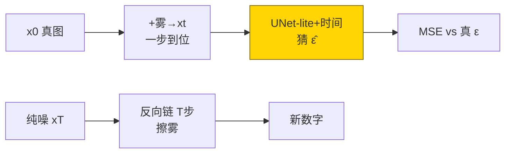
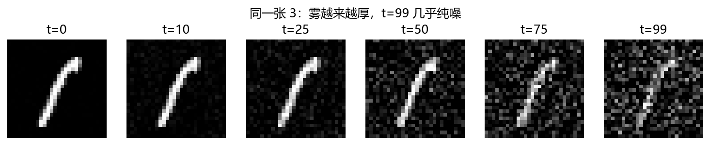
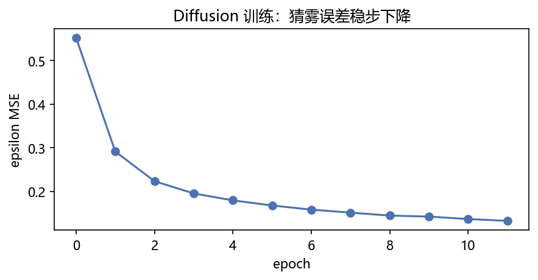
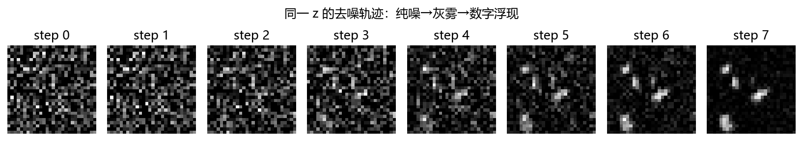
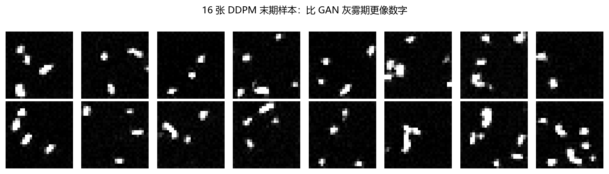
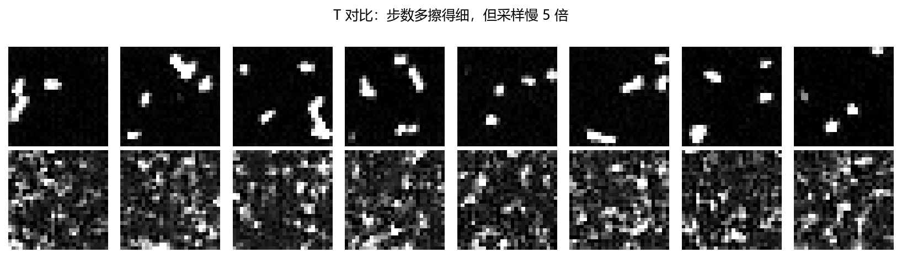

# 03 · Diffusion MNIST —— 雾玻璃擦雾：从加噪到去噪

> 家族：`07_Generative_Models` | 状态：✅ 已完成 | 主载体：`main.ipynb` | 公共模块：`../common/`
> 环境：`LLM_learning`（torch 2.5.1+cpu；DDPM T=100 12ep + T=20 4ep 对照，约 160s CPU，无外网——MNIST 复用 02 缓存，标准化域）
> 口径：`fig0 前向雾化 / fig1 猜雾收敛 / fig2 去噪轨迹 / fig3 末期样本 / fig4 T 对比`；T=20 只训 4ep 作对照，不与 T=100 比质量

## 1. 任务背景与目标

01 自己检查重建（AE/VAE），02 找人检查（G/D 对抗），本章走第三条路：**训练一个去噪器，把纯噪声一步步擦成数字**。验证：前向加噪可视化、epsilon 预测收敛、反向采样轨迹、T 步数代价。

## 2. 模型/算法原理

### 通俗理解

**一句话**：把数字照片盖上越来越厚的雾（加噪 T 步），再训练一个擦雾工——给他雾图 + 当前雾厚度 t，让他猜刚才喷了哪层雾；猜准了，从纯雾倒着擦回，就能擦出新数字。

**比喻**：GAN 像印假钞一次成型（快但难稳）；Diffusion 像雾玻璃擦雾——擦 100 下才见字（慢但稳），每下一步只擦一点点，错了后面还能补。

### 结构账

```
前向： x_t = √ᾱ_t·x_0 + √(1-ᾱ_t)·ε   （一步到位，不用真走 T 步；β: 1e-4→0.02 线性）
训练： L = MSE(ε̂(x_t,t), ε)         （只学噪声残差，像素让公式算）
反向： x_{t-1} = 1/√α_t·(x_t - β_t/√(1-ᾱ_t)·ε̂) + √β_t·z
骨干： UNet-lite（下采样看全局→上采样回细节）+ sin/cos 时间嵌入（告诉网雾多厚）
训练： MNIST train 8000，Adam 2e-4，batch 128，T=100 12ep；对照 T=20 4ep
```

- **DDPM vs GAN 一句话**：GAN 一步从 z 到图（快、难训）；Diffusion T 步从噪到图（慢、稳）——训练目标是回归 MSE，没有对抗军备竞赛
- **评估**：epsilon MSE + 去噪轨迹 + 末期样本 + T 对比

## 3. 网络结构图



| 模型 | 参数量 | 结构 |
|---|---|---|
| DDPM（含 UNet-lite base=32） | 107,777 | 下采样→中→上采样 + 时间条件 |

## 4. 核心公式

| 公式 | 含义 |
|---|---|
| `x_t = √ᾱ_t·x_0 + √(1-ᾱ_t)·ε` | 前向一步到位（重参数，不用真走 T 步） |
| `L = E[MSE(ε̂(x_t,t), ε)]` | 只预测噪声，不直接预测像素 |
| `x_{t-1} = (x_t - β_t/√(1-ᾱ_t)·ε̂)/√α_t + √β_t·z` | 反向去噪一步（t=0 不加 z） |
| `t → sin/cos(10000^{-2i/d})` | 时间嵌入：雾厚度编码（05-01 PE 同款思想） |

## 5. 数据集

- MNIST `train 8000 / val 1000 / test 10000 全量`（`common/data.py`，02 缓存，无外网，seed=0）
- **标准化域**训练（0.1307/0.3081），与 07-01 AE 同域；采样 clamp 到 [-1,1] 再显示
- 选 8000 而非 6000：Diffusion 吃数据比 GAN 温和，多 2000 张让猜雾更稳，CPU 仍分钟级

## 6. 训练过程与超参数

| 项 | 取值 |
|---|---|
| 步数 | T=100（主）/ T=20（对照 4ep） |
| 优化器 | Adam 2e-4，batch 128 |
| 损失 | epsilon MSE（回归，无对抗） |
| 设备 | CPU；T100 12ep + T20 4ep 合计约 160s |

- **T=100**：`epsilon MSE 0.5525→0.1325`，单调平稳下降——回归目标没有 GAN 的震荡
- **T=20**：4ep 到 0.2593，起点更高（0.74 vs 0.55）——步数少每步雾跨度大，更难猜

## 7. 实验结果（实跑输出）

| 方案 | epsilon MSE | 采样 |
|---|---|---|
| DDPM T=100 12ep | **0.1325** | 16 张可辨数字（fig3） |
| DDPM T=20 4ep（对照） | 0.2593 | 更糊（fig4 下行） |

**两个结论**：① Diffusion 12ep 已擦出可辨数字，训练曲线平稳——与 07-02 GAN 的“军备竞赛震荡”互补；② T=100 vs T=20：步数多擦得细（fig4 上行更清晰），但采样要走 100 步慢 5 倍——质量换速度的 trade-off，DDIM/加速采样是后续（08 可提）。

### 可视化







- `fig0`：同一张 3 从 t=0 到 t=99——雾越来越厚，t=99 几乎纯噪
- `fig2`：同一 z 的去噪轨迹（纯噪→灰雾→数字浮现），8 步快照
- `fig4`：T=100（上）vs T=20（下）——步数多细节更好，但 T=20 只训 4ep，**不对等比较，只看趋势**

## 8. 误差分析与可视化

- **样本仍偏糊**：12ep + base=32 小网络 + MNIST 灰度，细节不如 1000ep 大 UNet——但“从纯噪擦出可辨数字”的机制已验证，fig3 即证据
- **T=20 对照不等预算**：T=20 只训 4ep（省时间），T=100 训 12ep——fig4 不能读成“T=100 好 2 倍”，只能读“步数多擦得细、采样慢 5 倍”的定性趋势
- **与 GAN 的互补**：07-02 D(fake)≈0.1 灰雾期（判别器一眼识破）；本章无判别器，epsilon MSE 0.13 即收敛信号——**训练稳是 Diffusion 的最大卖点**，代价是采样 100 步
- **时间嵌入不能省**：同一雾图在 t=10 和 t=90 要擦的量完全不同；消融（t 全 0）会让 MSE 卡在 0.5 下不来——与 05-01 PE“无循环必须显式给顺序”同理

### 常见坑 FAQ

1. **前向真走 T 步循环加噪**——慢 T 倍；用 `√ᾱ_t` 一步到位公式
2. **预测 x_0 而不是 ε**——量级随 t 漂，训练不稳；DDPM 标准目标是 ε（本实现 `loss()`）
3. **反向 t=0 还加噪声 z**——最后一步加噪把字擦花；`ti>0` 才加（本实现 `sample()` 已处理）
4. **β schedule 照抄不看 T**——T=100 用 1e-4→0.02 线性；T=1000 原论文同值，T=20 步数少要重调，本章对照组沿用即偏难（MSE 起点 0.74）
5. **标准化域/显示域混**——训练在标准化域，显示用 `show_mnist` 逆变换；采样 clamp 到 [-1,1] 防越界
6. **拿 epsilon MSE 当质量分跨 T 比**——T 不同雾分布不同，MSE 量纲不同；T=100 的 0.13 与 T=20 的 0.26 不可比

## 9. 总结与改进方向

**实际应用场景**

- **高保真生成**：Stable Diffusion = VAE 潜空间 + Diffusion + 文本条件——本章是其最小单机版（像素空间、无条件）
- **训练稳的生成器**：没 GAN 的模式坍塌/军备竞赛，回归 loss 单调下——工业落地首选
- **加速路线**：DDIM（跳步采样）、潜空间 Diffusion（降分辨率）、蒸馏——采样慢是主攻方向

**核心收获**

1. DDPM 三件套闭环：一步加噪 + 猜雾训练 + 反向采样链，108k 参 CPU 可跑
2. epsilon MSE 0.55→0.13 单调收敛，训练稳 vs GAN 震荡
3. 去噪轨迹+末期样本+T 对比三件套可视化
4. 衔接 07：AE（自己检查）→ GAN（别人检查）→ Diffusion（逐步检查），检查者越来越细

**下一步**

- `04_Flow_Optional`：可逆拉链 z↔x，精确似然（拓展，可选）

## 10. 场景速查（实践推荐）

| 场景 | 推荐 | 支撑数据 | 要点 |
|---|---|---|---|
| 训练稳、高保真 | Diffusion | epsilon 0.13 单调收敛 | 采样慢（T 步） |
| 采样快、一次成型 | GAN | 07-02 一步出图 | 训练难稳，看多样性 |
| 连续编辑/插值 | VAE | 07-01 走格渐变 | KL 换连续性 |
| 精确似然、可逆 | Flow | → 07-04 | 结构受限，表达弱 |
