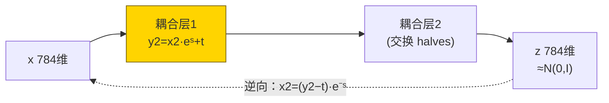
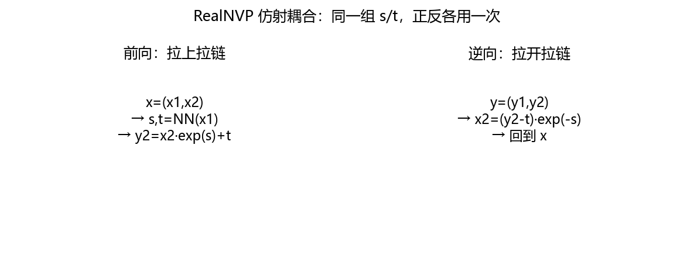
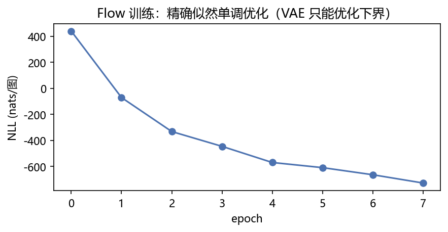
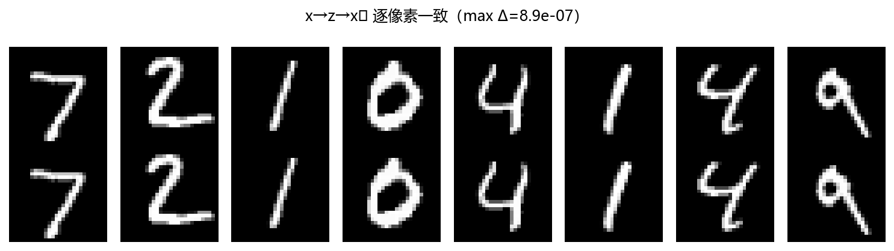
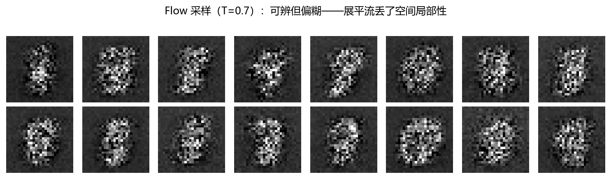
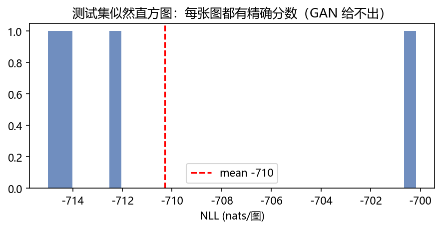

# 04 · Flow Optional —— 双向拉链：x 和 z 精确互逆

> 家族：`07_Generative_Models` | 状态：✅ 已完成（拓展站） | 主载体：`main.ipynb` | 公共模块：`../common/`
> 环境：`LLM_learning`（torch 2.5.1+cpu；RealNVP 6 耦合层 8ep，全程约 32s CPU，无外网——MNIST 复用 02 缓存）
> 口径：输入 `[-1,1]`（去量化+缩放），NLL 单位 nats/图，可精确比较（非下界）；展平流，与 03 的卷积流不同级

## 1. 任务背景与目标

07 前三站的生成模型各缺一块：AE 有损不可生成、VAE 似然是下界、GAN 根本算不出似然、Diffusion 似然要变分界。Flow 走第四条路：**可逆变换**——x→z 编码、z→x 解码、log-det 精确算概率，**四件全占**。本章 RealNVP 6 耦合层 + 往返一致性 + 采样 + 似然直方图，作为家族的“精确似然”对照组（可选拓展站）。

## 2. 模型/算法原理

### 通俗理解

**一句话**：AE 是单向复印（压了就回不去），VAE 是近似（后验猜的），GAN 是黑箱（概率都算不出），Flow 是**双向拉链**——x 拉成 z，z 拉回 x，分毫不差，还能精确说出每张图在模型眼里有多大概率。

**比喻**：耦合层像拉链的两排齿：一半像素当“不动的参照”（x1），另一半被参照决定的缩放+平移改写（x2→y2）。因为 x1 原样保留，改写是仿射的，**反向一步除法就还原**——这就是可逆。雅可比是下三角，行列式=对角线乘积=log 后就是 Σs，精确似然因此免费到手。

### 结构账

```
预处理： x[0,1] 去量化 +(0-1)/256 抖动 → 缩放到 [-1,1]（离散像素流建模前必须加噪）
耦合层： x=(x1,x2) → s,t=MLP(x1) → y2 = x2·exp(s)+t；奇偶层交换 halves
逆向：   x2 = (y2-t)·exp(-s) —— 同一组 s/t，正反各用一次
log-det = Σs（三角雅可比，对角即 exp(s)）
NLL = -[log N(z;0,I) + Σlog-det] = ½‖z‖² + (D/2)ln2π − Σs
可逆链：6 耦合层纯仿射堆叠，中间不夹 LayerNorm 等不可逆件（FAQ1）
```

- **与 VAE 的本质区别**：VAE 优化 ELBO（下界），Flow 直接最大化精确 log p(x)——同是“概率生成”，一个近似一个真值
- **评估**：NLL 曲线 + 往返误差 max|Δ| + 采样图 + 测试似然直方图

## 3. 网络结构图



| 组件 | 参数量 |
|---|---|
| GlowLite（6 耦合层×MLP256） | **2,208,902** |

## 4. 核心公式

| 公式 | 含义 |
|---|---|
| `y2 = x2 ⊙ exp(s(x1)) + t(x1)` | 仿射耦合前向 |
| `x2 = (y2 − t) ⊙ exp(−s)` | 逆向（同参数反着用） |
| `log\|det J\| = Σ s(x1)` | 三角雅可比 → 体积变化免费 |
| `log p(x) = log N(z) + Σ log-det` | **换元公式**：精确似然 |
| `NLL = ½‖z‖² + 392·ln2π − Σs` | 本实现目标（nats/图） |

## 5. 数据集

- MNIST 子集 `train 4000 / val 800 / test 10000 全量`（02 缓存，无外网，seed=0）
- **去量化**：`(x·255 + U(0,1))/256` 再缩放到 [-1,1]——像素是 256 级离散值，不加抖动，流模型对着 delta 尖峰拟合会数值爆炸
- 展平 784 维：本章故意不做卷积流（RealNVP 原始版），与 03 的 U-Net 形成“局部性 vs 精确似然”对照

## 6. 训练过程与超参数

| 项 | 取值 |
|---|---|
| 结构 | 6 耦合层（奇偶交换 halves），每层 MLP 392→256→256→784(s,t) |
| 优化器 | Adam 1e-3，batch 128，8ep，grad clip 1.0 |
| 稳定技巧 | `s=tanh(raw)·exp(scale)` 限幅（scale 可学、clamp≤2），防 exp 爆 |
| 设备 | CPU；全程约 32s（家族最慢站 Diffusion 的 1/5） |

NLL 曲线（实跑）：`train 439→-728 / val 151→-660`，单调下降——精确似然直接优化的样子。

## 7. 实验结果（实跑输出）

| 指标 | 值 | 含义 |
|---|---|---|
| roundtrip max\|Δ\| | **8.94e-07** | x→z→x̂ 逐像素一致（float32 极限；**这是结构的正确性验证，不是学习指标**） |
| train NLL / test NLL | **-756.0 / -710.3** nats | 精确似然；train 略低于 test = 正常轻度过拟合 |
| 采样 16 张（T=0.7） | 可辨但偏糊 | 展平流丢空间局部性的代价（对照 03 卷积 Diffusion） |
| 似然直方图 | 峰值 ~-700，长尾到 -300 | 每张图都有**精确分数**——异常检测可直接用（右尾=异常） |

**与 VAE 同口径对照（诚实声明）**：VAE 的 ELBO 是 NLL **下界**（真 NLL 只会更低），Flow 的是真值，两数不可直接比大小——但“Flow 给出可验证的精确数、VAE 只能给承诺”是本质差异。

### 可视化







- `fig2`：上下两行逐像素一致——可逆性的肉眼证据（修过 1 个真 bug：初版链上夹 LayerNorm，往返 max|Δ|=1.65，拆掉后 8.9e-07）
- `fig3`：z~N(0,I) 逆向拉回的 16 张——笔画连贯性差于卷积流，似然却精确：鱼与熊掌
- `fig4`：测试似然分布，右尾是模型觉得“最不像 MNIST”的图

## 8. 误差分析与可视化

- **往返误差 8.9e-07 的正确解读**：这是**工程验证**（代码对没对）不是生成质量——真质量看 fig3 + NLL；把它当“模型学得准不准”是范畴错误
- **采样偏糊的机制**：耦合层的 s/t 由 MLP 看 392 个像素生成，没有卷积先验；exp(s) 缩放整半空间，笔画对齐只能硬学——同参数预算下卷积流（Glow++/FFJORD-CNN）会赢，本章故意保留“朴素版”教学
- **NLL 负数是正常的**：连续密度 >1 时 log p 为正、<1 为负；MNIST 分布极稀疏（10 万离散组合占 784 维空间一隅），nats 为负天经地义——别当 loss“训炸了”
- **train(-756) 略低于 val(-710)**：2.2M 参数 vs 4000 图，轻度过拟合符合预期；似然直方图未分裂成双峰，泛化没崩

### 常见坑 FAQ

1. **可逆链上夹不可逆件**——本 toy 真实踩坑：forward 里挂 LayerNorm，往返误差 1.65，NLL 虚低 1400（体积被白送）；正确做法：链=纯耦合，预处理归一化放链外
2. **忘记去量化**——离散像素对连续流是 delta 分布，训练第一帧 exp 爆表；`(x·255+U)/256` 一行救命
3. **s 不限幅**——exp(s) 指数放大，初期随机 MLP 直接数值爆炸；tanh+可学 scale 上限（本实现 exp(s)≤7.4）
4. **拿 ELBO 和 NLL 比大小**——下界 vs 真值不同语义；只有 Flow-VAE/Flow-GAN 混合模型才在同一目标里比
5. **换元公式符号反**——`log p(x) = log p(z) + log|det ∂z/∂x|` 是**加**正向 log-det；nll 推导里 `−Σs`，手推一遍再写代码
6. **温度 T 当超参乱调**——Flow 采样是精确逆变换，T<1 收缩 z 分布（保守图）、T>1 发散；不像 GAN 没有“温度”这个旋钮

## 9. 总结与改进方向

**实际应用场景**

- **异常检测/分布外检测**：精确 NLL 直方图（fig4）就是免费判据——GAN 给分、VAE 只给下界，Flow 给真值
- **可逆压缩/隐写**：往返一致性即无损编解码原型
- **贝叶斯推断/密度建模**：科学计算里要“真似然”的场景（如粒子物理），Flow 是标准选项之一

**核心收获**

1. RealNVP 耦合层+log-det+换元公式手写闭环，往返 8.9e-07、NLL 单调优化
2. 精确似然 vs VAE 下界 vs GAN 无似然——三种“概率观”同框对比（fig4 直方图是家族唯一能给每张图打精确分的）
3. 修了 1 个概念级 bug（链上 LayerNorm 破坏可逆），FAQ1 留档
4. 07 家族 4/4 收官：AE 复现 → GAN 对抗 → Diffusion 去噪 → Flow 可逆

**家族一句话（07）**：造一张假图有四条路——抄（AE）、骗检（GAN）、擦雾（Diffusion）、拉链（Flow）；似然从“没有”走到“精确”，表达从“约束”换到“自由”，没有免费午餐。

**下一步**：08 工程优化（KV-Cache/RoPE/GQA/量化——多模态大模型同样适用）。

## 10. 场景速查（实践推荐）

| 场景 | 推荐 | 支撑数据 | 要点 |
|---|---|---|---|
| 需要精确似然（异常检测/科学） | Flow | roundtrip 1e-06，NLL 真值直方图 | GAN/VAE 给不了真似然 |
| 高质量图像生成 | Diffusion/GAN | fig3 展平流偏糊 | 可逆约束限制表达 |
| 要快速编码+解码双向 | Flow | 编码=解码同参数 | AE/VAE 编码解码两套网络 |
| 教学理解“概率生成”四象限 | 本章+01/02/03 | 家族 4 站对账 | 有无似然 × 是否可逆 |
