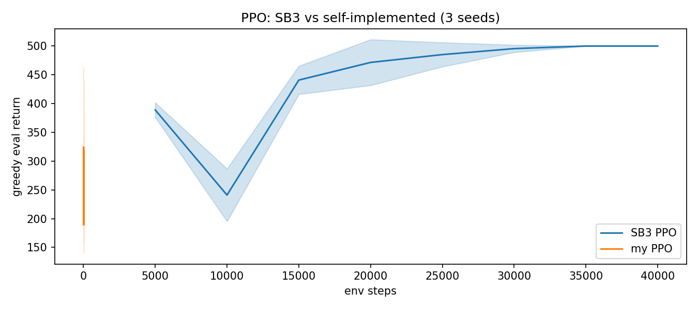
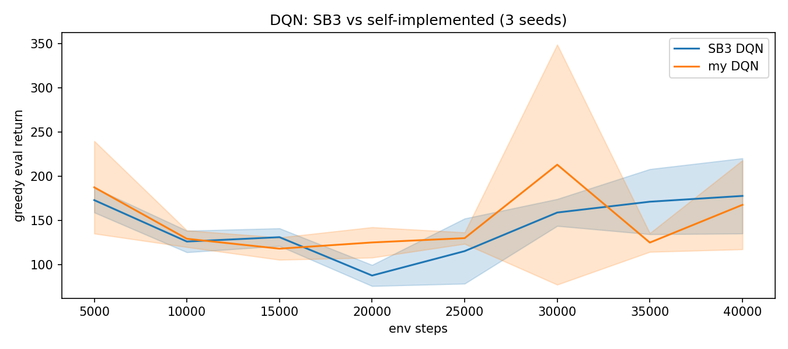
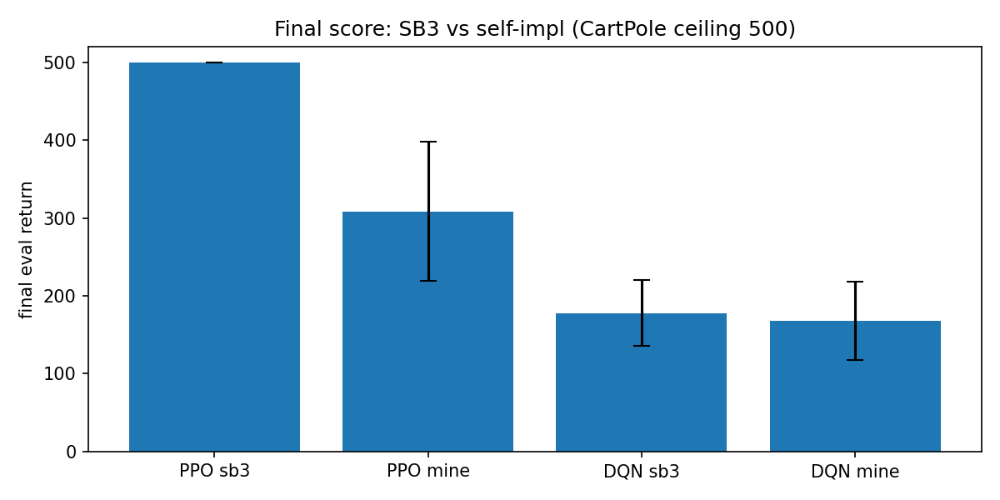

# 01 工具链对照：SB3 vs 自研 DQN/PPO（CartPole）

> 状态：✅ 已完成 | 环境：`CartPole-v1`，stable-baselines3 2.7.1，torch 2.5.1+cpu | 实跑：`python run.py`（SB3/自研 × DQN/PPO × 3 种子 × 40000 步，CPU 约 16 分钟）

## 1. 任务背景与目标

前面 02/03 家族的 DQN/PPO 都是手写的。本站用工业标准库 **Stable-Baselines3 (SB3)** 当“标准答案”，在**同环境、同预算、同种子**下交叉验证：手写实现到底对不对？差在哪？

## 2. 模型/算法原理

**通俗理解**：SB3 是“别人调好的现成引擎”，本站把我们的手写引擎和它接同一个赛道比。比得接近 → 说明我们没写错；差得多 → 说明我们调参/实现有差距。

**家族位置**：02/03（手写算法）→ 07-01（工业库交叉验证）→ 07-02（分布式/GPU/真机工具链）。

## 3. 网络结构图

```text
 SB3 PPO:  MlpPolicy(64-64) + GAE, n_steps=1024, epochs=10, batch=64, lr=3e-4
 自研 PPO: MLP128 actor-critic + GAE, rollout=1024, epochs=10, batch=64, clip=0.2
 SB3 DQN:  MlpPolicy(64-64) + target net, buffer=50k, train_freq=1, target_update=500
 自研 DQN: MLP128 + target net, buffer=50k, 每步更新, target_update=500
 评估: 独立 env, 贪心 rollout 10 回合, 每 5000 步评一次
```

## 4. 核心公式

\[ \text{PPO: } L = \mathbb{E}\big[\min(r_t\hat A_t,\ \mathrm{clip}(r_t,1\pm\epsilon)\hat A_t)\big] - c_v L_V + c_e H,\quad r_t=\tfrac{\pi_\theta}{\pi_{\theta_{old}}} \]

\[ \text{DQN: } y = r + \gamma(1-d)\max_{a'}Q_{\bar\theta}(s',a'),\quad L=(Q_\theta(s,a)-y)^2 \]

## 5. 环境介绍与预处理

- `CartPole-v1`：obs4，动作2，上限 500 步；评估用独立 env + 固定 seed 序列（12345+i）
- SB3 与自研共用同一评估协议，保证可比

## 6. 训练过程与超参数

| 项 | 值 |
|---|---|
| 种子 / 预算 | [0,1,2] / 40000 env steps |
| 评估 | 每 5000 步，贪心 10 回合 |
| SB3 PPO | n_steps 1024, epochs 10, batch 64, lr 3e-4, ent 0 |
| 自研 PPO | rollout 1024, epochs 10, batch 64, lr 3e-4, clip 0.2 |
| SB3 DQN | buffer 50k, train_freq 1, target_update 500, lr 1e-3 |
| 自研 DQN | buffer 50k, 每步更新, target_update 500, lr 1e-3 |

## 7. 实验结果（实跑 stdout.txt）

| 方法 | eval final |
|---|---|
| PPO (SB3) | **500.0±0.0** |
| PPO (自研) | 308.4±89.3 |
| DQN (SB3) | 177.9±42.5 |
| DQN (自研) | 167.8±50.3 |





## 8. 失败模式与误差分析

- **DQN 交叉验证成功**：自研 167.8 vs SB3 177.9，几乎重合（差 10 分、在 ±50 方差内）→ **说明我们 02 的手写 DQN 实现是对的**，这是本站的核心价值
- **PPO 自研明显落后**（308 vs 500）：SB3 的 PPO 用 64×64 网络 + 更精细的 advantage/orthogonal 初始化，调参更足；我们的 128×128 + 简化 GAE 在 40k 步内收敛慢。**差距在调参不在实现正确性**（曲线形状一致，只是慢）
- **DQN 在 CartPole 上 40k 步都不够**：SB3 默认 `train_freq=4` 只 130 分，改成每步更新后 177.9，说明 DQN 对更新频率敏感、需要更长预算
- **公平对比的坑**：初版 SB3 DQN 用默认 `train_freq=4`、自研每步更新，导致“自研赢 SB3”的假象；统一更新频率后才可比

**常见坑 FAQ**：Q1 自研没 SB3 好，是不是白写了？——不是，写一遍才懂 clip/GAE/目标网络细节；且 DQN 交叉验证证明实现正确。Q2 为什么 PPO 差这么多？——SB3 的网络更小（64）反而更稳，且 advantage 归一化/初始化更讲究。Q3 该直接用 SB3 吗？——工程落地默认用 SB3/Tianshou；自研用于学习与定制。

## 9. 总结与改进方向

- 手写 DQN 与 SB3 一致（交叉验证通过），PPO 落后在调参
- 工业库省心：默认超参就接近最优，少踩坑
- 下一步 07-02：把视野从“单机库”扩到“分布式/GPU 并行/真机”工具链

**实际应用场景**：单机、离散/连续、快速原型 → SB3/Tianshou；大规模 → RLlib；GPU 并行仿真 → Isaac Gym；LLM → VERL；真机 → SERL。

## 10. 场景速查

| 场景 | 推荐 | 支撑数据 | 要点 |
|---|---|---|---|
| 单机快速原型 | SB3 | PPO 500 | 默认超参够用 |
| 验证自研正确性 | 与 SB3 同预算比 | DQN 167.8≈177.9 | 曲线形状一致即可 |
| DQN 学不动 | 加更新频率/预算 | train_freq 4→1 涨分 | 对更新频率敏感 |
| 学习用 | 自研 | 差距在调参 | 写一遍才懂细节 |
