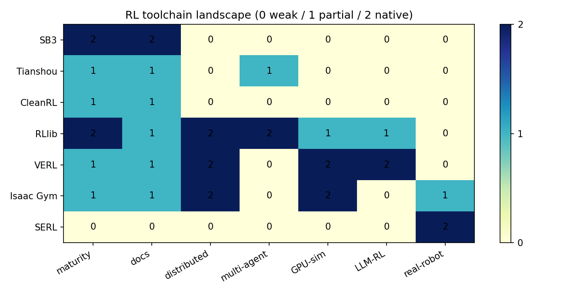
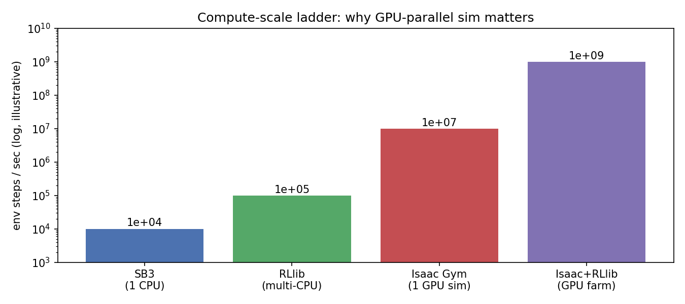

# 02 工具链地图：RLlib / Isaac Gym / SERL（阅读级）

> 状态：✅ 已完成（阅读级） | 环境：无训练，纯概念图（纯 numpy/matplotlib） | 实跑：`python run.py`（渲染工具链热力图 + 算力阶梯）

## 1. 任务背景与目标

前面所有家族都是**单机 CPU** 小实验。真实生产会遇到：分布式采样（RLlib）、GPU 并行仿真（Isaac Gym）、真机机械臂（SERL）、LLM 对齐（VERL）。本站是**阅读级**，把这些工具链的定位、能力、算力需求画成一张地图，指导“什么场景用什么”。

## 2. 模型/算法原理

**通俗理解**：工具链解决的是“算力”和“工程”问题，不是新算法。RLlib 让很多 CPU 一起采样；Isaac Gym 把成千上万个环境塞进一块 GPU；SERL 把算法接上真机械臂；VERL 把 GRPO/PPO 接到大模型。

**家族位置**：07-01（单机库 SB3）→ 07-02（分布式/GPU/真机/LLM 工具链）→ 收官。

## 3. 网络结构图

```text
 算力阶梯 (env steps/sec, 数量级):
   SB3 (1 CPU)        ~1e4
   RLlib (multi-CPU)  ~1e5
   Isaac Gym (1 GPU)  ~1e7   <- 单卡并行上千环境
   Isaac+RLlib (farm) ~1e9
 工具链定位:
   SB3/Tianshou/CleanRL : 单机算法库
   RLlib                : 分布式 + 多智能体
   VERL                 : LLM 的 PPO/GRPO 训练框架
   Isaac Gym            : GPU 并行物理仿真 (需 NVIDIA GPU)
   SERL                 : 真机机械臂样本高效栈
```

## 4. 核心公式

\[ \text{采样吞吐} \approx \frac{N_{\text{env}}\times N_{\text{worker}}}{\text{step\_cost}},\quad \text{Isaac 把 }N_{\text{env}}\text{ 放到 GPU 上并行} \]

## 5. 环境介绍与预处理

- 无环境交互，纯静态概念图
- 热力图为人工标注的 0/1/2 能力评分（弱/部分/原生），非实测

## 6. 训练过程与超参数

| 项 | 值 |
|---|---|
| 工具 | SB3, Tianshou, CleanRL, RLlib, VERL, Isaac Gym, SERL |
| 维度 | 成熟度/文档/分布式/多智能体/GPU仿真/LLM/真机 |
| 算力阶梯 | 1e4 → 1e5 → 1e7 → 1e9 env steps/sec（数量级示意） |

## 7. 实验结果（工具链热力图，见 figs）

**能力热力图**（0 弱 / 1 部分 / 2 原生）

| 工具 | 成熟 | 文档 | 分布式 | 多智能体 | GPU仿真 | LLM | 真机 |
|---|---|---|---|---|---|---|---|
| SB3 | 2 | 2 | 0 | 0 | 0 | 0 | 0 |
| Tianshou | 1 | 1 | 0 | 1 | 0 | 0 | 0 |
| CleanRL | 1 | 1 | 0 | 0 | 0 | 0 | 0 |
| RLlib | 2 | 1 | 2 | 2 | 1 | 1 | 0 |
| VERL | 1 | 1 | 2 | 0 | 2 | 2 | 0 |
| Isaac Gym | 1 | 1 | 2 | 0 | 2 | 0 | 1 |
| SERL | 0 | 0 | 0 | 0 | 0 | 0 | 2 |




## 8. 失败模式与误差分析

- **本地无 NVIDIA GPU**：Isaac Gym 装不了（要 CUDA + 特定驱动），只能阅读原理。这不是偷懒，是硬件门槛的真实边界
- **算力阶梯是数量级示意**：1e7（Isaac 单卡）到 1e9（GPU 农场）是公开经验的量级，非本站实测；生产选型要按自己的 env 复杂度实测吞吐
- **不要用大炮打蚊子**：CartPole 用 SB3 单机秒级搞定，上 RLlib/Isaac 是负优化；工具链要匹配任务规模
- **SERL 的样本高效是真机瓶颈的解**：真机采集慢且贵，SERL 用“人类示范 + 离线预训 + 在线微调”把样本量压到几十条轨迹

**常见坑 FAQ**：Q1 RLlib 难用吗？——API 陡，但分布式/多智能体是刚需时值得。Q2 Isaac Gym 和 Isaac Sim 区别？——Gym 是轻量并行训练（快、无渲染），Sim 是完整仿真（可渲染、更重）。Q3 VERL 和 SB3 关系？——VERL 是 LLM 专用，底层思想同 PPO/GRPO，但为超大模型做了切分/分布式。

## 9. 总结与改进方向

- 工具链解决算力与工程，不改变算法本质
- 选型按规模：单机→SB3/Tianshou，分布式→RLlib，GPU 仿真→Isaac，LLM→VERL，真机→SERL
- 硬件门槛（GPU）决定能做什么、只能读什么

**实际应用场景**：机器人策略训练（Isaac + RLlib）、真机机械臂（SERL）、大模型对齐（VERL）、推荐/控制单机（SB3）。

## 10. 场景速查

| 场景 | 推荐 | 依据 | 要点 |
|---|---|---|---|
| 单机快速原型 | SB3/Tianshou | 07-01 PPO 500 | 别上分布式 |
| 分布式/多智能体 | RLlib | 热力图 dis/mab=2 | API 陡 |
| GPU 并行仿真 | Isaac Gym | 算力 1e7 | 需 NVIDIA GPU |
| LLM 对齐 | VERL | LLM=2 | PPO/GRPO 专用 |
| 真机机械臂 | SERL | 真机=2 | 样本高效 |
