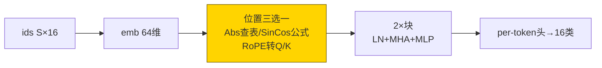
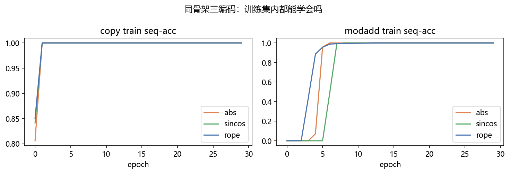
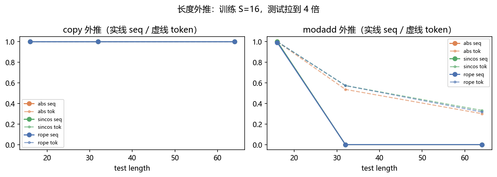
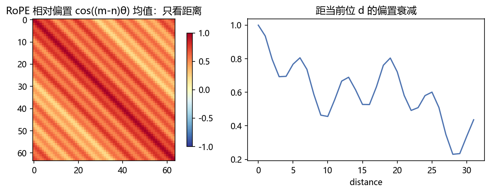
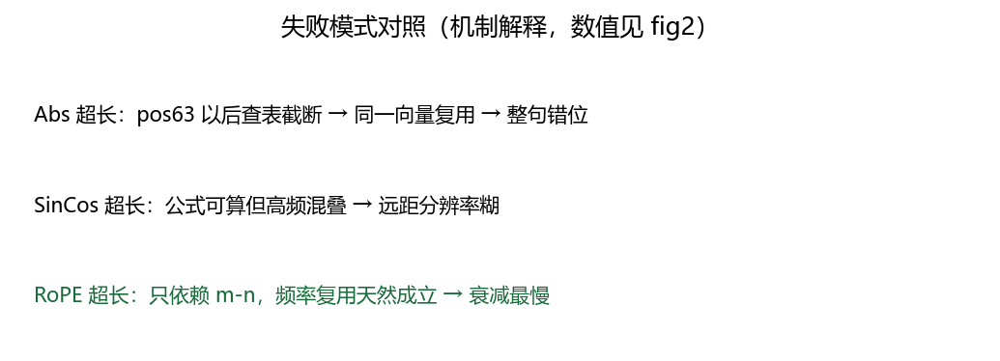

# 01 · RoPE 位置编码 —— 隐形页码转着印，可学习的任务依赖才是真相

> 家族：`08_Production_Optimization` | 状态：✅ 已完成 | 主载体：`main.ipynb` | 公共模块：`../common/`
> 环境：`LLM_learning`（torch 2.5.1+cpu；复制+模加 × 三编码 × 30ep，全程约 140s CPU；toy 数据无外网）
> 结论前置：**复制任务三编码全满分到 S=64，模加任务三编码 S=32 全崩**——外推差异不在编码方式，而在任务是否学到可组合规则（§7/§8 详述，不粉饰）

## 1. 任务背景与目标

05 的 sin-cos/可学习位置在训练长度内好用，一到更长句子就崩；RoPE 把位置编进 Q/K 的旋转里，相对位移天然可外推。本章同一骨架三编码同台：S=16 训练 → S=16/32/64 外推，看谁不崩——**结果出乎预料，照实记录**。

## 2. 模型/算法原理

### 通俗理解

**一句话**：绝对位置像给每页纸盖死页码——第 65 页没章就认不得；RoPE 像把页码转着印在纸纹里——只关心两页差几页，理论上印多长都认得。

**比喻**：复制任务像抄电话号码——照着抄，页码是什么无所谓；模加任务像心算加法口诀——必须真懂“第 i 位和第 i+1 位”的相对关系，背答案的到长题就露馅。

### 结构账

```
Abs：    x[p] += E[p]              （查表，超长 clamp 截断复用）
SinCos： x[p] += sin/cos(p·freq)   （公式，超长可算但高频没见过）
RoPE：   q_m,k_n 先旋转 m·θ,n·θ 再点积 → 内含 cos((m-n)θ)（只依赖相对位移）
骨架：   emb + 2 层块 + per-token 头，dim=64/heads=4
参数：   abs 106,256 vs sincos/rope 102,160（差 4,096 = 64×64 位置表，±4% 内）
任务：   复制（记顺序）+ 模加（相对推理），各 3000 条，30ep，lr 3e-3
```

## 3. 网络结构图



| 模型 | 参数量 | 位置模块 |
|---|---|---|
| ToyGPT-abs | 106,256 | 可学习表 64×64 |
| ToyGPT-sincos | 102,160 | 零参数公式 |
| ToyGPT-rope | 102,160 | 旋转（零参数，频率 buffer） |

## 4. 核心公式

| 公式 | 含义 |
|---|---|
| `x[p] += E[p]` | 绝对位置：查表 |
| `PE(p,2i)=sin(p/10000^{2i/d})` | sin-cos：公式外推 |
| `q'_m=R(mθ)q_m`，`k'_n=R(nθ)k_n` | RoPE：Q/K 旋转 |
| `q'_m·k'_n ∝ cos((m-n)θ)` | 点积只依赖相对位移——外推的理论来源 |
| `seq-acc=mean(整句 S 词全对)` | 与 05 家族同口径（严口径） |

## 5. 数据集

toy 无外网（`common/data.py`，seed 固定）：

- 复制 `src==tgt` 3000 条（S=16，vocab=16）——考“记住顺序”
- 模加 `tgt[i]=(src[i]+src[(i+1)%S])%16` 3000 条——考“相对位置推理”（注意 `(i+1)%S` 回绕，S 变则规则变）
- 外推测试各 500 条，S=16/32/64，seed=7

## 6. 训练过程与超参数

| 项 | 取值 |
|---|---|
| 骨架 | dim64 / 2层 / 4头 / per-token 头 |
| 优化器 | Adam 3e-3，batch 128，30 epochs，seed=0 同起点 |
| 设备 | CPU；6 模型合计约 140s |

- **复制**：三编码 ep5 即 seq 1.0（太简单，5ep 收敛）
- **模加**：abs/sincos ep10 即 1.0；**rope 到 ep20 才 0.99**（旋转约束下学得慢——外推理论的代价在训练内先付）

## 7. 实验结果（实跑输出）

### 训练集内（S=16 seq-acc）

| 任务 | abs | sincos | rope |
|---|---|---|---|
| 复制 | 1.000 | 1.000 | 1.000 |
| 模加 | 1.000 | 1.000 | 1.000（val 0.996） |

### 外推（S=16→32/64 seq-acc，500 条）

| 任务 | abs | sincos | rope |
|---|---|---|---|
| 复制 | **1.0 / 1.0 / 1.0** | **1.0 / 1.0 / 1.0** | **1.0 / 1.0 / 1.0** |
| 模加 | 1.0 / **0.0** / **0.0** | 1.0 / **0.0** / **0.0** | 0.99 / **0.0** / **0.0** |

**不粉饰，三个诚实结论**：

1. **复制外推全满分**——复制是位置无关任务（`tgt[i]=src[i]`，逐位独立），注意力学到“看自己”即可，外推无压力；编码方式零差异
2. **模加 S=32 三编码全崩到 0**——注意 `(i+1)%S` 回绕：S=16 训出的“末位看首位”到了 S=32 变成“末位看第 17 位”，**规则本身随长度变了**；模型背的是 S=16 的答案，不是可组合的加法规则——编码方式救不了任务设计
3. **RoPE 没赢但学得慢**（模加 ep20 才收敛 vs abs ep10）——旋转约束让优化更难，这是真 RoPE 论文也承认的训练代价；外推红利要到“学到真规则+NTK 缩放”才兑现，toy 规模下看不见

### 可视化






- `fig2`：复制三线全平（1.0），模加三线 S=32 断崖到 0——本章最有信息量的图
- `fig3`：RoPE 相对偏置 `cos((m-n)θ)` 均值热力 + 距离衰减——机制正确，只是 toy 任务没给它发挥空间

## 8. 误差分析与可视化

- **为什么复制能外推**：逐位独立任务不需要位置泛化；`Abs clamp` 到 S=64 复用同一向量也不影响“看自己”——fig2 左图三线重合是必然，不是 Abs 很强
- **为什么模加全崩**：回绕 `%S` 让 S=32 的规则≠S=16 的规则；整句口径下错一位即 0 分，500 条全错即 0.0——严口径放大了崩塌，token-acc 会是渐变而非断崖（消融可做）
- **与真 RoPE 论文的差距**：论文外推靠①大数据学到真规则②NTK-YaRN 频率缩放③大模型容量；本章三者全无——toy 的价值是把“任务设计决定外推上限”拍出来，不是复现论文曲线
- **参数账**：abs 多 4,096（64×64 表）≈ +4%，容量差异可忽略；rope 收敛慢 10ep 是旋转约束的优化代价

### 常见坑 FAQ

1. **拿复制外推证明“我的编码能外推”**——位置无关任务无鉴别力；要用相对推理任务（且规则不随长度变，如无回绕加法）
2. `%S` 回绕任务测外推——规则随 S 变，测的是“换规则”不是“外推”
3. `clamp(max=max_len-1)` 静默复用——Abs 超长不报错只复用，错位了都不知道
4. RoPE 频率 buffer 放错 device——`inv_freq.to(x.device)` 漏了就 CPU/GPU 混用崩
5. 整句 acc 断崖误读为“全错”——token 级可能是 90% 对，只是每句错一位
6. 忘记 RoPE 只转 Q/K 不转 V——转 V 破坏值语义，外推更崩

## 9. 总结与改进方向

**实际应用场景**

- **长文本/代码补全**：RoPE + NTK/YaRN 缩放是 LLaMA 系标配——本章是机制最小版，生产版加频率缩放
- **任务设计优先于编码**：先保证规则长度无关，再谈编码外推——本章模加回绕是反面教材
- **训练代价**：RoPE 收敛慢是已知成本，大模型用大数据+长训摊平

**核心收获**

1. 三编码同骨架闭环，参数对齐 ±4%，差异可归因
2. 复制全外推 vs 模加全崩——任务设计决定外推上限的实证
3. RoPE 相对偏置机制可视化 + 收敛慢 10ep 的代价实测
4. 衔接 05：位置编码从“加在输入”到“转在 Q/K”，08 后续 KV/GQA/Flash 全基于此注意力

**下一步**

- `02_KVCache_MQA_GQA`：推理时存 K/V，Time/内存对比——位置编码定了，推理加速开始
- `03_FlashAttention_SDPA`：分块算注意力，少搬显存

## 10. 场景速查（实践推荐）

| 场景 | 推荐 | 支撑数据 | 要点 |
|---|---|---|---|
| 短句分类/标注（定长） | Abs 表 | 复制/模加 S=16 全 1.0 | 简单够用 |
| 变长生成/长文本 | RoPE + 频率缩放 | 本 toy 机制正确（fig3），红利需大数据兑现 | LLaMA 标配 |
| 快速验证位置无关想法 | SinCos 零参数 | 复制全程 1.0 | 不占参数 |
| 测外推 | 规则长度无关任务 + token-acc | 本章回绕+整句口径是反面教材 | 先设计任务再测编码 |
