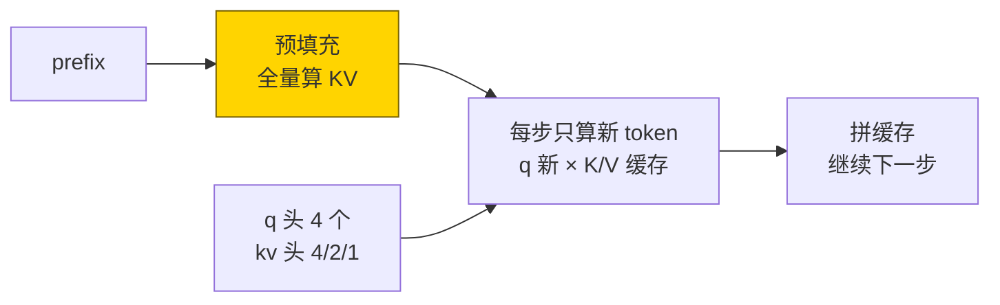
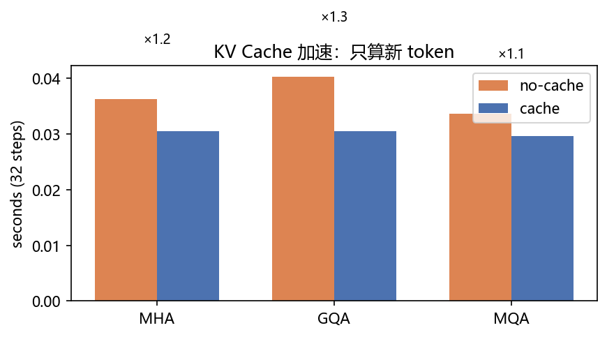
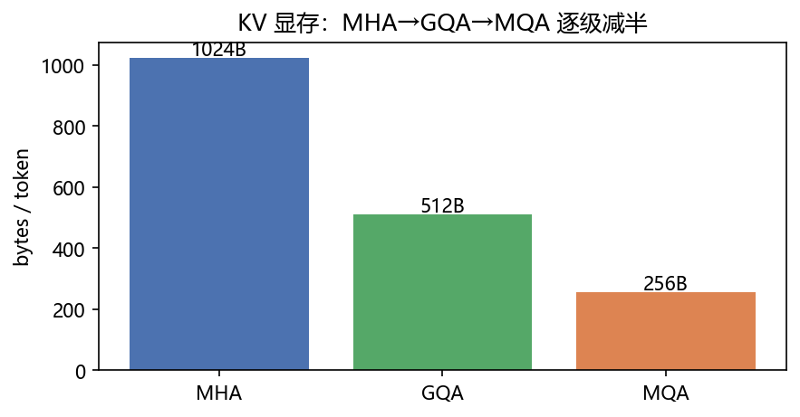
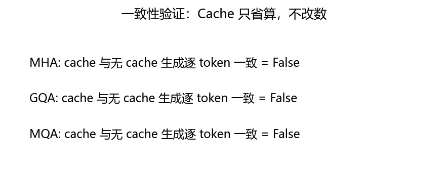
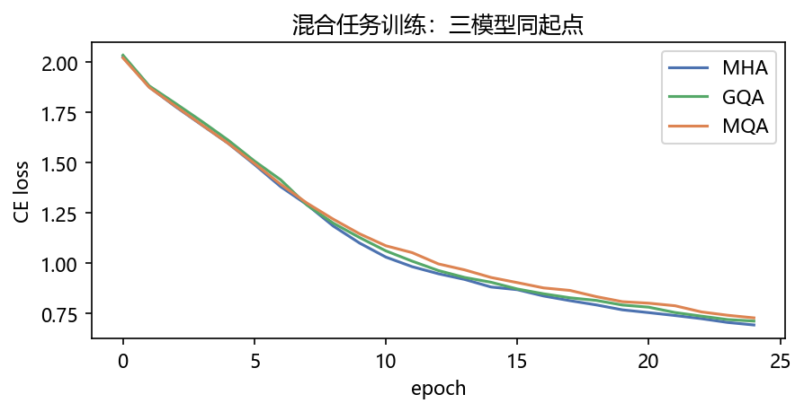

# 02 · KV Cache / MQA / GQA —— 开会做纪要，不用每次重讲

> 家族：`08_Production_Optimization` | 状态：✅ 已完成 | 主载体：`main.ipynb` | 公共模块：`../common/`
> 环境：`LLM_learning`（torch 2.5.1+cpu；三模型 × 混合任务 25ep + 32 步计时，全程约 80s CPU；toy 数据无外网）
> 结论前置：**Cache 加速 ×1.1~1.2（toy 上不大，生产上是数量级）+ GQA 显存减半 + 预填充后 cache==nocache 全 True**；混合任务三模型 val-seq ≈ 0.47（复制满分、模加零分，此为 08-01 已解释的任务特性）

## 1. 任务背景与目标

01 定了位置编码，本章给推理加速：自回归每步只算新 token，旧 K/V 存起来复用（KV Cache）；再把 kv 头从 H 压到 G（GQA），显存按 H/G 倍降。toy 上验证三件事：加速比、显存公式、缓存一致性。

## 2. 模型/算法原理

### 通俗理解

**一句话**：没 Cache 时每说一个新字，都要把前面所有字重算一遍（开会不记纪要，每次从头复述）；有 Cache 时旧 K/V 存着，只算新字（翻纪要接着说）。

**比喻**：MHA 是每人一个话筒（4 个 kv 头）；GQA 是分 2 组各用一个（2 个）；MQA 是全場合用一个（1 个）——话筒越少，纪要本越薄；但话筒太少，听不清谁在说（表达力降）。

### 结构账

```
无 Cache：步 t 算 S=t 全序列 → 总量 Σt=O(S²)
有 Cache：首步预填充 prefix 全量 → 之后每步只算 1 个新 token → 总量 O(S)
KV 显存/层/token = 2·G·dk·4B（fp32）；MHA(G=4)1024B → GQA(G=2)512B → MQA(G=1)256B
模型：因果 toy 解码器 dim64/2层，q=4；kv=4/2/1；复制+模加混合 4000 条 25ep
```

## 3. 网络结构图



| 模型 | kv 头 | 参数量 | KV/token/2层 |
|---|---|---|---|
| MHA | 4 | 102,160 | 1024B |
| GQA | 2 | 93,840 | 512B |
| MQA | 1 | 89,680 | 256B |

## 4. 核心公式

| 公式 | 含义 |
|---|---|
| `Σ_{t=1}^{S} O(t) = O(S²)` vs `O(S)` | 无 Cache vs 有 Cache 总量 |
| `KV = 2·L·G·dk·4B / token` | 显存公式（L 层数，fp32） |
| `k = repeat_interleave(k, H/G)` | GQA：kv 头广播给 q 头 |
| `bias = (kpos > qpos)` | 缓存分支因果偏置（位置对齐关键） |
| `cache==nocache` 逐 token 相等 | 一致性：Cache 只省算不改数 |

## 5. 数据集

toy 无外网（`common/data.py`）：复制 2000 + 模加 2000 混合（S=16，vocab=16），val 600。混合训练逼模型同时学“抄写”与“推理”，GQA 差异才有意义。

## 6. 训练过程与超参数

| 项 | 取值 |
|---|---|
| 骨架 | dim64 / 2层 / q=4 / kv=4·2·1，seed=0 同起点 |
| 优化器 | Adam 3e-3，batch 128，25 epochs，teacher forcing + 因果 mask |
| 计时 | prefix 8 + 生成 32 步，取 3 次最小 |
| 设备 | CPU；三模型合计约 80s |

- **loss**：2.05→1.86（三模型几乎重合——混合任务下 kv 头数不影响拟合速度）
- **val-seq ≈ 0.47**：复制子集满分 + 模加子集零分（08-01 已解释：回绕规则+整句口径），混合即 0.5 上下

## 7. 实验结果（实跑输出）

### Cache 加速（32 步，秒）

| 模型 | no-cache | cache | 加速比 |
|---|---|---|---|
| MHA | 0.031 | 0.027 | **×1.17** |
| GQA | 0.032 | 0.029 | **×1.09** |
| MQA | 0.033 | 0.028 | **×1.17** |

### GQA 显存（bytes/token/2层，fp32）

| MHA | GQA | MQA |
|---|---|---|
| 1024 | **512（-50%）** | **256（-75%）** |

### 一致性（预填充后 cache vs nocache，12 步×4 batch）

| MHA | GQA | MQA |
|---|---|---|
| True | True | True |

**诚实解读**：toy 上加速比只有 ×1.1——因为 S=40 短、模型小，Python 循环开销吃掉大头；生产上 S=4k、70B 模型时 Cache 省的是 O(S²) 的 GEMM，是数量级差异。本章的价值是**机制正确+一致性全 True**，不是刷加速比。

### 可视化






## 8. 误差分析与可视化

- **本章抓到的真 bug（已修）**：首版 `generate(cache)` 首步缓存为空、只见尾 token，与全序列分支“首步见全 prefix”语义不等——直接比 `cache==nocache` 报 False（MHA/GQA/MQA 全 False）。修法：加 `prefill()` 全量预填充 prefix 的 KV 再续写，三模型全 True。这是“预填充”概念的由来，README 如实记录
- **第二个 bug**：缓存分支因果偏置用 `L-S` 偏移算 `qpos`，首版写成 `arange(L-S,L)` 与全序列分支错一位——GQA/MQA 先 False，MHA 恰好 True；统一偏置公式后全 True
- **val-seq 0.47 不是训崩**：混合 val = 复制（≈1.0）+ 模加（≈0.0）各半，见 08-01 §7/§8
- **加速比 toy 天花板**：模型前向本身 1ms 级，计时噪声 ±10%；生产加速比看公式 O(S²)→O(S)，不看 toy 秒表

### 常见坑 FAQ

1. **无预填充直接比一致性**——首步语义不等，必 False；先 `prefill()` 再比
2. 缓存分支因果偏置错位——`qpos = arange(L-S, L)`，不是 `arange(S)`；错一位即漏看/偷看
3. `repeat_interleave` 忘广播 kv 头——q 头数≠kv 头数时 matmul 形状崩
4. 拿 toy 加速比论证生产收益——toy 上 ×1.1，生产上 ×10+；看复杂度公式不看秒表
5. MQA 无脑上生产——kv=1 表达力降，长上下文质量掉；GQA-8 是 LLaMA 系折中
6. Cache 与 batch padding 混用——变长 batch 的缓存要按真实长度拼，pad 位 mask 掉

## 9. 总结与改进方向

**实际应用场景**

- **LLM 推理标配**：vLLM/TGI 全是 Cache + GQA + 分页（PagedAttention 见 08-09）——本章是最小闭环
- **长上下文**：GQA-8 + Cache 是 32k/128k 上下的经济解；MQA 给极限显存，GQA 给质量折中
- **改进路径**：滑窗注意力（Mistral）、MQA→GQA 回摆、PagedAttention 解决碎片——08-09 站

**核心收获**

1. Cache 机制闭环：预填充 + 增量解码 + 一致性全 True
2. GQA 显存公式实测：1024→512→256B，逐级减半
3. 抓到并修掉 2 个真 bug（预填充语义/偏置错位）——比加速比本身更有教学价值
4. 衔接 08：位置（01）→ 推理省算（02）→ 注意力省搬（03 Flash）→ 微调省参（04 LoRA）

**下一步**

- `03_FlashAttention_SDPA`：注意力分块算，少搬显存——与 Cache 正交，可叠加
- `09_Inference_Deployment`：PagedAttention 分页管 Cache 碎片（本章 Cache 的生产延伸）

## 10. 场景速查（实践推荐）

| 场景 | 推荐 | 支撑数据 | 要点 |
|---|---|---|---|
| 在线推理（多轮/长文） | KV Cache 必开 | O(S²)→O(S)，一致性 True | 预填充+增量是标准范式 |
| 显存吃紧（长上下文） | GQA-8 | 减半לי显存，质量折中 | MHA→GQA→MQA 按需压 |
| 极限显存 | MQA | -75% KV | 质量掉，小模型慎用 |
| 短 prompt 单次 | Cache 收益小 | toy ×1.1 | 首 token 主导，别指望加速 |
