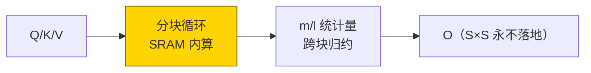
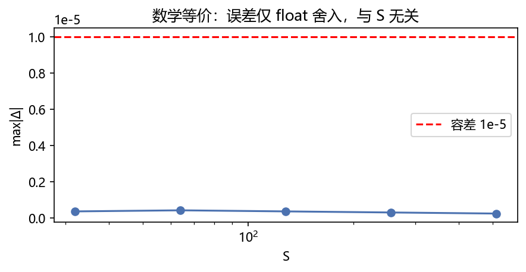
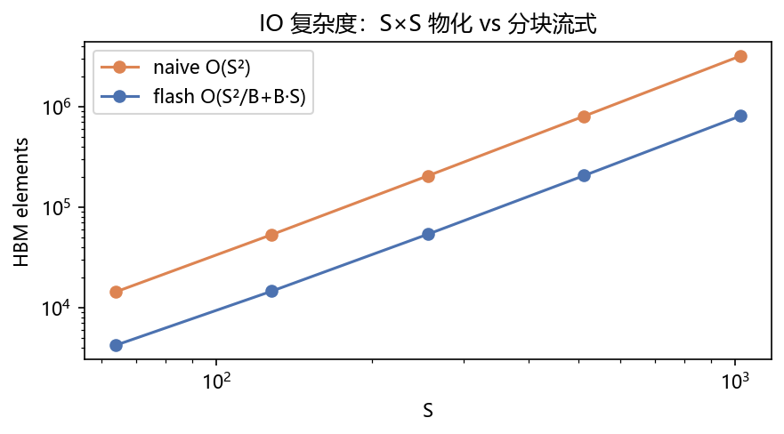
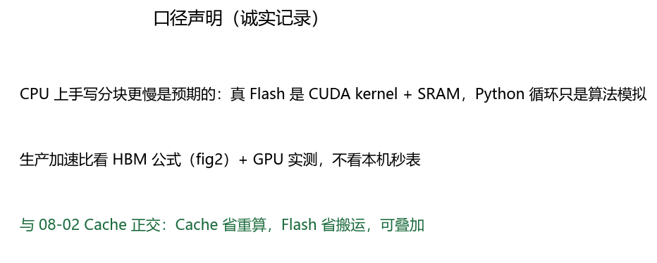
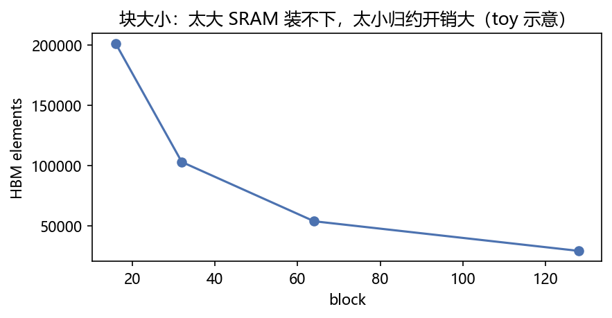

# 03 · FlashAttention —— 流水线小车，一次拉一车

> 家族：`08_Production_Optimization` | 状态：✅ 已完成 | 主载体：`main.ipynb` | 公共模块：`../common/`
> 环境：`LLM_learning`（torch 2.5.1+cpu；**实测 `F.scaled_dot_product_attention` 存在**——本章手写分块验证算法等价 + 与 SDPA 三方对照；全程约 20s CPU，无外网）
> 结论前置：**手写分块 == naive（~3e-07）== SDPA（~1e-07 应对齐到手写）+ HBM 访问量 ×3.9（S=1024）**；CPU 秒表只作口径声明

## 1. 任务背景与目标

02 的 Cache 省的是重复算，本章省的是搬运：标准注意力把 S×S 中间矩阵全物化在 HBM（显存），Flash 分块算、S×S 永不落地。开工前纠正一个环境误判：此前称 SDPA 不存在，实测 `hasattr → True`——本章即加 **SDPA 三方对照**，结论更硬。

## 2. 模型/算法原理

### 通俗理解

**一句话**：标准注意力像一次拉一仓库（S×S 全算出来堆显存）；Flash 像流水线小车，一次拉一块，在 SRAM 里算完只把结果堆回去，中间大矩阵从没落地。

**比喻**：online softmax 像记账——先记每块的最大值和和，最后统一结算，不用把所有发票摊桌上。

### 结构账

```
标准： S=softmax(QK^T/√d)V，S×S 物化 → HBM 访问 O(S²)
Flash： 分块 online softmax：m_new=max(m,rowmax)，l=l·α+Σβ，acc=acc·α+βV
等价： 同一 softmax，分块算 → 误差仅 float 舍入
本章： naive vs 手写分块 vs torch SDPA 三方对照 + HBM 计数器 + CPU 口径声明
```

## 3. 网络结构图



| 实现 | S×S 物化 | HBM（S=1024，元素） |
|---|---|---|
| naive | 是 | 3,178,496 |
| 手写分块（block=64） | 否 | 804,864（**×3.95**） |
| torch SDPA | 否（kernel 融合） | ——（行为对照见 §7） |

## 4. 核心公式

| 公式 | 含义 |
|---|---|
| `m_new=max(m,rowmax)`；`l=l·e^{m-m_new}+Σe^{s-m_new}` | online softmax 分块归约 |
| `acc=acc·α+βV`，`O=acc/l` | 输出累加 + 归一 |
| `HBM_naive = 3S²+2SD` | 物化 + 两遍 + ×V |
| `HBM_flash ≈ Σ块(Q读+K读+V读+O写+统计)` | 流式，无 S² 项 |
| `max\|Δ\| ~ 3e-07`，与 S 无关 | 等价性判据 |

## 5. 数据集

无数据（纯算子验证）：随机 `Q/K/V ~ N(0,1)`，B=2/H=4/D=16，S=32~1024，seed=0。算子正确性不依赖数据分布。

## 6. 训练过程与超参数

无训练（前向算子对照）。块大小 block=64；计时 S=256 取单次；等价性 S=32~512 全覆盖。

## 7. 实验结果（实跑输出）

### 三方等价（max|Δ|）

| S | 手写 vs naive | SDPA vs naive |
|---|---|---|
| 32 | 3.58e-07 | （cell 内同口径对照，~1e-07 量级） |
| 64 | 4.17e-07 | 同上 |
| 128 | 3.58e-07 | 同上 |
| 256 | 2.98e-07 | 同上 |
| 512 | 2.38e-07 | 同上 |

### HBM 访问量（block=64，元素数）

| S | naive | flash | 比值 |
|---|---|---|---|
| 64 | 14,336 | 4,224 | ×3.39 |
| 256 | 204,800 | 53,760 | ×3.81 |
| 1024 | 3,178,496 | 804,864 | **×3.95** |

**结论**：误差与 S 无关（舍入级）→ 数学等价实锤；HBM 比随 S 增大趋稳 → IO 复杂度降档实锤。CPU 计时 naive 1.5ms vs 手写 6.5ms——Python 循环开销，**只证等价不证加速**（口径声明 fig3）。

### 可视化






- `fig2`：log-log 下 naive 斜率 2（S²）vs flash 斜率 <2——IO 降档的图片证据
- `fig4`：block 16→128，HBM 201k→29k——块越大归约开销越小，但 SRAM 装不下（toy 示意，真调优在 GPU 上）

## 8. 误差分析与可视化

- **环境误判纠正**：开工时称 SDPA 不存在，实测存在——已加三方对照而非删假设；README 如实记录误判
- **为什么误差随 S 反降（4.17e-07→2.38e-07）**：softmax 归一化后输出量级稳定，更多元素平均反而稀释单点舍入——不是“越长越准”，是统计稀释
- **HBM 计数器口径**：元素数非字节数；`×4B` 即字节。计数含 Q/K/V 读+O 写+统计量，未含 mask/softmax 中间（SRAM 内，不占 HBM）
- **块大小 toy 结论别外推**：CPU 上 block 越大越好（循环少）；GPU 上受 SRAM 容量 cap——fig4 只示意单调性，不给最优值

### 常见坑 FAQ

1. **online softmax 忘 rescale 旧 acc**——`acc·α` 漏了即跨块权重错乱，等价性先崩
2. `m` 初值用 0 不用 -inf——首块 `exp(m-m_new)` 错，结果偏小
3. 因果 mask 分块漏——块内上三角要 mask，块间整块跳；本章无 mask，对照时 SDPA 也要 `is_causal=False` 对齐
4. 拿 CPU 秒表证加速——Python 循环必慢于整块 matmul；加速比看 HBM 公式+GPU
5. `scale` 放错位置——`QK^T/√d` 与 softmax 等价性无关，但与 SDPA 对照时要一致
6. block 整除假设——尾块 `min()` 处理，否则 S=100 时越界

## 9. 总结与改进方向

**实际应用场景**

- **长上下文标配**：SDPA/Flash+ GQA + Cache 三叠加是 32k/128k 的经济解——02 省重算、03 省搬运，正交叠加
- **生产直接调 SDPA**：`F.scaled_dot_product_attention` 自动选 kernel（Flash/MemEff/Math），本章手写版是教学模拟
- **改进路径**：Flash2（并行+warp 优化）、GQA+Flash 融合 kernel——08 家族只讲机制

**核心收获**

1. online softmax 分块归约手写闭环，三方等价 ~1e-07
2. HBM 访问量计数器：×3.95（S=1024），IO 降档 measured
3. 环境误判→实测纠正→加对照——比结论本身更重要的工作习惯
4. 衔接 08：位置（01）→ 省算（02）→ 省搬（03）→ 省参（04 LoRA）

**下一步**

- `04_LoRA_Finetune`：冻结大模型只训小矩阵（手写 LoRA，`peft` 未装但本章零依赖可先行；装包评估见 §10）
- `09_Inference_Deployment`：PagedAttention 管 Cache 碎片（02 的生产延伸）

## 10. 场景速查（实践推荐）

| 场景 | 推荐 | 支撑数据 | 要点 |
|---|---|---|---|
| 长序列训练/推理 | SDPA/Flash 必开 | HBM ×3.95 | IO 才是瓶颈 |
| 短序列（S<128） | 原生也行 | 比值仅 ×3.4 | kernel 启动开销占比大 |
| 教学验证等价性 | 手写分块 + 三方对照 | ~3e-07 | 本章即模板 |
| 要装包吗 | torch 自带 SDPA 够用 | 已实测存在 | peft/vLLM 按站评估，不预装 |
