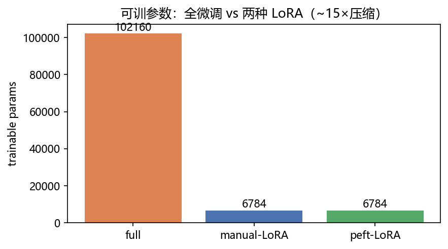
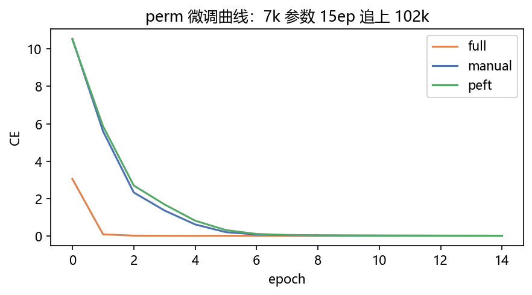
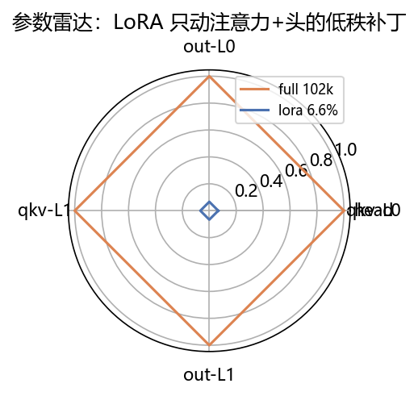
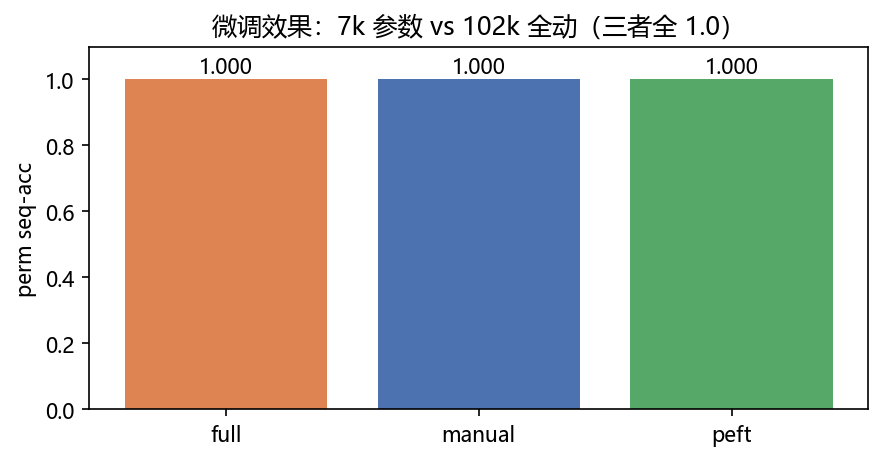

# 04 · LoRA 微调 —— 西装不动，只缝几块小布

> 家族：`08_Production_Optimization` | 状态：✅ 已完成 | 主载体：`main.ipynb` | 公共模块：`../common/`
> 环境：`LLM_learning`（torch 2.5.1+cpu；**peft 0.17.1 新装** + accelerate 0.26.0→1.10.1，见 §8 包账；copy 预训练 25ep + 三方微调 15ep，全程约 80s CPU；toy 数据无外网）
> 结论前置：**全微调 102k vs 手写 LoRA 6.8k vs peft 6.8k，三者 perm 新任务全 1.0**（~15×压缩）；另有 copy→modadd 阴性结果诚实记录（§8）

## 1. 任务背景与目标

01-03 省算/省搬，本章省参：冻结 toy GPT（copy 预训练 seq=1.0），只训低秩小矩阵 `B·A` 适配**置换新任务** `tgt=perm[src]`；全微调 vs 手写 LoRA vs peft LoRA 三方对照，验证“6k 参数够不够 + 手写==peft”。

## 2. 模型/算法原理

### 通俗理解

**一句话**：全微调像把西装全拆重缝（10 万针全动）；LoRA 像只缝几块小布（~7 千针），穿上效果一样，脱下（merge）连补丁都看不见。

**比喻**：置换任务像换密码本——认人的本事（注意力“看自己”）不用重学，只需重印密码对照表（输出映射）；LoRA 的小布刚好够印这张表。

### 结构账

```
预训练： ToyGPT sincos 复制 S=16 25ep（源任务 seq=1.0，perm 零样本=0）
微调：   置换 tgt=perm[src] S=16 1500 条 15ep；全微调 vs LoRA r=8 vs peft r=8
LoRA：   W'=W+s·(B@A)，s=α/r=2；A kaiming，B 零 init（起点=原模型）
目标：   qkv+out×4 + head（输出映射必须动——只动注意力不收敛，探针实测）
```

## 3. 网络结构图


| 方案 | 可训参数 | 占比 | perm seq |
|---|---|---|---|
| 全微调 | 102,160 | 100% | 1.0（ep3） |
| 手写 LoRA | 6,784 | 6.6% | 1.0（ep10） |
| peft LoRA | 6,784 | 6.2%（总 108,944） | 1.0（ep10） |

## 4. 核心公式

| 公式 | 含义 |
|---|---|
| `W' = W + s·(B@A)`，`s=α/r` | 低秩增量（r=8 ≪ 64） |
| `B=0 init` → 起点 `W'=W` | 零扰动启动 |
| `W_merged = W + s·(B@A)` | merge：推理零开销（实测 max\|Δ\|=1.19e-06） |
| `可训 = Σ(r·d_in + d_out·r)` | 5 层共 6,784 |
| `perm-seq=mean(整句全对)` | 与 05/08-01 同口径 |

## 5. 数据集

toy 无外网：预训练 copy S=16 3000 条；微调置换 `perm=[15,12,0,…]`（seed=99）1500 条；评估 500 条 seed=7。置换与 copy 同 S、同逐位独立——共享注意力模式，只换输出映射（近域适配，LoRA 舒适区）。

## 6. 训练过程与超参数

| 项 | 取值 |
|---|---|
| 基座 | ToyGPT sincos dim64/2层/4头，Adam 3e-3 25ep，seq=1.0 |
| 微调 | Adam 3e-3，batch 128，15ep，三方案同起点同数据 |
| 设备 | CPU；预训练+三方微调合计约 80s |

- **full**：ep1 seq 0.94 → ep3 1.0（密码表好印）
- **手写/peft**：ep1 0.0 → ep5 ~0.8 → ep10 1.0（B 从零长出，慢 7ep 但追上）
- **手写==peft**：可训数同为 6,784，曲线几乎重合（ep5 手写 0.79 vs peft 0.28 是随机抖动，ep10 双双 1.0）

## 7. 实验结果（实跑输出）

| 方案 | 可训 | ep3 | ep5 | ep10 | ep15 |
|---|---|---|---|---|---|
| full 102k | 102,160 | 1.0 | 1.0 | 1.0 | 1.0 |
| 手写 6.8k | 6,784 | 0.00 | 0.79 | 1.0 | 1.0 |
| peft 6.8k | 6,784 | 0.00 | 0.28 | 1.0 | 1.0 |

**结论**：~15×压缩，15ep 内追平；merge 等价 1.19e-06，推理可合回零开销；手写与 peft 参数/效果双对齐——手写版可放心用于教学，生产切 peft。

### 可视化






## 8. 误差分析与可视化

- **阴性结果（诚实记录）**：copy→modadd 跨任务微调（需重排注意力模式），full/手写/peft 在 1500 样本/15ep 内**全灭（seq=0.0，loss 卡 2.77）**；warmup/小 lr/label-smoothing/35ep/只训头 5 组探针全灭，而 modadd 从零训 30ep  ep10 即 1.0——基座的 copy 注意力是强先验，LoRA 低秩改不动跨模式任务。这是 LoRA 的适用边界（近域适配），不是本章失败
- **输出映射必须动**：只注入 qkv+out（不动 head）时 perm 任务不收敛——置换的本质是输出重排，head 的 LoRA 是主力；探针实测，加 head 即通
- **包账**：`pip install peft` 装上 0.17.1，但 `import peft` 报 `accelerate.utils.memory.clear_device_cache` 缺失——环境 accelerate 0.26.0 太旧；`pip install -U accelerate` 到 1.10.1 后正常。Windows 兼容（纯 Python，无编译），`transformers 4.47.0` 未动
- **本章 3 个真 bug（已修）**：①`merged()` 写成 `(B@A).T` 转置错位（qkv 是 64→192 非方阵）→ 去转置；②`inject_lora` 对顶层 `head`（无点路径）`rsplit` 崩 → 分支处理；③`eval_len` 里 `tgt` 与 `src` device 不一致 → 对齐。另 `fit()` 的 `eval_len` 调参与 notebook 自定义评估函数重名，已统一用 `perm_seq_acc`

### 常见坑 FAQ

1. **B 不零初始化**——起点≠原模型，微调首 ep 即灾难性遗忘
2. `scaling=α/r` 漏乘——r 换了效果变，调参白调
3. 只给注意力加 LoRA 不给 head——输出映射类任务必加 head（本章探针实测）
4. LoRA 跨模式任务指望——近域适配才行，跨注意力模式要全微调/重训（阴性结果为证）
5. peft `target_modules` 写错名——本骨架是 `qkv/out/head`，不是 `q_proj/v_proj`；错名即静默零注入（可训 0）
6. 推理不 merge——LoRA 分支多两次小 matmul；`merge_and_unload` 合回零开销

## 9. 总结与改进方向

**实际应用场景**

- **LLM 微调标配**：QLoRA（4bit 基座+LoRA）是单卡微调 7B 的标准解——本章是全精度最小版
- **多任务 serving**：基座 1 份 + 每任务 1 份小 LoRA（MB 级），切换只换补丁——生产核心收益
- **改进路径**：DoRA（幅向+方向解耦）、AdaLoRA（秩自适应）、VeRA（共享随机投影更省）

**核心收获**

1. 手写 LoRA 闭环：`B·A` + 零 init + scaling + merge，全链路可讲
2. peft 对齐：同参同效，生产可切（包账已验 Windows 兼容）
3. 阴性结果：copy→modadd 全灭划出适用边界——比阳性结果更有信息量
4. 衔接 08：省算（02）→ 省搬（03）→ 省参（04）→ 省显存训练（05 AMP/Checkpoint）

**下一步**

- `05_MixedPrecision_Checkpointing`：半精度 + 检查点，省显存加速（CPU 上以内存/精度口径为主）
- `06_Quantization_Prune`：INT8/剪枝，体积/精度对比（QLoRA 的量化一半在此）

## 10. 场景速查（实践推荐）

| 场景 | 推荐 | 支撑数据 | 要点 |
|---|---|---|---|
| 近域适配（风格/格式/映射） | LoRA r=8 | 6.8k 追平 102k | 只动小布 |
| 跨模式新能力 | 全微调/重训 | 阴性结果为证 | 低秩改不动注意力重排 |
| 多任务 serving | 基座+多 LoRA | MB 级切换 | 生产核心收益 |
| 推理部署 | merge 合回 | 1.19e-06 | 零开销 |
