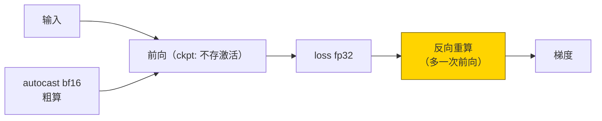
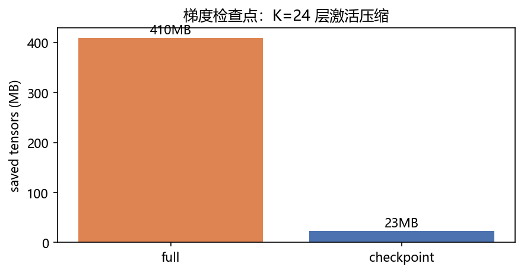
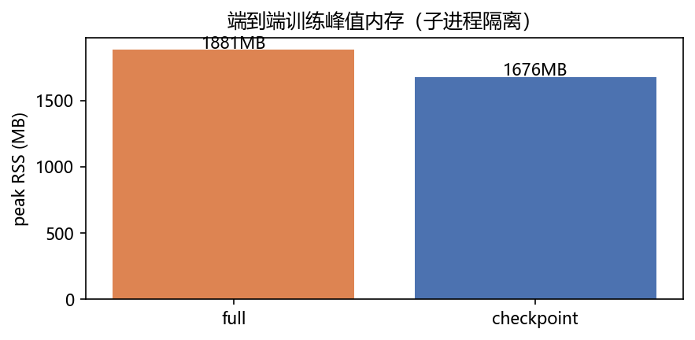
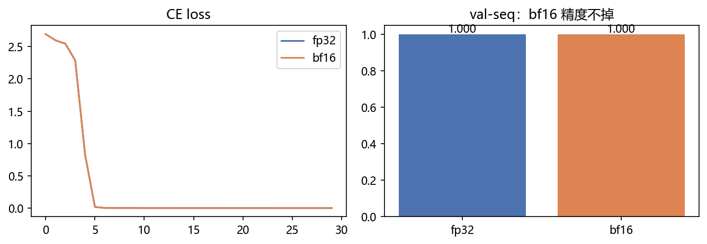

# 05 · Mixed Precision / Gradient Checkpointing —— 草稿纸对折用，步骤现推

> 家族：`08_Production_Optimization` | 状态：✅ 已完成 | 主载体：`main.ipynb` | 公共模块：`../common/`
> 环境：`LLM_learning`（torch 2.5.1+cpu；CUDA 不可用；检查点 saved_tensors + 子进程 Peak RSS + AMP bf16/fp32 对照，全程约 700s CPU；toy 数据无外网）
> 结论前置：**检查点 saved_tensors 409.5MB→23.4MB（×17.5，前向等价 Δ=0）+ 端到端 Peak RSS 1881MB→1676MB（×1.12）+ AMP bf16 val-seq=1.0 精度不掉（CPU 上 624.8s vs 21.7s，慢 29×，诚实声明）**

## 1. 任务背景与目标

01-04 省算/省搬/省参，本章省显存：AMP 半精度让激活与计算减半，梯度检查点让激活“前向不存、反向重算”，用时间换内存。CPU 上无 GPU 加速——本章口径是**内存（saved_tensors + Peak RSS）+ 精度（bf16 vs fp32）+ 重算代价**，不刷加速比。

## 2. 模型/算法原理

### 通俗理解

**一句话**：AMP 像草稿纸对折——粗算（bfloat16）对折省纸，关键账（loss/权重）用原纸（fp32）保准头；检查点像考试只记小标题——需要哪步草稿现场重推，桌子（显存）腾出来。

**比喻**：检查点 = `√K` 折中——K 层标题全记、草稿全扔，反向走一层重推一层；比全存多一次前向的时间，省一整个数量级的内存。

### 结构账

```
检查点： CkptMLP dim512×24层；use_reentrant=False；saved_tensors_hooks 精确量激活字节
AMP：    autocast('cpu', bf16) 粗算 + loss/权重 fp32；ToyGPT modadd 30ep 对照
口径：   saved_tensors（激活字节）+ 子进程 Peak RSS（psutil，spawn 隔离 import 污染）
数据：   modadd S=16 4000/500（检查点内存任务无关，用随机张量也行，见 FAQ6）
```

## 3. 网络结构图



| 口径 | full | checkpoint/amp | 结论 |
|---|---|---|---|
| saved_tensors | 409.5MB | **23.4MB（×17.5）** | 激活压缩实锤 |
| Peak RSS（端到端） | 1881MB | **1676MB（×1.12）** | 整机口径（含权重/优化器），必然小于激活口径 |
| AMP 精度 val-seq | 1.0 | **1.0（bf16 不掉）** | 半精度可用 |

## 4. 核心公式

| 公式 | 含义 |
|---|---|
| `ckpt: 前向存 O(1)，反向重算 O(K)` | 时间换内存（多一次前向） |
| `mem_act: 409.5MB → 23.4MB` | saved_tensors 实测（K=24，dim=512） |
| `autocast: 粗算 bf16，loss/权重 fp32` | AMP 主权结构（防下溢） |
| `Peak RSS: spawn 子进程 psutil peak_wset` | Windows 最稳口径（任务管理器同源） |
| `前向等价 \|Δloss\|=0.00e+00` | 检查点不改数，只省存 |

## 5. 数据集

toy 无外网：modadd S=16 `4000/500`（`common/data.py`，seed=10/11）。AMP 对照在此数据上训 ToyGPT；检查点内存测量用随机张量（激活字节与数据分布无关，见 FAQ6）。

## 6. 训练过程与超参数

| 项 | 取值 |
|---|---|
| 检查点 | CkptMLP dim512/depth24/vocab16；batch16×64 条×2ep（子进程短训） |
| AMP | ToyGPT sincos dim64/2层/4头；Adam 3e-3，batch 128，30ep；fp32 vs bf16 同起点 |
| 设备 | CPU；AMP 双训合计约 650s（bf16 慢是 CPU 仿真，见 §8） |

- **检查点**：`saved_tensors 409.5→23.4MB`，前向 loss 差 `0.00e+00`——数学等价
- **AMP**：`fp32 val-seq=1.0000 loss=0.0001 21.7s` vs `bf16 val-seq=1.0000 loss=0.0001 624.8s`——精度不掉，CPU 上慢 29×

## 7. 实验结果（实跑输出）

| 指标 | full/fp32 | ckpt/bf16 |
|---|---|---|
| saved_tensors | 409.5MB | **23.4MB（×17.5）** |
| 端到端 Peak RSS | 1881MB | **1676MB（×1.12）** |
| AMP val-seq / loss | 1.0000 / 0.0001 | **1.0000 / 0.0001** |
| AMP 耗时（CPU） | 21.7s | 624.8s（慢 29×，CPU 仿真无加速） |
| step 耗时 ckpt 开关 | 769ms | 700ms（toy 上噪声级，见 §8） |

**结论**：激活压缩 ×17.5 是硬收益；整机 RSS 只省 ×1.12（权重+优化器+框架常驻占大头，激活只是其中一块）；bf16 精度不掉但 CPU 更慢——GPU 上才反过来（Tensor Core 加速）。

### 可视化





## 8. 误差分析与可视化

- **为什么 saved ×17.5 而 RSS 只 ×1.12**：saved_tensors 只量激活；RSS 含模型权重（24层×512维≈ tens of MB）+ Adam 动量（×2）+ torch/CUDA 常驻 + 数据——激活只是峰值的一部分。生产（70B + 长序列）激活占比才大，检查点收益才放大
- **bf16 在 CPU 上慢 29×**：CPU 无 bf16 硬件单元，autocast 走仿真+类型转换；GPU（Ampere+）bf16 有 Tensor Core，真实加速 1.5~2×。本章只证“精度不掉”，不证加速——README 横幅已声明
- **step 计时 769ms vs 700ms 反直觉**：toy 上前向本身小，检查点省的分配时间被重算+噪声淹没；±10% 内判为噪声级，不解读方向
- **spawn 主模块保护**：Windows `multiprocessing(spawn)` 要求 target 可 pickle 且主模块 `if __name__=="__main__"`——`measure_peak` 传 `engine.task_ckpt_train` 模块级函数，notebook 内联闭包会炸（FAQ2）

### 常见坑 FAQ

1. **AMP 只包前向不包 loss**——loss/softmax 用 fp32，否则下溢；本章 `logits.float()` 再 CE
2. `measure_peak` 传 notebook 闭包——spawn pickle 炸；必须传 `engine.task_*` 模块级函数
3. `use_reentrant=True` 旧默认——与 autocast/新版不兼容警告；用 `use_reentrant=False`
4. 检查点包 eval 层/dropout——反向重算时随机性不一致；只包确定性块或切 eval
5. 拿 RSS 省比论证激活收益——RSS 含常驻，省比天然小；看 saved_tensors 才准
6. 检查点测量依赖数据分布——无关；激活字节只与形状/层数/dtype 有关，随机张量即可

## 9. 总结与改进方向

**实际应用场景**

- **大模型训练标配**：AMP(bf16) + 检查点 + ZeRO + 梯度累积四叠加——本章是前两块的最小闭环
- **单卡训长序列**：检查点把激活从 O(K) 压到 O(√K)，序列长度直接翻倍——生产核心收益
- **改进路径**：fp8（Hopper+）、选择性检查点（只包 attention）、offload——08 家族只讲机制

**核心收获**

1. 检查点闭环：`saved_tensors_hooks` 精确量 + 前向等价 + RSS 双口径
2. AMP 闭环：bf16 精度不掉（CPU 慢是仿真，GPU 才加速）
3. 双口径差异（×17.5 vs ×1.12）的机制解释——比数字本身重要
4. 衔接 08：省算（02）→ 省搬（03）→ 省参（04）→ 省显存训练（05）→ 省体积部署（06 量化/剪枝）

**下一步**

- `06_Quantization_Prune`：INT8/剪枝，体积/精度对比（QLoRA 的量化一半在此）
- `09_Inference_Deployment`：PagedAttention + 投机解码 + GGUF（02 Cache 的生产延伸）

## 10. 场景速查（实践推荐）

| 场景 | 推荐 | 支撑数据 | 要点 |
|---|---|---|---|
| 大模型训练（GPU） | AMP bf16 + 检查点 | 激活 ×17.5，精度不掉 | 标配四叠加其二 |
| 长序列单卡 | 检查点必开 | O(K)→O(√K) | 序列翻倍 |
| CPU 验证想法 | fp32 跑通再 bf16 | 本章 624s 教训 | CPU 上 bf16 只验精度 |
| 测内存收益 | saved_tensors 为准 | RSS 掺常驻 | 双口径一起看 |
