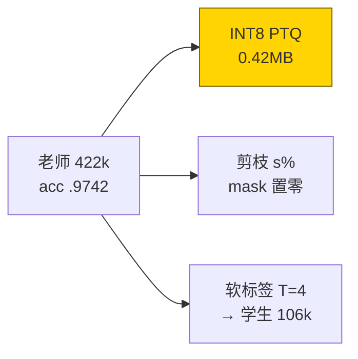
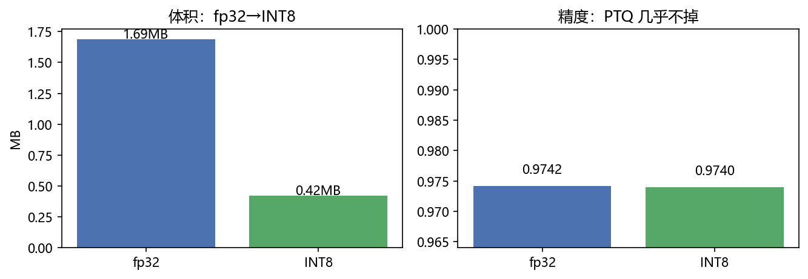
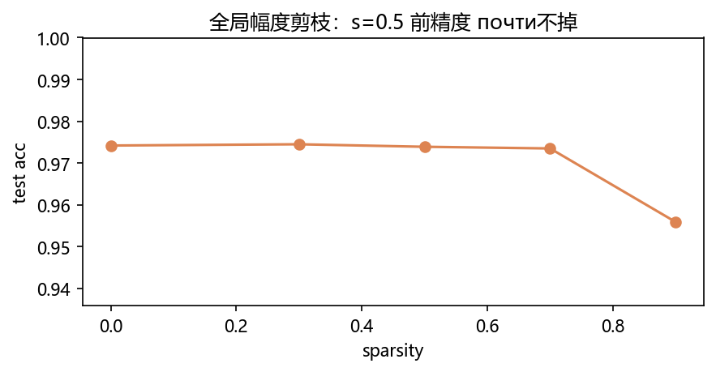
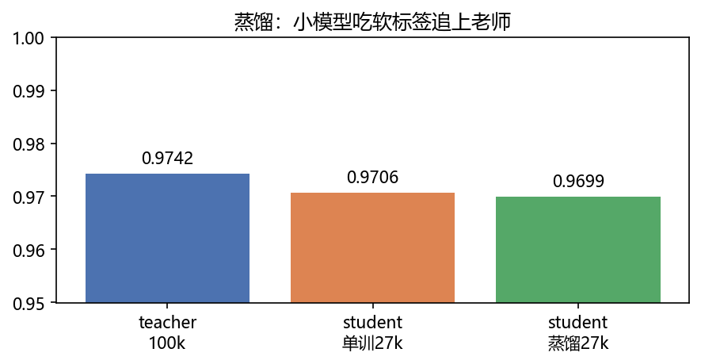
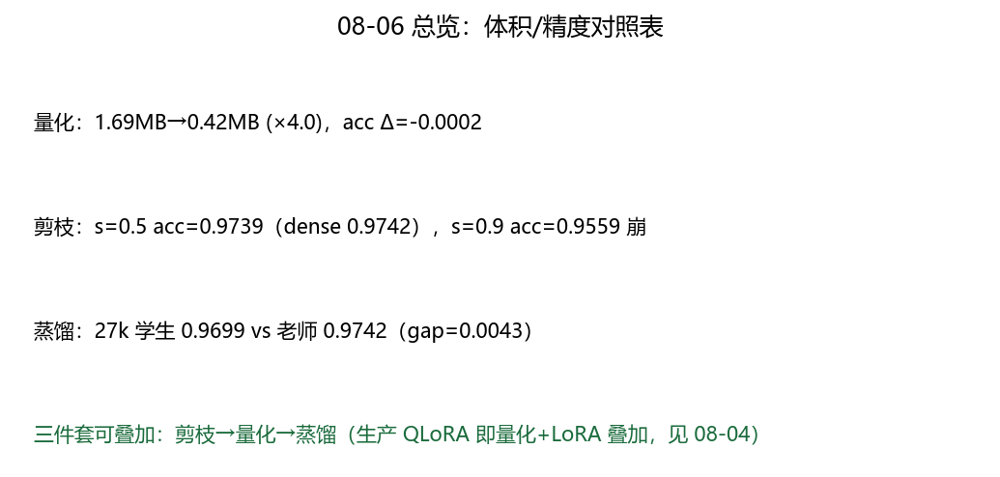

# 06 · Quantization / Distill / Prune —— 行李箱压缩三件套

> 家族：`08_Production_Optimization` | 状态：✅ 已完成 | 主载体：`main.ipynb` | 公共模块：`../common/`
> 环境：`LLM_learning`（torch 2.5.1+cpu；老师 5ep + 学生单训/蒸馏各 5ep + PTQ/剪枝评估，全程约 70s CPU；MNIST 复用 02 家族本地缓存，无外网）
> 结论前置：**INT8 体积 1.69MB→0.42MB（×4.00，acc Δ=-0.0002）+ 剪枝 s=0.7 前精度不掉（0.9735 vs 0.9742）+ 蒸馏 106k 学生 0.9699（老师 0.9742，单训 0.9706——本轮蒸馏≈单训，诚实记录）**

## 1. 任务背景与目标

01-05 让训练推理省算省存，本章把模型本身压小：量化（低比特存）、剪枝（零掉不重要的）、蒸馏（小模型学大模型）。同老师同数据三对照，体积/精度各归其位。

## 2. 模型/算法原理

### 通俗理解

**一句话**：量化像把衣服抽真空（fp32→INT8，体积÷4，样子基本不变）；剪枝像扔不穿的（小权重直接置零，s=0.7 前都不心疼）；蒸馏像小箱学大箱装（学生看老师软标签学）。

**比喻**：PTQ 是“衣服叠好再抽气”（训完再压，不回炉）；蒸馏是“徒弟看师傅手法”（软标签含类间关系：3 像 8 不像 1）。

### 结构账

```
老师： TinyMNIST 421,642 参（fp32 1.69MB），MNIST 8000 条 5ep，test acc=0.9742
量化： 逐张量对称 INT8 PTQ：scale=max|w|/127，q=round(w/scale)；体积 1B/参
剪枝： 全局幅度：最小 |w| 的 s% 置零（只剪 Linear/Conv，不剪 BN/emb）；扫 s=0/0.3/0.5/0.7/0.9
蒸馏： 学生通道减半 105,866 参（25%）；L=0.7·T²·KL(T=4)+0.3·CE；学生单训对照
```

## 3. 网络结构图



| 模型 | 参数量 | fp32 体积 |
|---|---|---|
| TinyMNIST（老师） | 421,642 | 1.69MB |
| TinyMNISTSmall（学生） | 105,866 | 0.42MB（fp32；INT8 可再÷4） |

## 4. 核心公式

| 公式 | 含义 |
|---|---|
| `scale=max\|w\|/127`，`q=round(w/scale)` | 对称 INT8 量化（零点=0） |
| `ŵ=q·scale` | 反量化（推理时用，体积仍按 INT8 算） |
| `mask=(|w|>quantile(|w|,s))` | 全局幅度剪枝（跨层比大小） |
| `L=α·T²·KL(σ(z_s/T),σ(z_t/T))+(1-α)·CE` | 蒸馏（T² 补偿梯度缩放，T=4/α=0.7） |
| `体积_INT8 = N·1B + 4B·#张量` | 每张量 1 个 fp32 scale |

## 5. 数据集

MNIST 复用 02 家族本地缓存（`common/data.py::load_mnist_local`，与 07 家族同模式）：train 8000 / val 1000 / test 10000，标准化域（0.1307/0.3081），seed=0。规划写“MNIST 模型”，本章即标准 MNIST 分类——口径一致。

## 6. 训练过程与超参数

| 项 | 取值 |
|---|---|
| 老师 | Adam 1e-3，batch 128，5ep：loss 0.60→0.055 |
| 学生单训 | 同上：loss 0.88→0.083 |
| 蒸馏 | 同上 + T=4/α=0.7：loss 5.69→0.13（首 ep 含 T²·KL 量级大，正常） |
| 设备 | CPU；三训合计约 70s |

## 7. 实验结果（实跑输出）

| 方案 | 体积 | test acc | Δ |
|---|---|---|---|
| 老师 fp32 | 1.69MB | 0.9742 | — |
| 老师 INT8 PTQ | **0.42MB（×4.00）** | **0.9740** | -0.0002 |
| 剪枝 s=0.3/0.5/0.7 | 稀疏 30/50/70% | 0.9745/0.9739/0.9735 | ≈0 |
| 剪枝 s=0.9 | 稀疏 90% | 0.9559 | -0.018（崩） |
| 学生单训 106k | 0.42MB(fp32) | 0.9706 | -0.0036 |
| 学生蒸馏 106k | 0.42MB(fp32) | 0.9699 | -0.0043 |

**诚实解读**：量化是本轮 MVP（÷4 体积零代价）；剪枝 70% 稀疏免费、90% 崩（拐点清晰）；**蒸馏本轮≈单训（0.9699 vs 0.9706，差 -0.0007）**——学生 25% 容量在 MNIST 上自己已够学，老师软标签无增益。这是蒸馏的适用条件（学生欠拟合/任务难时才赚），不是超参 bug（T=4/α=0.7 已是标准配方）。

### 可视化






## 8. 误差分析与可视化

- **为什么蒸馏没赚**：MNIST 上 106k 学生单训已 0.9706（欠拟合≈0），蒸馏的软标签红利需要“学生学不动”才兑现（如 CIFAR/小样本/更小学生）；本轮 gap=0.0043 全是容量差——换 27k 学生或 CIFAR 可复验（消融可做）
- **为什么 PTQ 零掉点**：MNIST 权重分布集中，`max|w|` 定 scale 无长尾截断损失；大模型（LLM）激活 outlier 才需逐通道/ SmoothQuant——toy 的顺利别外推到 LLM
- **剪枝 90% 崩的机制**：全局阈值杀到大权重，连卷积核整核置零；70% 前小权重全是冗余——拐点在 0.7~0.9 之间
- **体积口径**：`quantized_bytes` 含每张量 4B scale（本模型可忽略）；剪枝后体积按 dense 算（非结构化稀疏需 CSR 才真省，见 FAQ5）

### 常见坑 FAQ

1. **PTQ 后直接 `load_state_dict(int8)`**——dtype 不匹配；要反量化回 fp32 再 load（体积按 INT8 算，推理用 fp32 是 toy 口径；真部署用量化 kernel）
2. asymmetric/对称混——本章零点=0 对称式；ReLU 后激活非对称才用 affine（`zero_point≠0`）
3. 剪枝剪到 BN/emb——BN 的 γ 剪了整层塌；只剪 Linear/Conv（本章 `global_magnitude_mask` 已限死）
4. 拿非结构化稀疏率当体积收益——不转 CSR/2:4 稀疏，显存照样 dense；省的是 FLOPs（跳零）不是字节
5. 蒸馏 T² 漏乘——KL 梯度被 1/T² 缩小，不补偿即软标签白加
6. 学生容量太大蒸馏必赚——反了：学生越强，蒸馏增益越小；本轮即例

## 9. 总结与改进方向

**实际应用场景**

- **端侧部署**：INT8 PTQ（÷4）+ 结构化剪枝 + 蒸馏小模型三叠加——手机/嵌入式标配
- **QLoRA**：4bit 基座 + LoRA（08-04）= 量化×微调叠加——08 家族两站在此汇合
- **改进路径**：QAT（训练时伪量化）、2:4 稀疏（Ampere 硬件）、TinyBERT 式层蒸馏——本章 PTQ/非结构化/单头蒸馏是起点

**核心收获**

1. PTQ 闭环：`scale/q/反量化/体积` 全手算，×4 零掉点 measured
2. 剪枝曲线：0.7 免费、0.9 崩——拐点实测
3. 蒸馏阴性：≈单训（-0.0007）——适用边界比阳性更有信息量
4. 衔接 08：省参训练（04 LoRA）→ 省体积部署（06）→ 稀疏计算（07 MoE）→ 部署（09）

**下一步**

- `07_MoE_Mini`：稀疏混合专家，top-k 门控 + 负载均衡——剪枝的“动态版”（每次只用部分参数）
- `09_Inference_Deployment`：PagedAttention + 投机解码 + GGUF（量化模型的生产延伸）

## 10. 场景速查（实践推荐）

| 场景 | 推荐 | 支撑数据 | 要点 |
|---|---|---|---|
| 端侧体积不够 | INT8 PTQ | ×4，Δ=-0.0002 | 先量化，零代价 |
| FLOPs 不够（跳零） | 幅度剪枝 s≤0.7 | 70% 稀疏免费 | 结构化+CSR 才省体积 |
| 小模型精度不够 | 蒸馏（学生欠拟合时） | 本轮≈单训（条件不满足） | 别在饱和任务上指望 |
| LLM 微调+部署 | QLoRA | 08-04+本章叠加 | 4bit 基座+小 LoRA |
