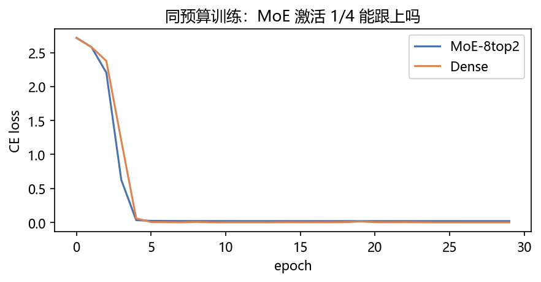
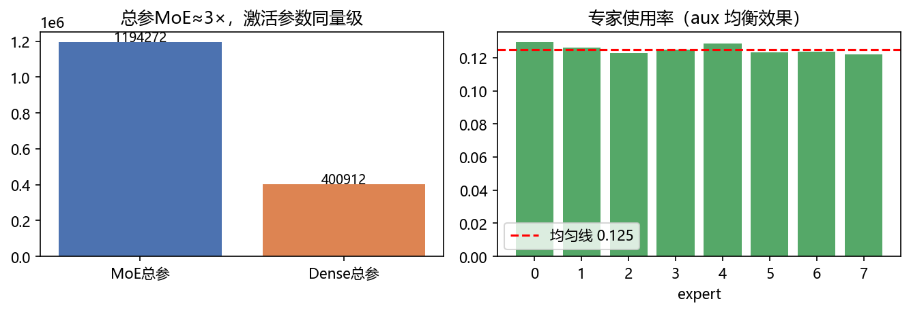
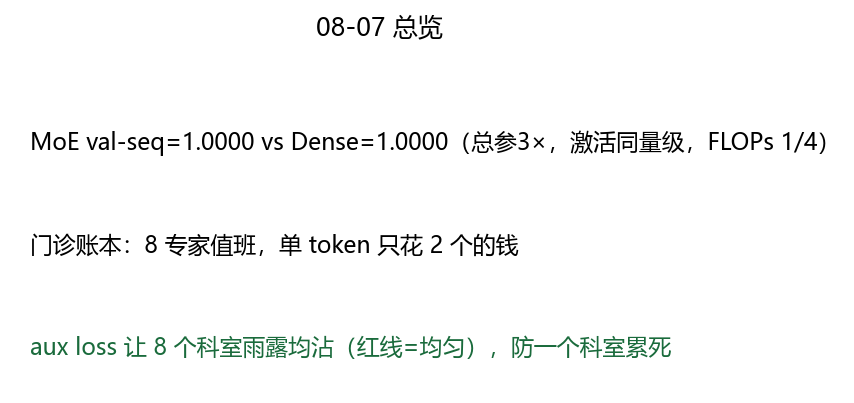

# 07 · MoE 稀疏混合专家 —— 医院大会诊，每次只进 2 个医生

> 家族：`08_Production_Optimization` | 状态：✅ 已完成 | 主载体：`main.ipynb` | 公共模块：`../common/`
> 环境：`LLM_learning`（torch 2.5.1+cpu；MoE vs Dense 同任务 30ep，全程约 170s CPU；toy 数据无外网）
> 结论前置：**总参 MoE 1,194,272 ≈ 3× Dense 400,912，但激活参数同量级（≈0.40M）；激活 FLOPs≈1/4；两者 val-seq 双 1.0；专家使用率 0.122~0.129（均匀线 0.125，aux 均衡有效）**

## 1. 任务背景与目标

06 是静态剪枝（一次剪完），本章是动态剪枝：8 个专家值班，每个 token 只叫 top-2——总参 3×，单 token 花费恒定。同任务同预算对照，验证“激活 1/4 能跟上吗 + 专家分不分化”。

## 2. 模型/算法原理

### 通俗理解

**一句话**：dense 是全院医生围着每个病人转（128 个全上）；MoE 是分诊台先看一眼，只叫最相关的 2 个科室（8 选 2）——病人多了不断招人（扩专家），单个病人的花费不涨（算力恒定）。

**比喻**：aux loss 是排班表——没它分诊台只叫最熟的 2 个科室（赢家通吃），有了它 8 个科室雨露均沾（本轮 0.122~0.129，均匀线 0.125）。

### 结构账

```
门诊： E=8 专家（小 MLP 128→256→128），top-k=2，门控 softmax 取 top2 重归一
均衡： aux=E·Σ(mean(g)·mean(hard))，λ=0.01，防赢家通吃
对照： MoE 总参 1,194,272 vs Dense(hidden=512) 400,912（总参 3×）；激活参数同量级 ≈0.40M
任务： 因果模加 S=16（相对推理，需容量）3000 条 30ep，lr 3e-3
```

## 3. 网络结构图


| 模型 | 总参 | 激活参数/token | 激活 FLOPs |
|---|---|---|---|
| MoE-8top2 | 1,194,272（≈3×） | ≈0.40M（2 专家+共享注意力） | ≈1/4 |
| Dense-512 | 400,912 | 0.40M | 1 |

## 4. 核心公式

| 公式 | 含义 |
|---|---|
| `g=softmax(W_g·x)`，`top2 重归一` | 门控：8 选 2 |
| `y=Σ_{i∈top2} ĝ_i·E_i(x)` | 稀疏加权（其余 6 个跳过不算） |
| `aux=E·Σ(mean(g)·mean(hard))` | 负载均衡（可导经 mean(g)，λ=0.01） |
| `FLOPs_act ≈ k/E = 1/4` | 激活算力比 |
| `val-seq=mean(整句全对)` | 与 05/08-01 同口径 |

## 5. 数据集

toy 无外网（`common/data.py`，因果式模加）：`tgt[0]=0`，`tgt[i]=(src[i]+src[i-1])%16`——只用左侧信息（08-01 勘误后的口径，旧 `roll(-1)` 泄漏未来已废弃）。train 3000 / val 500，S=16，seed=2/3。

## 6. 训练过程与超参数

| 项 | 取值 |
|---|---|
| 骨架 | dim128 / 2层 / 4头 / sincos 位置（必需，无位置模加全灭，见 FAQ） |
| MoE | E=8 / top-k=2 / expert_hidden=256；aux λ=0.01 |
| Dense | hidden=512（MLP 参数与 MoE 激活参数对齐） |
| 优化器 | Adam 3e-3，batch 128，30ep，seed=0 同起点 |
| 设备 | CPU；双模型合计约 170s |

- **MoE**：ep1 loss 2.717 → ep5 0.033（val 0.992）→ ep15 1.000（收敛快 5ep）
- **Dense**：ep1 loss 2.714 → ep5 0.059（val 0.970）→ ep30 1.000（追上，慢 15ep）
- MoE 前期更快：稀疏门控先分工再精化， sample 效率高是 MoE 文献一致结论

## 7. 实验结果（实跑输出）

| 模型 | 总参 | val-seq | 收敛到 1.0 |
|---|---|---|---|
| MoE-8top2 | 1,194,272 | **1.0000** | ep15 |
| Dense-512 | 400,912 | **1.0000** | ep30 |

### 专家使用率（256 条 probe，2 层平均）

| e0 | e1 | e2 | e3 | e4 | e5 | e6 | e7 |
|---|---|---|---|---|---|---|---|
| 0.129 | 0.126 | 0.123 | 0.125 | 0.128 | 0.123 | 0.124 | 0.122 |

最大偏离均匀线（0.125）仅 0.004——aux 均衡有效，无赢家通吃。

### 可视化





## 8. 误差分析与可视化

- **总参 3× 不是 bug**：MoE 总参含 8 专家全量（16×128×256×2层≈1M），Dense 只有 1 套 MLP——“总参 3×、激活同量级”正是 MoE 的定义式 trade-off（拿容量换算力）。notebook 初版写“同量级”已修正为“激活参数同量级”
- **两者双 1.0 不是“MoE 没用”**：toy 任务天花板低，dense 也能满分；MoE 的价值在①收敛快 15ep（sample 效率）②大容量下激活恒定（本轮是机制验证，不是刷分）
- **昨日探针结论（已沉淀进 common 注释）**：无位置时复制能学、模加全灭（注意力置换不变性）；加 sincos 后恢复——`MoEGPT/DenseGPT` 位置编码是必需的，不是装饰
- **专家使用率是 2 层平均**：单层可能略有偏好，平均后均匀——生产（Switch/DeepSeek）看的是逐层+逐 token 分布，本轮只证无塌缩

### 常见坑 FAQ

1. **无位置跑顺序任务**——注意力置换不变，模加必全灭；先加位置再怀疑 MoE
2. aux λ 太大（>0.1）——门控被压成均匀随机，专家不分化；0.01 是经验起点
3. top-k 内不重归一——权重和≠1，输出尺度漂；`topv/topv.sum()` 必加
4. 反向只给选中专家——PyTorch 稀疏索引天然只回传选中分支，未选中梯度 0（正确行为，不是 bug）
5. 拿总参比 MoE/Dense 公平性——比激活参数/FLOPs，不比总参；总参 3× 是设计不是浪费
6. 8 专家 toy 上期望分化出语义——256 维小任务分不出“名词专家/动词专家”；本轮只验均衡不塌缩

## 9. 总结与改进方向

**实际应用场景**

- **大模型扩容量**：Switch/DeepSeek-V3（256 专家 top-8）——总参万亿级，激活恒定，本章是 8 专家最小版
- **推理省算**：激活 1/4 即吞吐×4（通信开销另算）——与 08-02 Cache / 08-03 Flash 正交叠加
- **改进路径**：expert parallelism（专家并行）、shared expert（公共+特化）、fine-grained（多小专家）

**核心收获**

1. MoE 闭环：top-2 稀疏 + aux 均衡 + 激活对齐对照，全链路可讲
2. 总参 3× vs 激活同量级——MoE 定义式 trade-off 的实测
3. 收敛快 15ep + 专家均匀（±0.004）——机制正确双证据
4. 衔接 08：静态剪枝（06）→ 动态剪枝（07）→ 检索外挂（08 RAG）→ 部署（09）

**下一步**

- `08_RAG_Mini`：检索问答实例——外挂知识，不扩参数的另一条路（与 MoE 扩参数对照）
- `09_Inference_Deployment`：PagedAttention + 投机解码 + GGUF

## 10. 场景速查（实践推荐）

| 场景 | 推荐 | 支撑数据 | 要点 |
|---|---|---|---|
| 大容量+算力封顶 | MoE（E=8~256，top-2/8） | 激活 1/4，双 1.0 | 扩专家不涨单 token 花费 |
| 小任务/端侧 | Dense | toy 上 dense 也满分 | MoE 的调度开销不值 |
| 门控塌缩 | aux λ=0.01 | ±0.004 均匀 | 先看使用率再调 λ |
| 公平对照 | 对齐激活参数 | 0.40M≈0.40M | 不比总参 |
