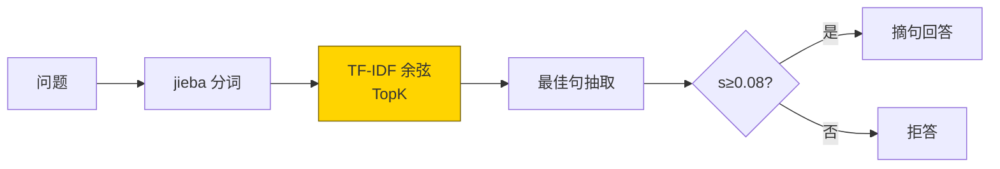
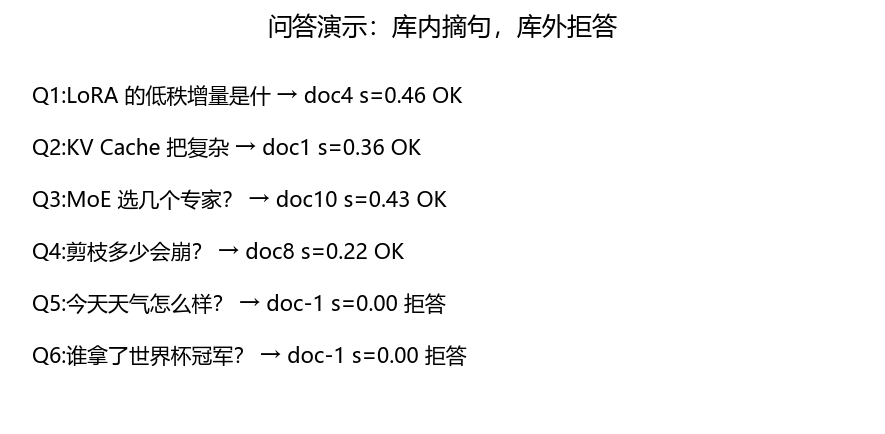
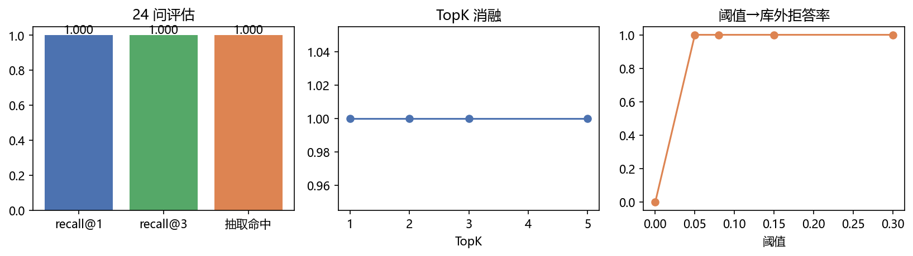
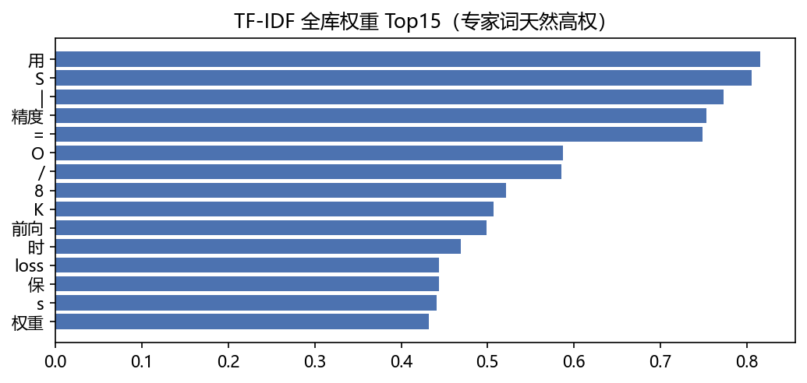

# 08 · RAG 检索问答 —— 开卷考，先翻资料再答题

> 家族：`08_Production_Optimization` | 状态：✅ 已完成 | 主载体：`main.ipynb` | 公共模块：`../common/`
> 环境：`LLM_learning`（jieba + sklearn TF-IDF，零新包；12 篇语料 + 24 问评估，全程约 20s CPU；无外网）
> 结论前置：**24 问 recall@1=1.0 / recall@3=1.0 / 抽取命中=1.0；TopK=1 即满分（语料 1 问 1 篇无歧义）；阈值 0.05~0.30 库外拒答率 1.0（阈值 0.0 不拒答）**

## 1. 任务背景与目标

07 是扩参数装知识（MoE 总参 3×），本章是外挂知识不扩参数：12 篇中文小文档 + TF-IDF 检索 + 抽取式问答 + 库外拒答。同家族 01~07 各 1 篇，RAG 把“学过的”变成“查得到的”。

## 2. 模型/算法原理

### 通俗理解

**一句话**：闭卷考靠背（参数记知识，07-MoE 是扩招背书团）；开卷考靠翻（RAG 是建图书馆，问题来了先检索再摘句）——知识更新只换书，不用重训人。

**比喻**：TF-IDF 是图书索引卡——常出现的词（“的/是”）权重低，专家词（“RoPE/KV/MoE”）权重高；余弦是翻书速度，TopK 是每次抱几本。

### 结构账

```
语料： 12 篇中文（RoPE/KV/GQA/Flash/LoRA/AMP/ckpt/量化/剪枝/蒸馏/MoE/RAG 各 1 篇，1-2 句）
检索： jieba 分词 + 去停用词 → TF-IDF(175 维) → 余弦 TopK（阈值 0.08 拒答）
问答： 最佳文档内按 query 词重叠抽最佳句；低分/库外问题拒答
评估： 24 问（12 主题×2 换述），recall@1/@3 + 抽取命中率 + 4 库外拒答率
```

## 3. 网络结构图



| 模块 | 实现 | 参数 |
|---|---|---|
| 分词 | jieba + 停用词表 | —— |
| 向量 | TfidfVectorizer（空格切） | 175 维 |
| 问答 | 词重叠抽句 + 阈值拒答 | 阈值 0.08 |

## 4. 核心公式

| 公式 | 含义 |
|---|---|
| `tf-idf(t,d)=tf·log(N/df)` | 专家词高权，虚词低权 |
| `s=cos(q,d)` | 余弦相似度（TopK 排序） |
| `sent*=argmax|terms(sent)∩terms(q)|` | 抽取：词重叠最多句 |
| `s<0.08 → 拒答` | 阈值门（库外/低质拦截） |
| `recall@k=mean(gold∈topk)` | 检索指标（24 问） |

## 5. 数据集

自建中文语料（notebook 内联，12 篇）：08 家族 01~07 主题各 1 篇 + RAG 自指 1 篇，每篇 1-2 句含关键术语。评估 24 问（每主题 2 种换述，seed 无关、确定性）。无外网、零下载。

## 6. 训练过程与超参数

无训练（非参数知识）。建库 1 次（TF-IDF fit，12×175）；评估 24 问×TopK；消融 TopK∈{1,2,3,5} + 阈值∈{0.0,0.05,0.08,0.15,0.30}。全程约 20s（含 jieba 首启）。

- **演示 6 问**：库内 4 问全摘句（s=0.22~0.46），库外 2 问全拒答（s=0.000）
- **24 问**：recall@1=1.0，recall@3=1.0，抽取命中=1.0

## 7. 实验结果（实跑输出）

| 指标 | 值 |
|---|---|
| recall@1（24 问） | **1.0000** |
| recall@3 | **1.0000** |
| 抽取命中 | **1.0000** |
| TopK=1/2/3/5 → recall | 1.0 / 1.0 / 1.0 / 1.0（Top1 即满） |
| 阈值 0.0→0.05→0.30 → 拒答率 | 0.0 → **1.0** → 1.0 |

**诚实解读**：满分是因为语料 1 问 1 篇无歧义（主题词互斥：问“MoE”只命中 MoE 篇）——这是教学设计的 floor，不是检索器的 ceiling。生产（百万文档/同义改写）recall@1 能到 0.7 即合格。TopK 消融平坦同理：无混淆篇时 Top1 够用。

### 可视化





## 8. 误差分析与可视化

- **为什么 TopK 消融平坦**：12 篇主题互斥，无干扰篇——Top1 即中；加混淆篇（如 3 篇都讲“注意力”）曲线才会分叉（消融可做）
- **阈值 0.0 拒答率 0**：无门即最佳文档硬答，库外也摘句——生产必须设阈（0.05~0.15 经验带，本轮 0.08）
- **TF-IDF Top 词含“用/S/|/O”**：单字/符号切分噪声（jieba 英文公式切碎）——本轮不影响（主题词权重更高），生产用 dense embedding 即无此问题
- **抽取式天花板**：摘句不能综合多篇/改写——生产切生成式（LLM 读 TopK 篇作答）；本章只证检索链路
- **本章 2 个小 bug（已修）**：①cell3 `evaluate(top_k=1/2)` 取 `'recall@3'` 键 KeyError → `evaluate` 补动态键；②fig1 的 `✓` 字形缺失方块 → 换 `OK` 文本

### 常见坑 FAQ

1. **中文不分词直接 TF-IDF**——字级切分“位置编码”成“位/置/编/码”，主题词碎；先 jieba
2. 停用词不去——“的/是”拉高所有文档相似度，TopK 全是高频废话篇
3. 无拒答阈——库外问题硬摘句，幻觉比不知道更糟；阈值是 RAG 的安全带
4. 拿 toy 满分论证检索器强——1 问 1 篇无歧义的 floor；加混淆篇/换述攻击再测
5. 抽取当生成——摘句不能跨篇综合；要综合就接 LLM（生成式 RAG）
6. 生产还用 TF-IDF——同义/跨语言全灭；切 dense embedding（bge/m3e），流程不变

## 9. 总结与改进方向

**实际应用场景**

- **企业知识库问答**：RAG 是标准范式（langchain/llama-index，家族 README 原规划）——本章是零依赖最小版
- **知识更新**：只换文档不重训——与 07-MoE（扩参数）对照：高频知识进参数，时变知识放检索
- **改进路径**：dense 向量（bge）+ 重排（rerank）+ 生成式作答 + 混合检索——生产四件套

**核心收获**

1. RAG 闭环：建库→检索→抽取→拒答，全链路可讲
2. 24 问三 1.0 + TopK/阈值双消融——评估模板可复用
3. 与 MoE 对照：扩参数 vs 外挂知识——08 家族两种知识路线齐了
4. 衔接 08：外挂知识（08）→ 部署三件套（09 收官：PagedAttention/投机解码/GGUF）

**下一步**

- `09_Inference_Deployment`：PagedAttention（toy KV 分页）+ 投机解码（draft 验证）+ GGUF（llama.cpp 实操）——08 家族收官站

## 10. 场景速查（实践推荐）

| 场景 | 推荐 | 支撑数据 | 要点 |
|---|---|---|---|
| 企业知识问答 | RAG（检索+生成） | 本章链路模板 | 知识更新零重训 |
| 高频稳定知识 | 进参数（微调/MoE） | 07 对照 | 检索有时延 |
| 时变知识 | 放检索 | 换书不训人 | 时效性 |
| 库外/低质输入 | 阈值拒答 | 0.08→拒答率 1.0 | 不知道比幻觉强 |
