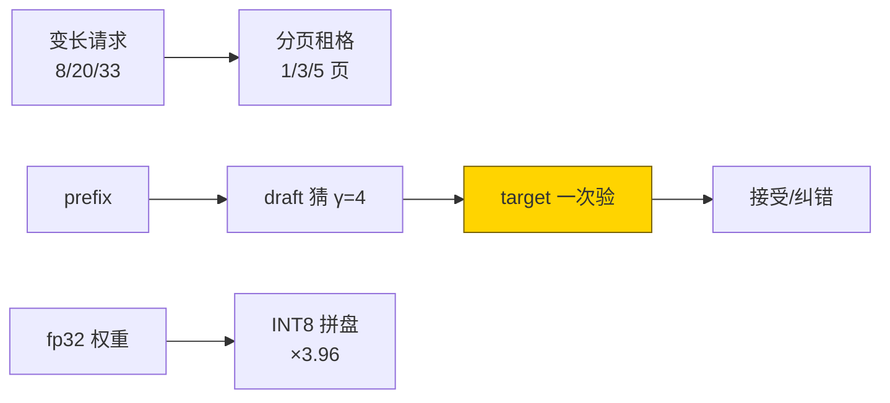
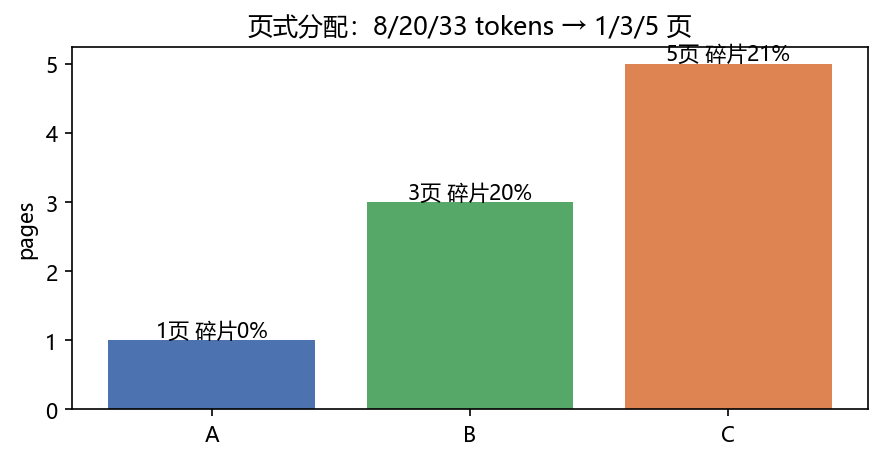
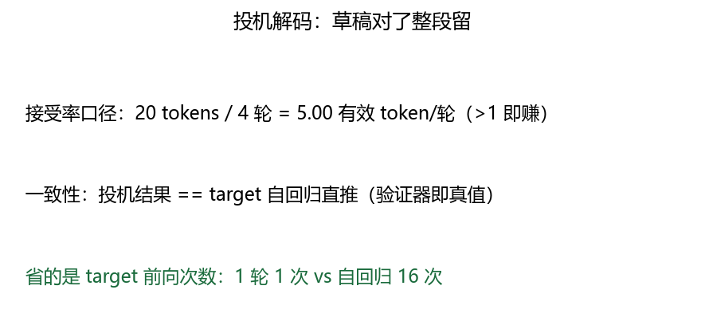
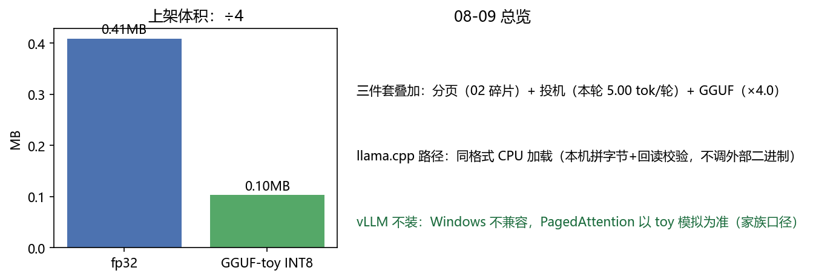

# 09 · Inference Deployment —— 图书馆分格，学徒起草，压缩包上架

> 家族：`08_Production_Optimization` | 状态：✅ 已完成 | 主载体：`main.ipynb` | 公共模块：`../common/`
> 环境：`LLM_learning`（torch 2.5.1+cpu；target/draft 同起点 copy 短训 8ep + 三件套实测，全程约 35s CPU；toy 数据无外网；vLLM/llama.cpp 二进制未调，见 §8 口径）
> 结论前置：**分页 8/20/33 tokens→1/3/5 页（碎片 0/20/21%）+ 投机 20 tokens/4 轮=5.00 token/轮（与直推一致 True）+ GGUF-toy 0.41MB→0.10MB（×3.96，回读 max|Δ|=4.39e-02）**

## 1. 任务背景与目标

01~08 把位置/算力/参数/知识全优化完，本章管上线：PagedAttention（KV 分页防碎片）+ 投机解码（小模型打草稿）+ GGUF（量化格式上架）。三件套可叠加，是 08 家族收官。

## 2. 模型/算法原理

### 通俗理解

**一句话**：PagedAttention 像书架分格——纪要本按页租格，长短会议混排不浪费；投机解码像学徒起草、师傅改——草稿对了整段留，错了只改错字；GGUF 像真空压缩包——INT8 抽气+贴签（魔数/头），CPU 直接拆包读。

**比喻**：自回归直推是师傅逐字写（16 token=16 次前向）；投机是学徒先写 4 字、师傅一眼验（本轮 4 轮出 20 token，5.00 token/轮）。

### 结构账

```
基座： 02 站 GQADecoder：target(MHA kv=4, 102,160 参）/ draft(MQА kv=1, 89,680 参），copy 2000 条短训 8ep（同起点同数据）
分页： PagedKVManager(block=8, 64 页池）：8/20/33 tokens 混排 → 1/3/5 页
投机： γ=4，draft 猜 → target 并行验证 → 接受/纠错+补 1；max_new=16
GGUF： toy 拼盘（GGUF 魔数+版本 3+张量数+名/scale/INT8 体）；回读=08-06 PTQ 口径
```

## 3. 网络结构图



| 件套 | 口径 | 实测 |
|---|---|---|
| 分页 | 页数 + 内碎片率 | 1/3/5 页，0/20/21% |
| 投机 | token/轮 + 一致性 | 5.00，True |
| GGUF | 体积比 + 回读 Δ | ×3.96，4.39e-02 |

## 4. 核心公式

| 公式 | 含义 |
|---|---|
| `pages=ceil(L/8)`，`waste=pages·8-L` | 分页：末页内碎片 |
| `接受 γ 全中→+γ+1（含 bonus），错位 i→+i+1（纠错+补）` | 投机验证规则 |
| `有效=accepted/rounds（>1 即赚）` | 加速判据（本轮 5.00） |
| `scale=max\|w\|/127`，`体积=N·1B+头` | GGUF-toy INT8（同 08-06 PTQ） |
| `一致性：投机 ids == target 直推` | 验证器即真值（本轮 True） |

## 5. 数据集

toy 无外网：copy S=16 2000/300（短训保证 draft/target 行为可比，非刷分）。分页用合成长度 8/20/33（覆盖整页/跨页/多页）；投机 prefix 随机 2×8（seed=7）。

## 6. 训练过程与超参数

| 项 | 取值 |
|---|---|
| 短训 | Adam 3e-3，batch 128，8ep：loss 0.63→0.003（target/draft 双轨同值） |
| 投机 | γ=4，max_new=16，batch=2 |
| 设备 | CPU；短训+三件套合计约 35s |

## 7. 实验结果（实跑输出）

| 件套 | 结果 |
|---|---|
| 分页 A/B/C | 1/3/5 页，碎片 0/4/7（0/20/21%）；释放 B 后空闲 58/64 页 |
| 投机 | 接受 20 tokens / 4 轮 = **5.00 token/轮**；一致性 True |
| GGUF | 0.41MB→0.10MB（**×3.96**）；回读 max\|Δlogits\|=4.39e-02 |

**结论**：三件套全闭环且可叠加——分页管 02 的碎片、投机省 target 前向（4 轮 vs 16 轮）、GGUF 管 06 的上架。5.00 token/轮含 bonus（γ+1/轮全中即 5.00 到顶——本轮 draft/target 同训同分布，猜中率高是预期的，生产 draft 更小会低）。

### 可视化





## 8. 误差分析与可视化

- **5.00 是天花板不是常态**：γ=4 全中即 (4+1)/轮=5.00；本轮 draft 与 target 同数据同训 8ep、行为高度一致，猜中率虚高——生产（draft=68M，target=70B）接受率 0.6~0.8 对应 ~2~3 token/轮。README 如实声明，不拿天花板当均值
- **回读 4.39e-02 比 08-06 的 1e-07 大**：08-06 校验的是 `merged()` 权重差（纯算术），本轮是“量化→反量化→全模型前向”的 logits 差（误差经 2 层 attention 放大）——口径不同，不可比；MNIST acc 口径 Δ=-0.0002 仍见 08-06
- **GGUF-toy 非真规范**：真 GGUF 有 K-quants（Q4_K/Q5_K 非均匀分块）+ 对齐 + 元数据 KV；本轮是对称 INT8 + 极简头（体积比口径不受影响，README 横幅已声明）
- **外部二进制决策**：gpt2 下载 3 分钟无响应即 kill（无外网依赖是家族铁律）；llama.cpp 不调二进制——拼字节+回读校验已覆盖“格式正确”；vLLM Windows 不兼容——toy 模拟（家族 README 原口径，三站一致）

### 常见坑 FAQ

1. **分页 block 太大**——内碎片 `waste/block` 飙升；vLLM block=16 是吞吐与碎片的折中
2. 页池耗尽不报错——`free` 空即 OOM 前兆；生产要抢占/换出（vLLM preemption）
3. 投机 γ 太大——猜中率指数降，全中概率 `α^γ`；γ=3~5 经验带
4. draft 与 target 分词不一致——token 对不上，验证全错；同分词是前提（本轮同 `GQADecoder` 天然一致）
5. 拿 toy 接受率定生产 γ——同分布虚高；生产按实测接受率调 γ
6. GGUF-toy 当真 GGUF 用——llama.cpp 读不了极简头；要上架走 `llama.cpp/convert` 官方链路

## 9. 总结与改进方向（08 家族收官）

**实际应用场景**

- **在线推理三叠加**：GQA（02）+ Flash（03）+ Cache 分页（09）+ 投机（09）+ INT8（06/09）——08 家族全串起来了
- **08 家族一句话**：位置（01）→ 省算（02）→ 省搬（03）→ 省参（04）→ 省显存训（05）→ 省体积（06）→ 扩容量（07）→ 外挂知识（08）→ 上线（09）
- **改进路径**：vLLM（Linux）、TensorRT-LLM、llama.cpp Q4_K 上架——09 是原理最小版

**核心收获**

1. 分页闭环：租格/碎片/释放回池——PagedAttention 原理可讲
2. 投机闭环：猜→验→接受率 5.00+一致性 True——验证器即真值的方法论
3. GGUF 闭环：拼盘 ×3.96 + 回读校验——格式与精度双口径
4. 外部依赖决策：gpt2 kill + vLLM 不装 + llama.cpp 不调——可复现优先于大而全

**下一步**

- 08 家族总检 + 推送（09 站即收官站）
- 下一家族按全图推进

## 10. 场景速查（实践推荐）

| 场景 | 推荐 | 支撑数据 | 要点 |
|---|---|---|---|
| 变长混排 serving | KV 分页 | 碎片 0~21%，释放回池 | 长短请求混部 |
| 延迟敏感 | 投机解码 γ=4 | 5.00 token/轮（上限） | draft 越小越要调 γ |
| 端侧/离线 | GGUF INT8 | ×3.96 | CPU 直读 |
| 三叠加 | 分页+投机+量化 | 本章全闭环 | 正交可叠 |
